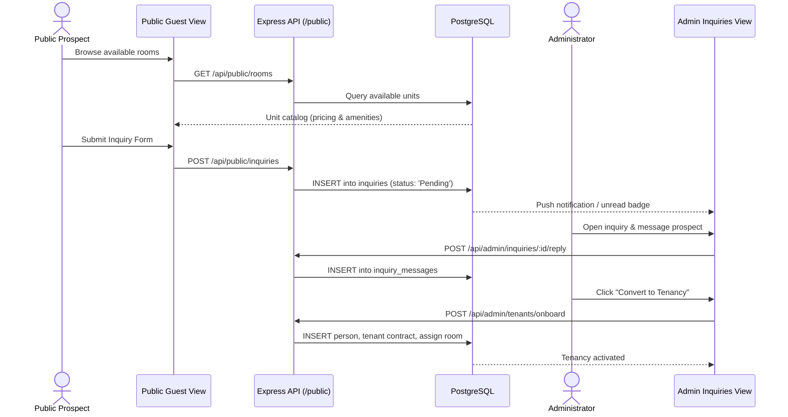
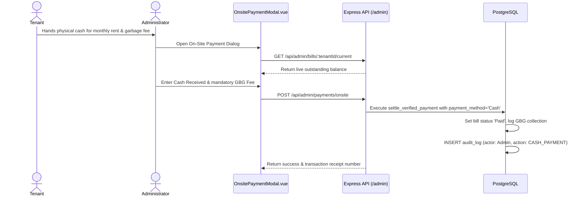

# HIVELET CODEBASE DOCUMENTATION
## Complete Architectural & Technical Developer Guide

**Project:** Hivelet: Web-Based Boarding House Management and Financial Operations System  
**Client Property:** Fe Galang Da Silva Boarding House, Legazpi City  
**Academic Context:** IT 124 — Capstone Project 2, Bicol University College of Science, Group 4  
**Document Purpose:** Comprehensive technical reference explaining the architecture, codebase organization, module interactions, data flows, database procedures, and operational rules of the Hivelet application.

---

## 1. Architectural Blueprint & System Identity

### 1.1 Architectural Pattern
Hivelet is built upon a canonical, five-tier architectural design:
> **Layered Client-Server Architecture Structured as a Modular Monolith with a Pluggable Payment Gateway Adapter**

This architecture enforces strict separation of concerns, tenant isolation, centralized financial calculation, and defensible auditability required for commercial operations and academic capstone evaluation.

```
┌────────────────────────────────────────────────────────────────────────┐
│                        TIER 1: PRESENTATION                            │
│  Vue 3 Single-Page App (Composition API, Pinia, Tailwind CSS, Vite PWA)│
└───────────────────────────────────┬────────────────────────────────────┘
                                    │ HTTPS / REST (JSON)
┌───────────────────────────────────▼────────────────────────────────────┐
│                  TIER 2: API & SECURITY PERIMETER                      │
│  Express.js on Node.js (TypeScript, Helmet, CORS, JWT, RBAC & Zod)     │
└───────────────────────────────────┬────────────────────────────────────┘
                                    │ In-Process Service Dispatch
┌───────────────────────────────────▼────────────────────────────────────┐
│                    TIER 3: DOMAIN SERVICE LAYER                        │
│  Modular Monolith Services (Auth, Billing, Audit, Export, Settings)    │
└───────────────────────┬────────────────────────────────┬───────────────┘
                        │ Supabase JS / SQL              │ REST Webhooks
┌───────────────────────▼───────────────┐ ┌──────────────▼───────────────┐
│     TIER 4: DATA PERSISTENCE          │ │   TIER 5: PAYMENT GATEWAY    │
│  PostgreSQL 16 on Supabase            │ │   Adyen Drop-in with GCash   │
│  (20 Relational Tables, RLS, RPCs)    │ │   (Session API, HMAC Auth)   │
└───────────────────────────────────────┘ └──────────────────────────────┘
```

### 1.2 The Five Tiers Explained

| Tier | Name | Technology Stack | Core Responsibility |
| :--- | :--- | :--- | :--- |
| **Tier 1** | **Presentation** | Vue 3, Vite, Tailwind CSS, Pinia, PWA | Renders responsive user interfaces for Administrator, Tenant, and Public Guest roles; provides offline cached views via service worker; communicates with backend via REST. |
| **Tier 2** | **API & Security Perimeter** | Node.js, Express, TypeScript, Helmet, CORS | Terminates every incoming HTTP request; validates payloads via Zod; verifies JWT credentials; executes Role-Based Access Control (RBAC) permission guards before domain dispatch. |
| **Tier 3** | **Domain Service Layer** | TypeScript Modular Services | Encapsulates all domain and business logic (billing generation, ₱200/head water calculations, payment verification, audit trail emission, CSV report exports). |
| **Tier 4** | **Data Persistence** | PostgreSQL 16 hosted on Supabase | Maintains 20 normalized relational tables; enforces referential integrity (`ON DELETE RESTRICT` for financial ledgers); executes atomic stored procedures (`settle_verified_payment`). |
| **Tier 5** | **Pluggable Payment Gateway** | Adyen Web SDK / Server Checkout API | Facilitates secure online cashless payments via GCash; handles HMAC-validated asynchronous webhook notifications for transaction settlement. |

---

## 2. Codebase Topology & Directory Structure

```
HIVELET/
├── backend/                  # Tier 2 & Tier 3: Express API & Domain Services
│   ├── src/
│   │   ├── config/           # RBAC permission matrix and Supabase database client
│   │   ├── middleware/       # JWT bearer auth, permission, and role guards
│   │   ├── routes/           # REST endpoints grouped by audience
│   │   ├── services/         # Modular business services and report generators
│   │   ├── types/            # TypeScript interfaces and domain types
│   │   ├── utils/            # ApiError handling and structured loggers
│   │   └── server.ts         # Server bootstrap, middleware pipeline & listeners
│   └── package.json          # Backend dependencies (Express, Zod, Adyen, Supabase)
│
├── frontend/                 # Tier 1: Vue 3 Client Application
│   ├── src/
│   │   ├── components/       # Reusable layout shells, UI widgets, and dialog modals
│   │   │   ├── layout/       # AppNavbar, AppSidebar, MobilePillNavbar, NotificationPopover
│   │   │   ├── modals/       # AdyenPaymentModal, OnsitePaymentModal, AdminEditUnitModal
│   │   │   └── ui/           # Skeleton loaders, toast indicators, badges
│   │   ├── lib/              # Reactive state stores, API clients, and constants
│   │   │   ├── api.ts        # Centralized HTTP client with JWT injection
│   │   │   ├── authStore.ts  # Session authentication store
│   │   │   ├── systemState.ts# Reactive data repository with defensive fetch guards
│   │   │   └── canonicalUnits.ts # Ground-truth unit metadata (33 units)
│   │   ├── router/           # Vue Router definitions with role navigation guards
│   │   ├── views/            # Single-Page Views (Admin, Tenant, Public)
│   │   ├── App.vue           # Root layout orchestrator
│   │   ├── index.css         # Jira-inspired design tokens and Tailwind configuration
│   │   └── main.ts           # Vue application initialization and plugin registration
│   └── vite.config.ts        # Vite build tool and PWA Workbox configuration
│
├── database/                 # Tier 4: SQL Database Schema and Functions
│   ├── FULL_DATABASE_SCHEMA.sql # Authoritative 20-table schema with constraints & RLS
│   └── migrations/           # Incremental schema evolution and stored procedures
│
├── docs/                     # Project Specifications, System Bible & Architecture
│   ├── 01_SYSTEM_BIBLE.md    # Product identity, domain rules, and functional scope
│   ├── 04_ARCHITECTURE.md    # Definitive 5-tier technical architecture
│   ├── SCREEN_CONTRACT.md    # Screen-by-screen API read/write contract register
│   └── CODE_DOCUMENTATION.md # This document
│
└── scripts/                  # Automated CI/CD, Verification, and Auditing Suites
    ├── check-all.mjs         # Master verification runner
    ├── check-canon.mjs       # Canonical wording and business rule validator
    ├── check-liveness.mjs    # Rate consistency and defensive fallback auditor
    └── check-reachable.mjs   # Vue template component import validator
```

---

## 3. Backend Implementation Deep Dive

### 3.1 Server Bootstrap & Security Pipeline (`backend/src/server.ts`)
The server initialization sequence establishes a secure execution environment before mounting domain routers:
1. **Security Headers (`helmet`)**: Configures standard Content Security Policy, strict transport security, and DNS prefetch protection.
2. **CORS Allowlist**: Restricts cross-origin requests exclusively to recognized frontend client origins (`http://localhost:5173`, `http://127.0.0.1:5173`, and production domains).
3. **HTTP Request Logging (`morgan`)**: Captures HTTP verb, status code, response time, and payload size.
4. **Request Size Capping**: Limits `express.json` bodies to `1mb` to defend against payload exhaustion attacks.
5. **Global Error Interception (`errorHandler`)**: Intercepts unhandled exceptions and instances of `ApiError`, ensuring stack traces are redacted in production while returning standardized JSON error bodies `{ success: false, message, error }`.

### 3.2 Role-Based Access Control & Middleware (`backend/src/config/rbac.ts`, `backend/src/middleware/auth.ts`)
Hivelet implements a fine-grained, permission-based authorization model rather than inspecting raw role strings inside routes.

#### The Four System Roles:
- `guest`: Unauthenticated visitor accessing public property information and catalog listings.
- `prospect`: Public visitor who submitted a room inquiry (retains guest-level permissions).
- `tenant`: Active boarding house resident possessing authenticated access to their own room, bills, payments, and maintenance tickets.
- `admin`: Boarding house owner/administrator possessing comprehensive operational and financial management rights.

#### Key Authorization Middlewares:
- `attachGuestRole`: Automatically provisions unauthenticated incoming requests with guest identity and default permissions.
- `requireAuth`: Extracts and validates the HTTP `Authorization: Bearer <token>` header, verifying token signature, issuer, and expiration.
- `requireRole(role)`: Validates that the active session matches a designated role.
- `requirePermission(permission)`: Checks the requester's role against the centralized permission matrix in `rbac.ts`. For example, `requirePermission('payments:verify')` guarantees that only an administrator can verify payments.
- `requireSelfOrAdmin(resourceParam)`: Resolves tenant row scoping. A tenant may only inspect or modify records belonging to their authenticated `tenant_id`; administrators are granted universal access.

### 3.3 Domain Services (`backend/src/services/`)

#### 1. Payment Gateway Adapter (`adyenService.ts`, `adyenWebhookHandler.ts`)
Encapsulates all communication with Adyen.
- **Session Initiation (`createCheckoutSession`)**: Formulates an Adyen Checkout Session, configuring currency (`PHP`), amount and return URL, and passing shopper identity (`shopperReference`, and `shopperEmail` where one is on file) as risk context. The amount is the bill's **outstanding balance**, not its total, so a part-paid bill cannot be charged twice over. The caller need not name a bill: since 2026-09-22 `POST /api/tenant/payments/checkout` resolves the current period's bill or raises one, because bills are raised on demand and a resident with no bill row yet previously had no way to reach checkout at all.
- **HMAC Signature Verification (`verifyHmacSignature`)**: Validates the cryptographic signature of incoming Adyen webhook notifications using the configured HMAC secret.
- **Idempotent Webhook Handler (`handleAdyenNotification`)**: Dispatches webhook events. When an `AUTHORISATION` event succeeds, it logs the gateway reference and marks the payment as `'Pending Verification'` or settled in accordance with administrative approval rules.

#### 2. Authentication Service (`authService.ts`)
Manages the user account lifecycle:
- **Password Security**: Validates credentials using secure cryptographic hashing (Argon2 / Bcrypt).
- **Session Dispatch**: Generates signed JSON Web Tokens (JWT) containing user ID, username, role, and permission sets.
- **Demo Mode Isolation**: Safely handles credential verification for pre-seeded testing environments.

#### 3. Billing Engine (`billingService.ts`)
Handles the periodic calculation of tenant liabilities:
- **Water Derivation Rule**: Computes monthly water utility charges strictly at **₱200 per head** based on the recorded occupant headcount (`occupants * 200`).
- **Rent & Arrears**: Calculates base room rent based on the unit's active rate in `room_price_history`, factoring in any outstanding past balances.
- **Due Date & Overdue Tracking**: Automatically evaluates whether an unsettled bill has passed its due date and grace period, transitioning the status badge between `'Unpaid'` and `'Overdue'`.

#### 4. Audit Trail Service (`auditService.ts`)
Enforces transparency across the system:
- **Append-Only Event Logging**: Captures actor ID, IP address, target entity (`bills`, `payments`, `units`, `expenses`), action verb (`INSERT`, `UPDATE`, `VERIFY`), and structured JSON diffs of previous versus updated state.
- **Database Non-Repudiation**: Operates over the immutable `audit_logs` table where database `UPDATE` and `DELETE` operations are permanently revoked.

#### 5. Financial Export Generators (`incomeReportExport.ts`, `expenseReportExport.ts`)
Generates RFC-4180 compliant CSV exports for the property owner:
- Escapes special characters, double quotes (`""`), and currency symbols so that resident names with punctuation (e.g., `Jose "Jojo" Cruz`) never corrupt spreadsheet columns.
- Produces clean tabular reconciliations of income receipts, expense allocations, and cluster breakdowns.

---

## 4. Frontend Implementation Deep Dive

### 4.1 Application Setup & Architecture (`frontend/src/`)
Built with Vue 3 using the Composition API (`<script setup lang="ts">`) and bundled with Vite.

```
frontend/src/
├── main.ts               # Initializes Vue, Pinia store, and Vue Router
├── App.vue               # Global shell: renders AppNavbar, AppSidebar, and <router-view>
├── router/index.ts       # Navigation routes, role metadata, and beforeResolve guards
└── lib/
    ├── api.ts            # Centralized fetch wrapper with Bearer token injection
    ├── systemState.ts    # Single source of truth reactive repository
    ├── authStore.ts      # Authentication session and token store
    └── notificationsStore.ts # Alert badge and notification manager
```

### 4.2 State Management & The Defensive Liveness Pattern (`systemState.ts`)
The `systemState.ts` file acts as the centralized reactive client-side store, caching data for units, occupants, bills, payments, maintenance tickets, inquiries, and expenses.

#### The "No Confident Wrong Numbers" Philosophy:
A foundational requirement of Hivelet is that **a failed network request must never present a confident wrong number or default zero to the user**.
- If bill loading fails, the screen **must not** display *"All Rent Accounts Settled"* or `₱0.00`. Instead, an amber banner *"Bills could not be loaded"* and an em dash (`—`) are rendered.
- If expense records fail to fetch, the dashboard **must not** default expenses to `₱0`, which would falsely display gross revenue as pure profit.
- Each reactive loader sets a dedicated failure flag (e.g., `billsFetchFailed`, `expensesFetchFailed`) that is directly bound to view error states.

### 4.3 Screen-to-API Contract & Views

| View Name | File Location | Role Access | Primary Operational Responsibilities |
| :--- | :--- | :--- | :--- |
| **AdminOverviewView** | `views/AdminOverviewView.vue` | Admin | Real-time property KPIs: Occupancy rate (out of 33 units), Monthly Gross Income, Monthly Operational Expenses, Net Operating Income, and urgent action alerts. |
| **IncomeCollectionsView** | `views/IncomeCollectionsView.vue` | Admin | Manages rent roll, payment verification queue, on-site cash payment recording, and monthly revenue reconciliation. |
| **ExpensesLedgerView** | `views/ExpensesLedgerView.vue` | Admin | Logs operating expenses (Meralco, Prime Water, maintenance supplies) and allocates each one across **property areas** — Boarding House, Main House, Front Apartment, Back Apartment, and Other Expenses / Personal. Read from `expense_property_allocations`; these are not lettered clusters. |
| **TenantManagementView** | `views/TenantManagementView.vue` | Admin | Resident directory, active lease tracking, contact details, emergency contacts, and tenant onboarding. |
| **RoomDirectoryView** | `views/RoomDirectoryView.vue` | Admin | Full catalog of all 33 units across 4 levels (1st, 2nd, 3rd and the Penthouse); occupancy status, assigned residents, and rate history. |
| **CategoryRoomsView** | `views/CategoryRoomsView.vue` | **Public** | Browse one kind of unit and its live availability. The four kinds are **Studio, One-bedroom, Two-bedroom and Three-bedroom**. Reached at `/category/:categorySlug`, which carries no `meta.roles` — it is a public browsing surface, not an admin pricing tool. |
| **MaintenanceDispatchView** | `views/MaintenanceDispatchView.vue` | Admin | Kanban and list triage of maintenance issues submitted by tenants; technician assignment, priority scheduling, and resolution. |
| **InquiriesView** | `views/InquiriesView.vue` | Admin | Inbox for public room inquiries; direct messaging thread with prospective tenants, conversion into formal tenancies. |
| **AuditLogsView** | `views/AuditLogsView.vue` | Admin | Immutable timeline of administrative and financial activities with actor identification and payload diffs. |
| **TenantOverviewView** | `views/TenantOverviewView.vue` | Tenant | Resident dashboard: current room details, roommate information, current balance summary, and quick action shortcuts. |
| **TenantPaymentsView** | `views/TenantPaymentsView.vue` | Tenant | Outstanding bill statements, itemized rent and water breakdowns, Adyen GCash online checkout modal, and historical payment receipts. |
| **TenantTicketsView** | `views/TenantTicketsView.vue` | Tenant | Issue reporting portal: file maintenance requests with category, severity, and photo attachments; live resolution tracking. |
| **TenantProfileView** | `views/TenantProfileView.vue` | Tenant | Account credentials, contact phone update, and password modification dialog. |
| **PublicGuestView** | `views/PublicGuestView.vue` | Public | Public-facing landing page showcasing property amenities, room types, live availability, location details, and inquiry submission. |
| **InquireView** | `views/InquireView.vue` | Public | The enquiry form at `/inquire`. States plainly, at the point of filling it in, that no automatic confirmation is sent — so a prospect knows to leave a number or address she can actually reply to. |
| **PrivacyPolicyView** | `views/PrivacyPolicyView.vue` | Public | The privacy policy at `/privacy`, added 2026-09-22. Covers what the enquiry form collects, what a resident account holds, and that GCash credentials go to Adyen directly and are never received or stored by this system. Linked from the enquiry form's notice and the footer. |
| **LoginView** | `views/LoginView.vue` | Public | Role-aware portal authentication (Admin and Tenant sign-in). |

### 4.4 Load-Bearing Modals (`frontend/src/components/modals/`)
- **`AdyenPaymentModal.vue`**: Mounts the Adyen Web Drop-in Component. Initiates payment sessions with Adyen, renders the GCash QR code/redirect flow, and handles transaction completion callbacks.
- **`OnsitePaymentModal.vue`**: Enables the administrator to record manual cash or direct bank payments. Enforces the inclusion of the required **Garbage Fee (GBG)** and validates payment amounts against live room billing balances.
- **`AdminEditUnitModal.vue`**: Allows the administrator to adjust unit configurations, update base pricing (which automatically appends an entry to `room_price_history`), and modify room status.
- **`ChangePasswordModal.vue`**: Secure dialog for tenants and administrators to update authentication passwords with confirmation checks.

---

## 5. Database Schema & Stored Procedures

### 5.1 Relational Architecture (20 Normalized Tables)
The database runs on PostgreSQL 16 hosted via Supabase. All primary keys are UUIDs (`gen_random_uuid()`).

```
                    ┌─────────────────┐
                    │    clusters     │ (Building Sections A, B, C, D)
                    └────────┬────────┘
                             │ 1:N
┌─────────────────┐ 1:N     ┌▼────────────────┐ 1:N     ┌─────────────────┐
│   categories    ├────────►│      units      ├────────►│room_price_hist. │
└─────────────────┘         └──┬────────────┬─┘         └─────────────────┘
                               │ 1:N        │ 1:N
                    ┌──────────▼──────┐    ┌▼─────────────────┐
                    │   inquiries     │    │  tenants/occup.  │
                    └─────────────────┘    └──┬────────────┬──┘
                                              │ 1:N        │ 1:N
                                   ┌──────────▼─────┐     ┌▼──────────────────┐
                                   │     bills      │◄────┤     payments      │
                                   └────────────────┘     └───────────────────┘
```

#### Table Summary Register:
1. `clusters`: Physical building sections (Cluster A, B, C, D) for cost-center allocation.
2. `categories`: Unit types (Aircon, Non-Aircon, Solo, 2-Bed, 4-Bed).
3. `units`: The 33 physical boarding house rooms.
4. `room_price_history`: Immutable ledger of room rate changes over time, preserving historic rental rates.
5. `persons`: Master human identity table storing legal names and contact data.
6. `tenants`: Tenancy contracts linking a person to a unit with move-in dates and security deposits.
7. `bills`: Monthly liability statements with base rent, ₱200/head water calculations, and status flags.
8. `payments`: Payment transactions (Cash, Bank, GCash via Adyen) with verification states.
9. `monthly_income_records`: Historical income ledger snapshots preserving historical spreadsheet parity.
10. `expenses`: Operational expenditures (Utilities, Repairs, Supplies, Municipal Fees).
11. `expense_allocations`: Splits expense amounts across designated building clusters.
12. `inquiries`: Prospect booking inquiries and lead tracking.
13. `inquiry_messages`: Two-way messaging threads between prospective tenants and the administrator.
14. `maintenance_tickets`: Tenant maintenance requests, issue categories, and urgency levels.
15. `ticket_updates`: Progress notes and status history for maintenance tickets.
16. `notifications`: In-app notification alerts for tenants and administrators.
17. `audit_logs`: Immutable security and operation audit trail.
18. `users`: System authentication accounts linked to person identities.
19. `system_settings`: Key-value configuration store for property rates and operational parameters.
20. `schema_migrations`: Version tracking for database migrations.

### 5.2 Atomic Stored Procedures (RPCs)

#### 1. `settle_verified_payment(p_payment_id, p_admin_id)`
Executes payment verification and bill settlement inside a single atomic database transaction:
```sql
-- Conceptual flow of settle_verified_payment
BEGIN;
  -- 1. Lock payment row and assert pending state
  SELECT * FROM payments WHERE id = p_payment_id FOR UPDATE;
  
  -- 2. Update payment status to 'Verified' and record verifying admin
  UPDATE payments 
  SET status = 'Verified', verified_by = p_admin_id, verified_at = NOW() 
  WHERE id = p_payment_id;
  
  -- 3. Transition associated bill to 'Paid'
  UPDATE bills 
  SET status = 'Paid', balance = 0, updated_at = NOW() 
  WHERE id = (SELECT bill_id FROM payments WHERE id = p_payment_id);
  
  -- 4. Emit audit log entry
  INSERT INTO audit_logs (actor_id, action, entity_type, entity_id, ...) 
  VALUES (p_admin_id, 'VERIFY_PAYMENT', 'payments', p_payment_id, ...);
COMMIT;
```

#### 2. `create_expense_entry_with_allocations(...)`
Atomically records an operational expense and decomposes the cost across specified building clusters in `expense_allocations`, guaranteeing that the sum of cluster shares exactly matches the parent expense amount.

---

## 6. End-to-End System Workflows

### 6.1 Workflow A: Public Room Inquiry to Tenancy Onboarding


### 6.2 Workflow B: Monthly Bill Generation & Online Payment via Adyen GCash
```mermaid
sequenceDiagram
    actor Tenant as Tenant
    participant TenantUI as Tenant Payments View
    participant API as Express API
    participant Adyen as Adyen Payment Gateway
    participant DB as PostgreSQL
    actor Admin as Administrator

    Note over Tenant,DB: No scheduler exists. The bill is raised on demand.
    Tenant->>TenantUI: Open the payment screen
    TenantUI->>API: POST /api/tenant/payments/checkout
    API->>DB: Resolve this period's bill, or raise it now
    DB->>DB: INSERT into bills (status: 'Due') — rent + BR-014 water
    API->>Adyen: POST /sessions (amount = outstanding balance, currency: PHP)
    Adyen-->>API: sessionData & sessionToken
    API-->>TenantUI: Return session parameters
    TenantUI->>Adyen: Mount Drop-in component & Authorize GCash
    Adyen-->>TenantUI: Payment Authorised
    Adyen->>API: Webhook (AUTHORISATION Notification, HMAC verified)
    API->>DB: INSERT payment (verification_status: 'Pending Verification')
    Admin->>API: Review & Verify Payment (settle_verified_payment)
    API->>DB: Mark payment 'Verified', mark bill 'Paid'
    DB-->>TenantUI: Receipt available; bill settled
```

### 6.3 Workflow C: On-Site Cash Payment Recording


---

## 7. Non-Negotiable Business Rules & Calculations

### 7.1 Arithmetic of `fifty_percent_share`
- **Definition**: A system-computed figure equal to half (50%) that row's Rent Amount.
- **Purpose**: Kept strictly for ledger parity with the property owner's historical accounting spreadsheet.
- **Rule**: In accordance with project governance (BR-035), `fifty_percent_share` is described **only** by its arithmetic. The code and documentation must never name a party, recipient, purpose, or destination for this figure.

### 7.2 The ₱200/Head Monthly Water Billing Rule
- **Definition**: Water utility charges are determined by tenant headcount rather than sub-metering.
- **Formula**: `Water Charge = Active Occupants * ₱200.00`.
- **Implementation**: Derived directly from the active tenancy occupants in `backend/src/services/billingService.ts` and mirrored in `frontend/src/views/TenantPaymentsView.vue`.

### 7.3 Total Property Room Count
- The property consists of **exactly 33 units** distributed across 3 building floors (32 active tenant leases currently occupied). It must never be described as `"32 units"` or `"32 rooms"`.

### 7.4 Garbage Collection Fee (GBG)
- The garbage collection fee is a mandatory operational cost. On the on-site cash payment collection form (`OnsitePaymentModal.vue`), the GBG input field is `required` and strictly factored into the cash settlement calculation.

### 7.5 Rate Management & Price History
- There is **no automatic annual rate escalation**. All room prices are updated manually by the property administrator.
- When an administrator modifies a room's rate, the previous rate is archived in `room_price_history` with an effective timestamp, ensuring that historical bills remain accurate and auditable.

### 7.6 Real Payment Gateway Integration
- The online payment gateway is **Adyen with GCash**, fully configured, live, and operational. It is never characterized as a mock, simulator, or prototype.

---

## 8. Quality Assurance & Automated Verification Suites

The repository contains automated verification scripts designed to guarantee architectural compliance, token hygiene, and runtime safety:

```bash
# Run all verification suites across the workspace
npm run check:all
```

### Key Verification Scripts:

| Script Command | Target Location | Verification Purpose |
| :--- | :--- | :--- |
| `npm run check:reachable` | `frontend/` | Scans all Vue component templates to ensure that every rendered component tag is explicitly imported, preventing silent blank rendering. |
| `npm run check:tokens` | `frontend/` | Asserts that components use design token CSS variables (`--primary`, `--surface`) and prevents raw hex color regressions. |
| `npm run check:liveness` | `frontend/` | Validates that all state loaders declare defensive fetch-failure flags and that money fallbacks match configured live rates. |
| `npm run check:canon` | Root | Enforces non-negotiable project phrasing (prevents banned synonyms for `fifty_percent_share`, asserts 33 units, verifies Adyen status). |
| `npm run contract` | `frontend/` | Analyzes all frontend source files and updates `docs/SCREEN_CONTRACT.md`, tracking every API call and state write. |

---

## 9. Developer Setup & Contribution Guidelines

### 9.1 Local Development Environment

#### 1. Backend Server Setup
```bash
cd backend
npm install
npm run dev
# Server listens at http://localhost:5000 (Healthcheck: /api/health)
```

#### 2. Frontend Client Setup
```bash
cd frontend
npm install
npm run dev
# Client serves at http://localhost:5173
```

#### 3. Building for Production
```bash
cd frontend
npm run build
# Executes vue-tsc type checking followed by vite build (PWA assets output to /dist)
```

### 9.2 Contribution Rules
1. **Pull before starting**: Always execute `git pull` before beginning edits.
2. **Preserve load-bearing fallbacks**: Never replace an em dash (`—`) or error state with a default `₱0`.
3. **Verify before committing**: Always execute `npm run check:all` and verify `npm run build` succeeds cleanly before pushing changes.
