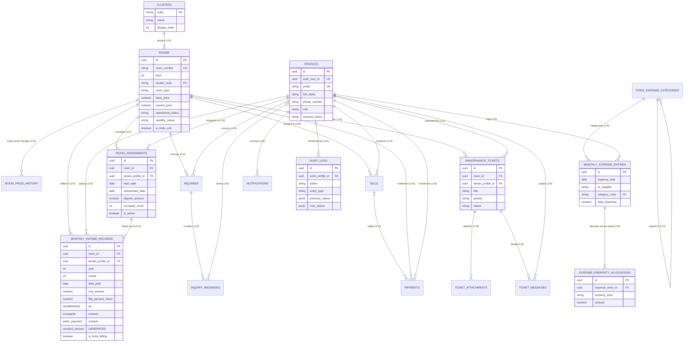

/**
 * @file DATABASE_SPECIFICATION.md
 * @description Authoritative Technical Specification & 3NF ERD Manual for Hivelet Database.
 * @systemBibleRef docs/01_SYSTEM_BIBLE.md, docs/02_BUSINESS_RULES.md, docs/05_DATABASE_DESIGN.md
 * @capstoneRef Fe Galang Da Silva Boarding House Management System Manuscript
 */

# HIVELET DATABASE TECHNICAL SPECIFICATION & 3NF ERD MANUAL

## Executive Summary

This document serves as the comprehensive, authoritative database specification for **Hivelet** (Fe Galang Da Silva Boarding House Management System). 

The database architecture is designed **DB-First**, guaranteeing that data integrity, business rules (BR-001 to BR-049), role permissions, and financial calculations are enforced directly by PostgreSQL via constraints, foreign keys, triggers, generated columns, and Row Level Security (RLS) policies.

---

## 1. Architectural & Governance Foundations

### 1.1 Source Documentation Traceability

Every table, constraint, and rule in this database traces directly back to:
- **Capstone Manuscript:** System Purpose, Target Property (Fe Galang Da Silva Boarding House), and Scope boundaries.
- **System Bible (`docs/01_SYSTEM_BIBLE.md`):** Room-centric operational model, user roles, billing rules, and audit requirements.
- **Business Rules (`docs/02_BUSINESS_RULES.md`):** BR-001 to BR-049.
- **Income & Expense Specifications (`docs/09_MONTHLY_INCOME_REPORT.md` & `docs/10_MONTHLY_EXPENSES_REPORT.md`):** Canonical 33-unit layout across 5 clusters, 10 fixed expense categories, and split area allocations.

### 1.2 DB-First Security Philosophy

Security is enforced **at the database level**, ensuring that even if an unauthorized SQL query or direct API request bypasses the frontend or Express server, the database engine strictly rejects invalid or unauthorized actions.

1. **Supabase Auth Integration:** User profiles link 1:1 to `auth.users(id)` via `auth_user_id`.
2. **Row Level Security (RLS):** Enabled on all 18 tables (`ALTER TABLE ... ENABLE ROW LEVEL SECURITY;`).
3. **Role-Based RLS Enforcement:**
   - **`admin` Role:** Full CRUD access across operational, financial ledgers, and system settings.
   - **`tenant` Role:** Restricted strictly to viewing published rooms, their own tenant profile, their own assigned room bills/payments, and creating maintenance tickets for their assigned room.
   - **`anon` (Public) Role:** Restricted strictly to viewing published rooms and submitting public room inquiries.
4. **Immutable Audit Trail (`audit_logs`):** Implemented with INSERT permissions for triggers/admins and SELECT permissions for Admins. **UPDATE and DELETE operations are permanently blocked for all roles.**

---

## 2. 3NF Normalization Proof & Anomaly Prevention

The database is normalized to **3rd Normal Form (3NF)**:

| Normal Form | Rule | Implementation in Hivelet Database |
| :--- | :--- | :--- |
| **1NF (Atomicity)** | Atomic values, no repeating groups. | All fields store atomic scalars. Split property area allocations for expenses are normalized into a dedicated child table (`expense_property_allocations`). |
| **2NF (No Partial Dependencies)** | Non-key fields depend on the whole primary key. | All tables use surrogate UUID primary keys (`id`). All non-key attributes depend completely on `id`. |
| **3NF (No Transitive Dependencies)** | Non-key fields depend ONLY on the primary key. | 1. Tenant profiles (`profiles`) are isolated from occupancy history (`room_assignments`).<br>2. Derived calculations (`fifty_percent_share` and `remitted_amount`) use PostgreSQL `GENERATED ALWAYS AS (...) STORED` columns, eliminating transitive calculation drift.<br>3. Split expense amounts are isolated per property area without repeating vendor date or category header data. |

### Anomaly Prevention Mechanisms:
- **Insertion Anomalies Prevented:** A new unit or cluster can be added without needing an active tenant. A new tenant profile can be onboarded before being assigned to a room.
- **Update Anomalies Prevented:** Updating a room's base price or current price automatically logs an entry in `room_price_history` without mutating historical bill or payment records.
- **Deletion Anomalies Prevented:** Foreign keys use `ON DELETE RESTRICT` or soft status flags (`account_status = 'inactive'`, `is_active = FALSE`) so vacating a tenant preserves their payment history and maintenance records.

---

## 3. Entity-Relationship Diagram (3NF ERD)



---

## 4. Comprehensive Entity & Data Dictionary

### Module 1: Core User & Authentication

#### 1. `profiles`
Stores personal and role information for all system users (Landlady Admin, Active Tenants, Former Tenants, Prospects), linked 1:1 to Supabase `auth.users`.

| Column | Type | Constraints | Description & Business Rule Alignment |
| :--- | :--- | :--- | :--- |
| `id` | `UUID` | `PRIMARY KEY`, `DEFAULT gen_random_uuid()` | Unique profile identifier. |
| `auth_user_id` | `UUID` | `UNIQUE`, `REFERENCES auth.users(id)` | Linked Supabase Authentication account ID. |
| `email` | `VARCHAR(255)` | `UNIQUE`, `NOT NULL` | User email address. |
| `full_name` | `VARCHAR(255)` | `NOT NULL` | User full name. |
| `phone_number` | `VARCHAR(50)` | `NULLABLE` | Primary contact phone number. |
| `emergency_contact_name` | `VARCHAR(255)` | `NULLABLE` | Emergency contact person (BR-008). |
| `emergency_contact_phone` | `VARCHAR(50)` | `NULLABLE` | Emergency contact phone number. |
| `occupation` | `VARCHAR(100)` | `NULLABLE` | Tenant occupation/employment detail. |
| `facebook_url` | `TEXT` | `NULLABLE` | Social contact link. |
| `role` | `user_role_type` | `ENUM('admin', 'tenant', 'prospect')` | System access role (BR-002, BR-024). |
| `account_status` | `account_status_type` | `ENUM('active', 'inactive')` | Account lifecycle state (BR-025). |
| `created_at` | `TIMESTAMPTZ` | `DEFAULT NOW()` | Record creation timestamp. |
| `updated_at` | `TIMESTAMPTZ` | `DEFAULT NOW()` | Record last update timestamp. |

---

### Module 2: Property & Room Directory

#### 2. `clusters`
Defines the five canonical property clusters of Fe Galang Da Silva Boarding House.

| Column | Type | Constraints | Description & Business Rule Alignment |
| :--- | :--- | :--- | :--- |
| `code` | `VARCHAR(50)` | `PRIMARY KEY` | Cluster code: `'BH'`, `'Back Apartment'`, `'Penthouse'`, `'Front Apartment'`, `'Linda'` (BR-032). |
| `name` | `VARCHAR(100)` | `NOT NULL` | Cluster display name. |
| `display_order` | `INT` | `NOT NULL` | Canonical presentation order (1 to 5). |

#### 3. `rooms`
Stores the canonical 33 rentable units across the property.

| Column | Type | Constraints | Description & Business Rule Alignment |
| :--- | :--- | :--- | :--- |
| `id` | `UUID` | `PRIMARY KEY`, `DEFAULT gen_random_uuid()` | Unique room identifier. |
| `room_number` | `VARCHAR(20)` | `UNIQUE`, `NOT NULL` | Room number (e.g. `'1a'`, `'B1F'`, `'PH'`, `'LF'`) (BR-002, BR-032). |
| `floor` | `INT` | `NOT NULL`, `CHECK (floor IN (1, 2, 3))` | Floor level (1, 2, or 3). |
| `cluster_code` | `VARCHAR(50)` | `REFERENCES clusters(code)` | Foreign key to cluster group. |
| `room_type` | `room_type_enum` | `ENUM('Studio', 'One-bedroom', 'Two-bedroom', 'Three-bedroom')` | Room architectural layout. |
| `description` | `TEXT` | `NULLABLE` | Amenities, size, and layout description. |
| `capacity` | `INT` | `NOT NULL`, `CHECK (capacity > 0)` | Maximum registered occupants. |
| `base_price` | `NUMERIC(10,2)` | `NOT NULL`, `CHECK (base_price >= 0)` | Original base price. |
| `current_price` | `NUMERIC(10,2)` | `NOT NULL`, `CHECK (current_price >= 0)` | Active room rental rate. |
| `operational_status` | `operational_status_type` | `ENUM('Available', 'Reserved', 'Occupied', 'Under Maintenance')` | Operational state (BR-005, BR-006). |
| `visibility_status` | `visibility_status_type` | `ENUM('Published', 'Hidden')` | Public website visibility (BR-007). |
| `available_from` | `DATE` | `NULLABLE` | Expected future availability date (BR-005). |
| `is_linda_unit` | `BOOLEAN` | `DEFAULT FALSE` | Flag identifying Linda's fixed billing units (LF, LB) (BR-040). |

#### 4. `room_price_history`
Tracks all historical price adjustments, supporting the 2% annual increase rule.

| Column | Type | Constraints | Description & Business Rule Alignment |
| :--- | :--- | :--- | :--- |
| `id` | `UUID` | `PRIMARY KEY` | Identifier. |
| `room_id` | `UUID` | `REFERENCES rooms(id) ON DELETE CASCADE` | Room reference. |
| `previous_price` | `NUMERIC(10,2)` | `NOT NULL` | Price before adjustment. |
| `new_price` | `NUMERIC(10,2)` | `NOT NULL` | Price after adjustment. |
| `effective_date` | `DATE` | `DEFAULT CURRENT_DATE` | Date price change took effect. |
| `reason` | `TEXT` | `NULLABLE` | Reason (e.g., "2% annual recommendation"). |
| `created_by` | `UUID` | `REFERENCES profiles(id)` | Admin profile who approved change. |

#### 5. `room_assignments`
Manages room-centric tenant occupancy and primary contact relationships over time.

| Column | Type | Constraints | Description & Business Rule Alignment |
| :--- | :--- | :--- | :--- |
| `id` | `UUID` | `PRIMARY KEY` | Identifier. |
| `room_id` | `UUID` | `REFERENCES rooms(id)` | Assigned room. |
| `tenant_profile_id` | `UUID` | `REFERENCES profiles(id)` | Primary contact tenant profile (BR-008). |
| `start_date` | `DATE` | `NOT NULL` | Move-in date. |
| `end_date` | `DATE` | `NULLABLE` | Vacate date (NULL if active). |
| `anniversary_date` | `DATE` | `NOT NULL` | Tenant's monthly billing anchor date (BR-033, BR-039). |
| `deposit_amount` | `NUMERIC(10,2)` | `NOT NULL`, `DEFAULT 0.00` | Security deposit captured at onboarding (BR-039). |
| `occupant_count` | `INT` | `NOT NULL`, `DEFAULT 1` | Occupant count carried forward monthly (BR-034). |
| `is_primary_contact` | `BOOLEAN` | `DEFAULT TRUE` | Primary accountable person flag (BR-008). |
| `is_active` | `BOOLEAN` | `DEFAULT TRUE` | Active occupancy flag (BR-004, BR-025). |

> [!IMPORTANT]
> **DB-Level Constraint (`idx_single_active_assignment_per_room`):** A Partial Unique Index enforces at the database level that a room can have **at most one active assignment (`is_active = TRUE`)** at any point in time (BR-026).

---

### Module 3: Public Inquiries

#### 6. `inquiries` & 7. `inquiry_messages`
Stores prospective tenant booking inquiries submitted from the public website.

- `inquiries` captures `prospect_name`, `prospect_email`, `prospect_phone`, `message`, `status` (`'Pending'`, `'Contacted'`, `'Converted'`, `'Closed'`), and `converted_tenant_id` for zero-retyping tenant onboarding (BR-009).
- `inquiry_messages` captures the communication thread between landlady and prospect.

---

### Module 4: Billing & Landlady Monthly Income Ledger

#### 8. `monthly_income_records`
Reproduces the landlady's Excel Monthly Income Report ledger with 3NF automated calculations (BR-031 to BR-040, `09_MONTHLY_INCOME_REPORT.md`).

| Column | Type | Constraints | Formula / Description |
| :--- | :--- | :--- | :--- |
| `id` | `UUID` | `PRIMARY KEY` | Ledger entry identifier. |
| `room_id` | `UUID` | `REFERENCES rooms(id)` | Unit reference. |
| `year`, `month` | `INT` | `NOT NULL` | Billing year and month. |
| `date_paid` | `DATE` | `NOT NULL` | Date payment was received. |
| `contact_name` | `VARCHAR(255)` | `NOT NULL` | Tenant contact name. |
| `invoice_number` | `VARCHAR(100)` | `NOT NULL` | Official receipt/invoice number. |
| `rent_period_start`, `rent_period_end` | `DATE` | `NOT NULL` | Derived billing period ("Rent For") (BR-033). |
| `rent_amount` | `NUMERIC(10,2)` | `NOT NULL` | Monthly rent charged. |
| `fifty_percent_share` | `NUMERIC(10,2)` | **`GENERATED ALWAYS AS (rent_amount / 2.0) STORED`** | **BR-035:** Derived 50% revenue share figure, calculated automatically by DB. |
| `occupants` | `INT` | `NOT NULL` | Occupants count (BR-034). |
| `water_payment` | `NUMERIC(10,2)` | `NOT NULL` | **BR-014, BR-036:** Water fee ($\text{Occupants} \times ₱200.00$). |
| `gbg_fee` | `NUMERIC(10,2)` | `DEFAULT 0.00` | Annual garbage fee (BR-037). |
| `remitted_amount` | `NUMERIC(10,2)` | **`GENERATED ALWAYS AS (rent_amount + water_payment) STORED`** | **BR-038:** Total remitted ($\text{Rent} + \text{Water}$), calculated automatically by DB. |
| `is_linda_billing` | `BOOLEAN` | `DEFAULT FALSE` | Linda fixed billing flag (BR-040). |
| `linda_electricity_charge`, `linda_water_charge` | `NUMERIC(10,2)` | `DEFAULT 0.00` | Fixed electricity (₱325) & water charges remitted to Linda. |

#### 9. `bills` & 10. `payments`
Tracks itemized monthly tenant statements and payment receipts:
- `bills` records `due_date`, `grace_period_end_date` (1-week grace period BR-012), and overdue status.
- `payments` records payment method (`'Cash'`, `'GCash'`, `'Adyen Online'`) and `verification_status` (`'Verified'`, `'Pending Verification'`). Online GCash payments via Adyen enter `Pending Verification` status requiring landlady approval (BR-016, BR-017).

---

### Module 5: Landlady Monthly Expenses Ledger & Split Allocations

#### 11. `fixed_expense_categories`
Fixed system-wide Chart of Accounts (BR-043, `10_MONTHLY_EXPENSES_REPORT.md` Section 3).

- Fixed Categories: `1 Supplies`, `2 Taxes & Licenses`, `3 Janitorial & Messengerial`, `4 Depreciation`, `5 Professional Fees`, `6 Salaries: Michelle` (with sub-lines `6a PhilHealth`, `6b SSS`, `6c Allowances`), `7 Communication Light & Water`, `8 Repairs & Maintenance`, `9 Fuel & Oil`, `10 Others`.

#### 12. `monthly_expense_entries` & 13. `expense_property_allocations`
Reproduces the landlady's Monthly Expenses ledger with 3NF split property area allocations (BR-041 to BR-047).

- `monthly_expense_entries`: Header storing `expense_date`, `or_supplier`, `category_code` (BR-042: **one category per entry**), and `total_expenses` (BR-045: row total updated automatically by DB trigger).
- `expense_property_allocations`: 3NF child table storing amounts per property area (`'Boarding House'`, `'Main House'`, `'Front Apartment'`, `'Back Apartment'`, `'Other Expenses / Personal'`) (BR-041, BR-044).

```sql
-- DB Trigger recalculating monthly_expense_entries.total_expenses automatically:
CREATE OR REPLACE FUNCTION update_expense_entry_total()
RETURNS TRIGGER AS $$
BEGIN
    UPDATE monthly_expense_entries
    SET total_expenses = (
        SELECT COALESCE(SUM(amount), 0.00)
        FROM expense_property_allocations
        WHERE expense_entry_id = COALESCE(NEW.expense_entry_id, OLD.expense_entry_id)
    ),
    updated_at = NOW()
    WHERE id = COALESCE(NEW.expense_entry_id, OLD.expense_entry_id);
    RETURN NEW;
END;
$$ LANGUAGE plpgsql;
```

---

### Module 6: Maintenance Dispatch & Audit Logs

#### 14. `maintenance_tickets`, 15. `ticket_attachments`, & 16. `ticket_messages`
Manages issue tickets submitted by active tenants (BR-021, BR-022, BR-023):
- Support priority levels: `Emergency` (Red), `High` (Orange), `Medium` (Yellow), `Low` (Green).
- Attachments for issue photos.
- Landlady retains sole final authority to close resolved tickets (`closed_by` FK).

#### 17. `notifications`
In-system alerts categorized by priority (`Emergency`, `Medium`, `Low`).

#### 18. `audit_logs`
Immutable audit history tracking all administrative and financial changes (BR-018, BR-028, FR-029).

| Column | Type | Description |
| :--- | :--- | :--- |
| `id` | `UUID` | Audit log entry ID. |
| `actor_profile_id` | `UUID` | Profile who performed the action. |
| `action` | `VARCHAR(100)` | Action code (e.g. `'RECORD_INCOME_PAYMENT'`, `'CORRECT_FINANCIAL_RECORD'`). |
| `entity_type`, `entity_id` | `VARCHAR`, `UUID` | Targeted record reference. |
| `previous_values`, `new_values` | `JSONB` | **Audit History:** Previous and updated states stored as JSONB. |
| `created_at` | `TIMESTAMPTZ` | Immutable timestamp. |

> [!CAUTION]
> **Immutable Audit Rule:** Row Level Security (RLS) policies permit `INSERT` and `SELECT` (Admin only) on `audit_logs`, but **`UPDATE` and `DELETE` operations are completely omitted/blocked for all roles**.

---

## 5. Business Rules Traceability Matrix

| Business Rule | Rule Name | Database Implementation / Constraint |
| :--- | :--- | :--- |
| **BR-001** | Single Property Scope | Centralized property design for Fe Galang Da Silva Boarding House. |
| **BR-002** | Room Identity | `rooms.room_number` `UNIQUE` constraint. |
| **BR-004** | Room Occupancy | `room_assignments` active flag (`is_active = TRUE`). |
| **BR-008** | Primary Contact | `room_assignments.is_primary_contact` flag & 1:1 active constraint. |
| **BR-010** | Due Date | `bills.due_date` anchored on `room_assignments.anniversary_date`. |
| **BR-012** | Grace Period | `bills.grace_period_end_date` ($\text{due\_date} + 7\text{ days}$). |
| **BR-014** | Water Fee | `monthly_income_records.water_payment` ($\text{occupants} \times ₱200.00$). |
| **BR-016 & BR-017** | Online Payment Verification | `payments.verification_status` (`'Pending Verification'`). |
| **BR-018** | Financial Corrections Audit | `audit_logs` tracking `previous_values` and `new_values`. |
| **BR-021** | Ticket Priority | `maintenance_tickets.priority` `ENUM('Emergency', 'High', 'Medium', 'Low')`. |
| **BR-023** | Ticket Closure Authority | `maintenance_tickets.closed_by` `REFERENCES profiles(id)`. |
| **BR-026** | Duplicate Prevention | Partial `UNIQUE INDEX idx_single_active_assignment_per_room`. |
| **BR-032** | Canonical Unit List | `clusters` & `rooms` pre-loaded with 33 canonical units. |
| **BR-035** | 50% Share Derivation | `monthly_income_records.fifty_percent_share` `GENERATED ALWAYS AS (rent_amount / 2.0) STORED`. |
| **BR-038** | Remitted Amount Formula | `monthly_income_records.remitted_amount` `GENERATED ALWAYS AS (rent_amount + water_payment) STORED`. |
| **BR-039** | Deposit Equals Initial Rent | `room_assignments.deposit_amount` stored once at onboarding. |
| **BR-040** | Linda Fixed Billing Exception | `rooms.is_linda_unit` flag & `monthly_income_records.is_linda_billing` charges. |
| **BR-041** | Expense Property Areas | `expense_property_allocations.property_area` `ENUM` (5 fixed areas). |
| **BR-043** | Fixed Expense Categories | `fixed_expense_categories` static 13-row chart of accounts. |
| **BR-045** | Expense Row Total Derived | `trg_update_expense_total` PL/pgSQL trigger. |
| **BR-048** | Admin-Only Ledger Authorship | Row Level Security (RLS) policies `policy_admin_income_ledger` and `policy_admin_expense_entries`. |

---

## 6. How to Verify & Query the Database

### 6.1 View in Supabase Local Studio (Dashboard GUI)
Open **`http://localhost:54323`** in your browser to interactively browse tables, edit records, test RLS policies, and run SQL queries.

### 6.2 Run Terminal Automated Verification
```powershell
cd backend
npm run db:verify
```

### 6.3 Run Direct SQL Queries (via psql or Supabase SQL Editor)
```sql
-- Query Monthly Income Report with 3NF Generated Columns:
SELECT 
    r.room_number,
    m.contact_name,
    m.date_paid,
    m.rent_amount,
    m.fifty_percent_share AS "50% Share (Derived)",
    m.occupants,
    m.water_payment AS "Water (₱200/head)",
    m.remitted_amount AS "Remitted (Derived)"
FROM monthly_income_records m
JOIN rooms r ON m.room_id = r.id;

-- Query Split Expenses allocated across Property Areas:
SELECT 
    e.expense_date,
    e.or_supplier,
    c.name AS category_name,
    a.property_area,
    a.amount AS area_amount,
    e.total_expenses AS row_total
FROM monthly_expense_entries e
JOIN fixed_expense_categories c ON e.category_code = c.code
JOIN expense_property_allocations a ON a.expense_entry_id = e.id;
```
