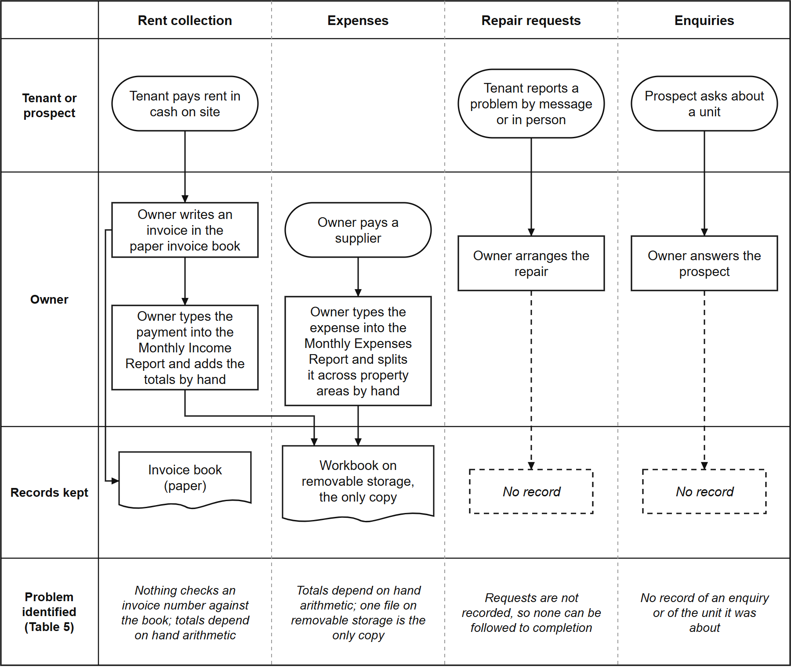
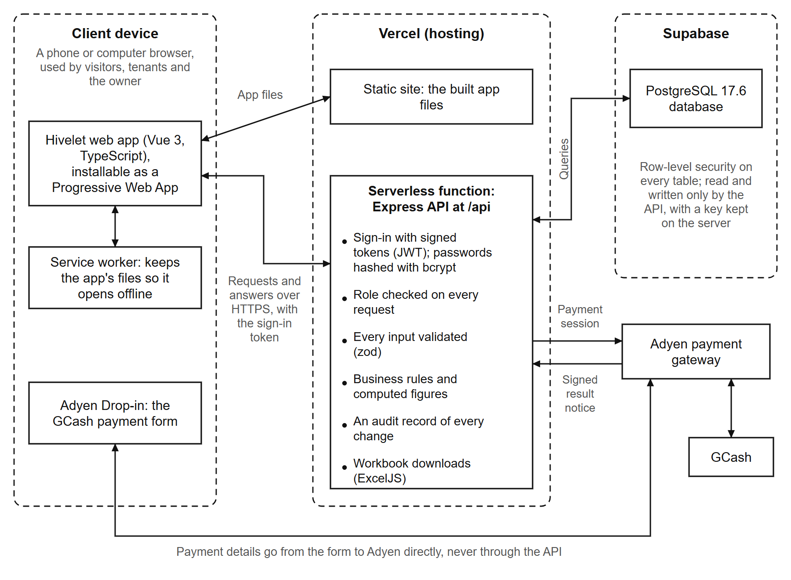
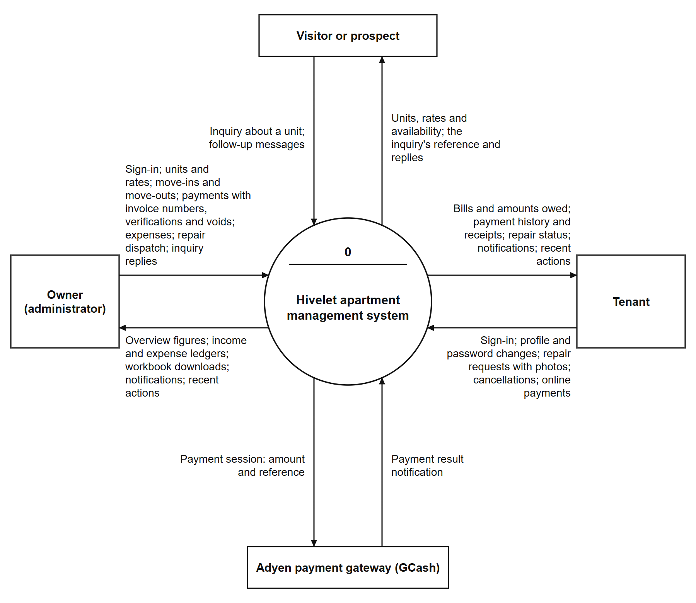
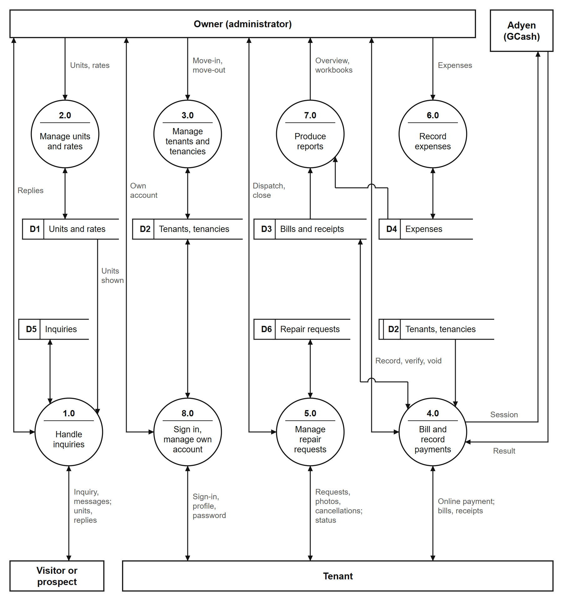
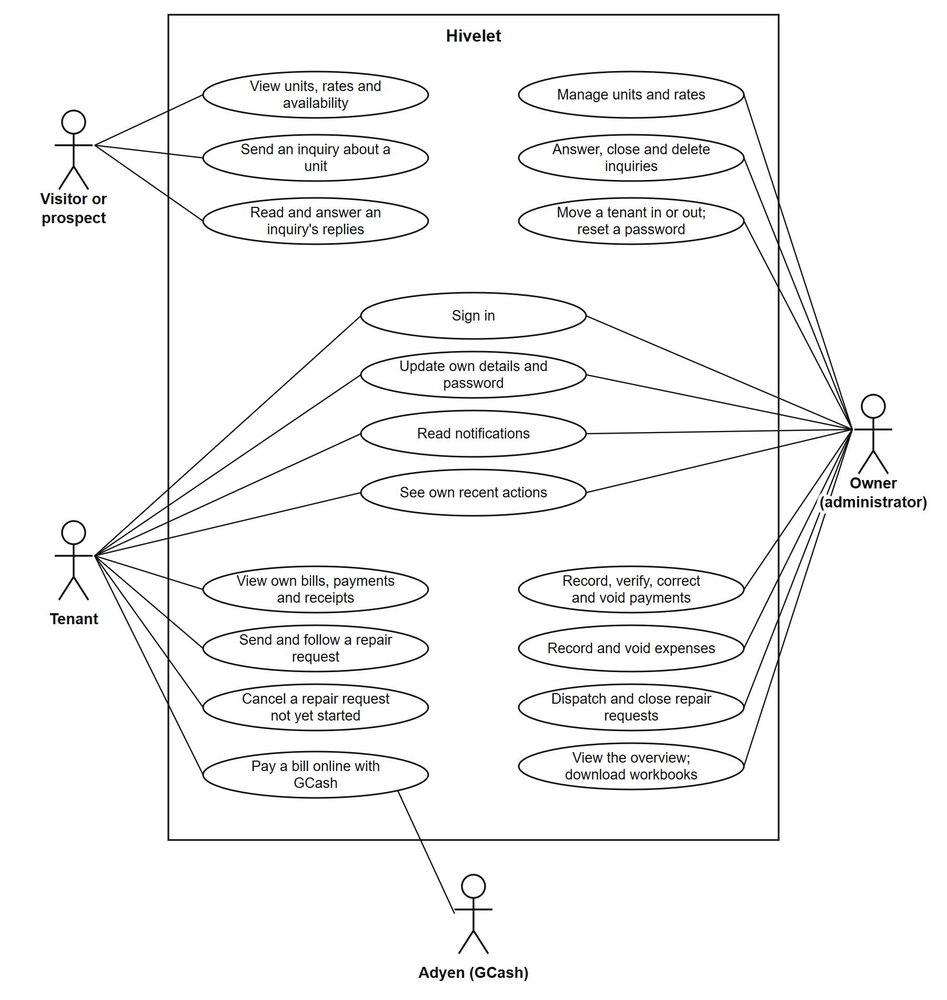
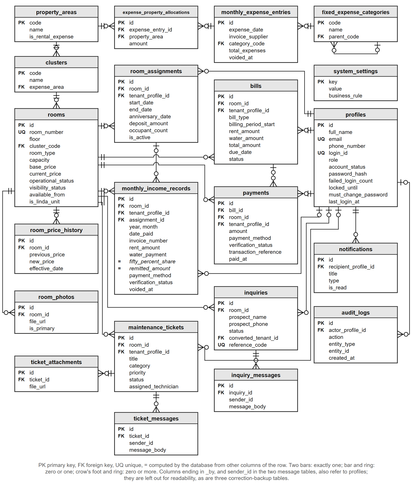
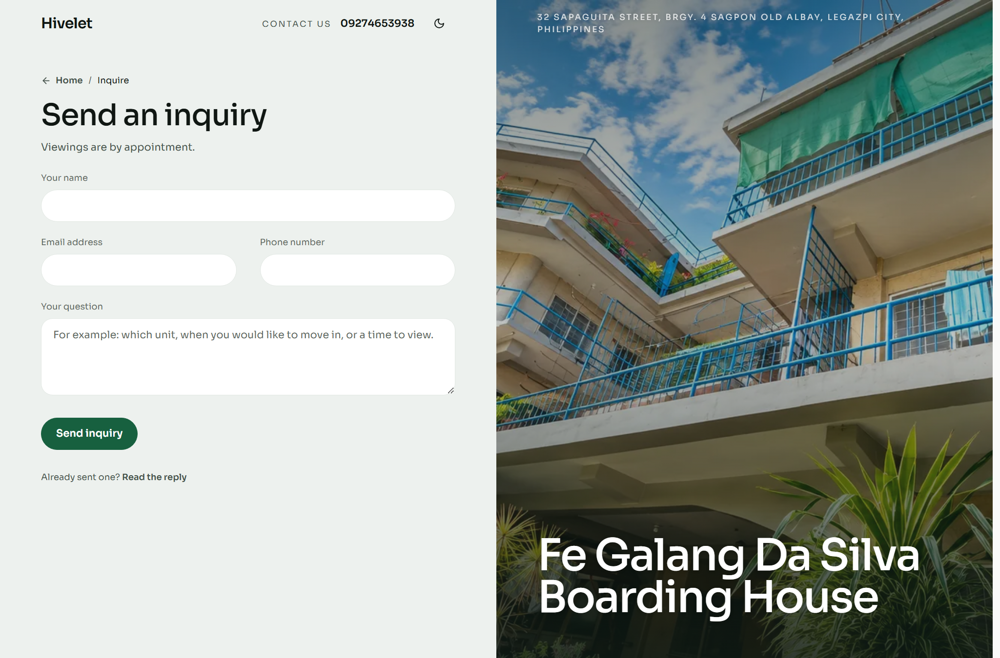
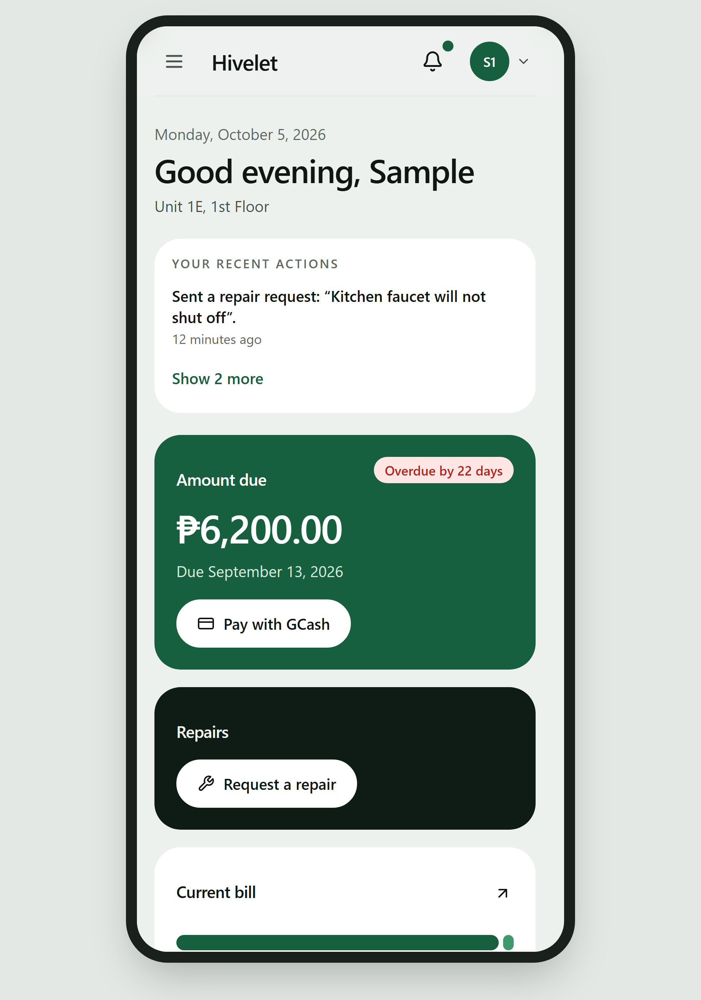

# 4 RESULTS AND DISCUSSION

> **TEAM NOTE (delete every TEAM NOTE block before pasting into the manuscript).**
> Written 2026-09-26 to replace the template text in the manuscript's Chapter 4, which is still
> Lorem Ipsum. Every number here was read from the live system or from a check run on
> 2026-09-26, and the source is named beside it. Anything marked **[DATA PENDING]** needs data only
> the team can collect (see `TEAM_TASKS_WE_DO_OURSELVES.md`). Do not fill a pending cell from
> expectation. Table and figure numbers continue from Chapter 3 (the last table there is Table 4,
> the Likert scale, and the last figure is Figure 3), because the manuscript numbers them across
> the whole document.
>
> **Updated 2026-09-28** against the system as it stands after the 26 September fixes and
> clean-up: Table 8 re-run, Table 9 and the defect list brought up to date (all six defects now
> fixed), the ledger pages' new names, the maintenance features added on 26 September, the removal
> of test data, and the decision about historical receipts.
>
> **Updated 2026-09-29**, the evening before the testing day: Table 8 re-run; §4.3.6 added with
> measured offline, installation, weak-connection and simultaneous-use results (Tables 11A, 11B);
> §4.3.7 added for the owner and tenant acceptance test (Tables 11C, 11D, pending); two rows added
> to Table 23; the tenant account reset in §4.2.6 and Table 25.
>
> **Updated 2026-10-01** from the testing day's results (`docs/TESTING_DAY/results/`): Table 10
> (§4.3.4), Table 11 (§4.3.5), Tables 11C and 11D (§4.3.7) and §4.4.8's supporting evidence filled;
> testing-day rows added to Table 23. Parts A, T and C were checked against the system's activity
> record first and corrected where it disagreed; each results file says what changed. **Still
> pending:** the survey (Tables 12 and 14 to 22, the technical evaluators on Saturday 3 October),
> Table 5's owner question, Table 25 stages 4 and 5. (The figures were added on 5 October; see
> `figures/README.md`.)
>
> **Updated 2026-10-05 (night):** Figures 4 to 9 added, the diagrams the course guide expects
> (as-is process, architecture, context, level 1 DFD, use case, ERD), drawn from the system by
> `scripts/build-chapter-4-diagrams.mjs`; the screenshots are now Figures 10 to 14. Table 7A is a new
> data dictionary extract, so the business rules and role matrix are now Tables 7B and 7C.
>
> **Updated 2026-10-05:** Table 23 gained the technical evaluators' fourteen comments from their
> 3 October review (relayed by Eljohn) and the change made for each, all on the live site by
> 5 October (commits 055c6ff to 47b37fa). The survey export is still the missing input for
> Tables 12 and 14 to 22.
>
> **Updated 2026-10-06 (evening): realigned to ISO**, as the adviser asked (the evaluation must be
> aligned with ISO). Nothing measured changed; every number below was already in this chapter or in
> `docs/TESTING_DAY/results/`. What is new: the chapter opening names the ISO/IEC 25000 (SQuaRE)
> standards used; **Table 7D** maps each test activity to the 25010 characteristics it measured,
> and each 4.3 subsection says which; **Table 12B** lays §4.4 out as the five steps of ISO/IEC 25040;
> **Table 12C** places the 2011 characteristics in the 2023 edition (the "why 2011?" answer);
> **Tables 14A to 21A** give each characteristic its measured evidence, sub-characteristic by
> sub-characteristic, beside the survey table; **Table 22A** sets measured and rated evidence side
> by side (27 of 31 sub-characteristics measured, 25 rated, 2 neither); **Table 22B** reports quality
> in use. The Compatibility row uses the testing day's browser matrix (CO-01 to CO-06), which the
> chapter had not reported. **Chapter 3 must declare the same framework: paste
> `FIXES_TO_CHAPTERS_1_TO_3.md` H8** (its Table 4B assigns every survey item to a sub-characteristic,
> which §4.4 relies on). The survey's items and Tables 14 to 22 are unchanged, so
> `compute-survey.mjs` still fills them as before.
>
> **Updated 2026-10-07: the survey is in.** Six responses (owner 1, tenants 3, prospect 1, technical
> evaluator 1), exported by Lloyd. Tables 12, 12A (but Distributed), 13A and 14 to 22 filled by
> `compute-survey.mjs --method=A` (the mean of the group means; method B is reported in one sentence
> in §4.4.2); one interpretation paragraph per characteristic, each read against its measured table;
> Table 22A's rated column and its paragraph; four survey rows in Table 23; satisfaction comments in
> Table 22B. Overall **4.53, Very High Quality**; lowest Maintainability 4.00 (one rater) and
> Usability 4.12. The export's name column was removed before use (B-103). Later the same day: Table
> 12A's Distributed (6 of 6, 100%) and Table 25's stages 4 and 5, from Sean.

This chapter presents the results of the study and discusses what they mean. It is organized by
the four specific objectives in Section 1.2: the analysis of existing practices (4.1), the
development of the system (4.2), pilot testing (4.3), and evaluation and optimization based on
ISO/IEC 25010 (4.4). It closes with the deployment plan (4.5).

The testing and the evaluation are aligned with one set of international standards, the ISO/IEC
25000 series on software quality (SQuaRE), as declared in Section 3.3. The quality model is that of
ISO/IEC 25010:2011, which divides product quality into eight characteristics and thirty-one
sub-characteristics and defines a separate model of quality in use. Each test in Section 4.3 is
reported as a measure of one or more of those sub-characteristics, in the form ISO/IEC 25023 uses
for product quality and ISO/IEC 25022 for quality in use, and Section 4.4 follows the five steps of
the evaluation process in ISO/IEC 25040. Every characteristic is therefore judged on two kinds of
evidence: what was measured in testing, and how the system's users rated it.

---

## 4.1 Analysis of Existing Apartment Management Practices and System Requirements

*Answers Objective 1.*

The Fe Galang Da Silva Boarding House has 33 rentable units in five clusters: the Boarding House
(22 units), the Back Apartment (5), the Front Apartment (3), the Penthouse (1) and Linda (2). The
units sit on three residential floors and a rooftop penthouse level, with 11, 11, 10 and 1 units
per floor. At the time of writing, 32 of the 33 units are occupied. These figures were confirmed by
the owner on 13 September 2026 and are checked against the live records on every verification run.

### 4.1.1 Existing Practices and Identified Problems

Before Hivelet, the owner ran the business from a spreadsheet workbook with two sheets, a Monthly
Income Report and a Monthly Expenses Report, kept on removable storage, together with a physical
invoice book. Rent was collected in cash on site. Tenant concerns and maintenance
requests arrived by messaging application or in person. Table 5 compares each practice with the
problem it caused.

**Table 5.** Existing Practices and Identified Problems

| Area | Existing practice | Problem identified |
| :--- | :--- | :--- |
| Tenant management | Tenant details kept in the income sheet and in the owner's memory | No single record of who lives in which unit, since when, or how many occupants |
| Financial tracking | Income and expense sheets typed by hand; invoices written in a paper book | Totals depend on manual arithmetic; nothing checks an invoice number against the book; one file on removable storage is the only copy |
| Communication | Requests sent by messaging application or said in person | Requests are not recorded, so there is no way to follow a request to completion |
| Booking | [CONFIRM WITH THE OWNER: how enquiries arrived before the system, for example walk-in, referral or phone] | No record of enquiries or which unit an enquiry was about |

Figure 4 follows each of the four areas through the hands that touched it. Every path ends in a
record kept apart from the others, or in no record at all, which is where each problem in Table 5
begins.

*Figure 4. The Owner's Process Before the System.*

The strongest evidence for these problems came from the owner's own records. When her workbook was
transferred into the system (937 income rows and 1,327 expense allocations), the transfer exposed
problems that had gone unnoticed in the spreadsheet:

- **402 of the 937 income rows (43%)** had no anniversary date and no deposit recorded.
- **Five invoice numbers** were each used for two different payments. In one case, a
  single invoice number was used for two different tenants on the same day. Each case is recorded
  in the system and reported on every verification run. None has been changed: the team decided
  on 26 September 2026 that historical records stay exactly as the owner wrote them, as the record
  of what happened. The standard the system is held to is that every record it produces itself is
  correct.

These are not errors by the owner. They are what happens when records are kept by hand with
nothing to check them against, and they are the kind of problem the system was built to catch.
The finding that matters most is that the problems did not sit in one area. **Each area kept its
own informal record, and nothing connected one record to another.** This matches the fragmentation
described in Chapter 2 (Ullah et al., 2021; Burke, 2026; Magno et al., 2024).

### 4.1.2 System Requirements

The analysis produced **44 functional requirements** and **49 business rules**. Every requirement
is traced to the part of the system that implements it in a traceability matrix, and every rule
is recorded with its status and evidence in a business rule register. Both documents are checked
automatically for internal consistency on every verification run (Section 4.3.1).

The matrix grades each requirement against the code, not against the plan. At its last full
grading (16 September 2026), 25 of the 44 were implemented as worded, 15 in part, 1 in the
interface only, and 3 not as worded. None of the three is absent from what the owner sees. Cash
flow (FR-019) and profitability (FR-020) appear on her overview as operating cash flow, net
operating income and collections by month, but they are computed in the browser from the two
ledgers rather than produced by a server report, which is what the requirements specify. The
number of occupants (FR-033) carries forward from the tenancy, which the owner edits, rather than
from the previous month's row as the requirement words it. Table 6 shows how each identified gap
became a requirement and a module.

**Table 6.** Identified Gaps, System Requirements and Implementing Modules

| Identified gap | System requirement | Module (Section) |
| :--- | :--- | :--- |
| No single tenant and unit record | Keep one record per unit and per tenant, with occupancy and move-in dates | Tenant and Room Management (4.2.2) |
| Enquiries not recorded | Let the public view units and send an enquiry about a specific unit | Booking and Reservation (4.2.3) |
| Manual arithmetic and unchecked receipts | Compute charges, record payments against the owner's own invoice numbers, reproduce the owner's reports | Financial Tracking (4.2.4) |
| Cash only, no digital option | Offer an optional online payment that the owner verifies before it counts | Financial Tracking (4.2.4) |
| Requests not followed to completion | Record each request and its status until the owner closes it | Maintenance Ticketing and Notification (4.2.5) |
| Anyone with the file sees everything | Give the owner and each tenant access to only what their role needs | Role-Based Access Control (4.2.6) |
| One file on one device | Make the system reachable from any phone or computer | Progressive Web Application (4.2.7) |

Where the owner's answer was needed to settle a requirement, it was asked rather than assumed. For
example, the owner confirmed that a bill is overdue from the day after its due date (she allows
about a week before following up a late payment, but that week does not change when rent is due),
that she sets room rates by hand (so the system keeps a history of every rate change instead of
applying any automatic increase), and that a tenant does not need an email address to be recorded.
On 20 September 2026 she gave the current rate of every unit, and every one agreed with her own
receipts. **The questions still waiting for her answer** are collected in one list for a single
meeting and are named in Chapter 5 as recommendations.

---

## 4.2 Development of the Hivelet System

*Answers Objective 2. Each feature named in the objective has its own subsection.*

Figures 4 to 9 model the system as built, and Figures 10 to 14 show its screens as they stood on 5
October 2026. The units, their rates and their status in Figures 10 and 11 are the property's own, as the public site shows them. To protect the
tenants' privacy, the names, payments, expenses and repair requests in Figures 10, 12, 13 and 14 are
sample records, and no real tenant's name or payment appears in any figure.

### 4.2.1 System Architecture and Technology Stack

The system was built in three Agile iterations (Section 3.2). The first, from 24 July to 28 August
2026, built a working system and transferred the owner's records into it. The second, from 12 to
14 September 2026, checked that the system and its documents said the same thing, corrected 22
recorded errors, and added automated checks. The third, still in progress, closes the questions
that need the owner's answer and refines the system from client feedback and testing. Table 7
lists the technology used.

**Table 7.** Technology Stack of the Developed System

| Layer | Technology | Purpose |
| :--- | :--- | :--- |
| Presentation | Vue 3.5 with TypeScript 5.7, built with Vite 5.4, styled with Tailwind CSS 4.0 | The screens used by the public, tenants and the owner |
| Application | Node.js with Express 4.19 in TypeScript | Business rules, calculations and access checks |
| Data | PostgreSQL 17.6, hosted on Supabase | Storage of all records, with row-level security |
| Payment gateway | Adyen (Web Drop-in 6.44, API Library 32.0) with GCash | The optional online payment |
| Client delivery | Progressive Web Application (vite-plugin-pwa) | Installation on a phone or computer without an app store |
| Hosting | Vercel | Serves the application at a public web address |

Every change to the database structure or to stored records is written as a numbered migration
file (more than seventy by 5 October 2026), so the history of the data can be reviewed and repeated.

**Architecture.** Figure 5 shows where each part of the system runs. The application is delivered to
the browser as a Progressive Web Application and talks to one server program, an Express API that
runs on Vercel as a serverless function. Only that API reads or writes the database: row-level
security is switched on for every table and no rule opens a table to a browser, so a request that
does not pass through the API's sign-in and role checks reaches no data. Payment details are typed
into Adyen's own form and go from it to Adyen directly. The API only creates the payment session,
and records a payment once Adyen confirms it (Section 4.2.4).

*Figure 5. System Architecture.*

**Process model.** Figure 6 is the context diagram: the system as one process, with the four parties
outside it and the data that passes between them. Figure 7 opens that process into its eight
processes and the stores each reads and writes. Two stores are written by nearly every process and
are left out of Figure 7 for readability: the notifications, and the audit record of every change
(Section 4.4.8). The tenants, tenancies and store D2 is drawn twice, marked by a second bar, to avoid
crossing lines.

*Figure 6. Context Diagram.*

*Figure 7. Level 1 Data Flow Diagram.*

Figure 8 shows the same functions from the side of the people who use them. Each use case is a
function the server grants to that role and refuses to every other (Table 7C); Sign in, own details,
notifications and recent actions are shared by tenants and the owner, each seeing only their own.

*Figure 8. Use Case Diagram.*

**Data model.** Figure 9 is the entity-relationship diagram of the database as it stood on 5
October 2026. It was drawn from the database's own catalogue of tables, keys and constraints, not
from a design document, so it shows what the database enforces: 21 tables, each with a primary key,
and 37 foreign keys. Rooms and profiles are the two centres of the design. Every bill, payment,
receipt, tenancy, repair request and inquiry belongs to one unit, and every tenancy, bill and
payment to one person. The owner's two ledgers are kept as she kept them, a Monthly Income table of
receipts and a Monthly Expenses table whose entries are split across property areas.

*Figure 9. Entity-Relationship Diagram.*

Several of the rules in Section 4.2.4 live in the database itself rather than in the program, so
no screen or script can bypass them. One unit cannot have two active tenancies; one invoice number
cannot be used twice for the same unit and month on receipts that stand; an online payment's
gateway reference cannot be recorded twice; and the 50% Share and the remitted amount are computed
columns, so they cannot disagree with the rent and water beside them. Table 7A describes the
Monthly Income table, the one the owner reads most, as an extract of the data dictionary.

**Table 7A.** Data Dictionary Extract: Monthly Income Records

| Column | Type | Null | Key | Description |
| :--- | :--- | :---: | :---: | :--- |
| id | uuid | No | PK | Identifies the receipt |
| room_id | uuid | No | FK | The unit the payment is for (rooms) |
| tenant_profile_id | uuid | Yes | FK | The tenant who paid, where one is recorded (profiles) |
| assignment_id | uuid | Yes | FK | The tenancy the payment belongs to, where known (room_assignments) |
| year, month | integer | No | | The ledger month the receipt is filed under |
| date_paid | date | No | | The day the money was received |
| contact_name | varchar(255) | No | | The name as written on the receipt |
| invoice_number | varchar(100) | Yes | | The owner's own invoice number; not repeated for the same unit and month among receipts that are not voided |
| rent_period_start, rent_period_end | date | No | | The period the rent covers (BR-033) |
| rent_amount | numeric(10,2) | No | | The rent received |
| occupants | integer | No | | The number of occupants that month |
| water_payment | numeric(10,2) | No | | The water fee, ₱200 per occupant (BR-014) |
| fifty_percent_share | numeric(10,2) | | Computed | A system-computed figure equal to half the row's Rent Amount, kept for ledger parity with the owner's historical spreadsheet (BR-035) |
| remitted_amount | numeric(10,2) | | Computed | Rent Amount plus Water Payment (BR-038) |
| payment_method | enumeration | No | | Cash, GCash, Bank Transfer or Adyen Online |
| verification_status | enumeration | No | | Verified, Pending Verification or Rejected |
| transaction_reference | varchar(120) | Yes | | The gateway's reference for an online payment; never recorded twice |
| is_linda_billing, linda_water_charge, linda_electricity_charge | boolean, numeric(10,2) | Yes | | The two Linda units' charges, recorded separately (BR-040) |
| voided_at, voided_by, void_reason | timestamp, uuid, text | Yes | voided_by: FK | When, by whom and why a receipt was voided; a voided receipt is kept, never deleted |
| created_at, updated_at | timestamp | Yes | | When the row was written and last changed |

### 4.2.2 Tenant and Room Management Module

Each unit carries its cluster, floor, current rate and status. Each tenancy carries the number of
occupants, the move-in date and emergency contacts. The owner's workbook did not record move-in
dates, so for the transferred tenancies the screen says the date is not recorded rather than
showing a guessed one. When the owner changes a room rate, a database
trigger records the old rate, the new rate, the date and who made the change. Because the trigger
runs inside the database, a rate cannot be changed through any path without being recorded.

*Figure 10. Room and Rate Directory.*

### 4.2.3 Booking and Reservation Management Module

The public site lists the units with their rates, read live from the database. A visitor sends an
enquiry about a specific unit without needing an account. The enquiry appears in the owner's inbox,
and when accepted it becomes a tenancy that stays linked to the enquiry it came from. The owner
answers inside the system, and the visitor reads the answer there too: on sending, they are given a
private link and a short reference code, and either one (the code together with the phone number
they gave) opens their conversation, where they can write back. No account is created and nothing
is sent by text or email; the link's secret is stored only in hashed form, like a password. A reserved
unit stays visible but accepts no new enquiries. The public site never shows a tenant's name; this
is checked on every verification run against all 33 published units.

*Figure 11. Public Unit Catalogue (top) and Enquiry Form (bottom).*

### 4.2.4 Financial Tracking and Payment Recording Module

A bill carries rent and water as separate amounts. Water is the number of occupants multiplied by
a rate the owner can change in the settings, currently ₱200 per occupant, for every unit. The two
Linda units' money is recorded separately and kept out of the property's grand totals, as in the
owner's own workbook (BR-040). A bill is overdue from the day after its due date, as the owner confirmed.

Cash payments are recorded by the owner with the number of the invoice she issued, written INV#,
or with none, since not every payment has an invoice. The system never makes up an invoice number. Online payments go through Adyen with GCash: a payment
made this way enters a **Pending Verification** state and changes nothing on the tenant's bill
until the owner verifies it. Before the owner records a payment, the system warns her if the same
tenant already has a payment for that month, including one still waiting for verification.

Income and expenses are shown on two pages named after the owner's two workbook sheets, **Monthly
Income** and **Monthly Expenses**, in the same layout as those sheets, and can be exported as Excel
files in that layout. Income is filed under the month the rent is for, not the
day it was paid, so a late payment still counts toward the right month.

*Figure 12. The Monthly Income Ledger.*

Tenants follow the same record from their side. The tenant's payments page shows **"Your rent,
month by month"**: one sentence stating how far their payments reach ("Paid up to …") and what is
due, a bar for each of the last twelve months marked Paid, Due, Not entered or Not due yet,
and the months paid, the amount paid and the amount due now. Only receipts the owner has verified
count as paid, the same rule behind the "paid up to" date; a voided receipt never counts, and a GCash payment
still awaiting verification is listed separately as waiting. A month with no payment entered, whether
between two payments or after the last one, is shown as "Not entered", never as owed or overdue,
because the records alone cannot tell an unpaid month from one the owner has not entered yet; only
a bill actually raised is shown as due.

The system does not handle electricity. Every unit has its own meter and the tenant pays the
electric company directly, as the owner confirmed on 18 September 2026.

These results agree with Encarnacion et al. (2025) and Setty (2022), who found that bringing payment
records into one structured ledger improves oversight and reduces administrative errors. This study
adds one observation to theirs: the consolidation did not only prevent new errors, it exposed errors
already present in the owner's records (Section 4.1.1).

Every figure the owner reads is worked out by the system from the rules in Table 7B rather than
typed, so the same inputs always give the same amount.

**Table 7B.** Business Rules for Computed Figures, with a Worked Example

| Rule | What the system computes | Worked example |
| :--- | :--- | :--- |
| BR-014 Water fee | Water = number of occupants × ₱200 | Unit 2C with two occupants: 2 × ₱200 = ₱400 |
| BR-038 Remitted amount | Remitted = Rent Amount + Water Payment | ₱8,500 + ₱400 = ₱8,900 |
| BR-035 50% Share | A system-computed figure equal to half that row's Rent Amount, kept for ledger parity with the owner's historical spreadsheet | ₱8,500 ÷ 2 = ₱4,250 |
| BR-033 Rent period | The period a payment covers, from the tenancy's anniversary date | Anniversary on the 13th: rent for 13 August to 12 September |
| BR-010, BR-011, BR-012 Due date and overdue | Due on the date the billing cycle sets; overdue from the next day, with no grace period | Due 13 September: overdue from 14 September |
| BR-039 Deposit | Equal to the rent in effect at move-in, set once | Moved in at ₱8,500: deposit ₱8,500 |
| BR-040 Linda's units | Water at the same ₱200 per occupant, recorded separately and kept out of the remitted amount | Unit LF with two occupants: ₱400 recorded as Linda's water; remitted = rent only |
| BR-045 Expense total | An expense entry's total = the sum of its allocations to property areas | ₱6,000 to the Boarding House + ₱2,000 to the Main House = ₱8,000 |

### 4.2.5 Maintenance Ticketing and Notification Module

A tenant submits a request with a title, description and priority, and follows its status through
to completion. The owner can also log a repair herself when she is told about it in person,
including a repair to an empty unit, which has no tenant to report it. Only the owner can close a
request, and when she marks a tenant's repair as done the tenant is notified. The system also sends
in-app notifications to the tenant when a payment is verified or declined, and to the owner when a
payment, enquiry or request comment arrives. Opening a notification opens the record it is about,
for example the payment waiting to be verified, rather than only the page it is on.

This is the change Saputra et al. (2025) report, in which turning tenant complaints into recorded,
traceable requests improved accountability and response management, and it bears on the
responsiveness that Jing and Lim (2021) found central to residents' satisfaction: a request now
carries its status from submission to closing, where before it left no record (Figure 4).

*Figure 13. Maintenance Requests Board.*

### 4.2.6 Role-Based Access Control

The system has the three kinds of user designed in Section 3.2.2: the public, tenants and the
administrator. It also keeps a record of each visitor who sends an enquiry (a *prospect*), with
the same rights as the public, so that their details carry over if they become a tenant. Every
role's rights come from one named permission matrix. Each of the 55 administrator and
tenant routes declares the permission it requires, and this is checked on every verification run.
Access is also enforced by the database itself: row-level security is enabled on all 22 operational
tables (checked on the live database on 26 September 2026). The two remaining tables are backups
made during data corrections, and no client role has any access to them.

Other security measures in the system:

- Passwords are stored as bcrypt hashes, never as plain text. A new password must have at least
  ten characters, a letter and a number, checked by the server, and since 7 October 2026 it is also
  refused if it appears in a public list of breached passwords. Only the first five characters of
  its SHA-1 hash are sent to the list's service, so the password itself never leaves the server.
- An account locks after repeated failed sign-ins. The lock is checked before the password is
  compared, and it is kept per account so that an attacker cannot avoid it by changing address.
- A new account must change its password at first sign-in, and changing a password ends every
  other session of that account. Before the tenants first used the system, on 29 September 2026,
  every tenant account was given its own starting password, handed to the tenant in person, and
  set to require a new password at first sign-in; every earlier session was ended. Until then the
  tenant accounts had shared one password used by the development team. The owner can also reset a
  tenant's forgotten password from the tenant list: the tenant receives a new one-time password,
  must choose their own at next sign-in, and every earlier session ends (added 29 September 2026,
  Table 23).
- Every administrator action is written to an audit trail. The database refuses to let the
  application edit or delete its entries. The only change ever made to it was deliberate and
  reviewed: when test accounts were deleted, the name on their entries was removed and every entry
  kept. On the capstone adviser's advice the trail is kept in the database for the developers and
  is not shown in the application: its Activity screen was removed on 1 October 2026.
- Messages from the payment gateway are accepted only with a valid HMAC signature.
- A check for committed passwords and keys runs before every commit.

Table 7C sets out which role may use which function. It is read from the permission table in the
server's code, which every request is checked against before it reaches the data.

**Table 7C.** Role and Privilege Matrix

| Function | Visitor | Tenant | Administrator |
| :--- | :---: | :---: | :---: |
| View the public site, units and rates | Yes | Yes | Yes |
| Send an inquiry and read the reply (private link or reference code) | Yes | Yes | Yes |
| View and update their own details and password | No | Own | Own |
| View a unit, its bills, payments and receipts | No | Own | All |
| Pay a bill online with GCash | No | Own | No |
| Send, follow and cancel a repair request | No | Own | All, and dispatch or close |
| Receive notifications | No | Own | Own |
| Manage units and rates | No | No | Yes |
| Manage tenants: move in, move out, reset a password | No | No | Yes |
| Record, verify, correct and void payments | No | No | Yes |
| Income and expense ledgers, overview figures and workbook downloads | No | No | Yes |
| Answer, close and delete inquiries | No | No | Yes |

A prospect, someone recorded from an inquiry who has not moved in, holds a visitor's permissions.
"Own" means the server reads the person from their sign-in token and returns only their own
records; anyone else's answers "not found".

### 4.2.7 Progressive Web Application Implementation

The client is a Progressive Web Application with a service worker and a web app manifest, so it
can be installed on a phone or computer and opens without the browser's address bar. The service
worker keeps the application's own files for faster loading, but it does not store tenant or
financial data. A separate, read-only copy was added on 1 and 2 October 2026: the essential
figures, names and notifications the signed-in person's screens last loaded are kept in the
browser on that person's own device, so the installed application can still show them with no
connection under one notice giving the time they were saved. For a tenant these are their rent,
balance, payments, repair requests and details; for the owner, the units, tenants, income and
expense records, repairs and inquiries. Paying, recording and every other action still need the
connection and are not offered without it, and the copy is removed when the person signs out or
someone else signs in on the device. This stays within the delimitation in Section 1.4:
current data and every change to it need an internet connection. Screens adapt to the device: tables on a computer become cards
on a phone.
As Biørn-Hansen et al. (2019) describe, one application served every device: the same code ran on
the owner's laptop, an Android phone in Chrome and an iPhone in Safari during testing (Section
4.3.7), with no separate mobile application to build or install from an app store.

*Figure 14. The Tenant Portal on a Mobile Phone.*

---

## 4.3 Pilot Testing of the Developed System

*Answers Objective 3: functionality, responsiveness and operational performance.*

The three qualities Objective 3 names correspond to characteristics of ISO/IEC 25010:2011:
functionality to **Functional Suitability**, responsiveness to the time behaviour of **Performance
Efficiency**, and operational performance to its capacity and to **Reliability**. The pilot tests
measured these and five more characteristics, because a test written for one quality often
measures another as well: the walkthrough that showed a function works also showed that one tenant
cannot reach another's records. Table 7D lists each test activity with the characteristics it
measured. Each measure is reported in Section 4.3 and brought together by characteristic in
Section 4.4, where it stands beside the survey's ratings.

**Table 7D.** Test Activities and the ISO/IEC 25010:2011 Characteristics They Measured

| Test activity (Section) | Test level | Characteristics measured (sub-characteristics) |
| :--- | :--- | :--- |
| Automated verification (4.3.1) | Unit and integration | Functional Suitability (correctness); Security (confidentiality, integrity, authenticity); Compatibility (interoperability); Maintainability (testability) |
| Use in the live environment (4.3.2) | System, in operation | Functional Suitability (correctness); Compatibility (interoperability); Reliability (recoverability) |
| Screen-versus-database audit (4.3.3) | System | Functional Suitability (correctness); Reliability (maturity) |
| Functional walkthrough (4.3.4) | System | Functional Suitability (completeness, correctness); Usability (user error protection); Security (confidentiality); Reliability (fault tolerance) |
| Responsiveness (4.3.5) | System | Performance Efficiency (time behaviour, resource utilization) |
| Offline, installation, weak connections and simultaneous users (4.3.6) | System | Reliability (fault tolerance); Performance Efficiency (capacity); Portability (installability, adaptability); Usability (accessibility) |
| User acceptance testing (4.3.7) | Acceptance | Quality in use (effectiveness, efficiency, context coverage); Usability (learnability, operability); Security (confidentiality) |

### 4.3.1 Automated Verification

*Measures Functional Suitability (functional correctness); Security (confidentiality, integrity,
authenticity); Compatibility (interoperability, with the payment gateway and the Excel reports);
Maintainability (testability).*

Twenty automated check suites were written during development. They run against the live system
and **perform no writes**, which is what makes them safe to run against the owner's real records.
The full set was run again on 29 September 2026, the evening before the first test with real
users, and **all 20 passed**, with the same counts as the run of 28 September. Table 8 shows the
principal results.

**Table 8.** Results of Automated Verification (29 September 2026)

| Suite | What it checks | Result |
| :--- | :--- | :--- |
| Endpoint and access control | Every endpoint the client calls, the separation of roles, and the rejection of bad input | 78 of 78 passed |
| Ledger integrity | All 937 income rows against the business rules; room, tenant and occupancy agreement | Passed; 5 receipt anomalies reported for the owner |
| Report reconciliation | The exported Excel reports against the database, month by month | 490 of 490 passed |
| Payment gateway | Signature checking on gateway messages and how each kind of message is recorded | 73 of 73 passed |
| Record relations | That separate records agree with each other (payments with bills, tickets with units) | 30 of 30 passed |
| Billing arithmetic | Water, billing period and how a payment is split across bills | Passed |
| Data presentation | That no screen shows stored, sample or empty data as a live figure | 6 of 6 passed |
| Interface integrity | That every screen component exists, every input has a label, and every source file is used | Passed |
| Document consistency | That the requirements matrix and business rule register agree with themselves | Passed (44 requirements, 49 rules) |

Two results are worth discussing.

First, the checks found problems that no one had written a check for. The five receipt anomalies
in Section 4.1.1 came from the owner's historical records, not from the system. They are reported
on every run instead of being quietly corrected, because only the owner's invoice book can say
what each entry should read.

Second, several serious defects found during development gave no error on screen at all. In one,
a cash payment could be confirmed on screen while nothing was written to the ledger. In another, a
partial payment was recorded but the remaining debt was lost. Each was fixed, and each now has a
check that fails if it returns. This is the main argument for automated verification in a system
that holds real money: the most dangerous defects are the silent ones.

### 4.3.2 Use in the Live Environment

*Measures Functional Suitability (functional correctness); Compatibility (interoperability, with
the payment gateway); Reliability (recoverability).*

The system has run at a public address since September 2026 with the owner's real records. The
following real events are part of the pilot:

- **22 September 2026.** A checkout in the tenant portal, made during a live payment test, raised
  the first bill the system ever created for real use: ₱8,200.00 for unit 1a, made of the ₱8,000 rate and ₱200 water for one occupant. The amount
  was computed by the system and matches the rules exactly.
- **22 September 2026.** A cash receipt was recorded during testing and voided four minutes later.
  The ledger returned to exactly 937 rows and its previous total, which shows the void path works.
- **23 September 2026.** The client opened the system on a phone and found it hard to use. The
  team measured the problems instead of guessing: a table 518 pixels wide inside a 301-pixel
  screen, edit buttons that did not appear on touch screens, a payment form whose buttons were
  hidden below the screen, and toolbars that overlapped. All were fixed the same day (Section
  4.4.11).

At first, Adyen's test account refused every GCash payment. The team traced the fault using
Adyen's own API logs:
- the payment session was created (HTTP 201);
- GCash was offered as a payment method;
- but the payment request came back "Refused", with no redirect and no reason;
- and no transaction ever appeared in the account's payment list.

A bank decline or a fraud-risk rule acts on a transaction that exists. A refusal with no
transaction therefore pointed to how the account was set up, not to the system. Adyen support
(Case 08657379) confirmed this. The GCash acquirer account, which actually processes the payment,
was misconfigured, and Adyen set up a new one.

Asked afterwards what had gone wrong, Adyen Technical Support explained that GCash needs a
specific acquirer account configuration in the test environment, and that some of its fields had
probably been changed during Adyen's automatic setup flow, which broke the default configuration
the payment method depends on (Adyen Technical Support, personal communication, September 27,
2026). The test environment runs on predefined configurations and does not carry out every step
end to end, so a fault that live onboarding would catch appeared here as an immediate refusal. In
the live environment the setup is more controlled: some steps are handled by Adyen Support, and
the merchant may be asked for further details. Going live is therefore treated as a separate step
(Chapter 5, Recommendation 3).

On 26 September 2026 a test payment passed end to end:
- Adyen authorised it;
- its signed notification reached the system;
- it appeared as Pending Verification in the administrator's verification queue;
- it was rejected there, and the tenant's bill stayed owed.

That retest found one defect in the system itself. A tenant returning from a successful GCash
payment was told the payment could not be confirmed. It was fixed and confirmed on a second test
payment the same day. The system's own handling of gateway messages is covered by the passing
checks in Table 8.

When the pilot tests were finished, every record they had created was removed the same day, 26
September 2026, by a single reviewed migration run after a backup: all 20 payment records, every
one of them a test (the GCash payments, which could not be real money because the gateway account
is still Adyen's test account; the voided test receipt and its cash entries; and the demo accounts'
payments), together with 16 notifications and the demo accounts' bills and tenancies. The bill raised on 22 September stayed, because
it is a correct bill for a real tenancy, and went back to owed. The owner's 937 income rows were not
touched. The audit trail was not edited either: it keeps the record of the testing and gained one
entry saying what was removed and why.

### 4.3.3 Screen-versus-Database Audit

*Measures Functional Suitability (functional correctness) and Reliability (maturity).*

The automated suites prove that each part of the system is correct on its own. They do not prove
that a screen shows a person what the database holds for that person. On 26 September 2026 a team
member noticed that a tenant's payment history read "Nothing recorded" although the tenant had
seven receipts that year. Every suite had passed, because the screen was correct code reading the
wrong list.

The team therefore audited every owner screen, and the tenant payment screen, directly; the
remaining tenant screens followed on 29 September 2026, read with a tenant session on a local copy
of the application connected to the live records. Each figure a screen displayed was compared with
a read-only query of the live database for the same records. The owner's screens were read with
the owner's own session on the live site; where a screen could only be tested locally, it was given
the live figures with every personal detail removed. Nothing was written to the database during the
audit. Table 9 shows the result.

**Table 9.** Results of the Screen-versus-Database Audit (26 and 29 September 2026)

| Screen | What was compared | Result |
| :--- | :--- | :--- |
| Owner overview | Collections for each month of 2026, the year's total, occupancy, rent per cluster, expected monthly income, operating and personal costs | Matched to the peso |
| Monthly Income | Totals for rent and water (and a garbage fee, removed on 30 September); collections by cluster | Matched after one defect was fixed |
| Monthly Expenses | Total spent, split by kind and by area | Matched; one layout defect fixed |
| Rooms and rates | Rent and number of occupants for each unit | Matched |
| Tenants | Number of tenants per cluster; move-in dates | Counts matched; one defect fixed |
| Activity (audit trail) | Each recent entry against the recorded action | One defect fixed |
| Repairs, inquiries | Number of open items | Matched |
| Tenant payments | A tenant's receipts for 2026 | Two defects fixed |
| Tenant overview, repairs and details (29 Sep 2026) | Unit, rate, occupants, monthly charge (rent plus ₱200 per occupant), the period the receipts reach, amount due, requests, contact details | Matched |

The audit found six defects that no automated check had caught, and all six were fixed on 26
September 2026:

1. **A tenant's payment history showed no payments.** The page read only payments made through the
   system, while every receipt the owner recorded lives in the ledger. It now reads both.
2. **Rental and personal expenses shared one column.** A repair to the Back Apartment and one of the
   owner's personal costs looked the same on a row, on a page that says personal costs are not
   deducted from rental income. They now have separate columns, as in the owner's workbook.
3. **Every tenant appeared to have moved in on 1 July 2026.** That date was a placeholder written
   when the records were transferred; 29 of the 32 tenants have receipts from before it. The screen
   now says the date is not recorded.
4. **An opened GCash checkout was listed as "Payment recorded".** Six such entries appeared on 25 and
   26 September, and none became a payment. They now read "GCash payment started".
5. **A voided receipt still appeared in the tenant's own receipt list.** The server now leaves
   voided receipts out of what a tenant is shown, as every other screen already did.
6. **The Boarding House's remitted amount was halved on the income screen.** The screen totalled
   it as half the rent plus water, while the database, the Excel export and business rule BR-038
   used the full rent plus water. Rather than choose between the two, the team read the formula in
   the owner's own workbook, which adds the full rent; half the rent appears only in her separate
   50% column. The screen was corrected to match.

The audit also found that the list of payments behind the owner's overview would have stopped
silently at 1,000 records, a limit of the database service, which at the property's pace would
have been reached in about two and a half years. It now reads the list in batches, as the income
list already did.

The tenant screens showed one thing that is not a defect of the system but matters to anyone using
it. On 29 September 2026 the latest receipt in the ledger was dated 8 August 2026, so the portal
told every one of the 32 tenants that they were behind by one or two periods. The screens were
right about the records; the records were behind the owner's invoice book. A system that tenants
can see makes the owner's entry of receipts part of what they experience, and the testing day was
prepared accordingly (the owner enters the receipts she holds first, or tenants are told).

The lesson is the same one Section 4.3.1 draws, from the other side: **passing checks show that
what was tested is correct, not that everything is.** Comparing each screen with the records it
claims to show is now part of how the team verifies the system.

This supports the observation of Magno et al. (2024) that digitizing records does not by itself
remove fragmentation. Here every record was already in one database, yet the audit found six places
where a screen disagreed with it. The consistency that Pressman and Maxim (2020) attribute to
integrated systems had to be verified screen by screen; it did not follow from the shared database
alone.

### 4.3.4 Functional Walkthrough Testing

*Measures Functional Suitability (functional completeness and correctness); Usability (user error
protection); Security (confidentiality); Reliability (fault tolerance).*

A 26-step walkthrough (30 rows in Table 10, counting the sub-steps 15b, 19b, 22b and 23b) exercises every function that writes data exactly once. It runs against the
one unoccupied unit so that no real tenancy, receipt or expense is touched. The owner performed it
herself on 30 September 2026 on the administrator's laptop in Google Chrome, signed in to her own
account, with a team member reading each step and recording the outcome. Where the observer's notes
and the system's own activity record disagreed, the activity record was taken as the account of
what was done.

> **TEAM NOTE.** Source: `docs/TESTING_DAY/results/A_ADMIN_Lloyd.md` (Part A, A-05 to A-32), turned
> into this table by `scripts/survey/a-md-to-csv.mjs` and `fill-walkthrough.mjs`. Steps 7, 22, 22b
> and 26 were corrected to "Not done" on 1 October after the activity record showed they had not
> happened as written. Step 18 was first recorded as Fail (no water warning) and reclassified: since
> 30 September the water amount cannot be typed. The two test expenses of step 22 were voided by
> migration 070 on 1 October (BLOCKED_FOR_SEAN.md, B-91), so September's books no longer count them.

**Table 10.** Results of the Functional Walkthrough

| Step | Function tested | Expected result | Actual result | Pass or fail |
| :--- | :--- | :--- | :--- | :--- |
| 1 | Public unit catalogue browsing | 33 units listed without resident names or sensitive details | As expected. | Pass |
| 2 | Public unit detail inspection | Correct rate, floor, and cluster; resident names omitted (LB and LF verified) | As expected. | Pass |
| 3 | Public booking enquiry submission | Confirmation message displayed; rate limiter guards abuse | As expected. | Pass |
| 4 | Authentication negative test | Wrong current password rejected with inline message; session stays active | As expected. | Pass |
| 5 | Administrator password rotation | Password updated successfully; active session maintained | As expected. | Pass |
| 6 | Re-authentication with new credential | Successful sign-in using updated administrator password | As expected. | Pass |
| 7 | Unit rate update and audit trigger | Rate updated; database trigger writes immutable price history row | Not performed: the system's activity record shows no rate change that day, and the unit kept its ₱30,000 rate. | Not done |
| 8 | Tenant onboarding to vacant unit (PH) | Tenancy created; unit status transitions to Occupied | As expected. | Pass |
| 9 | Duplicate credential guard | Duplicate phone number registration rejected with validation message | As expected. | Pass |
| 10 | Tenancy details modification | Occupant count updated and persisted in database | As expected. | Pass |
| 11 | Tenant portal authentication | Tenant dashboard displays correct unit details, rate, and occupancy | Signed in after one mistyped password; the system required a new password, then showed the unit, rate and occupants. | Pass |
| 12 | Maintenance ticket creation with attachment | Ticket submitted with photo; size guard informs user if file is too large | As expected. | Pass |
| 13 | Ticket communication thread | Follow-up message posted and displayed within ticket conversation | As expected. | Pass |
| 14 | Tenant emergency contact update | Updated emergency contact saved and reflected in profile | As expected. | Pass |
| 15 | Online payment checkout initialization | Adyen Web Drop-in mounts inside modal and displays GCash button | The payment window opened with the GCash button; the attempt was not paid and was rejected, so nothing reached the ledger. | Pass |
| 15b | On-demand billing generation | Bill generated on demand matching unit rate plus ₱200/occupant water | A bill of ₱30,200 was raised (₱30,000 rent and ₱200 water for one occupant); removed after the test. | Pass |
| 16 | Notification state management | Notification marked as read; unread badge counter decrements | As expected. | Pass |
| 17 | Cross-tenant authorization perimeter | Accessing foreign ticket ID returns HTTP 404 (Not Found), not 403 | As expected. | Pass |
| 18 | On-site cash collection recording | Collection recorded against invoice REHEARSAL-001; bill marked settled | The collection of ₱30,200 was recorded and the bill settled. Water is worked out from the number of occupants and cannot be typed, so a wrong water amount could not be entered. | Pass |
| 19 | Duplicate invoice prevention | Re-submitting an identical invoice number is blocked with an explicit alert | As expected. | Pass |
| 19b | Receipt voiding and double-void guard | First void reverses ledger entry; second void attempt is rejected | The first void worked. The second window refreshed itself and no longer showed the receipt, so a second void could not be attempted; the refusal message was therefore not seen. | Pass |
| 20 | Enquiry processing and resolution | Administrator reply sent; enquiry status marked Closed | As expected. | Pass |
| 21 | Maintenance resolution and notification | Ticket advanced to Resolved; tenant receives resolution notification | Moved to In Progress, then Resolved; the tenant was notified that the repair was done. | Pass |
| 22 | Expense recording and allocation | ₱100 expense logged with property allocation; edits/deletion verified | Not performed as written: two separate expenses (₱60 and ₱40) were recorded instead of one ₱100 expense split 60/40, and neither was edited or deleted. | Not done |
| 22b | Expense allocation split derivation | Expense split across areas; total derived automatically via trigger | Not performed as written: two separate expenses (₱60 and ₱40) were recorded instead of one ₱100 expense split 60/40, and neither was edited or deleted. | Not done |
| 23 | Financial workbook export | income.xlsx and expenses.xlsx downloaded matching owner layout | As expected. | Pass |
| 23b | Fail-safe presentation on API interruption | Backend stopped; money tiles display "—" instead of misleading ₱0.00 | With the connection cut, the money tiles showed ₱0 and "Try again" instead of "—". | Fail |
| 24 | Tenant vacating and tenancy termination | Tenancy ended; unit returns to Available; end_date recorded | The test tenant was moved out and the unit showed Available. | Pass |
| 25 | Ledger baseline verification | Rehearsal records removed; ledger restored to exact 937 baseline rows | Done by the team after the session rather than on screen: the test tenant's bill, payments, voided receipt and repair were removed; the two test expenses of step 22 were voided on 1 October. | Not done |
| 26 | Unit rate restoration | PH rate restored to confirmed ₱30,000 rate card baseline | Not needed, because step 7 was not performed; the rate reads ₱30,000. | Not done |

Of the 30 rows of the walkthrough, 24 passed the first time, 1 failed and 5 were not performed as
written. Every function a tenant uses passed, as did the owner's onboarding, the duplicate guards
for phone numbers and invoice numbers, voiding, enquiry replies, repair handling, the workbook export and
moving a tenant out. In step 18 the collection was recorded and the bill settled; the test also
asked for a wrong water amount to be typed first, but since 30 September water is worked out from the
number of occupants and cannot be typed, so no wrong amount could be entered. The one failure was
step 23b: with the connection cut, the Overview showed ₱0 where the design (Section 4.2.7) requires
"—", so that a missing figure is never read as a zero balance. It is recorded as a defect (Table 23).
Of the steps not
performed, step 7 (a rate change) and step 26 (restoring it) were skipped together, and steps 22 and
22b were carried out as two separate expenses instead of one expense split between two areas, so
splitting, editing and deleting an expense were not exercised by the owner. Step 19b passed with an unexpected result: the second window refreshed itself before the
repeated void could be attempted, a consequence of the live updating added on 30 September, so the
guard against a double void was not reached from the screen.

### 4.3.5 Responsiveness and Operational Performance

*Measures Performance Efficiency (time behaviour and resource utilization).*

Performance was measured on 30 September 2026 on the live system, on a laptop in Google Chrome 154
over the boarding house's Wi-Fi and on a phone. First loads were taken with the browser's cache
cleared. Page loads on the laptop were read from the browser's developer tools (the time until the
page had finished loading); the other times were taken with a stopwatch, from the tap until the
figures the user came for were on screen, or until the file was saved.

> **TEAM NOTE.** Source: `docs/TESTING_DAY/results/PF_TIMINGS_Eljohn.md`. Three runs were timed per
> screen but only one value was written down, so each figure is a single run, not the median of
> three; Chapter 3's procedure now says one run (FIXES H2, corrected 7 Oct). **Before pasting:**
> make the column headings name the actual laptop and phone, and make sure Chapter 3's Tables 2 and 3
> list the same devices (the sheet names a Dell XPS 15; the phones used that day were an Infinix
> GT20 on Wi-Fi and an iPhone 15 on mobile data, and the sheet does not say which phone each time
> came from - ask Eljohn).

**Table 11.** Page Load and Response Times (30 September 2026, seconds)

| Screen | Laptop | Mobile phone |
| :--- | --: | --: |
| Public home page, first load | 1.85 | 2.42 |
| Public home page, second load | 0.62 | 0.95 |
| Sign-in to dashboard | 2.10 | 2.88 |
| Income ledger, one full year | 1.45 | not measured |
| Excel export of one year | 2.30 | not measured |
| Tenant portal, first load | 2.15 | 3.05 |
| Tenant payments page | 1.20 | 1.78 |
| Sending a repair request | 1.65 | 2.10 |

Every screen was usable within about three seconds on the phone and a little over two on the
laptop. The slowest was the tenant portal on first load (3.05 seconds on the phone). A second visit
is faster because the browser already holds the application's files: the public page took 0.95
seconds on the phone instead of 2.42. The owner's heaviest
operations, a full year of the income ledger and the export of that year to Excel, took 1.45 and
2.30 seconds.

Google's measurements agree with these. PageSpeed Insights, which runs Lighthouse on Google's
servers against an emulated mid-range phone on a slow 4G connection, scored the public page 85 to 88
for performance in four runs on 30 September and 1 October, with its largest element drawn at 3.4
to 3.6 seconds, and 95 and 98 as a computer page (largest element at 0.9 and 1.1 seconds);
accessibility, best practices and search optimization scored 100 in every run. Lighthouse run on
the owner's signed-in Overview on 1 October, in a clean browser profile, scored 85 for performance
as a computer page and 81 as a phone page, and 100 for accessibility and best practices. Its search
score of 66 is intended: the owner's pages tell search engines not to list them, so that her books
never appear in search results. What held the signed-in page back was movement as the figures
arrived on the computer (a layout shift of 0.22) and 0.7 seconds of script work on the emulated
phone (Chapter 5, recommendation 5).

### 4.3.6 Offline Use, Installation, Weak Connections and Simultaneous Users

*Measures Reliability (fault tolerance); Performance Efficiency (capacity); Portability
(installability and adaptability); Usability (accessibility).*

> **TEAM NOTE.** Tables 11A to 11D are new (29 September 2026). Renumber every table after
> Table 11 when this chapter goes into the Word file. The measurements are in
> `PRE_TESTING_AUDIT_2026-09-29.md`, with the device and time of each.

Before the system was used by its tenants, the behaviour a real day of use would test was measured
on the live system on 29 September 2026: what happens without a connection, on a weak one, when the
application is installed, and when several people use it at once. The measurements were taken with
Google Chrome 154 driven by an automated browser (Playwright) on an Acer Nitro ANV15-52 laptop
(Intel Core i5-13420H, 16 GB) on a home broadband connection, using Chrome's phone emulation
(390 × 844 pixels). Every attempt to save data was blocked inside the browser, so the tests wrote
nothing to the owner's records.

**Table 11A.** Offline and Installation Behaviour (29 September 2026)

| Test | Result |
| :--- | :--- |
| Installation requirements (manifest, service worker, icons) | Met; the service worker keeps 67 application files on the device after the first visit |
| Opening ten addresses with no connection | The application opened on all ten in about 1.5 seconds instead of the browser's "no internet" page |
| Tenant and administrator pages with no connection, signed out | The application opened and asked for sign-in; no personal or financial data was shown |
| Notice when the connection drops | Shown at once: "No connection. You can read what is already loaded, but nothing can be saved or paid until it is back." |
| Notice when the connection returns | "Back online" |
| Public unit list with no connection | Shown from the device's memory |
| Public unit list when the server stops answering | Shown from the device's memory after 3.1 seconds |
| Public page on a slow connection (400 kbps, 400 ms), first visit | Units on screen after 4.6 seconds |
| The same page, returning visitor | Units on screen after 0.3 seconds, because the installed application already holds its files |

**Table 11B.** Simultaneous Users, Read Operations (29 September 2026)

| Test | Users at once | Duration | Requests | Errors | Slowest 5% took longer than |
| :--- | --: | --: | --: | --: | --: |
| Public pages and public data, live site | 12 | 60 s | 1,085 | 0 | 0.52 s |
| The owner's ten main data requests, live database | 6 | 45 s | 285 | 0 | 0.80 s |

The results show that the application behaves as Section 1.4 and Section 4.2.7 say it should, and
no more. It opens without a connection and says plainly what it cannot do, but the owner's and
tenants' records need the connection. Since 1 and 2 October the essential figures, names and
notifications a person last loaded stay readable offline on that person's device (Section 4.2.7),
and they are removed at sign-out, so none are left on a shared phone.
Under loads several times larger than the property's own (a few tenants and one owner), no request
failed and nineteen in twenty were answered in under a second.

The same tests found one weakness. A weak signal usually stalls instead of failing, and the
application waited for as long as the browser did, which can be minutes, with the button showing
"Sending…" and no advice. A time limit was added the same evening: a page now stops waiting after
25 seconds and says it could not reach the server, and a save stops after 45 seconds and says it
**cannot tell whether the save arrived, so the reader should check before sending it again**. Only
the save message makes no claim, because a save that timed out may still have been recorded. With
the server held open on purpose, the public page showed its notice at 27 seconds and the enquiry
form its message at 46 seconds with the typed text kept; without the change, the same page still
showed nothing after 41 seconds (Table 23).

An accessibility scan of the seven public pages (axe-core 4, WCAG 2 levels A and AA) at phone and
computer widths found no violations, and no page was wider than a 360-pixel phone screen. The same
two measurements were taken on the owner's eight screens, signed in on a local copy of the
application connected to the live records, at 360, 390, 768 and 1366 pixels: no screen was wider
than the window and none had a violation. These were the screens the owner had found hard to use on
her phone on 23 September (Section 4.3.2); the fixes of that day are here measured on the real
screens with real records for the first time.

Google Lighthouse (version 12.8, run on the same laptop against the live public page, three runs
each, median reported) scored accessibility, best practices and search optimization 100 on both a
simulated phone and a computer. It also found the page jumping as it loaded: the footer appeared on
an empty page and was pushed down when the page's content arrived, a layout shift of 0.50 where
0.1 is the limit for "good", which held the computer performance score at 76. The space the page
needs is now held until it loads; after the change the live page measured a layout shift of 0 and
a computer performance score of 95. On the simulated slow phone the score stayed about 70, because
the page's main text appears only after its code has arrived and run, about five seconds on that
connection. Later that morning phones were sent only the part of each photograph they show: the
middle of the building photograph at full sharpness, half the file, and a smaller copy of the gate,
a third of it. Google's PageSpeed Insights, which runs Lighthouse on Google's own servers, then
scored the phone page 86 for performance with its largest element drawn at 3.5 seconds, against 76
and 5.3 seconds in its run before the change (Chapter 5, recommendation 5). The real-device timings in Table 11 are the measurement
that decides how fast the system is for the owner and tenants.

### 4.3.7 User Acceptance Testing with the Owner and Tenants

*Measures quality in use (effectiveness, efficiency and context coverage); Usability (learnability
and operability); Security (confidentiality).*

> **TEAM NOTE.** Filled on 1 October 2026 from `docs/TESTING_DAY/results/` (Parts A, T, C, O). Part T
> and Part C were corrected against the system's activity record before use; each file says what
> was changed and why. Table 11C is computed by `scripts/survey/compute-uat.mjs` from
> `T_observations.csv`. **Before pasting:** confirm that signed consent forms exist for the owner and
> all three tenants (the sentence on consent below depends on it).

The owner and three tenants used the live system for their own tasks on 30 September 2026, each on
their own device and signed in to their own account, after giving written consent, by the
procedure and measures described in Section 3.3. The owner's session
followed the walkthrough (Table 10) and her real work of the day. The tenants came at different
times in the evening: the first from 7:28 PM, the other two together from 8:08 PM, which is when
the simultaneous session took place. The team repeated the offline and installation tests of Table
11A on two phones, an Android phone in Chrome and an iPhone in Safari.

Where an observer's sheet and the system's activity record disagreed, the activity record was used,
since it records every sign-in, sign-out, request, note and saved change with its time. A task the
record shows was never done is counted as not attempted. On this rule the third tenant's session
counts only the tasks the record confirms, because the times on that tenant's sheet fall before the
account's first sign-in.

**Table 11C.** Tenant Task Results (30 September 2026)

| Task | Tenants attempting | Completed without help | Completed with help | Not completed | Median time (s) | Mean wrong turns | Completion without help |
| :--- | --: | --: | --: | --: | --: | --: | --: |
| First sign-in and choosing a password (T-01, T-02) | 3 | 4 | 2 | 0 | 120 | 0.5 | 67% |
| Finding their unit, rent and balance (T-03, T-04) | 2 | 3 | 1 | 0 | 90 | 0.5 | 75% |
| Finding their payments (T-05, T-06) | 2 | 4 | 0 | 0 | 60 | 0.0 | 100% |
| Sending a repair request with a photo (T-07 to T-09) | 3 | 7 | 0 | 0 | 90 | 0.0 | 100% |
| Following up a request (T-10, T-11) | 2 | 3 | 0 | 0 | 120 | 0.0 | 100% |
| Checking their details and notifications (T-12, T-13) | 3 | 5 | 0 | 0 | 60 | 0.2 | 100% |
| Opening the GCash payment (T-14) | 2 | 2 | 0 | 0 | 120 | 0.0 | 100% |
| Staying out of the owner's pages; signing out (T-15, T-16) | 2 | 3 | 0 | 0 | 60 | 0.0 | 100% |
| **All tasks** | 3 | 31 | 3 | 0 | 60 | 0.2 | 91% |

**Table 11D.** Simultaneous Use by the Owner and Tenants (30 September 2026, two tenants)

| Test (at the same moment) | Result |
| :--- | :--- |
| Every tenant opens their overview (C-01) | Pass: both screens loaded; the slowest in about 1 second |
| Each tenant sees only their own unit and records (C-02) | Pass: each saw only their own unit and account |
| Every tenant sends a message on a request (C-03, C-04) | Not performed: one tenant sent a note, and the owner saw and answered it within a minute |
| The owner changes two requests; only those tenants are notified (C-05) | Not applicable: by the owner's decision a tenant is notified when a repair is done, not when it is started, so no notice was expected |
| A double tap on Send saves one message (C-06) | Not performed |
| The owner opens a full year of Monthly Income while tenants are active (C-07) | Pass: loaded in about 3 seconds |
| The owner on the laptop and tenants on phones at once (C-08) | Pass: no session affected another |

Every task the tenants attempted was completed, 31 of 34 attempts without help (91 per cent). Help was needed at the start: two of the three tenants
were helped through their first sign-in, one after two wrong turns, and one needed help to find
their unit and rent. No tenant needed help with anything else. Finding payments, reporting a
repair, following it up, checking their details and notifications, opening the GCash payment and
being kept out of the owner's pages were all done alone, typically in one to two minutes each. The
repairs they sent reached the owner at once and she acted on them the same evening: two were set
to In Progress within minutes and she answered the second tenant's note a minute after it was sent.
Asked whether anything was confusing, the first tenant said "So far, wala naman" (nothing so far)
and the third "Wala naman po" (nothing). The second said "Nakulangan pa ako. And I want more" (it
still felt lacking; I want more), which the team reads as a request for more features rather than a
difficulty, and which Chapter 5 takes up. The owner, asked what she would use first the next
morning, said she would check the repair notifications.

Mia et al. (2024) name limited technical capacity as a barrier when small Philippine enterprises
adopt digital tools. The tenants' results locate that barrier precisely: the only help needed was at
the first sign-in and in finding the unit and rent, the first two things a new user does, and none
afterwards.

The simultaneous session ran with two tenants, not all three, and the owner; the tests that depend
on several tenants posting at once (C-03, C-04, C-06) were therefore not performed. Table 11B covers
simultaneous reading only, so simultaneous saving by several real users remains untested. On the two
phones the offline behaviour matched Table 11A: both installed the application from the browser
(Chrome offered "Add to Home screen" rather than an installation prompt), opened it without a
connection with the notice shown, kept typed text when a send failed, and showed no personal data after signing out; sending the kept text once the connection returned is confirmed
by the activity record on one of the two phones. One result differed. On a
connection that stops answering, the iPhone showed the "cannot tell whether it was saved" message
within the 45 seconds the design sets, but the Android phone showed it only after 60 to 80 seconds.
The message is correct but late on that phone, and it is recorded as a defect (Table 23).

---

Table 11E brings the testing of Section 4.3 together by test level, using the levels of ISO/IEC/IEEE
29119 (Section 3.2.4): unit and integration, system, and acceptance.

**Table 11E.** Summary of Test Execution by Level

| Level | Activity (source) | Executed | Passed | Failed | Not performed or not applicable | Pass rate |
| :--- | :--- | --: | --: | --: | --: | --: |
| Unit and integration | Automated check suites, 29 September 2026 (Table 8) | 20 | 20 | 0 | 0 | 100% |
| System | Functional walkthrough by the owner, 30 September 2026 (Table 10) | 25 | 24 | 1 | 5 | 96% |
| Acceptance | Tenant tasks, 30 September 2026 (Table 11C) | 34 | 34 | 0 | 0 | 100% (91% without help) |
| Acceptance | Simultaneous use by the owner and tenants (Table 11D) | 4 | 4 | 0 | 3 | 100% |
| **All levels** | | **83** | **82** | **1** | **8** | **98.8%** |

Every level passed at least 96 per cent of the tests executed. The one failure, at the system level,
is classified in Table 23A; it was not critical, and no critical defect was found in any activity.

## 4.4 Evaluation of the System Based on ISO/IEC 25010

*Answers Objective 4.*

> **TEAM NOTE.** Filled on 7 October 2026 from the Google Form export (six responses, names removed:
> `docs/TESTING_DAY/results/ISO_IEC_25010_Software_Quality_Assessment.csv`) by
> `scripts/survey/compute-survey.mjs --method=A`. The items are word for word the form's. Chapter 3
> must name all four respondent groups (FIXES H2 and H4) and the framework (H8). Table 12A's
> Distributed column and Table 25's stages 4 and 5 were confirmed by Sean on 7 October: the form
> went only to the six who used the system, and the system is not yet her main record.

The evaluation followed the five steps of the evaluation process in ISO/IEC 25040, set out in Table
12B. The quality model is that of ISO/IEC 25010:2011, the edition on whose eight characteristics the
instrument was built. Each characteristic was judged on two kinds of evidence:

- **Measured quality**: the results of the tests in Section 4.3, each expressed as a measure of a
  sub-characteristic in the manner of ISO/IEC 25023, for example the proportion of executed
  walkthrough steps that gave the correct result.
- **Rated quality**: the survey, in which each item is assigned to one sub-characteristic (Chapter
  3, Table 4B), so that every mean in Tables 14 to 21 belongs to a named part of the model.

The survey was answered by four groups: the owner, the tenants, prospective tenants who used only
the public website, and technical evaluators (IT professionals, developers or IT faculty). Each
group rated only what it is in a position to judge. Tenants use only the tenant portal, so they did
not rate Security or Maintainability, and prospective tenants, who see only the public website,
rated neither. Only technical evaluators rated Maintainability, because judging it requires reading
the source code and documentation.

**Table 12B.** The Evaluation Process, Following ISO/IEC 25040

| Step | What it required | How it was carried out |
| :--- | :--- | :--- |
| 1. Establish the evaluation requirements | The purpose, the product, the quality model and who judges it | Objective 4; the live system at its public address; ISO/IEC 25010:2011, eight characteristics; the owner, tenants and technical evaluators (Section 3.3) |
| 2. Specify the evaluation | The measures for each sub-characteristic, and the criteria for judging them | Measures from the tests of Section 4.3 (Table 7D); survey items assigned to sub-characteristics (Chapter 3, Table 4B); criteria: Table 13 for every mean, and for tests the course standard of at least 90 per cent passed with no critical defect open |
| 3. Design the evaluation | The activities, their order and schedule | Measurements on 29 September 2026; the walkthrough and acceptance test on 30 September; the technical evaluators' review on 3 October; the survey after each group's use of the system |
| 4. Execute the evaluation | Take the measures and apply the criteria | Section 4.3 (measured) and Tables 14 to 21 (rated) |
| 5. Conclude the evaluation | Review the results, report them, and act on them | Tables 22 and 22A, and the changes made in response (Table 23) |

ISO/IEC 25010 was revised in 2023. The revision keeps six of the eight characteristics, renames
Usability as *Interaction Capability* and Portability as *Flexibility*, and adds a ninth, *Safety*.
Because the survey was built and answered on the 2011 characteristics, its results are reported on
them; changing the model after the answers were given would change what the respondents were asked.
Table 12C shows where each result falls in the revised model, so that the evaluation can be read
against either edition.

**Table 12C.** The 2011 Characteristics and Their Place in ISO/IEC 25010:2023

| ISO/IEC 25010:2011 (this evaluation) | ISO/IEC 25010:2023 | What changed |
| :--- | :--- | :--- |
| Functional Suitability | Functional Suitability | Unchanged |
| Performance Efficiency | Performance Efficiency | Unchanged |
| Compatibility | Compatibility | Unchanged |
| Usability | Interaction Capability | Renamed; user interface aesthetics became user engagement, accessibility was divided into inclusivity and user assistance, and self-descriptiveness was added |
| Reliability | Reliability | Maturity renamed faultlessness |
| Security | Security | Resistance added |
| Maintainability | Maintainability | Unchanged |
| Portability | Flexibility | Renamed; scalability added |
| (no counterpart) | Safety | New. Its fail-safe and hazard-warning sub-characteristics correspond to results reported here under Reliability: a figure that cannot be loaded is never shown as ₱0, and a save that may not have arrived says so (Sections 4.3.4 and 4.3.6) |

### 4.4.1 Respondents

**Table 12.** Distribution of Respondents

| Group | Number | Percent |
| :--- | ---: | ---: |
| Owner / administrator | 1 | 16.67% |
| Tenants | 3 | 50.00% |
| Technical evaluators | 1 | 16.67% |
| Prospective tenants | 1 | 16.67% |
| **Total** | **6** | 100% |

Six people answered, each after using the system and each after giving consent on the form's
first page: the prospective tenant on the afternoon of 30 September 2026, after browsing the public
site and sending an inquiry; the three tenants that evening, after their tasks in Section 4.3.7;
the owner that night, after her walkthrough (Section 4.3.4); and one technical evaluator on 4
October, the day after the evaluators' review of the live system (Table 23). Three of the four
groups therefore have one respondent each. For those groups a mean is one person's rating and no
standard deviation can be computed, and the results below describe how these six people rated the
system, not a sample from which a wider population can be inferred.

**Table 12A.** Instrument Administration and Response Rate

| Group | Distributed | Retrieved | Valid | Response rate |
| :--- | ---: | ---: | ---: | ---: |
| Owner / administrator | 1 | 1 | 1 | 100% |
| Tenants | 3 | 3 | 3 | 100% |
| Technical evaluators | 1 | 1 | 1 | 100% |
| Prospective tenants | 1 | 1 | 1 | 100% |
| **Total** | **6** | **6** | **6** | **100%** |

The form was given only to those who had used the system for the evaluation: the administrator, the
three tenants and the prospective tenant who took part on 30 September, and the technical evaluator.
Every one of them answered, and every answer was complete.

### 4.4.2 Interpretation of Scores

Each item was rated on the five-point scale in Table 4. Mean scores are read using Table 13.

**Table 13.** Interpretation of Mean Scores

| Mean score | Verbal interpretation |
| :--- | :--- |
| 4.21 – 5.00 | Very High Quality |
| 3.41 – 4.20 | High Quality |
| 2.61 – 3.40 | Moderate Quality |
| 1.81 – 2.60 | Low Quality |
| 1.00 – 1.80 | Very Low Quality |

The composite mean of each characteristic is the mean of the group means, so that one owner is not
outweighed by three tenants on functions only she uses; the overall mean is the mean of the eight
composites. Averaging every response together instead gives an overall mean of 4.55 rather than 4.53,
with the same interpretation and the same highest and two lowest characteristics.

Table 13A works one weighted mean in full, so that every mean in Tables 14 to 21 can be checked
the same way: each rating is multiplied by the number of respondents who chose it, and the sum of
the products is divided by the number of respondents, WM = Σ(f × w) / N.

**Table 13A.** Worked Computation of a Weighted Mean

Indicator: "I can see my own unit details, my bill, and what I still owe." (Functional Suitability, rated by tenants).

| Rating (w) | Meaning | Frequency (f) | f × w |
| ---: | :--- | ---: | ---: |
| 5 | Strongly Agree | 3 | 15 |
| 4 | Agree | 0 | 0 |
| 3 | Neutral | 0 | 0 |
| 2 | Disagree | 0 | 0 |
| 1 | Strongly Disagree | 0 | 0 |
| **Total** | | **N = 3** | **Σ(f × w) = 15** |

WM = Σ(f × w) / N = 15 / 3 = **5.00**, which Table 13 reads as **Very High Quality**.

### 4.4.3 Functional Suitability

**Table 14.** Evaluation Results for Functional Suitability

| Indicator | Rated by | Mean | SD | Interpretation |
| :--- | :--- | ---: | ---: | :--- |
| The system lets me manage tenant records, units, and the number of occupants in each unit. | Owner | 5.00 |  | Very High Quality |
| The system computes rent and water charges correctly, without me doing the arithmetic myself. | Owner | 5.00 |  | Very High Quality |
| Payments I receive in person are recorded accurately against the correct unit and month. | Owner | 5.00 |  | Very High Quality |
| Online payments made by tenants appear correctly for me to verify before they are settled. | Owner | 5.00 |  | Very High Quality |
| Maintenance requests can be submitted, followed, and closed within the system. | Owner | 5.00 |  | Very High Quality |
| The financial reports the system produces match the records I keep. | Owner | 4.00 |  | High Quality |
| **Owner mean** | | **4.83** | | Very High Quality |
| I can see my own unit details, my bill, and what I still owe. | Tenants | 5.00 | 0.00 | Very High Quality |
| I can submit a maintenance request and follow what happens to it. | Tenants | 5.00 | 0.00 | Very High Quality |
| I can see a record of the payments I have made. | Tenants | 5.00 | 0.00 | Very High Quality |
| **Tenant mean** | | **5.00** | | Very High Quality |
| The system provides the functions required for tenant, unit, and occupancy management. | Technical | 5.00 |  | Very High Quality |
| Rent and water charges are computed correctly and consistently. | Technical | 5.00 |  | Very High Quality |
| Payment recording and verification behave correctly for both in-person and online payments. | Technical | 5.00 |  | Very High Quality |
| The maintenance ticketing workflow supports submission, tracking, and closure. | Technical | 3.00 |  | Moderate Quality |
| Generated reports agree with the records held in the database. | Technical | 5.00 |  | Very High Quality |
| **Technical evaluator mean** | | **4.60** | | Very High Quality |
| I could find which kinds of units the boarding house has and how much they cost. | Prospects | 5.00 |  | Very High Quality |
| I could see enough about a unit (its floor, how many people can stay, its floor plan) to decide whether to ask about it. | Prospects | 5.00 |  | Very High Quality |
| I could send an inquiry about a unit without difficulty. | Prospects | 5.00 |  | Very High Quality |
| **Prospective tenant mean** | | **5.00** | | Very High Quality |
| **Composite mean** | | **4.86** | | **Very High Quality** |

**Table 14A.** Measured Evidence for Functional Suitability

| Sub-characteristic | Measure | Result | Source |
| :--- | :--- | :--- | :--- |
| Functional completeness | Features named in Objective 2 that were implemented, X = A / B | 6 / 6 = 1.00 | Sections 4.2.2 to 4.2.7 |
| Functional completeness | Functional requirements implemented in full or in part, X = A / B | 41 / 44 = 0.93 (25 as worded); the other 3 reach the owner in another form | Section 4.1.2 |
| Functional correctness | Report reconciliation checks that agreed with the database, X = A / B | 490 / 490 = 1.00 | Table 8 |
| Functional correctness | Executed walkthrough steps that gave the expected result, X = A / B | 24 / 25 = 0.96 | Table 10 |
| Functional correctness | Screens whose figures matched the database, after correction | 9 / 9, after 6 defects were corrected | Table 9 |
| Functional appropriateness | Tenant tasks completed, X = A / B | 34 / 34 = 1.00 | Table 11C |

Every feature the objective names is present, and between 96 and 100 per cent of the executed checks of correctness gave the right result. The one incorrect result, the ₱0 of walkthrough step 23b, concerns a figure that could not be loaded rather than a computed amount, and is reported under Reliability.

Every group rated Functional Suitability Very High Quality (composite 4.86, second of eight), and
the tenants and the prospective tenant gave every item 5. The ratings agree with the measured
evidence. The lowest item was the technical evaluator's 3.00 for the maintenance workflow
(submission, tracking and closure). The same evaluators had asked the day before for tenants to be
able to withdraw a request, which was added on 5 October (Table 23), after the rating was given.
The owner gave 4.00 to the reports matching the records she keeps, her one item below 5, without
giving a reason.

### 4.4.4 Performance Efficiency

**Table 15.** Evaluation Results for Performance Efficiency

| Indicator | Rated by | Mean | SD | Interpretation |
| :--- | :--- | ---: | ---: | :--- |
| The system responds quickly when I move between screens. | Owner | 5.00 |  | Very High Quality |
| Financial reports are produced without a long wait. | Owner | 4.00 |  | High Quality |
| The system stays responsive even when many records are shown at once. | Owner | 5.00 |  | Very High Quality |
| **Owner mean** | | **4.67** | | Very High Quality |
| The system opens quickly. | Tenants | 5.00 | 0.00 | Very High Quality |
| The system responds without delay when I move between screens. | Tenants | 5.00 | 0.00 | Very High Quality |
| **Tenant mean** | | **5.00** | | Very High Quality |
| Response times are acceptable for the expected number of users and records. | Technical | 4.00 |  | High Quality |
| Report generation completes within a reasonable time. | Technical | 4.00 |  | High Quality |
| The system uses client and server resources efficiently. | Technical | 4.00 |  | High Quality |
| **Technical evaluator mean** | | **4.00** | | High Quality |
| The website opens quickly. | Prospects | 4.00 |  | High Quality |
| The pages respond without delay when I move around the website. | Prospects | 4.00 |  | High Quality |
| **Prospective tenant mean** | | **4.00** | | High Quality |
| **Composite mean** | | **4.42** | | **Very High Quality** |

**Table 15A.** Measured Evidence for Performance Efficiency

| Sub-characteristic | Measure | Result | Source |
| :--- | :--- | :--- | :--- |
| Time behaviour | Longest time until a screen was usable, real devices | 3.05 s on a phone (tenant portal, first load); 2.30 s on a laptop (a year exported to Excel) | Table 11 |
| Time behaviour | Time within which 95 per cent of requests were answered under load | 0.52 s (public pages); 0.80 s (the owner's data) | Table 11B |
| Resource utilization | Code a visitor's browser downloads for the payments page | About 20 kB; the 194 kB payment library only when a payment starts | Table 23 |
| Resource utilization | Script work on an emulated mid-range phone, the owner's Overview | 0.7 s | Section 4.3.5 |
| Capacity | Failed requests with 12 simultaneous users, X = A / B | 0 / 1,085 = 0.00 | Table 11B |
| Capacity | Failed requests with 6 simultaneous readers of the owner's records, X = A / B | 0 / 285 = 0.00 | Table 11B |

No request failed at several times the property's own load, and no screen took longer than about three seconds on a phone. The script work on a phone is the one measure that leaves room for improvement (Chapter 5, recommendation 5).

Performance Efficiency was rated Very High Quality (4.42) but sixth of eight. The tenants gave every
item 5; the technical evaluator and the prospective tenant gave every item 4, and the owner gave 4 to
the wait for financial reports and 5 to the rest. This matches the measurements: no request failed,
but the slowest screens took two to three seconds on a phone, and on a simulated slow phone Google's
PageSpeed Insights drew the public page's largest element at 3.4 to 3.6 seconds (Section 4.3.5).

### 4.4.5 Compatibility

**Table 16.** Evaluation Results for Compatibility

| Indicator | Rated by | Mean | SD | Interpretation |
| :--- | :--- | ---: | ---: | :--- |
| The system works correctly in the browser I normally use. | Owner | 5.00 |  | Very High Quality |
| Reports exported from the system open correctly in my spreadsheet program. | Owner | 5.00 |  | Very High Quality |
| I can use the system at the same time as the other applications on my device. | Owner | 5.00 |  | Very High Quality |
| **Owner mean** | | **5.00** | | Very High Quality |
| The system works correctly in the browser I normally use. | Tenants | 4.67 | 0.58 | Very High Quality |
| I can use the system at the same time as my other apps. | Tenants | 4.67 | 0.58 | Very High Quality |
| **Tenant mean** | | **4.67** | | Very High Quality |
| The system operates correctly across current mainstream browsers. | Technical | 5.00 |  | Very High Quality |
| Exported files conform to formats that other applications can read. | Technical | 5.00 |  | Very High Quality |
| The system coexists with other applications without interference. | Technical | 5.00 |  | Very High Quality |
| **Technical evaluator mean** | | **5.00** | | Very High Quality |
| The website works correctly in the browser I normally use. | Prospects | 4.00 |  | High Quality |
| **Prospective tenant mean** | | **4.00** | | High Quality |
| **Composite mean** | | **4.67** | | **Very High Quality** |

**Table 16A.** Measured Evidence for Compatibility

| Sub-characteristic | Measure | Result | Source |
| :--- | :--- | :--- | :--- |
| Co-existence | Not measured by a test; rated in the survey only | | |
| Interoperability | Device and browser combinations on which sign-in, the pages and installation worked, X = A / B | 5 / 5 = 1.00 (Android Chrome 154, iPhone Safari, Windows Chrome 154, Edge and Firefox 157); Samsung Internet not tried | Compatibility matrix, 30 September 2026 |
| Interoperability | Payment gateway message checks passed, X = A / B | 73 / 73 = 1.00 | Table 8 |
| Interoperability | Exported workbooks opened in a spreadsheet program in the owner's layout | Opened (walkthrough step 23); 490 / 490 month-by-month checks against the database | Tables 8 and 10 |

The system exchanged data correctly with the two outside systems it depends on, the payment gateway and the owner's spreadsheet program, and worked on every browser tried. Co-existence with other applications on the same device was not tested on its own, so it rests on the survey.

Compatibility was rated Very High Quality (4.67). The owner and the technical evaluator gave every
item 5; two tenants each gave one of the two items 4, and the prospective tenant gave 4. The
ratings agree with the browser matrix, on which every combination tried worked. Co-existence, which
no test measured, was rated 4.67 by the tenants and 5 by the owner and the evaluator.

### 4.4.6 Usability

**Table 17.** Evaluation Results for Usability

| Indicator | Rated by | Mean | SD | Interpretation |
| :--- | :--- | ---: | ---: | :--- |
| I can tell what each screen is for without being taught. | Owner | 3.00 |  | Moderate Quality |
| The words and labels used match the way I actually talk about my property. | Owner | 4.00 |  | High Quality |
| Before anything is changed or deleted, the system asks me to confirm and tells me what will happen. | Owner | 5.00 |  | Very High Quality |
| When something goes wrong, the message tells me what to do about it. | Owner | 5.00 |  | Very High Quality |
| I was able to learn the system without technical help. | Owner | 3.00 |  | Moderate Quality |
| **Owner mean** | | **4.00** | | High Quality |
| I can tell what each screen is for without being taught. | Tenants | 4.00 | 0.00 | High Quality |
| The words used in the system are easy to understand. | Tenants | 5.00 | 0.00 | Very High Quality |
| It is clear how much I owe and what the amount is made up of. | Tenants | 4.33 | 0.58 | Very High Quality |
| When something goes wrong, the message tells me what to do about it. | Tenants | 4.67 | 0.58 | Very High Quality |
| I was able to use the system without anyone explaining it to me. | Tenants | 4.33 | 0.58 | Very High Quality |
| **Tenant mean** | | **4.47** | | Very High Quality |
| The interface is understandable without prior training. | Technical | 3.00 |  | Moderate Quality |
| Terminology is consistent across the system and appropriate to the users. | Technical | 3.00 |  | Moderate Quality |
| Destructive actions require confirmation and state their consequence. | Technical | 3.00 |  | Moderate Quality |
| Error messages are actionable rather than technical. | Technical | 3.00 |  | Moderate Quality |
| The interface is operable for users with limited technical background. | Technical | 3.00 |  | Moderate Quality |
| **Technical evaluator mean** | | **3.00** | | Moderate Quality |
| I could tell what each part of the website is for without being taught. | Prospects | 5.00 |  | Very High Quality |
| The words used on the website are easy to understand. | Prospects | 5.00 |  | Very High Quality |
| When I made a mistake in the inquiry form, the message told me what to fix. | Prospects | 5.00 |  | Very High Quality |
| **Prospective tenant mean** | | **5.00** | | Very High Quality |
| **Composite mean** | | **4.12** | | **High Quality** |

**Table 17A.** Measured Evidence for Usability

| Sub-characteristic | Measure | Result | Source |
| :--- | :--- | :--- | :--- |
| Appropriateness recognizability | Tenant tasks completed without help, X = A / B | 31 / 34 = 0.91 | Table 11C |
| Learnability | Tasks that needed help after the first sign-in and finding the unit | 0; all 3 tasks that needed help were among those first two | Table 11C |
| Operability | Mean wrong turns per task; median time per task | 0.2; 60 s | Table 11C |
| User error protection | Wrong inputs the system refused when tried, X = A / B | 3 / 3 (a duplicate phone number, a duplicate invoice number, a typed water amount); the double-void guard could not be reached from the screen | Table 10, steps 9, 18, 19 and 19b |
| User interface aesthetics | Not measured and not rated | | |
| Accessibility | Automated scans with a WCAG 2.2 level A or AA violation, X = A / B | 0 / 76 after the correction of 5 October 2026; Lighthouse accessibility score 100 | Sections 4.3.5 and 4.4.6 |

Nine tasks in ten were done without help, and the only help needed was in the first two things a new user does. The instrument did not ask about appearance, so user interface aesthetics is not evaluated in this study.

Usability was rated **High Quality (4.12), the lowest of the characteristics that all four groups
rated**, and seventh of eight overall. The ratings divide by group. The prospective tenant gave every
item 5 and the tenants 4.47. The owner gave 4.00, with 3 for being able to tell what each screen is
for without being taught and for learning the system without technical help. The technical evaluator
gave 3 to all five items. Two facts explain most of this. The evaluator answered on the night of 4
October, after the review of 3 October and before its fourteen comments, eleven of them about
usability, were acted on the next day (Table 23), so the rating describes the system before those
changes. And the owner's walkthrough was read to her step by step (Section 4.3.4), so she learned the
system with help, as her answer says. Here the rating and the measurement disagree, and both are
right: the tenants completed nine tasks in ten without help and the screens passed every
accessibility check, but those measure whether a task can be done and whether the screens are built
correctly, not how easily a first-time user finds their way. Mia et al. (2024) name limited
technical capacity as a barrier for small Philippine enterprises adopting digital tools; the owner's
two ratings of 3 place that barrier at the start of use, where the tenants' need for help also fell
(Section 4.3.7). Chapter 5 takes this up in recommendation 6.

An accessibility audit on 2 October 2026 extended the earlier scan (Section 4.3.6) to every kind of
screen: 19 screens, eight public, seven of the owner's and four of the tenant's, each in light and
dark mode at phone (375 pixels) and computer (1,366 pixels) widths, 76 scans in all with axe-core 4
against WCAG 2.2 levels A and AA. None found a violation, nor did scans of the menus and forms in
their open state. The 76 scans were repeated on 5 October 2026, after the changes made for the
technical evaluators. They found one defect, on three screens: the name of a cluster had become part
of an element's identifier, and a name with a space in it made the identifier invalid, so assistive
technology could not tell which section a button opens. It was corrected the same night, and the
repeated scans found no violation. By keyboard alone, focus moved into every dialog, stayed inside it, and returned to
the button that opened it when the dialog was closed with Escape; every focused control showed a
visible outline; and with the device set to reduce motion, only fades remained. The audit used a
local copy of the system with invented records, and no screen reader was tried, so these results show
that the screens are built correctly for assistive technology, not that a user of one has tried them
(`docs/AUDIT_2026-10-02_SECURITY_ACCESSIBILITY.md`, Section 2).

### 4.4.7 Reliability

**Table 18.** Evaluation Results for Reliability

| Indicator | Rated by | Mean | SD | Interpretation |
| :--- | :--- | ---: | ---: | :--- |
| The system is available whenever I need it during the day. | Owner | 5.00 |  | Very High Quality |
| Records I enter are still there when I come back to them. | Owner | 5.00 |  | Very High Quality |
| When information cannot be loaded, the system says so instead of showing a wrong amount. | Owner | 5.00 |  | Very High Quality |
| After an interruption, nothing I had already recorded was lost. | Owner | 5.00 |  | Very High Quality |
| **Owner mean** | | **5.00** | | Very High Quality |
| The system is available whenever I try to use it. | Tenants | 4.33 | 1.15 | Very High Quality |
| The information shown to me is correct and up to date. | Tenants | 4.33 | 0.58 | Very High Quality |
| When something cannot be loaded, the system says so instead of showing a wrong amount. | Tenants | 4.00 | 1.00 | High Quality |
| **Tenant mean** | | **4.22** | | Very High Quality |
| The system handles failure of a request without presenting incorrect data. | Technical | 3.00 |  | Moderate Quality |
| Recorded data is retained reliably. | Technical | 5.00 |  | Very High Quality |
| The system distinguishes clearly between "no data" and "data could not be loaded". | Technical | 5.00 |  | Very High Quality |
| The system recovers from interruption without data loss. | Technical | 4.00 |  | High Quality |
| **Technical evaluator mean** | | **4.25** | | Very High Quality |
| The information shown (units, rates, availability) looks correct and up to date. | Prospects | 5.00 |  | Very High Quality |
| **Prospective tenant mean** | | **5.00** | | Very High Quality |
| **Composite mean** | | **4.62** | | **Very High Quality** |

**Table 18A.** Measured Evidence for Reliability

| Sub-characteristic | Measure | Result | Source |
| :--- | :--- | :--- | :--- |
| Maturity | Critical defects among those found in testing, X = A / B | 0 / 35; 31 resolved, 1 open, 3 accepted | Table 23A |
| Availability | Not measured as a share of time over a period; rated in the survey only | | |
| Fault tolerance | Addresses that opened with no connection, X = A / B | 10 / 10 = 1.00 | Table 11A |
| Fault tolerance | A figure that could not be loaded shown as unavailable, not as ₱0 | Failed once on the testing day (step 23b); not reproduced on 1 October; open | Tables 10 and 23A |
| Fault tolerance | A stalled save reports within the 45 seconds designed | iPhone within 45 s; Android after 60 to 80 s, since mitigated | Section 4.3.7 |
| Recoverability | Ledger after a receipt was recorded and voided | Returned to its 937 rows and its previous total | Section 4.3.2 |
| Recoverability | Typed text kept when a send failed | Kept on both phones; sent once the connection returned on one | Section 4.3.7 |

The system failed safely in most of the conditions tried, and no defect found was critical. Two results fell short of the design, both on a real device without a connection (step 23b and the late message on Android), and availability over time was not measured (Chapter 5, recommendation 8).

Reliability was rated Very High Quality (4.62). The owner gave every item 5. The tenants' ratings
spread more than on any other characteristic: one tenant rated both availability and the notice
when something cannot be loaded 3, where the other two gave 4 or 5. The technical evaluator gave 3 to the system
handling a failed request without presenting incorrect data. **That rating agrees with the one
open defect of the testing**: in the walkthrough the Overview showed ₱0 instead of "—" with the
connection cut (step 23b), a failed request presented as a figure. The ratings and the measurements
point at the same weakness.

### 4.4.8 Security

Tenants did not rate Security. They see only their own portal and cannot judge how the rest of the
system is protected.

**Table 19.** Evaluation Results for Security

| Indicator | Rated by | Mean | SD | Interpretation |
| :--- | :--- | ---: | ---: | :--- |
| Only I can reach the financial records. | Owner | 5.00 |  | Very High Quality |
| A tenant can see only their own information. | Owner | 5.00 |  | Very High Quality |
| I can see a record of the actions taken in the system and who took them. | Owner | 5.00 |  | Very High Quality |
| I can change my password myself when I need to. | Owner | 5.00 |  | Very High Quality |
| **Owner mean** | | **5.00** | | Very High Quality |
| Access to functions and records is correctly restricted by role. | Technical | 5.00 |  | Very High Quality |
| A tenant account cannot reach administrative data. | Technical | 5.00 |  | Very High Quality |
| Administrative actions are recorded in an auditable trail. | Technical | 5.00 |  | Very High Quality |
| Credentials are handled and stored appropriately. | Technical | 3.00 |  | Moderate Quality |
| Authentication and session handling follow accepted practice. | Technical | 4.00 |  | High Quality |
| **Technical evaluator mean** | | **4.40** | | Very High Quality |
| **Composite mean** | | **4.70** | | **Very High Quality** |

**Table 19A.** Measured Evidence for Security

| Sub-characteristic | Measure | Result | Source |
| :--- | :--- | :--- | :--- |
| Confidentiality | Another tenant's record requested by its number | Answered "not found" (walkthrough step 17); each tenant saw only their own unit (C-02) | Tables 10 and 11D |
| Confidentiality | Protections a user meets that held when tried by hand, X = A / B | 12 / 12 = 1.00 | Later in this section |
| Confidentiality | Tables with row-level security and no rule opening them to a browser | Every table; no warning from the database's security advisor | Sections 4.2.6 and 4.4.8 |
| Integrity | Payment gateway messages accepted only with a valid signature: checks passed, X = A / B | 73 / 73 = 1.00 | Table 8 |
| Integrity | Requests that change data checked against a schema before use | Every one, in all 71 request handlers read | Later in this section |
| Non-repudiation, accountability | Administrator actions written to an audit trail the application cannot edit or delete | Every administrator action | Section 4.2.6 |
| Authenticity | Account after five wrong passwords | Locked for 15 minutes | Later in this section |
| Authenticity | Grades from three passive external scans | SSL Labs A+; Mozilla HTTP Observatory A+ (115, 12 of 12 tests); securityheaders.com A+ | Later in this section |
| All | High-severity problems found by the code review | 0 | Later in this section |

Every protection tried held, and all three outside scanners graded the site A+, the evidence for which follows.

Security was rated Very High Quality (4.70) by the owner and the technical evaluator, the two groups
who rated it. The owner gave every item 5. The evaluator gave 5 to role restriction, to a tenant
being kept out of administrative data and to the audit trail, 4 to authentication and session
handling, and 3 to the handling and storage of credentials. The 4 agrees with the code review, which
accepted two low-risk session weaknesses: sign-in attempt limits counted per server instance, and
signing out not revoking a token already issued (Table 23A). The 3 is not explained by the measured
evidence, in which passwords are stored only as bcrypt hashes and accounts lock after five wrong
attempts, and the evaluator gave no reason on the form; it is reported as given.

Three passive external scans, which read the public site the way a browser does, were run as
supporting evidence. **Qualys SSL Labs graded the HTTPS setup A+** on 29 September 2026 (TLS 1.2
and 1.3 only, HSTS present; one of the host's two addresses graded A because HSTS was not seen on
it during the scan). **Mozilla HTTP Observatory first graded the security headers B, 75 of 100,
with 11 of 12 tests passed**, the one failure being deliberate: the Content Security Policy was
declared in report-only mode, which records what it would block without blocking it. A GCash
checkout on the live site then loaded Adyen with no report from the policy, the policy was switched
to enforcing, and on the evening of 30 September the Observatory graded the site **A+, 115 of 100,
with all 12 tests passed**; its remaining notes are recommendations, not failures (inline styles
still allowed, and four optional isolation headers not set). **securityheaders.com graded the
site A+** on 30 September at 10:18 PM, with all six headers it checks present.

The same day the team checked, by hand and without any scanning tool, the protections a user meets.
After five wrong passwords the test tenant's account locked for 15 minutes with a plain message. A
signed-out browser sent to a tenant page was taken to the sign-in page; after a tenant signed out,
the Back button showed no personal data; the starting password on the tenant's slip was refused once
the tenant had chosen their own. Two tenants who typed the owner's address into the address bar were
kept out, and another tenant's repair number typed into the address bar gave "not found". The public
pages showed no tenant names, and the owner's activity record listed the day's password changes and
administrative actions without showing any password. All twelve checks passed.

A security review of the code on 2 October 2026 read every one of the system's 71 request handlers.
Every administrative route requires a signed-in administrator; every tenant route takes the tenant
from the sign-in token, never from the request, and answers "not found" for another tenant's
record; every request that changes data is checked against a schema before it is used; and every
database function is callable by the server only. It found no high-severity problem in the code.
Four low-severity improvements were made the same day: return addresses that a browser could read
as another site are refused, the sign-in token's algorithm is named, a repair photo may no longer
be an SVG document, and the page security policy gained two directives. Row-level security was added
to three old backup tables that had been created without it (migration 076). Probed from outside
without signing in, the live site refused every protected endpoint with 401, served none of its
configuration or source files, and answered a request from a foreign website with a server error;
that request is now refused with 403 before any route runs. The technical evaluators' review the
next day led to two further input checks: phone numbers and photo formats are now checked by the
server as well as the page (Table 23).
On 5 October 2026, Supabase's own security advisor raised no warning on the database. Its only
notes were informational, one for each of the 24 tables: row-level security is on and no policy grants
access. That is the intended design: the public keys can read and write nothing, and every request
goes through the server, which checks the user's role first. The same day, `npm audit` found no
known vulnerability in the production dependencies of the frontend, the backend or the project root.

The conversation a visitor has about an enquiry (Section 4.2.3) is reached without an account, so
its link is itself the credential, what the W3C Technical Architecture Group calls a capability
URL (*Good Practices for Capability URLs*). Its secret is 256 bits, well above the 64 bits OWASP
recommends for session identifiers; only its SHA-256 hash is stored; and it travels in the address's
#fragment, which browsers do not send to a server, so it never reaches a server log. The shorter
reference code opens the conversation only together with the phone number given in the enquiry.
Look-ups are rate-limited (30 per 15 minutes from one address), and each link opens one
conversation only.

Two weaknesses remain by design and are named here. The sign-in token is kept in the browser's own
storage, where a script injected into the page could read it. What stands against that is the
enforced Content Security Policy, which lets the browser run scripts only from the site itself and
from Adyen, and the fact that no screen inserts raw HTML: every value shown is escaped. Keeping the
token in a cookie that no script can read would remove the weakness itself. And signing in takes a
password only; there is no second factor, even for the administrator. Public sign-up is closed (a
request to create an account is refused, checked on the live site on 7 October 2026), so no one can
create an account for themselves, but whoever learns the owner's password can use her account. Both
are left to Chapter 5, recommendation 3.

### 4.4.9 Maintainability

Only technical evaluators rated Maintainability, after being given access to the source code and
documentation.

**Table 20.** Evaluation Results for Maintainability

| Indicator | Rated by | Mean | SD | Interpretation |
| :--- | :--- | ---: | ---: | :--- |
| The codebase is organized so that a change can be located and made confidently. | Technical | 4.00 |  | High Quality |
| The system is documented sufficiently for another developer to maintain it. | Technical | 4.00 |  | High Quality |
| Changes to configurable values do not require code changes. | Technical | 4.00 |  | High Quality |
| Automated checks exist that would catch a regression. | Technical | 4.00 |  | High Quality |
| A change in one part of the system is unlikely to disturb unrelated parts. | Technical | 4.00 |  | High Quality |
| **Technical evaluator mean** | | **4.00** | | High Quality |
| **Composite mean** | | **4.00** | | **High Quality** |

**Table 20A.** Measured Evidence for Maintainability

| Sub-characteristic | Measure | Result | Source |
| :--- | :--- | :--- | :--- |
| Modularity | Routes whose access comes from the one permission matrix, checked on every run, X = A / B | 55 / 55 = 1.00 | Section 4.2.6 |
| Modularity | Database calls made through service modules rather than inside the request handlers, X = A / B | 50 / 204 = 0.25; the owner's handlers are one file of 5,120 lines | The server's code, counted 7 October 2026 |
| Reusability | Not measured and not rated | | |
| Analysability | Changes to the database kept as numbered, reviewable migrations | Every change; more than 70 by 5 October 2026 | Section 4.2.1 |
| Modifiability | The water rate changed without a change to the code | Changed in the settings | Section 4.2.4 |
| Testability | Automated suites that run against the live system without writing to it, passing, X = A / B | 20 / 20 = 1.00 | Table 8 |

The system can be checked as a whole on every change without touching the owner's records. Its
parts are less separate than its checks: three database calls in four are written inside the request
handlers, so the rules for one record are spread across the handlers that touch it. Reusability was
neither measured nor asked about.

Maintainability was rated High Quality (4.00), **the lowest composite of the eight**. It rests on
one respondent: only technical evaluators rated it, and one answered, giving every item 4. With one
rating and no spread, the result says that the evaluator found the code base, its documentation,
its configuration, its checks and its separation of parts good but not excellent, and no more. The
measured evidence agrees with that reading. Testability and analysability measured strongly (Table
20A), but modularity did not: three database calls in four sit inside the request handlers, which is
what the item about a change in one part disturbing another asks about. Chapter 5 takes this up in
recommendation 6.

### 4.4.10 Portability

**Table 21.** Evaluation Results for Portability

| Indicator | Rated by | Mean | SD | Interpretation |
| :--- | :--- | ---: | ---: | :--- |
| The system works on the devices I already own. | Owner | 5.00 |  | Very High Quality |
| I can install the system on my phone without going to an app store. | Owner | 5.00 |  | Very High Quality |
| I did not need to install any other software to use the system. | Owner | 5.00 |  | Very High Quality |
| **Owner mean** | | **5.00** | | Very High Quality |
| The system works on my own phone or computer. | Tenants | 5.00 | 0.00 | Very High Quality |
| I can open the system on more than one device. | Tenants | 4.67 | 0.58 | Very High Quality |
| I did not need to install anything extra to use it. | Tenants | 5.00 | 0.00 | Very High Quality |
| **Tenant mean** | | **4.89** | | Very High Quality |
| The system can be deployed to another environment without modification. | Technical | 4.00 |  | High Quality |
| The client installs on a mobile device without an application store. | Technical | 5.00 |  | Very High Quality |
| The system does not depend on software the target environment is unlikely to have. | Technical | 5.00 |  | Very High Quality |
| **Technical evaluator mean** | | **4.67** | | Very High Quality |
| The website works on my own phone. | Prospects | 5.00 |  | Very High Quality |
| I did not need to install anything to use it. | Prospects | 5.00 |  | Very High Quality |
| **Prospective tenant mean** | | **5.00** | | Very High Quality |
| **Composite mean** | | **4.89** | | **Very High Quality** |

**Table 21A.** Measured Evidence for Portability

| Sub-characteristic | Measure | Result | Source |
| :--- | :--- | :--- | :--- |
| Adaptability | Screens wider than the window at 360, 390, 768 and 1,366 pixels | 0 (seven public pages and the owner's eight screens) | Section 4.3.6 |
| Adaptability | Kinds of device on which the same code ran | 3: a laptop in Chrome, an Android phone in Chrome, an iPhone in Safari | Section 4.2.7 |
| Installability | Installation requirements of a Progressive Web Application | Met; installed from the browser on an Android phone and an iPhone, with no app store | Tables 11A and Section 4.3.7 |
| Replaceability | The owner's workbook reproduced by the system | Monthly Income and Monthly Expenses, exported in her layout and checked against the database month by month (490 / 490); she has not yet made it her main record | Section 4.2.4, Tables 8 and 25 |

One code base served every screen size and device tried and installed without an app store. Whether the system replaces the workbook in practice is the last stage of the deployment plan (Table 25).

Portability was rated highest of the eight (4.89, Very High Quality). Every group gave 5 to the
system working on their own device and needing nothing else installed; the one item below 5 was the
tenants' opening it on more than one device, which one tenant rated 4. The rating agrees with the
measurement: the same code was installed on an Android phone and an iPhone without an app store.

### 4.4.11 Summary of Evaluation Results and Optimization

**Table 22.** Summary of Evaluation Results

| Characteristic | n | Composite mean | Interpretation | Rank |
| :--- | ---: | ---: | :--- | ---: |
| Functional Suitability | 6 | 4.86 | Very High Quality | 2 |
| Performance Efficiency | 6 | 4.42 | Very High Quality | 6 |
| Compatibility | 6 | 4.67 | Very High Quality | 4 |
| Usability | 6 | 4.12 | High Quality | 7 |
| Reliability | 6 | 4.62 | Very High Quality | 5 |
| Security | 2 | 4.70 | Very High Quality | 3 |
| Maintainability | 1 | 4.00 | High Quality | 8 |
| Portability | 6 | 4.89 | Very High Quality | 1 |
| **Overall** | | **4.53** | **Very High Quality** | |

The six respondents rated the system **Very High Quality overall (4.53)**. Six of the eight
characteristics were rated Very High Quality, Portability highest (4.89) and Functional Suitability
next (4.86). Two were rated High Quality: Usability (4.12), the lowest of the characteristics every
group rated, and Maintainability (4.00), the lowest composite, which rests on a single technical
evaluator. No characteristic, and no group mean, fell below High Quality; the lowest single ratings
were 3, Moderate Quality, given by the owner to two Usability items, by one tenant to two Reliability
items, and by the technical evaluator to eight items across four characteristics. n is the number of respondents who rated the
characteristic, and Rank 1 is the highest composite.

Table 22A sets the two kinds of evidence side by side. Of the thirty-one sub-characteristics of
ISO/IEC 25010:2011, twenty-seven have a measured result in Tables 14A to 21A and twenty-five are
rated by at least one survey item. Two, user interface aesthetics and reusability, have neither,
and no conclusion is drawn about them.

**Table 22A.** Measured and Rated Evidence by Characteristic

| Characteristic | Sub-characteristics | Measured | Rated | Measured result (Tables 14A to 21A) | Composite mean (Table 22) |
| :--- | ---: | ---: | ---: | :--- | ---: |
| Functional Suitability | 3 | 3 | 3 | All six features present; 96 to 100 per cent of correctness checks passed | 4.86 |
| Performance Efficiency | 3 | 3 | 3 | No request failed under load; every screen usable within 3.05 s on a phone | 4.42 |
| Compatibility | 2 | 1 | 2 | 5 of 5 device and browser combinations; gateway and spreadsheet exchange correct | 4.67 |
| Usability | 6 | 5 | 4 | 91 per cent of tasks without help; 0 accessibility violations in 76 scans | 4.12 |
| Reliability | 4 | 3 | 4 | No critical defect; one fail-safe result open and one late message, both offline on a real device | 4.62 |
| Security | 5 | 5 | 3 | Every protection tried held; A+ from all three outside scanners | 4.70 |
| Maintainability | 5 | 4 | 4 | 20 of 20 suites pass without writing to the records; every change a numbered migration; but 154 of 204 database calls inside the request handlers | 4.00 |
| Portability | 3 | 3 | 2 | No screen wider than its window at four widths; installed on two phones without an app store | 4.89 |
| **All** | **31** | **27** | **25** | | **4.53** |

For seven of the eight characteristics the two kinds of evidence agree: for six, a strong measured
result and a rating of Very High Quality, and for Maintainability, discussed below, a weaker result
on both. The agreement is closest where it matters most. The one low rating on
Reliability, a failed request presented as data, names the one defect the testing left open.
**The two disagree on Usability.** Every measure of it was met, yet it was rated below every
characteristic but one. The difference lies in what each kind of evidence can see. The measures show
that the tasks can be done and that the screens are built correctly; the ratings record how hard the
system was to learn for its owner, who learned it with help, and how it looked to a technical
evaluator the night before fourteen changes were made in response to that evaluator's group. Neither
cancels the other, and the lesson for the evaluation is the one Section 4.3.3 drew for testing:
passing measures show what was measured. Maintainability, rated lowest, rests on one person's rating,
but here the measurement agrees with it: the system is easy to test and to trace, and its database
logic is not yet separated from its request handlers.

ISO/IEC 25010:2011 also defines quality in use, the quality of the system as experienced by its
users in their own context. The acceptance test of Section 4.3.7 measured it directly, in the
manner of ISO/IEC 25022, and Table 22B reports those measures.

**Table 22B.** Quality in Use (30 September 2026)

| Characteristic | Measure | Result | Source |
| :--- | :--- | :--- | :--- |
| Effectiveness | Tasks completed, X = A / B | 34 / 34 = 1.00; without help 31 / 34 = 0.91 | Table 11C |
| Effectiveness | The owner's walkthrough steps executed that passed, X = A / B | 24 / 25 = 0.96 | Table 10 |
| Efficiency | Median time per task; mean wrong turns per task | 60 s; 0.2 | Table 11C |
| Satisfaction | Not measured with a satisfaction scale. The open answers: two of three tenants found nothing confusing during their tasks, and one said the system still felt lacking; on the survey form the owner wrote "Beautiful system!" and a tenant named the ease of seeing their rent and asked for the deposit paid and the electric bill to be shown | | Sections 4.3.7 and 4.4 |
| Freedom from risk | Records of the owner changed or lost by testing | None: the 937 income rows were untouched, and the records each test created were removed or voided afterwards by reviewed changes | Sections 4.3.2 and 4.3.4 |
| Context coverage | Contexts in which the tasks were done | The owner's laptop in Chrome; an Android phone in Chrome; an iPhone in Safari; with no connection and on a stalled one; the owner and two tenants at the same time (reading; saving at the same moment was not tested) | Sections 4.3.6 and 4.3.7 |

Objective 4 asks for the system to be evaluated **and optimized**. Table 23 records the changes
made in response to feedback and testing. The first rows are changes made during the pilot,
followed by the fourteen comments of the technical evaluators who reviewed the system on
3 October 2026, each addressed by 5 October; the last four rows come from the survey.

**Table 23.** Optimizations Made in Response to Evaluation

| Source | Finding | Change made | Characteristic |
| :--- | :--- | :--- | :--- |
| Client review on a phone, 23 Sep 2026 | Edit buttons appeared only on mouse hover, so they did not exist on a touch screen | Buttons show on touch screens and stay hover-only on computers | Usability |
| Client review on a phone, 23 Sep 2026 | The tenant register was wider than the phone screen | Tables become cards on small screens | Usability, Portability |
| Client review on a phone, 23 Sep 2026 | The payment form's buttons were hidden below the screen | Form height limited on phones so the buttons stay visible | Usability |
| Client review on a phone, 23 Sep 2026 | Forms with typed input had no close button | Every form can be closed; only the required first password change cannot | Usability |
| Performance review, 26 Sep 2026 | The payments page loaded the whole payment gateway library for every visitor | The library (about 194 kB) now loads only when a tenant starts an online payment; the page's own code is about 20 kB, measured on the live site on 28 Sep 2026 | Performance Efficiency |
| Final review, 26 Sep 2026 | A refused refund could be announced as successful; a receipt could be credited to the wrong tenant | Both corrected, with checks added | Reliability, Functional Suitability |
| Screen audit, 26 Sep 2026 | A tenant's payment history showed no payments | Receipts from the ledger now shown with online payments | Functional Suitability |
| Screen audit, 26 Sep 2026 | Rental and personal expenses shared one column | Separate columns, as in the owner's workbook | Usability, Functional Suitability |
| Screen audit, 26 Sep 2026 | A placeholder date read as every tenant's move-in | Shown as not recorded until the real dates are entered | Reliability |
| Screen audit, 26 Sep 2026 | An opened GCash checkout was listed as a recorded payment | Listed as "GCash payment started" | Security (accountability of the audit trail) |
| Screen audit, 26 Sep 2026 | A voided receipt was listed to the tenant as a real payment | Voided receipts left out of the tenant's list | Reliability |
| Screen audit, 26 Sep 2026 | The Boarding House's remitted amount was halved on the income screen | Corrected to full rent plus water, read from the owner's workbook formula | Functional Suitability |
| Screen audit, 26 Sep 2026 | The payments list would stop silently at 1,000 records | Read in batches, like the income list | Reliability |
| Requirements review, 26 Sep 2026 | The owner could not record a repair she was told about in person, or one for an empty unit; a tenant was never told a repair was done | "Log a repair" added for any unit; the tenant is notified when the repair is marked done | Functional Suitability |
| Team review, 28 Sep 2026 | The two ledger pages were named "Money coming in" and "Money going out", which are not the owner's words | Renamed "Monthly Income" and "Monthly Expenses", the names of the two sheets in her workbook | Usability |
| Team review, 26 Sep 2026 | The highlighted option in every dropdown was cut off at the sides | Outline drawn inside the option | Usability |
| Client review, 26 Sep 2026 | Tenants who had moved out still appeared in the tenant list, and every current tenant carried a "Living here" label | The list opens on current tenants only; moved-out tenants are shown only when chosen, and only unusual states carry a label | Usability |
| Client review, 26 Sep 2026 | The same page had different names in the menu, the browser tab and its own heading | Each page has one name, used in all three places | Usability |
| Client review, 26 Sep 2026 | A year chosen on one page did not carry to the others | One year choice now applies to the overview and both ledgers | Usability |
| Mobile review, 26 Sep 2026 | On phones, every tap flashed a grey box, short pages scrolled slightly, and the notification panel could end under the browser's toolbar | Tap highlight removed; pages and the panel sized to the visible screen height | Usability, Portability |
| Check review, 28 Sep 2026 | Two checks disagreed on how many ended tenancies had no end date (2 and 1): the tenant list never sent end dates, and one real record had none | The list now sends end dates; the record was given its date (migration 059); both checks now fail on any new case | Reliability |
| Team review, 28 Sep 2026 | The public FAQ offered online GCash payment while the gateway is still Adyen's test account | The FAQ now says online payments charge no real money yet and asks tenants to pay in person | Functional Suitability |
| Pre-testing audit, 29 Sep 2026 | Every tenant account shared one password that the development team had used, so a tenant given it could have signed in as a neighbour | Each tenant given their own starting password, handed over in person, with a new password required at first sign-in; every earlier session ended | Security |
| Lighthouse audit, 30 Sep 2026 | The public page jumped while it loaded: the footer showed on an empty page and was pushed down when the page arrived (layout shift 0.50; desktop performance score 76) | The page's space is held until it loads; layout shift 0, desktop performance score 95, measured on the live site | Performance Efficiency, Usability |
| Pre-testing audit, 29 Sep 2026 | A tenant who forgot their password had no way back in, and the owner no way to help | The owner can reset a tenant's password from the tenant list; the tenant gets a one-time password and chooses their own at next sign-in | Usability, Security |
| Pre-testing audit, 29 Sep 2026 | The window that makes a tenant set their own password did not say which password it wanted, and had no way out | It asks for the starting password by name and offers Sign out | Usability |
| Pre-testing audit, 29 Sep 2026 | On a weak signal a page or a save could wait for minutes with no message | Pages stop after 25 seconds and saves after 45, each with a message; a save that may have arrived asks the reader to check before sending it again | Reliability, Usability |
| Owner's use, 30 Sep 2026 | A payment the owner recorded, or a repair a tenant sent, did not appear on the other person's open screen until they refreshed it | Every open page checks for changes every 5 seconds while it is on screen and reloads only what changed | Usability, Reliability |
| Walkthrough, 30 Sep 2026 (step 23b) | With the connection cut, the Overview's money tiles showed ₱0 instead of "—" | Not reproduced on 1 Oct 2026: on the current version, reloading the Overview with no connection shows "could not be loaded" on every tile and no ₱0. To be re-tested on the owner's laptop | Reliability |
| Testing day on an Android phone, 30 Sep 2026 | On a connection that stops answering, the "cannot tell whether it was saved" message came after 60 to 80 seconds instead of 45 | Chrome slows the timers of a page that is not on screen, which a phone test takes the user out of; the deadline is now also checked against the clock the moment the page is on screen again, so a late message appears at once. To be re-tested on the Android phone | Reliability |
| Team check of the evaluation account, 2 Oct 2026 | The tenant account prepared for the evaluators showed ₱30,400 owed, but paying online answered that there was nothing to pay: receipts voided on the testing day had left a payment counted against the bill | Online payment now skips a bill that is already covered and says when a receipt is missing; the account's bills were brought into line with its receipts (migration 077), with no other tenant's records changed | Functional Suitability, Reliability |
| Security review, 2 Oct 2026 | A request sent from another website received a server error (500) instead of a refusal | Refused with 403 before any route runs | Security |
| Security review, 7 Oct 2026 | A new password that met the length and character rules could still be a well-known breached one ("Password123" appears 1,505,362 times in Pwned Passwords) | A new password is checked against Pwned Passwords before it is saved; only five characters of its hash leave the server, and if the service cannot be reached the rules alone apply | Security |
| Technical evaluators, 3 Oct 2026 | On a phone, the light and dark mode switch sat at the foot of the footer, below every policy link | Moved to the top bar of every public page | Usability |
| Technical evaluators, 3 Oct 2026 | An email address was checked only when the form was sent | Checked as soon as the visitor leaves the field | Usability |
| Technical evaluators, 3 Oct 2026 | Links were underlined throughout the site | Underlines kept only in the footer; other links are shown in bold | Usability |
| Technical evaluators, 3 Oct 2026 | "Send one", the way to start an inquiry from the inquiry lookup page, did not stand out | Shown in bold | Usability |
| Technical evaluators, 3 Oct 2026 | Phone numbers were typed as one run of digits, and the inquiry form accepted any seven characters | Numbers are spaced as they are typed (0917 123 4567); an inquiry, and an emergency contact where one is given, must give a Philippine mobile number, checked on the page and again by the server | Usability, Functional Suitability |
| Technical evaluators, 3 Oct 2026 | Filters opened in a pop-up window and needed an Apply button | Each filter is a dropdown on the page that applies the moment it is chosen; on a phone the dropdowns open under the Filters button instead of in a window | Usability |
| Technical evaluators, 3 Oct 2026 | After a session ran out, signing in again did not return to the page that had been open | Signing in returns each person to the page they last had open | Usability |
| Technical evaluators, 3 Oct 2026 | Photos of any image format could be attached | JPG and PNG only, checked when the file is chosen and again by the server | Security, Functional Suitability |
| Technical evaluators, 3 Oct 2026 | A tenant could not withdraw a repair request | A tenant can cancel a request until work on it starts, at most once an hour, with an optional reason; the owner is notified and the request is kept, marked as cancelled | Functional Suitability |
| Technical evaluators, 3 Oct 2026 | Moving a tenant out recorded no reason | An optional reason, kept in the activity record with the move-out | Functional Suitability |
| Technical evaluators, 3 Oct 2026 | Rows opened with "Show more" or "Show all" on the owner's lists could not be hidden again | "Show fewer" returns the list to its first page | Usability |
| Technical evaluators, 3 Oct 2026 | Action history, and its error handling | Each person's Overview shows their own last three actions in plain words, each linking to where it happened ("Recorded a payment: 2B, October 2026, ₱8,800."); a refresh that fails for a moment keeps the figures already on screen; when the server refuses an entry, the message names the field and the reason ("Emergency contact phone: Enter a Philippine mobile number") instead of a technical code | Usability, Reliability |
| Technical evaluators, 3 Oct 2026 | The footer was tall, with too much empty space | Spacing reduced and its columns placed side by side on a phone | Usability |
| Technical evaluators, 3 Oct 2026 | The privacy policy's list of contents crowded the page on a phone | On a phone the list opens from a side panel; on wider screens it stays beside the text | Usability |
| Survey, 30 September to 4 October 2026 | The technical evaluator rated all five Usability items 3, on 4 October | Answered before the fourteen changes above, eleven of them to usability, went live on 5 October; no further change | Usability |
| Survey, 30 September 2026 | The owner rated 3 her telling what each screen is for, and learning the system, without help | No change to the screens; the user manual (Appendix K) describes every screen in her words, and training at hand-over is stage 4 of Table 25 (Chapter 5, recommendation 6) | Usability |
| Survey, 4 October 2026 | The technical evaluator rated 3 a failed request being handled without presenting incorrect data | The same defect as walkthrough step 23b (₱0 instead of "—"): not reproduced on 1 October; to be tested again on the owner's laptop | Reliability |
| Survey, 30 September 2026 | A tenant asked for the deposit paid and the electric bill to be shown | Not changed. The deposit is recorded for every tenancy but shown only to the owner; the electric bill is outside the system, since each tenant pays the electric company directly (Section 4.2.4) | Functional Suitability |

---

Table 23A counts the defects found by each test activity in Sections 4.3 and 4.4, by their highest
severity and what became of them. Severity follows four levels: **critical**, a wrong amount in the
records or lost data; **high**, a wrong amount shown, a core task blocked, or a weakness that could be
exploited; **medium**, a misleading display or a weakness with a workaround; **low**, usability,
appearance or hardening.

**Table 23A.** Defects Found, by Activity, Severity and Disposition

| Activity | Found | Highest severity | Resolved | Open or accepted |
| :--- | --: | :--- | --: | :--- |
| Screen-versus-database audit, 26 and 29 September (Table 9) | 6 | High: a tenant's payments not shown; a voided receipt shown as paid | 6 | None |
| Functional walkthrough, 30 September (Table 10) | 1 | Medium: ₱0 instead of "—" with the connection cut | 0 | 1 open: not reproduced on 1 October; to be tested again on the owner's laptop |
| Testing day on phones, 30 September | 1 | Medium: the "cannot tell whether it was saved" message late on Android | 1 | Mitigated; to be tested again on the same phone |
| Check of the evaluation account, 2 October | 1 | High: online payment refused for an amount owed | 1 | None |
| Security review and outside probe, 2 October | 12 | High, operational: the hosting provider's visitor challenge could block payment notifications | 9 | 3 accepted as low risk: sign-in attempt limits counted per server instance, signing out not revoking a token, a wide connection policy |
| Technical evaluators, 3 October | 14 | Medium: phone, email and photo validation | 14 | None |
| **All activities** | **35** | | **31** | **1 open, 3 accepted** |

No defect found in these activities was critical. The three accepted items are recorded in the
security audit with the reason each was accepted.

## 4.5 Deployment Plan and Strategies

The system is hosted on Vercel at a public web address, with the database on Supabase and the
payment gateway on Adyen. Every approved change is deployed automatically from the project's main
code branch. Table 24 lists what is needed to use the system, and Table 25 the deployment plan.

**Table 24.** Software and Hardware Requirements for Deployment

| Side | Requirement | Used in testing, 30 September 2026 |
| :--- | :--- | :--- |
| Owner | A current web browser on a computer, and an internet connection | The administrator laptop, Chrome; the team's laptop, a Dell XPS 15 on Windows 11 with Chrome 154, Edge and Firefox 157 (Table 11, §4.4.5) |
| Tenants and visitors | A current web browser (Chrome, Edge, Firefox or Safari) on a phone or computer, and an internet connection | Infinix GT20 with Android and Chrome 154; iPhone 15 and iPhone 13 with Safari; the three tenants' own phones, models not recorded |
| Hosting | Vercel (application), Supabase (PostgreSQL database), Adyen merchant account with GCash (optional online payment) | Vercel; PostgreSQL 17.6 on Supabase; Adyen Web Drop-in 6.44 and API Library 32.0 (Table 7) |
| Administration | A computer that can run Node.js, used only for backups and verification runs | Node.js 22.16 on the team's Windows 11 computer |

**Table 25.** Deployment Plan and Strategies

| Stage | Activity | Status |
| :--- | :--- | :--- |
| 1. Environment preparation | Hosting, database and gateway set up; security settings applied | Done |
| 2. Record transfer | The owner's workbook transferred: 937 income rows and 1,327 expense allocations | Done |
| 3. Pilot use | The system used alongside the owner's existing records; differences investigated | In progress |
| 4. Training and hand-over | The owner and tenants shown how to use the system; user manual (Appendix K) handed over; accounts issued | Begun: every tenant account prepared with its own starting password on 29 September 2026; the owner and three tenants shown the system and using it on their own accounts on 30 September 2026 (Section 4.3.7); the first change taken from the owner's own practice, acknowledgement receipts for payments with no invoice number, made on 1 October 2026. The hand-over of the user manual is still to come |
| 5. Full transition | The system becomes the owner's main record once both records agree | Not yet: as of 7 October 2026 the system has not become the owner's main record and runs beside her own records |

Three risks are managed deliberately:

- **The records are the owner's real financial records.** A backup is taken before any change to
  the data, and every change is a numbered migration that can be reviewed before it runs.
- **Gateway and database credentials** are kept outside the code, passed between team members
  separately, and never written in any document. A check for committed credentials runs before
  every commit.
- **The five historical receipt anomalies** are kept exactly as the owner wrote them and reported
  on every verification run, so they are never mistaken for errors made by the system.
