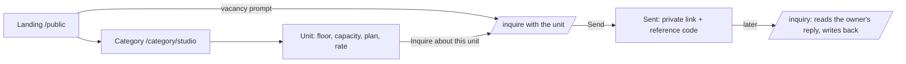
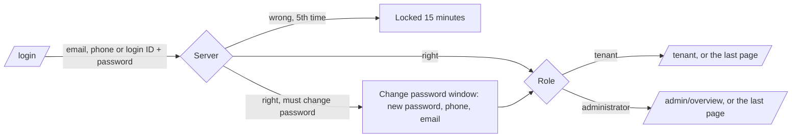
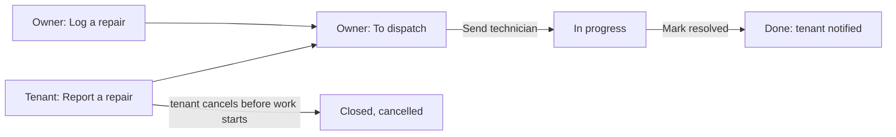

# 3. App Flow

What happens when someone clicks, and which page comes next. Read from `frontend/src/router/index.ts`
and the screens on 7 October 2026. Every call each screen makes is listed in `docs/SCREEN_CONTRACT.md`.

---

## 1. Every page

| Path | Page | Who | Notes |
| :--- | :--- | :--- | :--- |
| `/` | (redirect) | Anyone | Goes to `/public` (an administrator goes to her Overview) |
| `/public` | Landing page | Anyone | Hero, "33 Units, 4 Floors", categories, house rules, FAQ |
| `/category/:slug` | One category | Anyone | Studio, One-bedroom, Two-bedroom, Three-bedroom; its units, rates, floor plans |
| `/inquire` | Send an inquiry | Anyone | Can arrive with a unit already chosen |
| `/inquiry` | Your inquiries | Anyone with the link or code | Reads the reply and writes back |
| `/privacy`, `/terms` | Policies | Anyone | |
| `/login` | Sign in | Signed out | A signed-in person is sent to their home |
| `/tenant` | Overview | Tenant | Amount due, repairs, the current bill, "Recently" |
| `/tenant/payments` | Payments and billing | Tenant | Bill to pay, Pay with GCash, rent month by month, payment record |
| `/tenant/tickets` | Repairs | Tenant | Report a repair, follow or cancel one |
| `/tenant/profile` | My details | Tenant | Contact details, emergency contact, change password |
| `/admin/overview` | Overview | Administrator | Needs your attention, money this month, occupancy, months |
| `/admin/directory` | Rooms and rates | Administrator | |
| `/admin/tenants` | Tenants | Administrator | |
| `/admin/income` | Monthly Income | Administrator | |
| `/admin/expenses` | Monthly Expenses | Administrator | |
| `/admin/tickets` | Repairs | Administrator | |
| `/admin/inquiries` | Inquiries | Administrator | |
| anything else | Page not found | Anyone | Says which address was asked for, offers the home page |

`/admin` and the old `/basis/...` addresses redirect to the matching administrator page.

## 2. The rules every navigation follows

1. On the first navigation the app restores the session from the stored token, if there is one.
2. A **signed-out** person asking for a signed-in page goes to `/login` with a line saying what they
   were trying to reach ("Please sign in to access your payments."), and comes back to it after.
3. A signed-in person on the **wrong role's page** goes to their own home (`/tenant` or `/admin/overview`).
4. An **administrator** is kept in her workspace: `/` and tenant pages send her to the Overview. She can
   still open the public site on purpose ("Website" in the account menu).
5. Every signed-in page is remembered, so signing in again (after a session runs out) returns to it.
6. A person who **must change their password** (first sign-in, or after the owner reset it) sees only
   the change-password window until they do; it also offers Sign out.

## 3. Flows

### 3.1 A visitor finds a unit and asks about it

- A reserved unit stays listed but takes no new inquiry (BR-006).
- The form checks the email and the Philippine mobile number when the visitor leaves each field, and
  again on the server. Ten inquiries from one address in 15 minutes is the limit (30 look-ups, 10 replies).
- Nothing is sent by SMS or email: the link and the code are the way back.

### 3.2 Signing in

### 3.3 A tenant pays with GCash

1. `/tenant/payments` > **Pay with GCash** opens a window with the amount to pay now and the note that
   no real money is charged yet (test account).
2. Adyen's GCash page opens inside it; the tenant completes the payment there.
3. Back in Hivelet, the payment shows as **Waiting for verification**; the bill is unchanged.
4. Adyen's signed notification reaches the server; the owner gets a notification.
5. The owner opens **Monthly Income > To verify** and verifies or rejects it. The tenant is notified,
   and only a verified payment counts as paid.

### 3.4 The owner records a cash payment

Overview or Monthly Income > **Record payment** > unit (tenant and rate filled in) > occupants (water
is worked out) > invoice number or **ACK** > how they paid (a reference field appears only for GCash
or bank) > months covered > **Record payment**. A second payment for the same month asks first. The
receipt appears in Monthly Income at once, and on the tenant's screens within about five seconds.

### 3.5 A repair, from report to done

### 3.6 Moving a tenant in and out

- **In:** Tenants > **Move someone in** (or from an inquiry: **Move them in**) > name, unit, deposit,
  dates, who shares, emergency contact > the screen shows the tenant's login ID and one-time password,
  with a copy button, to hand over in person.
- **Out:** the tenant's card > **Move out** > optional reason > the unit returns to Available; the
  tenancy and every receipt stay.

### 3.7 Downloads

Monthly Income or Monthly Expenses > **Download** > Month, Year or All > an `.xlsx` in her workbook layout.

## 4. When things go wrong

| Situation | What the person sees |
| :--- | :--- |
| No connection | One notice; saved figures stay readable ("Saved figures from ..."); every save and payment button is greyed |
| A page waits 25 s | It stops and says it could not reach the server, with Try again |
| A save waits 45 s | It says it cannot tell whether the save arrived, and to check before sending again |
| A section fails to load | "could not be loaded", never ₱0, with Try again |
| The server refuses an entry | The field and the reason: "Emergency contact phone: Enter a Philippine mobile number" |
| Session ran out | Sign in again, then back to the same page |
| Account moved out | Signed out with a message that the account is no longer active |
