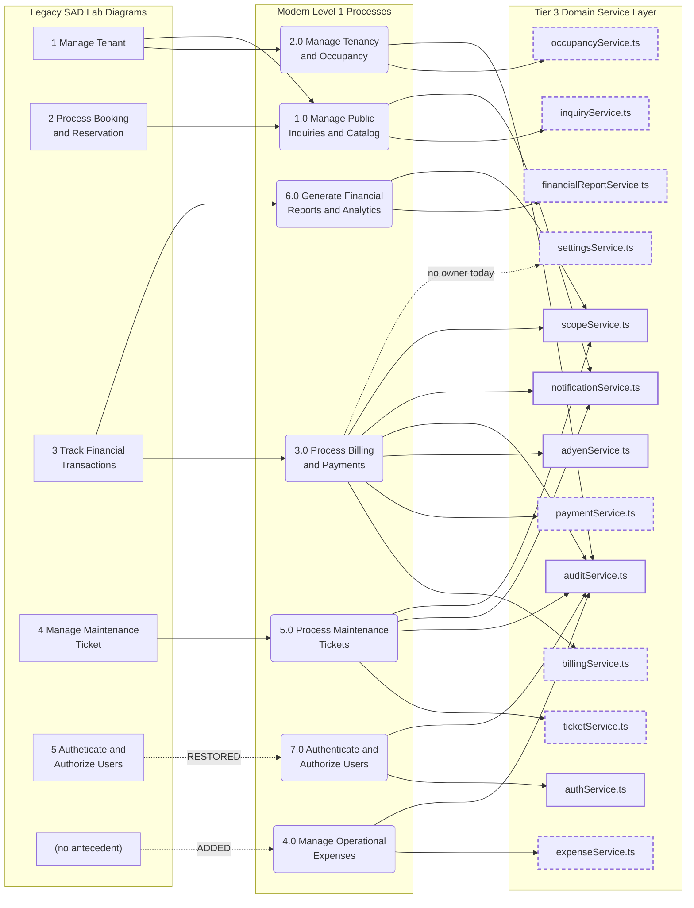

# PHASE 1 — DFD TRACEABILITY MATRIX
## From the SAD Laboratory Diagrams to Physical Tables and Backend Components

**Project:** Hivelet — Web-Based Boarding House Management & Financial Operations System
**Client:** Fe Galang Da Silva Boarding House, Legazpi City
**Institution:** Bicol University College of Science — IT 124, Capstone Project 2
**Group:** Group 4
**Adviser:** Dr. Jayvee Christopher Vibar
**Panel:** Dr. Aris J. Ordonez (Chair), Prof. Ryan A. Rodriguez, Prof. Laarni D. Pancho
**Deliverable:** PROMPT_1 Section 3 — Process & Data Flow Traceability
**Architectural pattern of record:** Layered Client-Server Architecture Structured as a Modular Monolith with a Pluggable Payment Gateway Adapter

---

## 0. Purpose, Method, and Status Vocabulary

### 0.1 What this document proves

Module 01 sets two non-negotiable audit conditions: **every data store in the DFD must map to a specific entity in the ERD**, and **every process in the DFD must map to a specific component in the architecture diagram**. This matrix discharges both, and extends them one level further than the module requires — down to the *running artifact* (route file, line number, service file) — so that the panel can open the repository and confirm each claim.

Traceability is proven in three directions, and all three must close:

1. **Forward** — every legacy laboratory element (`CFD.png`, `DFD.png`, `CHILD1.png`, `CHILD2.png`, `PHYSICAL.png`) reaches a modern element, or is explicitly accounted for as absorbed, split, or superseded.
2. **Reverse** — every modern data store resolves to physical PostgreSQL tables, and every one of the **20 tables** in `database/FULL_DATABASE_SCHEMA.sql` is claimed by **exactly one** store. No phantom stores, no orphan tables.
3. **Downward** — every modern process resolves to a named Tier-3 architecture component and a concrete backing artifact, with that component's implementation status stated plainly.

### 0.2 Status vocabulary

| Status | Meaning |
| :--- | :--- |
| **MAPPED** | A direct modern counterpart exists and is backed by verified code in the running repository. |
| **PARTIAL** | The modern counterpart exists and is reachable, but part of the specified behaviour is absent, hardcoded, or unwired. The defect is named in the row. |
| **MISSING** | Modelled in the modern DFD but with no backing artifact today. Phase 3 work, disclosed here rather than hidden. |
| **RESTORED** | Present in the laboratory diagram, dropped by the modernized draft, and deliberately reinstated in Phase 1. |
| **ADDED** | No laboratory antecedent. Introduced to model a real operational workflow the laboratory diagram never covered. |

### 0.3 Tier-3 service status convention

The Domain Service Layer (Tier 3) is a **target architecture, honestly marked**. Five services exist as files today; eight are planned extractions. Every table below that names a service carries an explicit **Implemented / Planned (Phase 3)** column, and the traceability diagram in Section 2.6 renders planned services with a dashed border. A planned service is never written about as though it exists.

| Tier-3 service | File | Status |
| :--- | :--- | :--- |
| `adyenService.ts` | `backend/src/services/adyenService.ts` (259 lines) | **Implemented** |
| `auditService.ts` | `backend/src/services/auditService.ts` (138 lines) | **Implemented** |
| `authService.ts` | `backend/src/services/authService.ts` (388 lines) | **Implemented** |
| `notificationService.ts` | `backend/src/services/notificationService.ts` (197 lines) | **Implemented** |
| `scopeService.ts` | `backend/src/services/scopeService.ts` (64 lines) | **Implemented** |
| `billingService.ts` | — | **Planned (Phase 3)** |
| `paymentService.ts` | — | **Planned (Phase 3)** |
| `occupancyService.ts` | — | **Planned (Phase 3)** |
| `ticketService.ts` | — | **Planned (Phase 3)** |
| `inquiryService.ts` | — | **Planned (Phase 3)** |
| `settingsService.ts` | — | **Planned (Phase 3)** |
| `expenseService.ts` | — | **Planned (Phase 3)** |
| `financialReportService.ts` | — | **Planned (Phase 3)** |

**The measured reason this column is necessary.** Counting `.from('...')` database invocations across `backend/src/routes/` and `backend/src/services/` yields **158** calls, of which **131 (83%)** sit inside route handlers: 107 in `backend/src/routes/admin.ts`, 18 in `backend/src/routes/tenant.ts`, 6 in `backend/src/routes/public.ts`. `backend/src/routes/admin.ts` is **2,056 lines**. Phase 3 is a mechanical extraction of those handlers into the eight planned services; it is not a redesign, which is why the process-to-component mapping below is stable across the extraction.

### 0.4 Source-file register

| Artifact | Path | Role in this matrix |
| :--- | :--- | :--- |
| `PHYSICAL.png` | `docs/claude_pipeline/diagrams/reference_dfds/PHYSICAL.png` | Manual baseline (problem alignment) |
| `CFD.png` | `docs/claude_pipeline/diagrams/reference_dfds/CFD.png` | Legacy Level 0 |
| `DFD.png` | `docs/claude_pipeline/diagrams/reference_dfds/DFD.png` | Legacy Level 1 (5 processes, 6 stores) |
| `CHILD1.png` | `docs/claude_pipeline/diagrams/reference_dfds/CHILD1.png` | Legacy child of Process 1.0 |
| `CHILD2.png` | `docs/claude_pipeline/diagrams/reference_dfds/CHILD2.png` | Legacy child of Process 2.0 |
| Modern Level 0 | `docs/diagrams/hivelet_dfd_context.mmd` | Modernized context diagram |
| Modern Level 1 | `docs/diagrams/hivelet_dfd_level1.mmd` | Modernized Level 1 (6 processes as submitted, 7 as corrected) |
| Submitted module text | `docs/module_01_submission/04_PROCESS_AND_DATA_FLOW_DIAGRAMS.md` | Panel submission under audit |
| Physical schema | `database/FULL_DATABASE_SCHEMA.sql` | 20-table authority |

---

## 1. DATA STORE TRACEABILITY

### 1.1 Manual baseline (`PHYSICAL.png`) — the two stores Hivelet replaces

The physical DFD of the legacy operation records exactly two persistent stores and no others. Every modern store below ultimately descends from one of those two, or from a workflow that previously had **no store at all**.

| Legacy physical store | Legacy medium | Failure mode it encodes | Replaced by | Status |
| :--- | :--- | :--- | :--- | :--- |
| **D1** Paper ledger / logbook | Bound paper book, consulted by hand (`1.1 Landlady checks paper ledger manually`) | Single physical copy; lookup is serial and manual; no record of who changed what | D1 Room Catalog, D3 Room Assignments, D5 Tenant Bills, D6 Payment Records, D10 Audit Logs | MAPPED |
| **D2** Spreadsheet file on USB | Workbook transcribed periodically (`1.2 Landlady records spreadsheet`) | Transcription lag and transcription error; the ledger is a *copy* of the paper book, not the book itself | D7 Monthly Income Ledger, D8 Expenses Ledger | MAPPED |
| *(none)* | Maintenance reported by chat message (`1.3`), `1.4 Landlady notes issue informally - no log`, `1.5 Hires repairman or fixes personally` | **Structurally unrecorded.** The baseline diagram is explicit that no store exists anywhere on this path | D9 Maintenance Tickets, D12 Notifications | ADDED |
| *(none)* | Rates, grace periods, and water charges held in memory and in cell formulas | No single place a parameter can be changed and audited | D11 System Parameters | ADDED |

### 1.2 Legacy logical stores D1–D6 (`DFD.png`) to modern stores D1–D12

The laboratory Level 1 diagram declares six stores. The modern model declares twelve. Each legacy store is accounted for by one of three transformations: **direct rename**, **normalization split** (one legacy store held attributes belonging to more than one entity), or **merge** (two legacy stores described the same physical rows).

| Legacy store (`DFD.png`) | Legacy content as drawn | Transformation | Modern store(s) | Status |
| :--- | :--- | :--- | :--- | :--- |
| **D1 Tenant Records** | Person identity *and* the room that person occupies, as one record | **Split.** Identity is a durable person-fact; tenancy is a time-bounded relationship with an occupant count, a move-in date, and an end. Fusing them violates 3NF and destroys tenancy history on move-out | **D2 User Profiles** + **D3 Room Assignments** | MAPPED |
| **D2 Room Records** | Rooms and their availability | **Rename + widen.** Cluster membership, marketing photographs, and rate history are room-dependent facts the single legacy store had no place for | **D1 Room Catalog** | MAPPED |
| **D3 Booking Records** | Booking inquiries | **Rename.** "Booking" becomes "Inquiry" to match the client's actual process: a prospect inquires, the administrator converts; there is no self-service reservation (BR-006) | **D4 Inquiries Store** | MAPPED |
| **D4 Financial Records** | One undifferentiated financial store | **Split three ways.** A *charge* (bill), a *settlement* (payment), and a *line in the landlady's monthly report* are three lifecycles with three different authorship rules. Collapsing them makes BR-048 (admin-only ledger authorship) unenforceable | **D5 Tenant Bills** + **D6 Payment Records** + **D7 Monthly Income Ledger** | MAPPED |
| **D5 Maintenance Tickets** | Maintenance reports | **Rename + widen.** Attachments and the message thread are separate multi-valued facts | **D9 Maintenance Tickets** | MAPPED |
| **D6 User Accounts** | Credentials and roles, drawn as a store distinct from D1 | **Merge into D2.** Credentials and role are attributes *of the same person row*. `profiles` carries `password_hash` and `role` on the identity record; a separate accounts table would be a 1:1 split with no justification and would invite orphaned credentials | **D2 User Profiles** | MAPPED |
| *(no antecedent)* | — | **Added.** The laboratory diagram models only money flowing in; it has no concept of money the landlady *spends* | **D8 Expenses Ledger** | ADDED |
| *(no antecedent)* | — | **Added.** BR-028 requires an append-only record of every financial and administrative mutation | **D10 Audit Logs** | ADDED |
| *(no antecedent)* | — | **Added.** ARCH-002 requires the water rate to be configurable rather than compiled in | **D11 System Parameters** | ADDED |
| *(no antecedent)* | — | **Added.** The manual baseline lost maintenance reports inside a chat thread; centralized in-app notification is the direct remedy | **D12 Notifications** | ADDED |

**Net:** 6 legacy stores → 6 modern stores by rename/split/merge, plus 4 stores with no legacy antecedent, minus **0 legacy stores dropped**. No legacy store is silently discarded.

### 1.3 Modern stores D1–D12 to physical tables, with verified code evidence

| Modern store | Physical table(s) — `database/FULL_DATABASE_SCHEMA.sql` | # tables | Verified write path | Verified read path | Status |
| :--- | :--- | :---: | :--- | :--- | :--- |
| **D1** Room Catalog | `clusters` (L26), `rooms` (L85), `room_photos` (L119), `room_price_history` (L136) | 4 | `admin.ts:66` POST rooms; `admin.ts:124` PATCH room; `admin.ts:211` POST room photo; `admin.ts:185` inserts `room_price_history` | `admin.ts:35` GET rooms; `public.ts:46` GET public rooms; `public.ts:69` GET one room; `public.ts:89` GET clusters | MAPPED |
| **D2** User Profiles | `profiles` (L45) | 1 | `admin.ts:344` POST tenant; `admin.ts:459` PATCH tenant; `admin.ts:624` PATCH status; `auth.ts:74` register; `auth.ts:123` PATCH own profile | `admin.ts:304` GET tenants; `auth.ts:100` GET me; `tenant.ts:542` GET my-profile; `authService.ts:48` login lookup | MAPPED |
| **D3** Room Assignments | `room_assignments` (L152) | 1 | `admin.ts:344` assignment on onboarding; `admin.ts:672` vacate | `tenant.ts:40` GET my-rooms; `scopeService.ts:28` `resolveTenantScope` | MAPPED |
| **D4** Inquiries Store | `inquiries` (L181), `inquiry_messages` (L197) | 2 | `public.ts:119` POST inquiry; `public.ts:169` inserts `inquiry_messages`; `admin.ts:1961` POST admin reply | `admin.ts:731` GET inquiries; `admin.ts:1942` GET thread | MAPPED |
| **D5** Tenant Bills | `bills` (L211) | 1 | `tenant.ts:445` bill INSERT; bill status update on verification (`admin.ts:836`) | `admin.ts:792` GET bills; `tenant.ts:71` GET my-bills | **PARTIAL** — no administrator-triggered monthly billing batch endpoint exists; the only INSERT path is incidental to checkout |
| **D6** Payment Records | `payments` (L232) | 1 | gateway completion in `adyenService.ts`; administrator verification at `admin.ts:836` | `admin.ts:808` GET payments; `tenant.ts:95` GET my-payments | MAPPED |
| **D7** Monthly Income Ledger | `monthly_income_records` (L255) | 1 | `admin.ts:942` INSERT on verification; `admin.ts:1066` manual POST; `admin.ts:1212` PATCH | `admin.ts:1014` GET income-records; `tenant.ts:118` GET my-income-records | **PARTIAL** — the share is computed at `admin.ts:911` on the verification path and at `admin.ts:1102` on the manual path, the remittance at `admin.ts:1104`, yet neither column appears in either INSERT payload (`admin.ts:942`–`admin.ts:958`; `admin.ts:1112`–`admin.ts:1129`), so every row written by either path persists 0.00 |
| **D8** Expenses Ledger | `fixed_expense_categories` (L304), `monthly_expense_entries` (L328), `expense_property_allocations` (L350) | 3 | `admin.ts:1379` POST entry; `admin.ts:1435` PATCH; `admin.ts:1477` inserts allocations | `admin.ts:1326` GET entries; `admin.ts:1532` GET categories | MAPPED |
| **D9** Maintenance Tickets | `maintenance_tickets` (L363), `ticket_attachments` (L390), `ticket_messages` (L400) | 3 | `tenant.ts:175` POST ticket; `tenant.ts:205` inserts attachments; `admin.ts:1668` PATCH; `admin.ts:1762` close; `tenant.ts:272` / `admin.ts:2013` POST message | `admin.ts:1550` GET tickets; `tenant.ts:137` GET my-tickets; `tenant.ts:243` / `admin.ts:1994` GET thread | MAPPED |
| **D10** Audit Logs | `audit_logs` (L428) | 1 | `auditService.ts:85` — the single append-only writer; `authService.ts:301` for auth events | `admin.ts:1865` GET audit-logs | MAPPED |
| **D11** System Parameters | `system_settings` (L441) | 1 | **none** | **none** | **MISSING** — `grep -rn "system_settings" backend/src` returns zero matches. Six keys are correctly seeded at `FULL_DATABASE_SCHEMA.sql:452` and read by no line of backend code |
| **D12** Notifications | `notifications` (L413) | 1 | `notificationService.ts:90` (insert), `:156` / `:173` (update); `adyenService.ts:246`; `admin.ts:966`; `admin.ts:984` | `admin.ts:1886` GET notifications; `tenant.ts:327` GET my-notifications | MAPPED |
| | **TOTAL** | **20** | | | |

### 1.4 Closure proof — reverse census of all 20 physical tables

Every `CREATE TABLE` in `database/FULL_DATABASE_SCHEMA.sql`, in schema order, with the single store that claims it. A table appearing under two stores would be a modelling error; a table appearing under none would be an orphan the DFD fails to describe.

| # | Physical table | Schema line | Claimed by | Claimed more than once? |
| :---: | :--- | :---: | :---: | :---: |
| 1 | `clusters` | 26 | D1 | No |
| 2 | `profiles` | 45 | D2 | No |
| 3 | `rooms` | 85 | D1 | No |
| 4 | `room_photos` | 119 | D1 | No |
| 5 | `room_price_history` | 136 | D1 | No |
| 6 | `room_assignments` | 152 | D3 | No |
| 7 | `inquiries` | 181 | D4 | No |
| 8 | `inquiry_messages` | 197 | D4 | No |
| 9 | `bills` | 211 | D5 | No |
| 10 | `payments` | 232 | D6 | No |
| 11 | `monthly_income_records` | 255 | D7 | No |
| 12 | `fixed_expense_categories` | 304 | D8 | No |
| 13 | `monthly_expense_entries` | 328 | D8 | No |
| 14 | `expense_property_allocations` | 350 | D8 | No |
| 15 | `maintenance_tickets` | 363 | D9 | No |
| 16 | `ticket_attachments` | 390 | D9 | No |
| 17 | `ticket_messages` | 400 | D9 | No |
| 18 | `notifications` | 413 | D12 | No |
| 19 | `audit_logs` | 428 | D10 | No |
| 20 | `system_settings` | 441 | D11 | No |

**Closure statement.** 20 tables, 20 claims, 12 stores, zero double-claims, zero unclaimed tables. Summing the per-store table counts in Section 1.3 gives 4+1+1+2+1+1+1+3+3+1+1+1 = **20**. There is **no phantom data store** (no store in the DFD lacking a physical table) and **no orphan table** (no table in the schema the DFD does not model).

### 1.5 Read/write completeness audit — the submitted Level 1 diagram against the corrected one

A data store with only inbound arrows is a black hole: data enters and is never consumed, and a panel is entitled to challenge it. Five stores were write-only in the **submitted** revision of `docs/diagrams/hivelet_dfd_level1.mmd`, and one was read-only with no owner. The defects were in the **diagram**, not in the code — Section 1.3 shows those stores are read and written by real endpoints.

**Citation note.** `docs/diagrams/hivelet_dfd_level1.mmd` in the working tree is the **corrected** Phase 1 file, which already carries every remedy below. The superseded revision is therefore described rather than cited by line: its line numbers no longer resolve against the working tree, and reproducing them would send a panelist to a comment header. Every remedy column cites the corrected file as it stands today; the corrected file records the same balancing work in its own header at `hivelet_dfd_level1.mmd:39-50`.

| Store | Defect in the submitted revision | Code reality | Remedy, verified in the corrected `hivelet_dfd_level1.mmd` |
| :--- | :--- | :--- | :--- |
| D1 Room Catalog | Balanced | Balanced | Read by 1.0 (L136), 2.0 (L160) and 3.0 (L174); written by 2.0 (L158, L159) |
| D2 User Profiles | **Write-only** — written by 2.0, read by nothing | Read on every authenticated request (`authService.ts:48`, `authService.ts:176`) | Restored **7.0** reads D2 (L119) and writes it (L120); 2.0 retains its own write (L154) and read (L155) |
| D3 Room Assignments | Balanced | Balanced | Written by 2.0 (L156); read by 2.0 (L157), 3.0 (L173) and 6.0 (L227) |
| D4 Inquiries Store | Balanced | Balanced | Written by 1.0 (L137); read by 1.0 (L138) and 2.0 (L153) |
| D5 Tenant Bills | **Write-only** | Read at `admin.ts:792`, `tenant.ts:71` | `D5 -> 3.0` "Read Outstanding, Due and Overdue Bills" (L176) and `D5 -> 6.0` "Read Billed versus Collected Totals" (L225) |
| D6 Payment Records | **Write-only** | Read at `admin.ts:808`, `tenant.ts:95` | `D6 -> 3.0` "Read Pending Verification Queue and Settled Payments" (L184) and `D6 -> 6.0` "Read Settled Payment Totals" (L226) |
| D7 Monthly Income Ledger | Balanced | Balanced | Written by 3.0 (L187); read by 6.0 (L223) |
| D8 Expenses Ledger | Balanced | Balanced | Written by 4.0 (L197); read by 4.0 (L198) and 6.0 (L224) |
| D9 Maintenance Tickets | **Write-only** | Read at `admin.ts:1550`, `tenant.ts:137` | `D9 -> 5.0` "Read Open Ticket Queue and Status History" (L209) |
| D10 Audit Logs | **Write-only** | Read at `admin.ts:1865` | `D10 -> 6.0` "Read Immutable Audit Trail Entries" (L228), terminating at `6.0 -> ADMIN` "Immutable System Audit Log" (L230) |
| D11 System Parameters | **Read-only; no owner** | Neither read nor written by backend code | Administrator configuration-maintenance flow into 3.0 (L170), `3.0 -> D11` write (L171) and `D11 -> 3.0` rate lookup (L172), giving ARCH-002 a visible owner. All three edges are drawn **dotted** because no backend line reads `system_settings` today |
| D12 Notifications | **Write-only** | Read at `admin.ts:1886`, `tenant.ts:327` | `D12 -> 1.0` "Read Unread Notification Feed" (L142) and `D12 -> 3.0` "Read Recipient Notice Feed" (L189), delivered onward by `1.0 -> ADMIN` (L143) and `3.0 -> TENANT` (L190). Delivery runs store to process to entity, never store to entity directly, which a DFD does not permit |

### 1.6 Level 0 / Level 1 balancing defect

The submitted Level 1 returned **exactly one** flow to an external entity — a single administrator report edge — while the context diagram promised a full set of outputs to three human entities. Nine or more promised outputs vanished at decomposition. That is the defect the corrected diagrams close.

**Corrected-file census, verifiable today.** `docs/diagrams/hivelet_dfd_context.mmd` carries **sixteen** labelled output line items across three outbound arrows: three to the Prospect (`:63`), five to the Active Tenant (`:67`), and eight to the Administrator (`:71`). The corrected `hivelet_dfd_level1.mmd` answers them with **fifteen** edges from a process to one of those three entities (`:121`, `:122`, `:123`, `:140`, `:143`, `:161`, `:162`, `:177`, `:185`, `:190`, `:199`, `:212`, `:213`, `:229`, `:230`), with 7.0 supplying the three login-confirmation returns the submitted revision had no process to emit.

> *Count note, for transparency.* Earlier internal drafts of the Phase 1 findings describe the submitted context diagram as promising eleven administrator outputs, and the corrected `hivelet_dfd_level1.mmd:41-42` header repeats that figure. The corrected context diagram carries eight administrator line items and sixteen in total. The counts differ because the diagrams were revised between the two readings. No count against the superseded revision is reproducible from the working tree, and none is asserted here. The substantive defect — one returned flow where a full set was promised — is unchanged either way, and the discrepancy is carried on the errata sheet.

The second balancing failure was on the input side. **"Authentication Credentials"** crosses the system boundary from the Active Tenant (`hivelet_dfd_context.mmd:66`) and from the Administrator (`:70`), and the Prospect sends "Registration and Login Credentials" (`:62`). In the submitted Level 1 those flows **landed in no process at all**. Restoring **Process 7.0 Authenticate & Authorize Users** is the corrective action: it now receives all three (`hivelet_dfd_level1.mmd:116`, `:117`, `:118`). See Section 3.3.

A third input-side gap: the context diagram sends a rate-change flow across the boundary — "Room Rate Change", one of the administrator line items at `hivelet_dfd_context.mmd:70` — and the submitted Level 1 had no flow into D1 carrying a rate change. `admin.ts:185` writes `room_price_history` on every rate change, so the code was ahead of the diagram. The corrected Level 1 adds it: `ADMIN -> 2.0` (`hivelet_dfd_level1.mmd:152`) and `2.0 -> D1` "Write Rate Change and Price History Row" (`:159`).

---

## 2. PROCESS TRACEABILITY

### 2.1 Legacy Level 1 processes (`DFD.png`) to modern processes 1.0–7.0

| Legacy process | Legacy title as drawn | Transformation | Modern process | Status |
| :--- | :--- | :--- | :--- | :--- |
| **1** | Manage Tenant | Re-decomposed. Tenant identity, room assignment, and occupancy monitoring are administrative onboarding; catalogue *browsing* is a public-facing concern and moves out | **2.0** Manage Tenancy & Occupancy, plus **1.0** Manage Public Inquiries & Catalog (catalogue read side) | MAPPED |
| **2** | Process booking and reservation | Renamed and narrowed. There is no self-service reservation in the client's operation; a prospect inquires and the administrator converts (BR-006, BR-009) | **1.0** Manage Public Inquiries & Catalog, with conversion handed to **2.0** | MAPPED |
| **3** | Track Financial Transactions | Split. Tenant-facing charge-and-settle is operational; the landlady's monthly report is analytical and separately authored under BR-048 | **3.0** Process Billing & Payments and **6.0** Generate Financial Reports & Analytics | MAPPED |
| **4** | Manage Maintenance Ticket | Renamed only | **5.0** Process Maintenance Tickets | MAPPED |
| **5** | Autheticate and Authorize Users *(sic — see Section 4)* | Dropped by the modernized six-process draft; reinstated in Phase 1 | **7.0** Authenticate & Authorize Users | **RESTORED** |
| *(no antecedent)* | — | Added | **4.0** Manage Operational Expenses | **ADDED** |

### 2.2 `CHILD1.png` sub-processes (child of legacy Process 1.0)

| Legacy sub-process | Legacy title as drawn | Modern destination | Backing artifact | Status |
| :--- | :--- | :--- | :--- | :--- |
| **1.1** Register Tenant | Receives Authenticated Session from Process 5.0; writes New Tenant Record to D1; raises Room Assignment Request to 1.3 | **2.0** Manage Tenancy & Occupancy | `backend/src/routes/admin.ts:344` POST `/admin/tenants`; `backend/src/routes/auth.ts:74` POST `/auth/register` | MAPPED |
| **1.2** Update Tenant Profile | Reads Existing Tenant Record from D1; writes Updated Tenant Record; returns Account Information to the Tenant | **2.0** (administrator edit) and **7.0** (tenant self-service edit) | `admin.ts:459` PATCH `/admin/tenants/:profileId`; `auth.ts:123` PATCH `/auth/me`; `tenant.ts:581` PATCH `/tenant/my-profile` | MAPPED |
| **1.3** Manage Room and Unit Records | Receives Room and Unit Data from the Administrator; reads and writes D2 Room Records; passes Assigned Room Details to 1.2 | **2.0** for assignment; catalogue maintenance surfaces under **1.0** | `admin.ts:66` POST `/admin/rooms`; `admin.ts:124` PATCH `/admin/rooms/:roomId`; `admin.ts:211` POST room photo; `admin.ts:269` DELETE room | MAPPED |
| **1.4** *labelled* "Manage Room and Unit Records" — *functionally the Occupancy / Bed Availability monitor* | Consumes Occupancy Data from D2; emits Bed Availability Report to the Administrator and Current Room Status to Process 2.0 | **2.0** Manage Tenancy & Occupancy (occupancy view) feeding **1.0** (public availability) | `admin.ts:35` GET `/admin/rooms` status projection; `public.ts:46` GET `/public/rooms`; `scopeService.ts:28` occupancy resolution | MAPPED — **legacy label corrected**, see Section 4 |

### 2.3 `CHILD2.png` sub-processes (child of legacy Process 2.0)

| Legacy sub-process | Legacy title as drawn | Modern destination | Backing artifact | Status |
| :--- | :--- | :--- | :--- | :--- |
| **2.1** Submit Booking Inquiry | Receives Room Availability Inquiry from Public User and Booking Inquiry from Tenant; writes D3 | **1.0** Manage Public Inquiries & Catalog | `backend/src/routes/public.ts:119` POST `/public/inquiries`; message thread seeded at `public.ts:169` | MAPPED |
| **2.2** Check Room Availability | Retrieves from D3; receives Room Status from Process 1.0; emits Availability Status | **1.0**, reading D1 Room Catalog | `public.ts:46` GET `/public/rooms`; `public.ts:69` GET `/public/rooms/:roomId`; `public.ts:89` GET `/public/clusters` | MAPPED |
| **2.3** Review and Approve Booking | Administrator reads and writes D3; emits Confirmed Booking to Process 3.0 | **1.0** (triage) handing off to **2.0** (conversion to tenancy) | `admin.ts:731` GET `/admin/inquiries`; `admin.ts:749` PATCH `/admin/inquiries/:inquiryId`; conversion at `admin.ts:344` | MAPPED |
| **2.4** Notify Applicant | Emits Room Availability Respoonse *(sic)* to Public User and Booking Confirmation to Tenant | **1.0** writing D12 Notifications, plus a threaded reply to the inquirer | `admin.ts:1961` POST `/admin/inquiries/:id/messages`; `notificationService.ts:89` | **PARTIAL** — in-app reply and notification exist; no outbound email or SMS channel to a non-registered prospect. Disclosed, not claimed |

### 2.4 Legacy Level 0 entities (`CFD.png`) to modern Level 0 entities

| Legacy entity (`CFD.png`) | Modern entity | Status |
| :--- | :--- | :--- |
| Tenant | Active Tenant | MAPPED |
| Administrator | Administrator (Mrs. Fe Galang Da Silva) | MAPPED |
| Public User | Public Visitor / Prospect | MAPPED |
| *(no antecedent)* | **Payment Gateway (Adyen GCash — Sandbox / Live)**, with a redirect-out / authorization-result-in flow pair | **ADDED** |

The fourth entity is not decoration. `backend/src/services/adyenService.ts:61` POSTs to `https://checkout-test.adyen.com/v71/sessions`: control and the tenant's browser genuinely leave the system boundary and return. A context diagram that omits the party the user is redirected to is incomplete. Group 4 obtained and configured an Adyen developer sandbox account and implemented the GCash checkout flow against it through a decoupled adapter that auto-selects sandbox or live credentials; commercial live processing additionally requires SEC/DTI business underwriting, which is outside the scope of an academic capstone. Because the account is a developer sandbox account, posting to `checkout-test.adyen.com` is correct behaviour, not a defect.

### 2.5 Modern processes 1.0–7.0 to architecture component to backing artifact

This is the table Module 01 asks for: **every process maps to a specific component in the architecture diagram**, and every component states whether it exists today.

| Modern process | Tier-3 architecture component | Component status | Concrete backing artifact (verified) | Stores touched | Traceability status |
| :--- | :--- | :--- | :--- | :--- | :--- |
| **1.0** Manage Public Inquiries & Catalog | `inquiryService.ts` | **Planned (Phase 3)** | `public.ts:46`, `public.ts:69`, `public.ts:89`, `public.ts:119`, `public.ts:169`; `admin.ts:731`, `admin.ts:749`, `admin.ts:1942`, `admin.ts:1961`. Notification fan-out already runs through `notificationService.ts` (**Implemented**) | D1 r, D4 rw, D12 w | MAPPED |
| **2.0** Manage Tenancy & Occupancy | `occupancyService.ts` | **Planned (Phase 3)** | `admin.ts:304`, `admin.ts:344`, `admin.ts:459`, `admin.ts:624`, `admin.ts:672`; `tenant.ts:40`. Row-scope resolution already runs through `scopeService.ts:28` (**Implemented**) | D1 w, D2 w, D3 rw, D4 r, D10 w | MAPPED |
| **3.0** Process Billing & Payments | `billingService.ts` + `paymentService.ts` | **Planned (Phase 3)** | `admin.ts:792`, `admin.ts:808`, `admin.ts:836`; `tenant.ts:71`, `tenant.ts:95`, `tenant.ts:380`, `tenant.ts:445`, `tenant.ts:515`; `public.ts:202`, `public.ts:853` | D1 r, D3 r, D5 rw, D6 rw, D7 w, D10 w, D11 r *(modelled only)*, D12 w | **PARTIAL** — defects G-2, G-4, G-5 in Section 5 |
| **3.0** (gateway leg) | `adyenService.ts` | **Implemented** (259 lines) | `adyenService.ts:56` `createCheckoutSession`; `adyenService.ts:61` Checkout API POST; `adyenService.ts:132` gateway-return completion handler; `adyenService.ts:246` admin notification insert | D6 w, D12 w | MAPPED |
| **4.0** Manage Operational Expenses | `expenseService.ts` | **Planned (Phase 3)** | `admin.ts:1326`, `admin.ts:1379`, `admin.ts:1435`, `admin.ts:1477`, `admin.ts:1497`, `admin.ts:1532` | D8 rw, D10 w | **ADDED** — no legacy antecedent |
| **5.0** Process Maintenance Tickets | `ticketService.ts` | **Planned (Phase 3)** | `admin.ts:1550`, `admin.ts:1583`, `admin.ts:1668`, `admin.ts:1762`, `admin.ts:1817`, `admin.ts:1994`, `admin.ts:2013`; `tenant.ts:137`, `tenant.ts:175`, `tenant.ts:205`, `tenant.ts:243`, `tenant.ts:272` | D9 rw, D10 w, D12 w | MAPPED |
| **6.0** Generate Financial Reports & Analytics | `financialReportService.ts` | **Planned (Phase 3)** | `admin.ts:1014`, `admin.ts:1066`, `admin.ts:1212`, `admin.ts:1291` (income ledger CRUD); `admin.ts:1326` (expense ledger read) | D5 r, D7 rw, D8 r, D10 r | **PARTIAL** — ledger CRUD is present; no server-side aggregation, per-category totals, year-to-date rollup, or Excel export endpoint exists (FR-039, FR-040, FR-044) |
| **7.0** Authenticate & Authorize Users | `authService.ts` + `middleware/auth.ts` + `config/rbac.ts` | **Implemented** (388 / 162 / 180 lines) | `auth.ts:34` login; `auth.ts:74` register; `auth.ts:100` GET me; `auth.ts:123` PATCH me; `auth.ts:152` change-password; `auth.ts:182` logout; `middleware/auth.ts:73` `requireAuth`; `middleware/auth.ts:115` `requireAdmin`; `middleware/auth.ts:123` `requirePermission`; `admin.ts:28` router-wide gate; `authService.ts:301` auth audit write | D2 rw, D10 w | **RESTORED** |
| *cross-cutting* | `auditService.ts` | **Implemented** (138 lines) | `auditService.ts:85` — sole append-only writer to `audit_logs`; invoked from 2.0, 3.0, 4.0, 5.0, 7.0 | D10 w | MAPPED |
| *cross-cutting* | `notificationService.ts` | **Implemented** (197 lines) | `notificationService.ts:89`, `:117`, `:139`, `:155`, `:172` | D12 rw | MAPPED |
| *cross-cutting* | `scopeService.ts` | **Implemented** (64 lines) | `scopeService.ts:28` `resolveTenantScope`; `:55` `assertRoomInScope` — narrows own-scoped reads for 3.0, 5.0 and 6.0 | D3 r | MAPPED |
| *cross-cutting* | `settingsService.ts` | **Planned (Phase 3)** | **none — no backing artifact exists** | D11 rw | **MISSING** — D11 has no owner in code today |

### 2.6 Traceability chain diagram

**Symbol convention for this diagram:** rounded rectangle = modern DFD process; plain rectangle = Tier-3 architecture component; **dashed border = component planned for Phase 3 and not implemented today**; solid border = component implemented today. This is a component-trace diagram, not a DFD; the DFD symbol convention (double circle = process, cylinder = data store, rectangle = external entity) is declared in a caption on the DFDs themselves.

*Caption: dashed service boxes and the dashed edge into `settingsService.ts` denote Phase 3 targets. Eight of the thirteen Tier-3 components are planned; five are implemented today — `adyenService.ts`, `auditService.ts`, `authService.ts`, `notificationService.ts` and `scopeService.ts`. `scopeService.ts` is cross-cutting: it narrows own-scoped reads for every process that serves a tenant, rather than owning a process of its own.*

### 2.7 Manual baseline activities (`PHYSICAL.png`) to modern processes — problem alignment

| Legacy manual activity | Legacy medium | Modern process | What structurally changes | Status |
| :--- | :--- | :--- | :--- | :--- |
| `1.0` Verbal request / chat message | Spoken word or a chat thread | **1.0** Manage Public Inquiries & Catalog | The request becomes a row in `inquiries` with a timestamped thread in `inquiry_messages` (`public.ts:119`, `public.ts:169`) instead of a message that scrolls out of view | MAPPED |
| `1.1` Landlady checks paper ledger manually | Paper ledger / logbook (D1) | **1.0** / **2.0** / **3.0** | Serial manual lookup becomes an indexed query against `rooms`, `room_assignments`, and `bills` | MAPPED |
| `1.2` Landlady records spreadsheet | Periodic transcription into a USB workbook (D2) | **3.0** feeding **6.0** | Transcription is eliminated: the ledger line is written at the moment of verification (`admin.ts:942`) rather than copied later. The transcription-lag failure mode disappears along with the transcription step | **PARTIAL** — see the `admin.ts:942` omission at G-4 |
| `1.3` Tenant reports issue via messaging app | Messaging app text | **5.0** Process Maintenance Tickets | Becomes `maintenance_tickets` plus `ticket_attachments` carrying a photograph (`tenant.ts:175`, `tenant.ts:205`) | MAPPED |
| `1.4` Landlady notes issue informally — **no log** | *No store exists on this path in the baseline* | **5.0** plus **D10** Audit Logs | The most consequential change in this matrix: a workflow that had **no persistent record at all** acquires a first-class store and an append-only audit trail (`auditService.ts:85`) | **ADDED** |
| `1.5` Hires repairman or fixes personally | Verbal assignment | **5.0** | Assignment and closure become state transitions carrying an actor and a timestamp (`admin.ts:1668`, `admin.ts:1762`) | MAPPED |
| *(no legacy activity)* | Expense receipts kept as loose paper and hand-totalled in the workbook | **4.0** Manage Operational Expenses | Expenditure acquires a chart of accounts and per-property-area allocation | **ADDED** |

---

## 3. STRUCTURAL CHANGES AND WHY — PANEL DEFENCE OF THE THREE DELTAS

### 3.1 Delta 1 — Data stores grew from 6 to 12

**The change.** The laboratory diagram declares six stores; the modern model declares twelve, resolving to twenty physical tables.

**Functionality.** Two of the six legacy stores were composites the client's actual paperwork does not support. **D1 Tenant Records** fused a person with the room that person occupies; the landlady's operation requires that a tenant may vacate, that the unit continues to exist, and that the historical tenancy remains readable for the income report. Splitting into **D2 User Profiles** (durable identity) and **D3 Room Assignments** (time-bounded tenancy with an occupant count) is what makes BR-003 Historical Preservation and BR-032 Canonical Unit List expressible at all. **D4 Financial Records** fused three distinct lifecycles: a charge, a settlement, and a line in the landlady's monthly report. Splitting into **D5 / D6 / D7** is what permits a payment to sit in `Pending Verification` while its bill remains `Due` — the sovereign verification gate of BR-017 is simply not representable inside a single financial store.

**Security.** The split is what makes BR-048 Admin-Only Ledger Authorship enforceable. With D7 separate from D5 and D6, `backend/src/routes/admin.ts:28` gates the entire income and expense ledger surface behind `requireAuth, requireAdmin` in one line, while tenants retain read access to their own bills and payments through `tenant.ts:71` and `tenant.ts:95` under `scopeService.ts:28` row scoping. A merged financial store would force per-column authorization inside a single table — brittle, and easy to get wrong.

**Scalability & maintainability, with the tradeoff stated.** Twelve stores and twenty tables carry a real cost: more joins, more foreign keys, more migration surface. The property is 33 rentable units across 5 clusters; join depth is not a performance concern at this cardinality. The tradeoff accepted is **write-path complexity in exchange for read-path correctness and authorization clarity**. The honest counter-cost is visible in the code: the verification path must now write `payments`, `bills`, `monthly_income_records`, `audit_logs`, and `notifications`, and **no `BEGIN`/`COMMIT` transaction exists anywhere in `backend/src`** — a repository-wide grep for transaction control returns nothing. Multi-table atomicity is therefore a **Phase 3 design target**, not an implemented property, and this document does not claim otherwise.

**Problem alignment.** The manual baseline had two stores because the landlady had two artifacts: a paper book and a USB workbook. Every one of the four added modern stores exists because the baseline diagram shows a workflow with **no store at all** — `1.4 Landlady notes issue informally - no log` is the clearest case. Growing the store count is not normalization for its own sake; it is the direct modelling of work that was previously invisible.

### 3.2 Delta 2 — Processes re-decomposed, with 4.0 Expenses and 6.0 Reports ADDED

**The change.** Legacy Process 1 splits across modern 1.0 and 2.0; legacy Process 2 narrows into 1.0; legacy Process 3 splits into 3.0 and 6.0; legacy Process 4 is renamed 5.0. Two processes have **no legacy antecedent whatsoever**: **4.0 Manage Operational Expenses** and **6.0 Generate Financial Reports & Analytics**.

**Why 4.0 was added.** The laboratory diagram models only money flowing *in*. The client's real ledger has a second half. `docs/10_MONTHLY_EXPENSES_REPORT.md` documents the landlady's existing "Monthly Expenses" workbook tab and declares at line 5 that it is the authoritative source for BR-041 through BR-047 and FR-037 through FR-042. It specifies a fixed thirteen-line chart of accounts and five Property Areas across which a single expense may be split. That structure is already physical: `fixed_expense_categories` (`FULL_DATABASE_SCHEMA.sql:304`) seeds all thirteen codes including the 6a/6b/6c sub-lines under Salaries; `monthly_expense_entries` (L328) carries the entry with void semantics; `expense_property_allocations` (L350) carries the split. A DFD with **three physical tables and six live endpoints** — `admin.ts:1326`, `:1379`, `:1435`, `:1497`, `:1532`, plus the allocation writes at `admin.ts:1477` — and no process to own them would be an orphan-table failure of exactly the kind the census in Section 1.4 is designed to detect. 4.0 exists because the tables and the client workflow exist.

**Why 6.0 was added.** Legacy Process 3, "Track Financial Transactions", conflates a transactional concern with an analytical one. The transactional concern — charge the tenant, accept settlement, verify — is 3.0, and is tenant-facing. The analytical concern — the monthly income report, per-category expense totals, year-to-date cumulative figures, and Excel export — is 6.0, is administrator-only under BR-048, and reads from stores it never writes. The two differ in actor, in authorization, in cadence, and in read/write shape. Keeping them fused would leave `docs/09_MONTHLY_INCOME_REPORT.md` (authoritative for BR-032 through BR-039 and FR-031 through FR-036, per line 5 of that document) and `docs/10_MONTHLY_EXPENSES_REPORT.md` without a process owner.

**Security.** Separating 6.0 lets the reporting surface be gated as a unit. Every `/admin/income-records` and `/admin/expense-entries` route sits behind the router-wide `requireAuth, requireAdmin` at `admin.ts:28` and a second `requirePermission` barrier per route. A tenant reads only their own ledger rows, through `tenant.ts:118`, scoped by `scopeService.ts:28`.

**Scalability & maintainability, with the tradeoff stated.** Seven processes cost more diagram surface than five, and the panel may reasonably ask whether 6.0 earns its own bubble when it currently performs no aggregation. The honest answer is that it does not yet: **6.0 is PARTIAL.** The ledger CRUD is real; server-side per-category totals, year-to-date rollup, reconciliation, and Excel export (FR-039, FR-040, FR-042, FR-044) do not exist as endpoints. The process is modelled because the requirement and the tables are real, and it is marked PARTIAL rather than MAPPED so that no panelist is told otherwise.

**Problem alignment.** The landlady's workbook has three tabs — Monthly Income, Monthly Expenses, and Statement of Loan. The laboratory diagram modelled roughly one of them. Processes 4.0 and 6.0 close that gap against the artifact the client actually uses every month.

### 3.3 Delta 3 — 7.0 Authenticate & Authorize Users RESTORED

**The change.** Legacy `DFD.png` Process 5, "Autheticate and Authorize Users", was dropped by the modernized six-process draft submitted in `docs/module_01_submission/04_PROCESS_AND_DATA_FLOW_DIAGRAMS.md`. Phase 1 reinstates it as **7.0**.

**Why the omission is a defect and not a simplification.** It creates a hard balancing failure. The context diagram sends **"Authentication Credentials"** across the system boundary from the Active Tenant (`docs/diagrams/hivelet_dfd_context.mmd:66`) and from the Administrator (`:70`), and "Registration and Login Credentials" from the Prospect (`:62`). In the submitted Level 1 those flows **terminated nowhere** — no process accepted them, no store received them. A Level 1 diagram must account for every flow its parent context diagram declares. Symmetrically, **D2 User Profiles** was written by 2.0 and read by nothing in that revision, making the system's identity store a write-only black hole on paper. Both failures are closed in the corrected file: 7.0 receives all three credential flows (`hivelet_dfd_level1.mmd:116-118`), reads D2 (`:119`) and writes it (`:120`).

**Why the restored process is substantial.** 7.0 is not a placeholder. It is the largest **implemented** service in the codebase: `backend/src/services/authService.ts` is **388 lines**, exporting `login` (L48), `issueToken` (L139), `verifyToken` (L155), `resolveAuthUser` (L176), `getOwnProfile` (L202), `updateOwnProfile` (L233), `changeOwnPassword` (L266), and `register` (L326). It is fronted by six endpoints (`auth.ts:34`, `:74`, `:100`, `:123`, `:152`, `:182`) and enforced by `middleware/auth.ts:73` `requireAuth`, `middleware/auth.ts:115` `requireAdmin`, and `middleware/auth.ts:123` `requirePermission`, with the permission catalogue in `backend/src/config/rbac.ts`. It writes D10 directly at `authService.ts:301`. Of the seven modern processes, **7.0 is one of only two whose Tier-3 component is fully implemented today** — the other being the `adyenService.ts` leg of 3.0. Omitting the most complete component from the process model would misrepresent the system in the direction of *understating* it.

**Security.** 7.0 is the visible owner of ARCH-006 Backend Security Boundary (canonical BR-006 and BR-048). Drawing it makes explicit that Express is the sole security perimeter, that the Supabase `service_role` key never leaves Tier 2, and that role verification happens on every protected route rather than in the client.

**Problem alignment.** The manual baseline has no authentication concept at all — the landlady simply knows who is standing in front of her. Digitizing the operation introduces an impersonation risk that did not previously exist. A process model that omits authentication omits the one risk the digitization itself creates.

---

## 4. CORRECTION NOTICE — LEGACY SOURCE IMAGES

The five laboratory diagrams remain the historical record of Group 4's Systems Analysis & Design work and are cited as such throughout Phase 1. Three defects in them are corrected **deliberately** in the modernized diagrams. They are listed here rather than silently fixed, so that a panelist holding the original laboratory output is not contradicted without explanation.

| # | Source | Defect as drawn | Correction in the modernized artifacts | Why the correction is right |
| :--- | :--- | :--- | :--- | :--- |
| **C-1** | `CHILD1.png` | Sub-processes **1.3 and 1.4 carry identical titles** — both read "Manage Room and Unit Records" | 1.3 retains the title; **1.4 is retitled to its actual function, Monitor Occupancy & Bed Availability** | The diagram's own flows disambiguate them. 1.3 receives "Room and Unit Data" from the Administrator and performs Write and Retrieve against D2 — it is the catalogue maintainer. 1.4 consumes "Occupancy Data" from D2 and emits "Bed Availability Report" to the Administrator and "Current Room Status" to Process 2.0 — it writes nothing and is purely a monitor. Two processes in one decomposition cannot share a name; the label, not the logic, was wrong |
| **C-2** | `DFD.png` | Process 5 is labelled **"Autheticate and Authorize Users"** — the letter *n* is missing from "Authenticate" | Modern **7.0 Authenticate & Authorize Users**, spelled correctly | Typographical only; the process semantics in the source are correct and are preserved intact |
| **C-3** | `CHILD2.png` | The flow from 2.4 Notify Applicant to Public User is labelled **"Room Availability Respoonse"** — doubled *o* | Rendered as "Room Availability Response" | Typographical only |

**Two further observations on the source images, recorded for completeness rather than corrected:**

- `DFD.png` draws **Process 4 and Process 5 twice each** — once at the left edge and once toward the centre-right. These are routing duplicates, a common editor device for reducing crossing lines, not additional distinct processes. The legacy diagram has five processes, as `CLAUDE_PIPELINE.md` Section 4.3 states.
- `CFD.png` declares **three external entities** (Tenant, Administrator, Public User). The modernized Level 0 declares **four**, adding the Payment Gateway. This is an addition justified in Section 2.4, not a correction of an error: at the time the laboratory diagram was produced, no gateway integration existed.

**Errata posture.** Phase 1 publishes corrected artifacts together with a one-page errata sheet the group hands the panel. C-1, C-2, and C-3 belong on that sheet, alongside the count discrepancy noted in Section 1.6 and the documentary errata carried elsewhere in the Phase 1 package — `docs/01_SYSTEM_BIBLE.md:146` states "32 total rooms/units" where the verified seed is **33**; `docs/module_01_submission/DEEP_TECHNICAL_ARCHITECTURE_AND_DATABASE_ANALYSIS.md:41` claims foreign-key `ON DELETE RESTRICT` constraints that do not exist today; and `DEEP_TECHNICAL_ARCHITECTURE_AND_DATABASE_ANALYSIS.md:109` cites "BR-048 2% Annual Escalation", whereas canonical BR-048 is Admin-Only Authorship of Income/Expense Ledgers, cited correctly at `backend/src/config/rbac.ts:6`. The 2% annual escalation that stale citation describes is, separately, **formally out of scope**: room rates are set manually by the administrator and every change is recorded in `room_price_history` (Section 5, scope note on rate changes). The misattribution and the out-of-scope feature are carried as two distinct rows on the errata sheet.

---

## 5. RESIDUAL GAP REGISTER — WHAT THIS MATRIX DOES NOT CLAIM

Every row below is a place where the DFD models something the running system does not yet fully deliver. All are Phase 2 or Phase 3 work. None is presented as complete.

| # | Gap | Evidence | Affected element | Disposition |
| :--- | :--- | :--- | :--- | :--- |
| **G-1** | **D11 System Parameters has no owner in code.** Six keys are correctly seeded in `system_settings` and read by zero lines of backend code | `grep -rn "system_settings" backend/src` returns no matches; seed at `FULL_DATABASE_SCHEMA.sql:452` | D11, `settingsService.ts` | **MISSING** — Phase 3. ARCH-002 requires the water rate to be read from `system_settings.water_rate_per_occupant` (BR-014, BR-036), presented as configurable with **200** as the seeded default |
| **G-2** | **Water charge is hardcoded** as `occupants * 200` in three places rather than read from D11 | `admin.ts:910`, `admin.ts:1103`, `admin.ts:1243` | 3.0, D11 | **PARTIAL** — Phase 3 |
| **G-3** | **The 50% Share figure is hardcoded** as `rentAmount / 2` rather than derived through a service | `admin.ts:911`, `admin.ts:1102` | 3.0, D7 | **PARTIAL** — Phase 3. Under BR-035 the figure is exactly half of the row's Rent Amount, computed by the system and never entered by hand; Water, GBG fee, and deposit are excluded from it. It is a derived figure carried over from Column 6 of the landlady's existing source spreadsheet, retained so that the digital ledger reconciles line-for-line with her historical records |
| **G-4** | **`fifty_percent_share` and `remitted_amount` are computed but never written.** The share is calculated at `admin.ts:911` (verification path) and `admin.ts:1102` (manual path) and the remittance at `admin.ts:1104`, yet neither column is written by either INSERT, so every row persists 0.00 | Computed at `admin.ts:911` and `admin.ts:1102`–`:1104`; the INSERT payloads at `admin.ts:942`–`:958` and `admin.ts:1112`–`:1129` contain neither column | D7, 3.0, 6.0 | **PARTIAL** — Phase 3. Remitted Amount = Rent Amount + Water Payment (BR-038) |
| **G-5** | **Grace period is hardcoded at 10 days**, contradicting the seeded value of 7 in `system_settings.grace_period_days` and BR-012 | `tenant.ts:453` sets `grace_period_end_date` to now + 10 days | 3.0, D5, D11 | **PARTIAL** — Phase 3. Overdue begins the day after the due date (BR-011); the due date derives from the move-in date (BR-010) |
| **G-6** | **No multi-table transaction exists.** No `BEGIN` or `COMMIT` appears anywhere in `backend/src` | Repository-wide grep for transaction control returns nothing | 3.0 | **Design target**, not an implemented property. Phase 3 |
| **G-7** | **Two payment endpoints are unauthenticated.** Neither carries `requireAuth`, `optionalAuth`, nor `requirePermission` | `public.ts:202` GET `/public/payments/mock-gateway`; `public.ts:853` POST `/public/payments/mock-gateway/complete` | 3.0, 7.0 | **RESOLVED** — see note below the table |

> **G-7 update, 2026-09-13.** Those two routes were the locally hosted checkout page, since renamed `/public/payments/local-cashier`. They now refuse to serve in any environment where Adyen credentials are configured, so they do not exist in a deployed system. The one remaining unauthenticated payment endpoint is the Adyen webhook, which cannot carry a JWT because a gateway holds none; it is protected by HTTP Basic Auth plus an HMAC-SHA256 signature over Adyen's payload, compared in constant time, and it is now the ONLY writer of an online payment.
| **G-8** | **Foreign-key posture on ledger tables.** The live schema carries **17** `ON DELETE CASCADE`, **4** `ON DELETE SET NULL`, and **0** `ON DELETE RESTRICT` constraints | Counted directly in `database/FULL_DATABASE_SCHEMA.sql` | D5, D6, D7 | **Phase 2 proposal** — migration `005_ledger_fk_restrict.sql` would move `room_id` and `tenant_profile_id` on `bills`, `payments`, and `monthly_income_records` to `RESTRICT`. Soft-delete already exists (`profiles.account_status`, `rooms.operational_status`), so `RESTRICT` is safe. **`RESTRICT` is not a current fact and is not claimed as one anywhere in this document** |
| **G-9** | **6.0 performs no aggregation.** Ledger CRUD exists; per-category totals, year-to-date rollup, reconciliation check, and Excel export do not | No endpoint in `admin.ts` implements FR-039, FR-040, FR-042, or FR-044 | 6.0 | **PARTIAL** — Phase 3 |
| **G-10** | **No outbound channel to a non-registered prospect.** Legacy 2.4 Notify Applicant is satisfied in-app only | `notificationService.ts` writes `notifications` rows; no email or SMS transport exists | 1.0, D12 | **PARTIAL** — outside Phase 1 scope, disclosed |
| **G-11** | **`@adyen/api-library` is declared but not imported.** The adapter calls the Adyen Checkout API over HTTP directly | Declared at `backend/package.json:13`; `grep -rn "@adyen" backend/src` returns no matches; direct POST at `adyenService.ts:61` | 3.0 | **Working as designed, but worth stating.** The decoupled adapter is the architectural commitment; the SDK dependency is presently unused and should either be adopted or removed |
| **G-12** | **No performance figure is asserted anywhere in this document.** Claims of "256MB RAM", "sub-50ms" response, and "100% data consistency" appear in earlier submitted documents without substantiating measurement | — | — | Such figures are **design targets**, not measured results, and are omitted here rather than repeated |

**Scope note on rate changes.** ARCH-004 **Rate Change History** maps to canonical **BR-003 Historical Preservation**. Room rates are set **manually** by the administrator, who edits a unit’s rate whenever she decides to change it; the system performs no automatic adjustment and schedules no rate-review cycle. What the pillar requires is that the change be preserved, and it is: `admin.ts:185` writes a `room_price_history` row carrying the previous price, the new price, the effective date, the reason, and the administrator who made the change. That store is claimed by **D1 Room Catalog** (Section 1.3) and the write is owned by **2.0 Manage Tenancy & Occupancy** (`hivelet_dfd_level1.mmd:159`), with the administrator’s rate change entering across the boundary at `hivelet_dfd_level1.mmd:152`. Historical rate tracking, not rate automation, is the whole of ARCH-004.

**Scope note on Linda units.** Units LF and LB are excluded from the per-occupant water model and use fixed per-unit charges under BR-040 — `linda_lf_water_charge` 400, `linda_lb_water_charge` 200, `linda_lb_electricity_charge` 325, all seeded at `FULL_DATABASE_SCHEMA.sql:455-457`. Because D11 has no code owner (G-1), this exception is presently modelled in the DFD and the schema but not exercised by any backend read.

---

## 6. TRACEABILITY CLOSURE STATEMENT

| Audit condition | Result | Where proven |
| :--- | :--- | :--- |
| Every DFD data store maps to a specific ERD entity | **Satisfied.** 12 stores → 20 tables | Section 1.3 |
| Every physical table is claimed by exactly one store | **Satisfied.** 20 of 20; zero double-claims; zero orphans | Section 1.4 |
| No phantom data store exists | **Satisfied.** Every store resolves to at least one `CREATE TABLE` | Sections 1.3, 1.4 |
| Every DFD process maps to a specific architecture component | **Satisfied.** 7 processes plus 3 cross-cutting components, each with a named Tier-3 component and an explicit implementation status | Section 2.5 |
| Every legacy laboratory element is accounted for | **Satisfied.** 6 of 6 legacy stores; 5 of 5 legacy Level 1 processes; 4 of 4 CHILD1 sub-processes; 4 of 4 CHILD2 sub-processes; 3 of 3 legacy Level 0 entities; 6 of 6 `PHYSICAL.png` activities | Sections 1.1, 1.2, 2.1–2.4, 2.7 |
| Planned components are visually and textually distinguished from implemented ones | **Satisfied.** Status column in every component table; dashed `classDef` in Section 2.6 | Sections 0.3, 2.5, 2.6 |
| Known defects are disclosed rather than concealed | **Satisfied.** 12 residual gaps registered with file-and-line evidence | Section 5 |

---

### Footnote on architectural nomenclature

The pattern of record is stated once and identically in every Phase 1 artifact: **Layered Client-Server Architecture Structured as a Modular Monolith with a Pluggable Payment Gateway Adapter**, in exactly five numbered tiers. An earlier synonym, *"Isolated Payment Gateway Adapter"*, appears in `FINAL_PRESENTATION_ARCHITECTURE_AND_DATABASE_DEFENSE.md`; a panelist quoting that slide is describing the same Tier 5 boundary under its previous name and is not contradicted by this document.

### Footnote on settlement posture

On-site in-person cash settlement remains the **primary** settlement method (BR-015 and the FR-014 family), matching Mrs. Fe Galang Da Silva's daily routine. Adyen GCash is the optional digital alternative. Under BR-017, gateway completion inserts a payment as `Pending Verification` and never auto-settles a bill; the administrator retains a sovereign verification gate at `admin.ts:836`.
