# PHASE 2 — ENTITY-RELATIONSHIP DIAGRAM AND DATA DICTIONARY

**Hivelet — Fe Galang Da Silva Boarding House**
Bicol University College of Science | Capstone Project 2 | Group 4
Database Administrator: John Lloyd Cuario

---

## 0. Provenance — where this document gets its facts

Every structural claim below was read out of the **live Supabase catalogue** on **2026-09-13** and
is reproduced in `database/live_schema.csv` (407 rows, produced by
`database/migrations/DRIFT_DIAGNOSTIC.sql`).

**`database/FULL_DATABASE_SCHEMA.sql` was not used as a source, and must not be cited as one.**
It is now known to be wrong about production in **seven** separate ways:

| # | What the file says | What production actually has | How it was found |
| :-- | :--- | :--- | :--- |
| 1 | `rooms.floor` has no CHECK constraint | `rooms_floor_check` capped `floor` at 3 | Migration `007` failed, SQLSTATE 23514 |
| 2 | `expense_property_allocations.property_area` is `VARCHAR(100)` | It is the enum `property_area_type` | Migration `008` failed, SQLSTATE 42883 |
| 3 | `fifty_percent_share` and `remitted_amount` are `NUMERIC(10,2) NOT NULL DEFAULT 0.00` | Both are **`GENERATED ALWAYS AS (…) STORED`** | Reading `pg_attribute.attgenerated` |
| 4 | Every enum-typed column is declared `VARCHAR`; the file contains **zero `CREATE TYPE`** statements | **13 enum types across 17 columns** | Reading `pg_type` — drift 2 was never a special case |
| 5 | No trigger anywhere | `update_expense_entry_total()` + `trg_update_expense_total` | Comparing function and trigger lists |
| 6 | No `current_user_role()` | It exists, created out of band | Comparing function lists |
| 7 | No composite unique key on the allocations | `UNIQUE (expense_entry_id, property_area)` | An `ON CONFLICT` clause failing under behavioural test |

Drifts 3–7 were all found during this phase, and **four of the five by reading rather than by a
production failure** — the correction of method that `VERIFICATION.md`'s second addendum called for.
Drift 3 **falsifies a standing entry in the defect register** (§6). Drift 5 is the most serious as a
continuity risk: the object that makes BR-045 true exists only inside the production database.
Drift 7 matters because that composite key is the entire subject of the 2NF proof.

All seven are now reproduced by `database/migrations/_TEST_FIXTURE_production_drift.sql`, which
previously claimed to hold "every known difference" and held two.

---

## 1. Scope

**21 tables.** The twenty of the original design, plus `property_areas`, introduced by migration
`008` to carry the rental/personal boundary that OD-05 established.

| Domain | Tables |
| :--- | :--- |
| Property catalog | `clusters`, `rooms`, `room_photos`, `room_price_history` |
| Identity & RBAC | `profiles` |
| Tenancy | `room_assignments` |
| Prospect pipeline | `inquiries`, `inquiry_messages` |
| Billing & settlement | `bills`, `payments` |
| Income ledger | `monthly_income_records` |
| Expense ledger | `fixed_expense_categories`, `monthly_expense_entries`, `expense_property_allocations`, `property_areas` |
| Maintenance | `maintenance_tickets`, `ticket_attachments`, `ticket_messages` |
| Governance | `audit_logs`, `notifications`, `system_settings` |

`auth.users` appears in the diagram because `profiles.auth_user_id` holds a real foreign key to it.
It belongs to Supabase's `auth` schema and is not one of the 21.

---

## 2. The Crow's Foot ERD

The diagram source is `docs/diagrams/hivelet_erd.mmd` (mirrored as `.txt`). It was rendered under
**`mermaid@11.17.2`** via `@mermaid-js/mermaid-cli` and parses clean.

> **Note for anyone editing the `.mmd`.** Do not add `%%` comment lines to it. This version of the
> Mermaid CLI collapses them into the first token and the file stops parsing with
> `Expecting 'ER_DIAGRAM', got '%'`. Provenance comments belong in this document instead.

```mermaid
erDiagram

    CLUSTERS                     ||--|{ ROOMS                        : "groups"
    PROPERTY_AREAS               ||--o{ CLUSTERS                     : "absorbs_costs_of"
    ROOMS                        ||--o{ ROOM_PHOTOS                  : "illustrated_by"
    ROOMS                        ||--o{ ROOM_PRICE_HISTORY           : "rate_changed_in"

    AUTH_USERS                   ||--o| PROFILES                     : "authenticates"

    ROOMS                        ||--o{ ROOM_ASSIGNMENTS             : "let_under"
    PROFILES                     ||--o{ ROOM_ASSIGNMENTS             : "holds"

    ROOMS                        ||--o{ INQUIRIES                    : "enquired_about"
    PROFILES                     ||--o{ INQUIRIES                    : "converted_into"
    INQUIRIES                    ||--o{ INQUIRY_MESSAGES             : "threads"
    PROFILES                     ||--o{ INQUIRY_MESSAGES             : "authored_by"

    ROOMS                        ||--o{ BILLS                        : "invoiced_for"
    PROFILES                     ||--o{ BILLS                        : "billed_to"
    BILLS                        ||--o{ PAYMENTS                     : "settled_by"
    ROOMS                        ||--o{ PAYMENTS                     : "credited_to"
    PROFILES                     ||--o{ PAYMENTS                     : "remitted_by"
    PROFILES                     ||--o{ PAYMENTS                     : "verified_by"

    ROOMS                        ||--o{ MONTHLY_INCOME_RECORDS       : "earns"
    PROFILES                     ||--o{ MONTHLY_INCOME_RECORDS       : "attributed_to"
    ROOM_ASSIGNMENTS             ||--o{ MONTHLY_INCOME_RECORDS       : "recorded_under"
    PROFILES                     ||--o{ MONTHLY_INCOME_RECORDS       : "voided_by"

    FIXED_EXPENSE_CATEGORIES     ||--o{ FIXED_EXPENSE_CATEGORIES     : "subdivides"
    FIXED_EXPENSE_CATEGORIES     ||--o{ MONTHLY_EXPENSE_ENTRIES      : "classifies"
    MONTHLY_EXPENSE_ENTRIES      ||--|{ EXPENSE_PROPERTY_ALLOCATIONS : "splits_into"
    PROPERTY_AREAS               ||--o{ EXPENSE_PROPERTY_ALLOCATIONS : "absorbs"
    PROFILES                     ||--o{ MONTHLY_EXPENSE_ENTRIES      : "entered_by"

    ROOMS                        ||--o{ MAINTENANCE_TICKETS          : "reported_for"
    PROFILES                     ||--o{ MAINTENANCE_TICKETS          : "raised_by"
    MAINTENANCE_TICKETS          ||--o{ TICKET_ATTACHMENTS           : "evidenced_by"
    MAINTENANCE_TICKETS          ||--o{ TICKET_MESSAGES              : "discussed_in"
    PROFILES                     ||--o{ TICKET_MESSAGES              : "posted_by"

    PROFILES                     ||--o{ NOTIFICATIONS                : "receives"
    PROFILES                     ||--o{ AUDIT_LOGS                   : "performed_by"
    PROFILES                     ||--o{ SYSTEM_SETTINGS              : "last_updated_by"
    PROFILES                     ||--o{ ROOM_PHOTOS                  : "uploaded_by"
    PROFILES                     ||--o{ ROOM_PRICE_HISTORY           : "authorised_by"
```

*(Entity attribute blocks are omitted from this excerpt for readability; the complete diagram,
including every attribute, is `docs/diagrams/hivelet_erd.mmd`.)*

### 2.1 Cardinality convention

Two different questions get confused in most student ERDs, so this document answers them separately
and says which is which:

- **Maximum cardinality** is *what the schema permits*. It is read from the foreign keys and unique
  constraints.
- **Minimum cardinality** is *what the business guarantees*. It is read from the business rules and
  confirmed against the live rows.

Where the two disagree, the disagreement is stated rather than hidden.

### 2.2 Why each non-obvious relationship is drawn the way it is

| Relationship | Notation | Justification |
| :--- | :--- | :--- |
| `CLUSTERS` → `ROOMS` | `\|\|--\|{` | `rooms.cluster_code` is `NOT NULL`, so every room has exactly one cluster. Minimum on the many side is **1**: all five clusters hold at least one unit (22 / 5 / 3 / 1 / 2 = 33). A cluster with no rooms would be a catalogue entry for nothing. |
| `MONTHLY_EXPENSE_ENTRIES` → `EXPENSE_PROPERTY_ALLOCATIONS` | `\|\|--\|{` | **BR-044.** An expense row exists to be split across areas; an entry with no allocation would have no ledger effect. Verified: **0 of 1,262** entries have zero allocations. Note the schema alone permits zero — the minimum of 1 is a business guarantee enforced in the application, not by a constraint. |
| `BILLS` → `PAYMENTS` | `\|\|--o{` | `payments.bill_id` is nullable with `ON DELETE SET NULL`. A payment can outlive the bill it settled, and on-site cash is recorded against a room and tenant without a bill row. |
| `AUTH_USERS` → `PROFILES` | `\|\|--o\|` | `profiles.auth_user_id` is **UNIQUE and nullable**. One Supabase Auth user maps to at most one profile, and a profile may have none. This is the shape OD-09 requires: a tenant is a record, a login is optional. |
| `PROFILES` → `PAYMENTS` (twice) | `\|\|--o{` ×2 | Two genuinely different relationships: `tenant_profile_id` (who paid, `NOT NULL`) and `verified_by` (which administrator verified it, nullable — BR-017). Drawing one edge would lose the distinction. |
| `FIXED_EXPENSE_CATEGORIES` → itself | `\|\|--o{` | `parent_code` is a nullable self-reference. It is non-NULL only on the `6a` / `6b` / `6c` sub-lines; the other ten of the thirteen seeded rows are roots. |
| `PROPERTY_AREAS` → `CLUSTERS` | `\|\|--o{` | One area absorbs the costs of zero-or-many clusters. `clusters.expense_area` is `NOT NULL`, so **every cluster routes somewhere**; `Linda` and `Back Apartment` both route to `Back Apartment`, which is exactly the many-to-one the old `property_areas.cluster_code` could not express. `Main House` and `Other Expenses / Personal` own no cluster, hence `o{` rather than `\|{`. |
| `ROOMS` → `ROOM_PRICE_HISTORY` | `\|\|--o{` | Zero-or-many, and currently **zero**: the table holds 0 rows. ARCH-004 is a design target that no rate change has yet exercised. |

### 2.3 Foreign key delete policy

The policy is deliberate and splits three ways.

| Behaviour | Count | Where | Why |
| :--- | :-- | :--- | :--- |
| `RESTRICT` | 7 | `bills.room_id`, `bills.tenant_profile_id`, `payments.room_id`, `payments.tenant_profile_id`, `monthly_income_records.room_id`, `monthly_income_records.tenant_profile_id`, `expense_property_allocations.property_area` | Financial history must not vanish because somebody deleted a room or a tenant. The first six were converted by migration `005`; the seventh was created by `008`. |
| `CASCADE` | 11 | `expense_property_allocations.expense_entry_id`, `inquiries.room_id`, `inquiry_messages.inquiry_id`, `notifications.recipient_profile_id`, `profiles.auth_user_id`, `room_assignments.room_id`, `room_assignments.tenant_profile_id`, `room_photos.room_id`, `room_price_history.room_id`, `ticket_attachments.ticket_id`, `ticket_messages.ticket_id` | Dependent detail with no independent meaning. An allocation cannot outlive its expense entry; a photo cannot outlive its room. |
| `SET NULL` | 1 | `payments.bill_id` | The payment is the financial fact; the bill is the demand for it. Losing the demand must not lose the record of the money. |
| `NO ACTION` | 19 | actor and authorship columns — `audit_logs.actor_profile_id`, `payments.verified_by`, `*.created_by`, `*.voided_by`, `maintenance_tickets.*`, `system_settings.updated_by`, `rooms.cluster_code`, `inquiries.converted_tenant_id`, `monthly_income_records.assignment_id`, `fixed_expense_categories.parent_code` | PostgreSQL's default. In practice `NO ACTION` and `RESTRICT` both refuse the delete; they differ only in whether the check can be deferred. These were left alone deliberately — migration `005` changed only the six ledger keys it named, and touched zero rows. |

---

## 3. Enumerated types

Thirteen custom enums carry the controlled vocabularies. Using enums rather than free text is what
makes several of the 1NF and 3NF claims in the companion document hold by construction.

| Type | Values |
| :--- | :--- |
| `account_status_type` | `active`, `inactive` |
| `bill_status_type` | `Pending`, `Due`, `Overdue`, `Paid`, `Partially Paid` |
| `bill_type_enum` | `Rent`, `Water`, `Combined`, `Other` |
| `inquiry_status_type` | `Pending`, `Contacted`, `Converted`, `Closed` |
| `operational_status_type` | `Available`, `Reserved`, `Occupied`, `Under Maintenance` |
| `payment_method_type` | `Cash`, `GCash`, `Bank Transfer`, `Adyen Online` |
| `property_area_type` | `Boarding House`, `Main House`, `Front Apartment`, `Back Apartment`, **`Penthouse`**, `Other Expenses / Personal` — six values since `012` |
| `room_type_enum` | `Studio`, `One-bedroom`, `Two-bedroom`, `Three-bedroom` |
| `ticket_priority_type` | `Emergency`, `High`, `Medium`, `Low` |
| `ticket_status_type` | `Submitted`, `In Progress`, `Resolved`, `Closed` |
| `user_role_type` | `admin`, `tenant`, `prospect` |
| `verification_status_type` | `Verified`, `Pending Verification`, `Rejected` |
| `visibility_status_type` | `Published`, `Hidden` |

---

## 4. Data dictionary

Five entities are specified in full, as required. Types are exactly as the live catalogue reports
them. `BR-` references point at `docs/02_BUSINESS_RULES.md`, which is the one canonical namespace;
`ARCH-` references point at the seven pipeline pillars and are never written with a `BR-` prefix.

### 4.1 `rooms` — 33 rows

The canonical unit list (BR-032).

| Field | Type | Null / Default | Constraints | Description |
| :--- | :--- | :--- | :--- | :--- |
| `id` | `UUID` | NOT NULL, `gen_random_uuid()` | **PK** | Surrogate key. |
| `room_number` | `VARCHAR(20)` | NOT NULL | **UNIQUE** | Natural key and the code the family actually uses. BR-002. |
| `cluster_code` | `VARCHAR(50)` | NOT NULL | **FK** → `clusters.code`, NO ACTION | Owning cluster, one of five. |
| `floor` | `INTEGER` | NOT NULL | `CHECK (floor BETWEEN 1 AND 4)` | Levels 1–3 residential, level 4 the rooftop penthouse. The bound was widened from 3 by migration `007`. **See §7 — the stored values are disputed.** |
| `room_type` | `room_type_enum` | NOT NULL, `'Studio'` | enum | Studio / One- / Two- / Three-bedroom. |
| `capacity` | `INTEGER` | NOT NULL | `CHECK (capacity > 0)` | Maximum occupants. |
| `base_price` | `NUMERIC(10,2)` | NOT NULL | `CHECK (>= 0)` | Originally listed rate. |
| `current_price` | `NUMERIC(10,2)` | NOT NULL | `CHECK (>= 0)` | Rate in force. Set manually by the administrator — **no automatic escalation of any kind** (ARCH-004). |
| `operational_status` | `operational_status_type` | NOT NULL, `'Available'` | enum | Available / Reserved / Occupied / Under Maintenance. BR-005. |
| `visibility_status` | `visibility_status_type` | NOT NULL, `'Published'` | enum | Whether the public website lists it. BR-007. |
| `available_from` | `DATE` | NULL | — | Earliest date the unit can be taken. |
| `is_linda_unit` | `BOOLEAN` | NULL, `false` | — | Flags the fixed-rate billing exception, BR-040. **Functionally determined by `cluster_code`** — see the 3NF proof, §4.3. |
| `description` | `TEXT` | NULL | — | Marketing copy. |
| `created_at` | `TIMESTAMPTZ` | NULL, `now()` | — | Row creation. |
| `updated_at` | `TIMESTAMPTZ` | NULL, `now()` | — | Last mutation. |

### 4.2 `bills` — 2 rows

| Field | Type | Null / Default | Constraints | Description |
| :--- | :--- | :--- | :--- | :--- |
| `id` | `UUID` | NOT NULL, `gen_random_uuid()` | **PK** | Surrogate key. |
| `room_id` | `UUID` | NOT NULL | **FK** → `rooms.id`, **RESTRICT** | Unit invoiced. |
| `tenant_profile_id` | `UUID` | NOT NULL | **FK** → `profiles.id`, **RESTRICT** | Tenant invoiced. |
| `bill_type` | `bill_type_enum` | NOT NULL, `'Combined'` | enum | Rent / Water / Combined / Other. |
| `billing_period_start` | `DATE` | NOT NULL | — | First day covered. BR-033. |
| `billing_period_end` | `DATE` | NOT NULL | — | Last day covered. **Never prorated** — a whole month is owed regardless of move-out date (OD-03). |
| `due_date` | `DATE` | NOT NULL | — | Payment deadline. BR-010. |
| `grace_period_end_date` | `DATE` | NOT NULL | — | End of the grace window. BR-012. Derived from `due_date` plus `system_settings.grace_period_days`, **stored** — see 3NF §4.2 and the open item OD-16. |
| `rent_amount` | `NUMERIC(10,2)` | NOT NULL, `0.00` | `CHECK (>= 0)` | Rent component. |
| `water_amount` | `NUMERIC(10,2)` | NOT NULL, `0.00` | `CHECK (>= 0)` | Water component. BR-014. |
| `total_amount` | `NUMERIC(10,2)` | NOT NULL | `CHECK (>= 0)` | Invoiced total. **Stored, application-maintained**, equal to `rent_amount + water_amount` in all 2 rows. |
| `status` | `bill_status_type` | NOT NULL, `'Pending'` | enum | Pending / Due / Overdue / Paid / Partially Paid. BR-011, BR-013. |
| `created_at` | `TIMESTAMPTZ` | NULL, `now()` | — | Row creation. |
| `updated_at` | `TIMESTAMPTZ` | NULL, `now()` | — | Last mutation. |

### 4.3 `payments` — 15 rows

| Field | Type | Null / Default | Constraints | Description |
| :--- | :--- | :--- | :--- | :--- |
| `id` | `UUID` | NOT NULL, `gen_random_uuid()` | **PK** | Surrogate key. |
| `bill_id` | `UUID` | NULL | **FK** → `bills.id`, **SET NULL** | Bill settled, when there is one. |
| `room_id` | `UUID` | NOT NULL | **FK** → `rooms.id`, **RESTRICT** | Unit credited. |
| `tenant_profile_id` | `UUID` | NOT NULL | **FK** → `profiles.id`, **RESTRICT** | Payer. |
| `amount` | `NUMERIC(10,2)` | NOT NULL | `CHECK (amount > 0)` | Amount tendered. Note the strict `>`: a zero payment is not a payment. |
| `payment_method` | `payment_method_type` | NOT NULL, `'Cash'` | enum | Cash / GCash / Bank Transfer / **Adyen Online**. |
| `payment_source` | `VARCHAR(100)` | NOT NULL, `'On-Site Cash'` | — | Channel the money arrived through. BR-016, BR-031. |
| `transaction_reference` | `VARCHAR(255)` | NULL | — | Gateway or receipt reference. |
| `verification_status` | `verification_status_type` | NOT NULL, `'Verified'` | enum | Verified / Pending Verification / Rejected. BR-017. |
| `verified_by` | `UUID` | NULL | **FK** → `profiles.id`, NO ACTION | Administrator who verified. |
| `verified_at` | `TIMESTAMPTZ` | NULL | — | Verification time. |
| `paid_at` | `TIMESTAMPTZ` | NOT NULL, `now()` | — | When the money was tendered. |
| `created_at` | `TIMESTAMPTZ` | NULL, `now()` | — | Row creation. |

### 4.4 `monthly_income_records` — 937 live rows

The ledger that reconciles line-for-line with the landlady's historical spreadsheet.

| Field | Type | Null / Default | Constraints | Description |
| :--- | :--- | :--- | :--- | :--- |
| `id` | `UUID` | NOT NULL, `gen_random_uuid()` | **PK** | Surrogate key. |
| `room_id` | `UUID` | NOT NULL | **FK** → `rooms.id`, **RESTRICT** | Unit that earned it. |
| `tenant_profile_id` | `UUID` | NULL | **FK** → `profiles.id`, **RESTRICT** | Payer. NULL on historical rows migrated from the spreadsheet with no matching profile (354 of 937). |
| `assignment_id` | `UUID` | NULL | **FK** → `room_assignments.id`, NO ACTION | Tenancy the row belongs to. |
| `invoice_number` | `VARCHAR(100)` | NOT NULL | — | Receipt / invoice identifier. |
| `contact_name` | `VARCHAR(255)` | NOT NULL | — | Payer name **as written on the receipt**. A deliberate point-in-time snapshot — see 3NF §4.4. |
| `year` | `INTEGER` | NOT NULL | — | Ledger year. **Not derivable** from any date column — see 3NF §4.5. |
| `month` | `INTEGER` | NOT NULL | `CHECK (month BETWEEN 1 AND 12)` | Ledger month. |
| `date_paid` | `DATE` | NOT NULL | — | Date the money was received. |
| `rent_period_start` | `DATE` | NOT NULL | — | First day covered. BR-033. |
| `rent_period_end` | `DATE` | NOT NULL | — | Last day covered. |
| `occupants` | `INTEGER` | NOT NULL | `CHECK (>= 0)` | Headcount used for this row's water charge. BR-034. Snapshot, not a live lookup. |
| `rent_amount` | `NUMERIC(10,2)` | NOT NULL | `CHECK (>= 0)` | Rent collected. |
| `water_payment` | `NUMERIC(10,2)` | NOT NULL, `0.00` | `CHECK (>= 0)` | Water collected. BR-036. |
| `gbg_fee` | `NUMERIC(10,2)` | NOT NULL, `0.00` | `CHECK (>= 0)` | Garbage fee. BR-037. Timing is open — OD-02. |
| `fifty_percent_share` | `NUMERIC(10,2)` | NULL | **`GENERATED ALWAYS AS (rent_amount / 2.0) STORED`** | A system-computed figure equal to half of this row's Rent Amount, retained so the ledger reconciles line-for-line with Column 6 of the historical spreadsheet. BR-035. |
| `remitted_amount` | `NUMERIC(10,2)` | NULL | **`GENERATED ALWAYS AS (rent_amount + water_payment) STORED`** | Total money received against this row. BR-038. |
| `linda_water_charge` | `NUMERIC(10,2)` | NULL, `0.00` | `CHECK (>= 0)` | Fixed water charge for a Linda unit. BR-040. |
| `linda_electricity_charge` | `NUMERIC(10,2)` | NULL, `0.00` | `CHECK (>= 0)` | Fixed electricity charge for a Linda unit. BR-040. |
| `is_linda_billing` | `BOOLEAN` | NULL, `false` | — | Marks the fixed-rate exception on this row. |
| `payment_method` | `payment_method_type` | NOT NULL, `'Cash'` | enum | How the money arrived. |
| `transaction_reference` | `VARCHAR(120)` | NULL | — | Gateway or receipt reference. |
| `verification_status` | `verification_status_type` | NOT NULL, `'Verified'` | enum | Verification state. |
| `voided_at` | `TIMESTAMPTZ` | NULL | — | Soft-void marker. Rows are **never deleted** — BR-003, BR-018. |
| `voided_by` | `UUID` | NULL | **FK** → `profiles.id`, NO ACTION | Administrator who voided. |
| `void_reason` | `TEXT` | NULL | — | Why. |
| `created_at` | `TIMESTAMPTZ` | NULL, `now()` | — | Row creation. |
| `updated_at` | `TIMESTAMPTZ` | NULL, `now()` | — | Last mutation. |

> **Editorial constraint (binding, PHASE1_LOCKED_DECISIONS §5).** `fifty_percent_share` is to be
> described **only** as a system-computed figure equal to half the row's Rent Amount, retained for
> ledger parity with the historical spreadsheet. No party, recipient, purpose, destination or
> external use is to be modelled, stated or implied anywhere in this project's artifacts.

### 4.5 `audit_logs` — 1,733 rows

The immutable event ledger. BR-028, ARCH-006.

| Field | Type | Null / Default | Constraints | Description |
| :--- | :--- | :--- | :--- | :--- |
| `id` | `UUID` | NOT NULL, `gen_random_uuid()` | **PK** | Surrogate key. |
| `actor_profile_id` | `UUID` | NULL | **FK** → `profiles.id`, NO ACTION | Who acted. NULL for system-initiated events. |
| `action` | `VARCHAR(100)` | NOT NULL | — | Verb, e.g. `PAYMENT_VERIFY`, `EXPENSE_CREATE`. |
| `entity_type` | `VARCHAR(100)` | NOT NULL | — | Table or aggregate acted upon. |
| `entity_id` | `UUID` | NOT NULL | — | Row acted upon. **Deliberately not a foreign key** — see below. |
| `previous_values` | `JSONB` | NULL | — | State before. NULL on create. |
| `new_values` | `JSONB` | NULL | — | State after. NULL on delete. |
| `ip_address` | `VARCHAR(50)` | NULL | — | Originating address. |
| `created_at` | `TIMESTAMPTZ` | NULL, `now()` | — | Event time. Append-only. |

**Why `entity_id` is not a foreign key.** The pair (`entity_type`, `entity_id`) is a *polymorphic*
reference: one column points into any of twenty tables depending on the value of another. SQL
foreign keys cannot express that — a key names exactly one referenced table. The alternatives are
twenty nullable columns with twenty keys, or no key. The design takes no key, and accepts the
consequence honestly: **referential integrity of `audit_logs.entity_id` is not enforced by the
database.** A log row survives the deletion of its subject, which for an audit trail is arguably
the desired behaviour rather than a defect. `notifications.related_entity_id` /
`related_entity_type` is the same pattern for the same reason.

**The JSONB columns and 1NF.** `previous_values` / `new_values` hold a document, not a repeating
group of the audit entity's own attributes. This is addressed directly in the 3NF proof, §2.2.

---

## 5. Integrity machinery beyond the keys

| Mechanism | Object | What it guarantees |
| :--- | :--- | :--- |
| Partial unique index | `idx_single_active_assignment_per_room` | At most one **active** tenancy per room. This is BR-004 enforced in the database rather than hoped for in the application. |
| Partial unique index | `idx_room_photos_one_primary` | At most one primary photo per room. |
| Partial unique index | `idx_profiles_email_lower` | Email uniqueness **case-insensitively**, and only over rows that have one. |
| Functional unique index | `idx_profiles_phone_login` | One login per human phone number, over `normalize_ph_phone(phone_number)`, restricted to credentialed rows. Folds the `+63` country code onto the national `0` prefix, so `0917 555 1234` and `+63 917 555 1234` collide as they should. |
| CHECK | `profiles_login_identifier_required` | A row with a `password_hash` must have an email **or** a phone number. A credential with no identifier cannot exist. |
| Trigger | `trg_update_expense_total` → `update_expense_entry_total()` | Keeps `monthly_expense_entries.total_expenses` equal to the sum of its allocations. BR-045. |
| Function | `replace_expense_allocations(uuid, jsonb)` | Replaces an entry's allocations **inside one transaction**. Exists because supabase-js cannot open a transaction and the previous two-round-trip delete-then-insert destroyed allocations when the insert was rejected. |
| Generated columns | `fifty_percent_share`, `remitted_amount` | Maintained by PostgreSQL. Cannot drift from their inputs. |

---

## 6. A standing defect entry that this document falsifies

`CONTINUE_HERE.md` and `PHASE1_LOCKED_DECISIONS.md` both carry **defect #5**:

> `fifty_percent_share` / `remitted_amount` computed but **never written** — every row stores `0.00`
> — `admin.ts:911`

**The first half is true and the second half is false.**

- True: `backend/src/routes/admin.ts:922` computes `const fiftyPercentShare = rentAmount / 2;` and
  the variable is **never read again**. It is dead code, and the backend does not write the column.
- False: the rows do not store `0.00`. Both columns are `GENERATED ALWAYS AS … STORED`, so
  **PostgreSQL** maintains them, not the application.

Verified across all 937 live non-void rows:

| Check | Result |
| :--- | ---: |
| Rows where `fifty_percent_share = 0` | **0** |
| Rows where `fifty_percent_share = round(rent_amount / 2, 2)` | **937 of 937** |
| Rows where `remitted_amount = 0` | **0** |
| Rows where `remitted_amount = rent_amount + water_payment` | **937 of 937** |

The correct statement of the defect is therefore much smaller: **dead code in `admin.ts:922` that
duplicates a database-maintained value.** It should be deleted, and it moves no money. This matters
for the defense — the register currently invites the panel to ask about ₱0.00 ledger columns that
do not exist.

Because these columns are generated, the application also **cannot** write them: an `INSERT` naming
`fifty_percent_share` would be rejected outright. Any Phase 3 work must leave both columns out of
its insert lists.

---

## 6b. The room roster, corroborated against the owner's own books

`INCOME AND EXPENSES PAST RECORDS/Michelles-BH-Report-Income-and-Expenses-fr-Yr-2024-up.xlsx`
is the landlady's actual ledger, and its *Monthly Income* sheet is organised by unit. Read directly
from the file, its section headers and unit rows are:

| Section in the spreadsheet | Units listed | Count |
| :--- | :--- | :-- |
| `BH` | `1a`–`1h`, `2a`–`2g`, `3a`–`3g` | 22 |
| `Back Apartment` | `B1F`, `B2F`, `B2B`, `B3F`, `B3B` | 5 |
| `Pent House` | `PH` | 1 |
| `Front Apartment` | `F1`, `F2F`, `F2B` | 3 |
| `Linda` | `*LF`, `*LB` | 2 |
| | **Total** | **33** |

**This matches `clusters` and `rooms` in the live database exactly** — the same 33 unit codes in the
same five groups. It is independent corroboration of BR-032 (the canonical unit list) and of the
errata decision to publish 33 rather than the System Bible's 32.

Two things it establishes that nothing else in the project did:

1. **`LF` and `LB` are both Linda units in the owner's own books**, listed under the `Linda` header
   and marked with an asterisk whose footnote reads *"Rent remitted to Linda directly"*. `LF` also
   carries a separate electric charge (₱325) that no other unit has. This bears directly on OD-17 —
   see §7.
2. **The spreadsheet records no floor for any unit.** A full-text search of the workbook finds three
   incidental mentions of "3rd floor", all of them inside expense descriptions
   (`Labor (Randy Millete) 3rd floor ceiling back`). There is no floor column, no storey grouping and
   no per-unit level anywhere. This matters for OD-14: the floor values in `rooms.floor` have no
   documentary source to be checked against, which is consistent with defect 10 — they were populated
   for development, not surveyed.

---

## 7. What this document does not settle

Two items are genuinely open and are recorded rather than papered over.

**OD-14 — the stored floor values contradict the owner's survey.**
Locked canon publishes **11 / 11 / 10 / 1** and the owner reconfirmed that distribution twice on
2026-09-13. The live `rooms.floor` data says:

| Floor | Units | Room numbers |
| :-- | :-- | :--- |
| 1 | **12** | `1a`–`1h`, `B1F`, `F1`, `LF`, `LB` |
| 2 | 11 | `2a`–`2g`, `B2B`, `B2F`, `F2B`, `F2F` |
| 3 | **9** | `3a`–`3g`, `B3B`, `B3F` |
| 4 | 1 | `PH` |

Both total 33. The discrepancy is symmetrical — one unit too many on the ground floor, one too few
on the third — so **exactly one row's `floor` is wrong**, and which one is not yet established.

The distribution itself is not in dispute; **11 / 11 / 10 / 1 is locked canon and the owner has
reconfirmed it.** What is missing is which single `rooms.floor` value to change, and that cannot be
derived:

- Every unit code except `LF` and `LB` encodes its own level (`1a`–`1h`, `B1F`, `F1` on the ground;
  `2a`–`2g`, `B2B`, `B2F`, `F2B`, `F2F` on the second; `3a`–`3g`, `B3B`, `B3F` on the third), so the
  codes alone produce 12 / 11 / 9 / 1.
- **The owner's ledger records no floor for any unit** (§6b) — there is no floor column anywhere in
  the workbook. So there is no document to check the database against.
- `rooms.floor` was populated for development rather than surveyed (defect 10), so the stored values
  carry no authority of their own.

**No migration has been written to move a unit.** Every candidate correction is arithmetically valid
and they disagree about which room is where; guessing would corrupt the one artifact whose purpose is
to describe the building truthfully. The ERD and data dictionary above are unaffected, because
neither asserts a per-floor count. **This closes with one walk of the ground and third floors** —
listing which units are on each — and nothing short of that will close it.

**OD-15 — closed by the owner, not yet applied.**
The owner confirmed on 2026-09-13 that the Penthouse gets **its own** expense category and that
Linda's costs book to **Back Apartment**. Migration `012` implements both and is written but
**not applied** — see §8. Until it is, `property_areas` holds five rows, the `Penthouse` and `Linda`
clusters route nowhere, and the diagram above reflects that live state rather than the intended one.

**OD-17 — is `LF` a Linda unit or a Front Apartment unit?**
The owner has said the unit should not be called "Linda Front" and belongs with the Front Apartment.
**The owner's own ledger says otherwise**, and that evidence is now on the record (§6b): the
*Monthly Income* sheet lists `*LF` and `*LB` together under a `Linda` header, against a footnote
reading *"Rent remitted to Linda directly"*, and `LF` carries a ₱325 electric charge no other unit
has. Reclassifying `LF` to the Front Apartment would put the database at odds with the book it was
built to reconcile with, and would move its costs from the Back bucket to the Front one under `012`.

**No room row has been reclassified.** `LF` is a real, separately let unit with 31 income records, its
own tenant and its own fixed charges; moving it on an instruction the source records contradict would
shift real money between reporting buckets across those records. The question to put to the client is
narrower than "which cluster": *the books say LF's rent is remitted to Linda directly — is that still
the arrangement, or has it changed?* If it has, the reclassification is correct and a migration is
trivial. If it has not, the database is already right and it is the label that misleads.

---

## 8. Migrations written during this phase and not yet applied

Both were blocked from being applied automatically and need a human to run them.

| Migration | What it does | Status |
| :--- | :--- | :--- |
| `013_fix_replace_allocations_enum_cast.sql` | **Repairs a live production defect.** `replace_expense_allocations()` inserts uncast `text` into the `property_area_type` enum column, so `PATCH /api/admin/expense-entries/:id` has been returning 500 on every allocation edit (`42804`). It fails safely — the transaction rolls back and the originals survive — but the feature does not work. | **Written and tested, not applied. Run this first.** |
| `011_security_posture_corrections.sql` | Enables forced RLS on `property_areas`; makes the `current_user_role()` revoke actually take effect; pins `search_path` on our public functions. | **Written and tested, not applied.** Detail in `PHASE2_SECURITY_AND_RLS.md`. |
| `012_penthouse_area_and_cluster_routing.sql` | Adds the `Penthouse` property area; moves the cluster→area mapping onto `clusters.expense_area` so many clusters can share one area; routes `Linda` → `Back Apartment`. | **Written and tested, not applied.** Closes OD-15. |

All three were applied in order to a throwaway PostgreSQL 16 built from the seven-drift fixture,
replayed twice more to prove idempotency, and exercised behaviourally. The full record — including
three defects the testing found *in these migrations* — is the fourth addendum of
`database/migrations/VERIFICATION.md`.

`012` also requires a matching one-line change to `backend/src/config/propertyAreas.ts` (add
`'Penthouse'` to `PROPERTY_AREAS`). **Apply the migration first** — adding the value to the
TypeScript list while the database still has five areas would let the API accept an area the
foreign key rejects.

---

---

## 9. Migration state this document reflects

**All of `005`–`014` are applied to the live database.** This document describes the schema as it
stands after them, verified against the catalogue on 2026-09-13:

| Check | Live value |
| :--- | :--- |
| Tables under forced RLS | **21 of 21** |
| `anon` can execute `current_user_role()` | **false** |
| Our functions with a mutable `search_path` | **none** |
| Extension functions altered | **0** |
| Property areas | **6, of which 4 rental** |
| Clusters routing nowhere | **0** |
| `property_areas.cluster_code` | **dropped** |
| BR-044 composite unique key | present |
| BR-045 trigger | present |
| Row counts (entries / allocations / rooms) | **1,262 / 1,327 / 33** — unchanged by the migrations |

The cluster-to-area routing now reads:

| Cluster | Units | Books costs to |
| :--- | :-: | :--- |
| `BH` | 22 | Boarding House |
| `Back Apartment` | 5 | Back Apartment |
| `Linda` | 2 | **Back Apartment** |
| `Front Apartment` | 3 | Front Apartment |
| `Penthouse` | 1 | **Penthouse** |

`backend/src/config/propertyAreas.ts` and `frontend/src/lib/systemState.ts` were updated in the same
change to carry the sixth area, **after** the migration rather than before — adding it to the
TypeScript list first would have let the API accept a value the database rejects. Both type-check
clean.

---

*Phase 2 deliverable. Companion documents: `PHASE2_NORMALIZATION_PROOF.md`,
`PHASE2_SECURITY_AND_RLS.md`. Binding canon: `PHASE1_LOCKED_DECISIONS.md`,
`PHASE2_LOCKED_DECISIONS.md`.*
