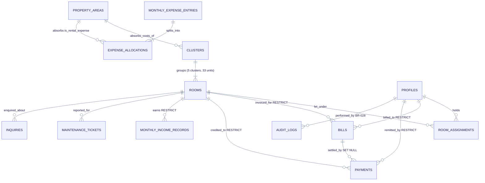
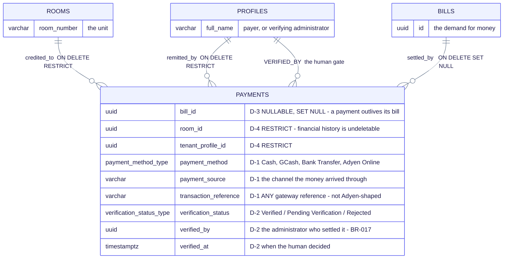
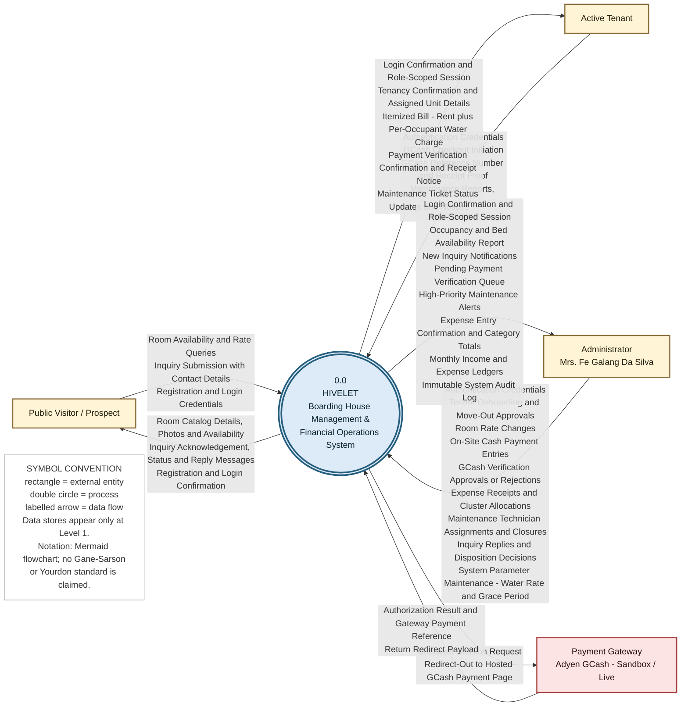
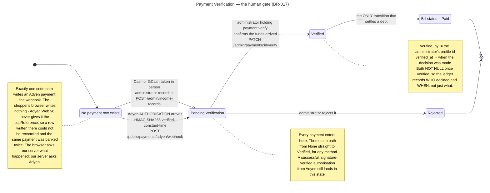

# DIAGRAM SOURCE — paste-ready Mermaid

**Hivelet** | Bicol University Capstone Project 2 | Group 4

Every diagram in this project, as code you can paste straight into
**[mermaid.live](https://mermaid.live)**, Mermaid Chart, Mermaid AI, or any editor that
renders Mermaid.


## Regenerating the PNGs

The rendered images under `docs/diagrams/rendered/` were previously exported at roughly
800px wide, which is why they looked soft when projected. They are now rendered with
`@mermaid-js/mermaid-cli` at a page width and scale chosen per diagram, giving 3,900 to
5,400 pixels across.

```bash
npm install @mermaid-js/mermaid-cli          # in a scratch directory, not the project
mmdc -i docs/diagrams/<name>.mmd -o docs/diagrams/rendered/<name>.png -w <width> -s <scale> -b white
```

| Diagram | `-w` | `-s` | Result |
| :--- | --: | --: | :--- |
| `hivelet_erd` | 1800 | 3 | 5352 x 1800 |
| `hivelet_dfd_level1` | 1800 | 3 | 5352 x 1812 |
| `hivelet_erd_defense` | 1600 | 3 | 4752 x 1842 |
| `hivelet_architecture` | 1600 | 3 | 4752 x 1158 |
| `hivelet_sequence_payment` | 1200 | 4 | 4736 x 2448 |
| `hivelet_architecture_defense` | 1000 | 4 | 3936 x 744 |
| `hivelet_erd_defense_overview` | 1000 | 4 | 3936 x 1568 |
| `hivelet_erd_defense_payments` | 1000 | 4 | 3936 x 1996 |
| `hivelet_dfd_context` | 1000 | 4 | 3936 x 4068 |

`-w` is the page width mermaid lays out against, so it changes how the diagram wraps; `-s`
only multiplies the pixels. Dense diagrams get a wider page so their labels are not cramped;
slide-shaped ones keep their natural layout and just get more pixels. All nine were verified
to render without a parse error at these settings.


---

## How to use this

1. Copy everything inside a code block below, **including the `%%{init...}%%` line at the top**.
2. Paste it into the editor.
3. Export as **SVG** for slides where you can.

### Why SVG rather than PNG

SVG is vector - it stays sharp at any size, on any projector. A PNG is fixed pixels and
softens the moment it is scaled up, which is what you noticed in the rendered files. The
PNGs in `docs/diagrams/rendered/` are there as a convenience; if your tool accepts SVG,
prefer it.

### The theme line

The first line of each block sets fonts, colours and spacing:

```
%%{init: {'theme':'base','themeVariables':{...}}}%%
```

It is not decoration - without it you get Mermaid's default look, which is what made the
earlier renders feel messy. Keep it. If you want a different palette, change the hex values
there and every diagram stays consistent.

### Source of truth

These blocks are copied from `docs/diagrams/*.mmd`. **If you edit a diagram in Mermaid AI,
paste the result back into the matching `.mmd` file** so the repository stays authoritative -
otherwise the next person regenerates from stale code.

> **One gotcha, learned the hard way.** Do not add `%%` comment lines to a `.mmd` file. The
> Mermaid CLI in this project collapses them into the first token and the file stops parsing
> with `Expecting 'ER_DIAGRAM', got '%'`. The `%%{init}%%` directive is fine - it is a
> directive, not a comment.

---


## Section 3 — Architecture (defense view)

Use this one on camera. Built wide and shallow so it fills a 16:9 frame. The amber tier and the green gate are the two things to point at.

*Source: `docs/diagrams/hivelet_architecture_defense.mmd` · Rendered: `docs/diagrams/rendered/hivelet_architecture_defense.png`*

```mermaid
%%{init: {'theme':'base','themeVariables':{'fontFamily':'Inter, Segoe UI, Helvetica, sans-serif','fontSize':'15px','primaryColor':'#f8fafc','primaryTextColor':'#0f172a','primaryBorderColor':'#94a3b8','lineColor':'#64748b','tertiaryColor':'#ffffff','clusterBkg':'#fcfcfd','clusterBorder':'#cbd5e1'}, 'flowchart': {'curve':'basis','nodeSpacing':45,'rankSpacing':70,'padding':14}}}%%
graph LR

    subgraph T1 ["TIER 1 &nbsp; Presentation"]
        UI["Vue 3 SPA<br/>Public &middot; Tenant &middot; Admin<br/><i>holds no database credential</i>"]
    end

    subgraph T2 ["TIER 2 &nbsp; API &amp; Security"]
        SEC["Helmet &middot; CORS &middot; JWT<br/>requirePermission<br/>39 permissions, 4 roles"]
    end

    subgraph T3 ["TIER 3 &nbsp; Domain Services"]
        SRV["Modular Monolith<br/>auth &middot; scope &middot; audit<br/>notification &middot; settings &middot; billing"]
    end

    subgraph TG ["&nbsp; THE HUMAN GATE &nbsp;"]
        GATE["ADMINISTRATOR<br/>VERIFICATION<br/>BR-017<br/><br/>only a human with<br/>payment:verify can<br/>move a bill to Paid"]
    end

    subgraph T4 ["TIER 4 &nbsp; Data"]
        DB["Supabase PostgreSQL<br/>21 tables<br/>forced RLS on all 21<br/>service_role only"]
    end

    subgraph T5 ["TIER 5 &nbsp; Pluggable Payment Gateway Adapter &nbsp; &mdash; &nbsp; exists because of the panel's recommendation"]
        direction LR
        ADAPTER["adyenService.ts<br/><i>the ONLY file that<br/>knows Adyen exists</i>"]
        LIVE["Adyen v71<br/>Checkout Sessions"]
        FALLBACK["Local settlement<br/>path"]
        ADAPTER -->|"isLiveConfigured&lpar;&rpar; true"| LIVE
        ADAPTER -->|"isLiveConfigured&lpar;&rpar; false"| FALLBACK
    end

    CASH["On-site CASH<br/><b>PRIMARY route</b><br/><i>independent of Tier 5</i>"]

    UI --> SEC --> SRV --> GATE --> DB
    SRV --> ADAPTER
    LIVE -.->|"Pending Verification"| GATE
    FALLBACK -.->|"Pending Verification"| GATE
    CASH ==> GATE

    classDef tier fill:#f8fafc,stroke:#475569,stroke-width:1.5px,color:#0f172a
    classDef adapter fill:#fef3c7,stroke:#b45309,stroke-width:3px,color:#7c2d12
    classDef gate fill:#dcfce7,stroke:#15803d,stroke-width:3px,color:#14532d
    classDef cash fill:#e0f2fe,stroke:#0369a1,stroke-width:2.5px,color:#0c4a6e

    class UI,SEC,SRV,DB tier
    class ADAPTER,LIVE,FALLBACK adapter
    class GATE gate
    class CASH cash
```



---


## Section 4a — ERD overview

Open Section 4 on this. Entities, cardinalities and delete policies, no attribute clutter.

*Source: `docs/diagrams/hivelet_erd_defense_overview.mmd` · Rendered: `docs/diagrams/rendered/hivelet_erd_defense_overview.png`*



---


## Section 4b — PAYMENTS close-up

Then cut to this and stay here. The four recommendation-driven changes, D-1 to D-4, in large type.

*Source: `docs/diagrams/hivelet_erd_defense_payments.mmd` · Rendered: `docs/diagrams/rendered/hivelet_erd_defense_payments.png`*



---


## Section 4 — ERD defense view (backup, with attributes)

Backup slide if a panelist wants more detail than the close-up shows.

*Source: `docs/diagrams/hivelet_erd_defense.mmd` · Rendered: `docs/diagrams/rendered/hivelet_erd_defense.png`*

```mermaid
%%{init: {'theme':'base','themeVariables':{'fontFamily':'Inter, Segoe UI, Helvetica, sans-serif','fontSize':'15px','primaryColor':'#eef2ff','primaryTextColor':'#1e1b4b','primaryBorderColor':'#6366f1','lineColor':'#64748b','attributeBackgroundColorOdd':'#ffffff','attributeBackgroundColorEven':'#f8fafc'}}}%%
erDiagram

    PROFILES                ||--o{ ROOM_ASSIGNMENTS       : "holds"
    ROOMS                   ||--o{ ROOM_ASSIGNMENTS       : "let_under"
    ROOMS                   ||--o{ BILLS                  : "invoiced_for"
    PROFILES                ||--o{ BILLS                  : "billed_to"
    BILLS                   ||--o{ PAYMENTS               : "settled_by  (SET NULL)"
    ROOMS                   ||--o{ PAYMENTS               : "credited_to (RESTRICT)"
    PROFILES                ||--o{ PAYMENTS               : "remitted_by (RESTRICT)"
    PROFILES                ||--o{ PAYMENTS               : "VERIFIED_BY"
    ROOMS                   ||--o{ MONTHLY_INCOME_RECORDS : "earns       (RESTRICT)"
    PROFILES                ||--o{ MONTHLY_INCOME_RECORDS : "attributed_to (RESTRICT)"
    PROFILES                ||--o{ AUDIT_LOGS             : "performed_by"

    PAYMENTS {
        uuid id PK "CHANGED FOR R-01 - gateway-agnostic settlement record"
        uuid bill_id FK "D-3 NULLABLE, ON DELETE SET NULL - a payment outlives its bill"
        uuid room_id FK "D-4 ON DELETE RESTRICT - financial history is undeletable"
        uuid tenant_profile_id FK "D-4 ON DELETE RESTRICT"
        numeric amount "CHECK amount GREATER THAN 0"
        payment_method_type payment_method "D-1 Cash, GCash, Bank Transfer, Adyen Online"
        varchar payment_source "D-1 channel the money arrived through"
        varchar transaction_reference "D-1 ANY gateway reference - not Adyen-shaped"
        verification_status_type verification_status "D-2 Verified, Pending Verification, Rejected"
        uuid verified_by FK "D-2 the administrator who settled it - BR-017"
        timestamptz verified_at "D-2 when the human decided"
        timestamptz paid_at "when the money was tendered"
    }

    BILLS {
        uuid id PK "Surrogate key"
        uuid room_id FK "D-4 ON DELETE RESTRICT"
        uuid tenant_profile_id FK "D-4 ON DELETE RESTRICT"
        date due_date "BR-010"
        date grace_period_end_date "equals due_date - there is NO grace period, OD-16"
        numeric rent_amount "from rooms.current_price"
        numeric water_amount "BR-014 occupants x configured rate, or Linda fixed"
        numeric total_amount "rent plus water"
        bill_status_type status "Pending, Due, Overdue, Paid, Partially Paid"
    }

    MONTHLY_INCOME_RECORDS {
        uuid id PK "The ledger that reconciles with the spreadsheet"
        uuid room_id FK "D-4 ON DELETE RESTRICT"
        numeric rent_amount "Rent collected"
        numeric water_payment "Water collected"
        numeric fifty_percent_share "GENERATED ALWAYS AS rent_amount / 2.0 - BR-035"
        numeric remitted_amount "GENERATED ALWAYS AS rent_amount + water_payment - BR-038"
        timestamptz voided_at "Soft-void only - rows are never deleted, BR-003"
    }

    AUDIT_LOGS {
        uuid id PK "Immutable event ledger - BR-028"
        uuid actor_profile_id FK "Who acted"
        varchar action "PAYMENT_VERIFY, EXPENSE_CREATE, ..."
        jsonb previous_values "State before"
        jsonb new_values "State after"
        timestamptz created_at "Append-only"
    }

    ROOMS {
        uuid id PK "33 units across 5 clusters"
        varchar room_number UK "Natural key - 1a to 3g, B1F, F1, LF, LB, PH"
        varchar cluster_code FK "BH, Back Apartment, Front Apartment, Penthouse, Linda"
        int floor "11 / 11 / 10 / 1 - CHECK between 1 and 4"
        numeric current_price "Set manually - no automatic escalation"
    }

    PROFILES {
        uuid id PK "Tenant or administrator"
        varchar email "NULLABLE - a portal login is optional, OD-09"
        varchar phone_number "Alternate login identifier"
        varchar password_hash "NULL means an administrator-managed tenant"
        user_role_type role "admin, tenant, prospect"
    }

    ROOM_ASSIGNMENTS {
        uuid id PK "The tenancy"
        date anniversary_date "Drives the billing cycle - BR-033"
        numeric deposit_amount "ADVANCE RENT, not a refundable deposit - OD-04"
        int occupant_count "Drives the water charge - BR-014"
        bool is_active "At most one active per room, enforced by a partial unique index"
    }
```



---


## Appendix — Full ERD, all 21 tables

Reference. Do NOT put this on camera - it is a document, not a slide.

*Source: `docs/diagrams/hivelet_erd.mmd` · Rendered: `docs/diagrams/rendered/hivelet_erd.png`*

```mermaid
erDiagram

    CLUSTERS                     ||--|{ ROOMS                        : "groups"
    PROPERTY_AREAS               ||--o{ CLUSTERS                     : "absorbs_costs_of"
    ROOMS                        ||--o{ ROOM_PHOTOS                  : "illustrated_by"
    ROOMS                        ||--o{ ROOM_PRICE_HISTORY           : "rate_changed_in"

    AUTH_USERS                   ||--o| PROFILES                     : "authenticates"

    ROOMS                        ||--o{ ROOM_ASSIGNMENTS             : "let_under"
    PROFILES                     ||--o{ ROOM_ASSIGNMENTS             : "holds"

    ROOMS                        ||--o{ INQUIRIES                    : "enquired_about"
    PROFILES                     ||--o{ INQUIRIES                    : "converted_into"
    INQUIRIES                    ||--o{ INQUIRY_MESSAGES             : "threads"
    PROFILES                     ||--o{ INQUIRY_MESSAGES             : "authored_by"

    ROOMS                        ||--o{ BILLS                        : "invoiced_for"
    PROFILES                     ||--o{ BILLS                        : "billed_to"
    BILLS                        ||--o{ PAYMENTS                     : "settled_by"
    ROOMS                        ||--o{ PAYMENTS                     : "credited_to"
    PROFILES                     ||--o{ PAYMENTS                     : "remitted_by"
    PROFILES                     ||--o{ PAYMENTS                     : "verified_by"

    ROOMS                        ||--o{ MONTHLY_INCOME_RECORDS       : "earns"
    PROFILES                     ||--o{ MONTHLY_INCOME_RECORDS       : "attributed_to"
    ROOM_ASSIGNMENTS             ||--o{ MONTHLY_INCOME_RECORDS       : "recorded_under"
    PROFILES                     ||--o{ MONTHLY_INCOME_RECORDS       : "voided_by"

    FIXED_EXPENSE_CATEGORIES     ||--o{ FIXED_EXPENSE_CATEGORIES     : "subdivides"
    FIXED_EXPENSE_CATEGORIES     ||--o{ MONTHLY_EXPENSE_ENTRIES      : "classifies"
    MONTHLY_EXPENSE_ENTRIES      ||--|{ EXPENSE_PROPERTY_ALLOCATIONS : "splits_into"
    PROPERTY_AREAS               ||--o{ EXPENSE_PROPERTY_ALLOCATIONS : "absorbs"
    PROFILES                     ||--o{ MONTHLY_EXPENSE_ENTRIES      : "entered_by"

    ROOMS                        ||--o{ MAINTENANCE_TICKETS          : "reported_for"
    PROFILES                     ||--o{ MAINTENANCE_TICKETS          : "raised_by"
    MAINTENANCE_TICKETS          ||--o{ TICKET_ATTACHMENTS           : "evidenced_by"
    MAINTENANCE_TICKETS          ||--o{ TICKET_MESSAGES              : "discussed_in"
    PROFILES                     ||--o{ TICKET_MESSAGES              : "posted_by"

    PROFILES                     ||--o{ NOTIFICATIONS                : "receives"
    PROFILES                     ||--o{ AUDIT_LOGS                   : "performed_by"
    PROFILES                     ||--o{ SYSTEM_SETTINGS              : "last_updated_by"
    PROFILES                     ||--o{ ROOM_PHOTOS                  : "uploaded_by"
    PROFILES                     ||--o{ ROOM_PRICE_HISTORY           : "authorised_by"

    CLUSTERS {
        varchar code PK "BH, Back Apartment, Front Apartment, Penthouse, Linda"
        varchar name "Display title of the cluster"
        property_area_type expense_area FK "NOT NULL. Area this cluster books costs to. Linda and Back Apartment share one, OD-15"
        int display_order "Canonical report ordering, 1 to 5"
    }

    ROOMS {
        uuid id PK "Surrogate key"
        varchar room_number UK "Natural key. 1a-1h, 2a-2g, 3a-3g, B1F, B2B, B2F, B3B, B3F, F1, F2B, F2F, LF, LB, PH"
        varchar cluster_code FK "Owning cluster. ON DELETE NO ACTION"
        int floor "1 to 3 residential, 4 rooftop. CHECK floor BETWEEN 1 AND 4"
        room_type_enum room_type "Studio, One-bedroom, Two-bedroom, Three-bedroom"
        int capacity "Maximum occupants. CHECK capacity > 0"
        numeric base_price "Original listed rate"
        numeric current_price "Rate in force now. Changed manually, never automatically"
        operational_status_type operational_status "Available, Reserved, Occupied, Under Maintenance"
        visibility_status_type visibility_status "Published or Hidden on the public website"
        date available_from "Earliest date the unit can be taken"
        bool is_linda_unit "Flags the fixed-rate billing exception, BR-040"
        text description "Marketing copy"
        timestamptz created_at "Row creation"
        timestamptz updated_at "Last mutation"
    }

    ROOM_PHOTOS {
        uuid id PK "Surrogate key"
        uuid room_id FK "ON DELETE CASCADE. Photos are transient assets"
        text file_url "Supabase Storage public URL"
        varchar caption "Optional alt text"
        int display_order "Gallery ordering"
        bool is_primary "At most one TRUE per room, enforced by partial unique index"
        uuid uploaded_by FK "Administrator who uploaded"
        timestamptz created_at "Upload timestamp"
    }

    ROOM_PRICE_HISTORY {
        uuid id PK "Surrogate key"
        uuid room_id FK "ON DELETE CASCADE"
        numeric previous_price "Rate before the change"
        numeric new_price "Rate after the change"
        date effective_date "When the new rate takes force"
        text reason "Free-text justification"
        uuid created_by FK "Administrator who made the change, ARCH-004"
        timestamptz created_at "Row creation"
    }

    AUTH_USERS {
        uuid id PK "Supabase auth.users. External to the public schema"
    }

    PROFILES {
        uuid id PK "Surrogate key"
        uuid auth_user_id FK "Supabase Auth link. UNIQUE, nullable"
        varchar email "NULLABLE since migration 006. Unique on lower(email) where not null"
        varchar phone_number "Alternate login identifier. Unique on normalised digits, credentialed rows only"
        varchar password_hash "bcrypt. NULL means an administrator-managed tenant with no portal login"
        varchar full_name "Legal name"
        user_role_type role "admin, tenant, prospect"
        account_status_type account_status "active or inactive"
        varchar occupation "Tenant occupation"
        text facebook_url "Social contact"
        varchar emergency_contact_name "Next of kin"
        varchar emergency_contact_phone "Next of kin number"
        int failed_login_count "Lockout counter"
        timestamptz locked_until "Lockout expiry"
        timestamptz last_login_at "Most recent successful login"
        timestamptz password_changed_at "Credential rotation marker"
        timestamptz created_at "Row creation"
        timestamptz updated_at "Last mutation"
    }

    ROOM_ASSIGNMENTS {
        uuid id PK "Surrogate key"
        uuid room_id FK "ON DELETE CASCADE"
        uuid tenant_profile_id FK "ON DELETE CASCADE"
        date start_date "Move-in"
        date end_date "Move-out. NULL while the tenancy is live"
        date anniversary_date "Drives the rent period, BR-033"
        numeric deposit_amount "ADVANCE RENT, not a refundable deposit. OD-04"
        int occupant_count "Headcount. Drives the water charge, BR-014"
        bool is_active "At most one TRUE per room, enforced by partial unique index"
        bool is_primary_contact "Named payer for the unit, BR-008"
        timestamptz created_at "Row creation"
        timestamptz updated_at "Last mutation"
    }

    INQUIRIES {
        uuid id PK "Surrogate key"
        uuid room_id FK "Unit enquired about. ON DELETE CASCADE"
        varchar prospect_name "Visitor name"
        varchar prospect_email "Visitor email"
        varchar prospect_phone "Visitor mobile"
        text message "Enquiry body"
        inquiry_status_type status "Pending, Contacted, Converted, Closed"
        uuid converted_tenant_id FK "Profile created on conversion, BR-009"
        timestamptz created_at "Row creation"
        timestamptz updated_at "Last mutation"
    }

    INQUIRY_MESSAGES {
        uuid id PK "Surrogate key"
        uuid inquiry_id FK "ON DELETE CASCADE"
        uuid sender_id FK "NULL when the sender is an unauthenticated visitor"
        varchar sender_name "Display name captured at send time"
        text message_body "Message content"
        timestamptz sent_at "Send timestamp"
    }

    BILLS {
        uuid id PK "Surrogate key"
        uuid room_id FK "ON DELETE RESTRICT. Financial history is not deletable"
        uuid tenant_profile_id FK "ON DELETE RESTRICT"
        bill_type_enum bill_type "Rent, Water, Combined, Other"
        date billing_period_start "First day covered"
        date billing_period_end "Last day covered. Never prorated, OD-03"
        date due_date "Payment deadline, BR-010"
        date grace_period_end_date "Due date plus grace, BR-012"
        numeric rent_amount "Rent component. CHECK >= 0"
        numeric water_amount "Water component. CHECK >= 0"
        numeric total_amount "Invoiced total. CHECK >= 0"
        bill_status_type status "Pending, Due, Overdue, Paid, Partially Paid"
        timestamptz created_at "Row creation"
        timestamptz updated_at "Last mutation"
    }

    PAYMENTS {
        uuid id PK "Surrogate key"
        uuid bill_id FK "ON DELETE SET NULL. A payment may outlive its bill"
        uuid room_id FK "ON DELETE RESTRICT"
        uuid tenant_profile_id FK "ON DELETE RESTRICT"
        numeric amount "Amount tendered. CHECK amount > 0"
        payment_method_type payment_method "Cash, GCash, Bank Transfer, Adyen Online"
        varchar payment_source "On-Site Cash or the online channel"
        varchar transaction_reference "Gateway or receipt reference"
        verification_status_type verification_status "Verified, Pending Verification, Rejected"
        uuid verified_by FK "Administrator who verified, BR-017"
        timestamptz verified_at "Verification timestamp"
        timestamptz paid_at "When the money was tendered"
        timestamptz created_at "Row creation"
    }

    MONTHLY_INCOME_RECORDS {
        uuid id PK "Surrogate key"
        uuid room_id FK "ON DELETE RESTRICT"
        uuid tenant_profile_id FK "ON DELETE RESTRICT. NULL for historical rows with no profile"
        uuid assignment_id FK "Tenancy the row belongs to"
        varchar invoice_number "Receipt or invoice identifier"
        varchar contact_name "Payer name as written in the spreadsheet"
        int year "Ledger year"
        int month "Ledger month. CHECK between 1 and 12"
        date date_paid "Date the money was received"
        date rent_period_start "First day of the period covered"
        date rent_period_end "Last day of the period covered"
        int occupants "Headcount used for the water charge"
        numeric rent_amount "Rent collected. CHECK >= 0"
        numeric water_payment "Water collected. CHECK >= 0"
        numeric gbg_fee "Garbage fee. CHECK >= 0"
        numeric fifty_percent_share "System-computed figure equal to half of rent_amount. Column 6 spreadsheet parity, BR-035"
        numeric remitted_amount "System-computed figure equal to rent_amount plus water_payment, BR-038"
        numeric linda_water_charge "Fixed water charge for a Linda unit, BR-040"
        numeric linda_electricity_charge "Fixed electricity charge for a Linda unit, BR-040"
        bool is_linda_billing "Marks the fixed-rate exception"
        payment_method_type payment_method "How the money arrived"
        varchar transaction_reference "Gateway or receipt reference"
        verification_status_type verification_status "Verified, Pending Verification, Rejected"
        timestamptz voided_at "Soft-void marker. Rows are never deleted, BR-003"
        uuid voided_by FK "Administrator who voided"
        text void_reason "Why the row was voided"
        timestamptz created_at "Row creation"
        timestamptz updated_at "Last mutation"
    }

    FIXED_EXPENSE_CATEGORIES {
        varchar code PK "Category code. 13 seeded rows including 6a, 6b, 6c"
        varchar name "Category title"
        varchar parent_code FK "Self-reference. Non-NULL on the 6a/6b/6c sub-lines"
        int display_order "Canonical report ordering"
    }

    MONTHLY_EXPENSE_ENTRIES {
        uuid id PK "Surrogate key"
        date expense_date "Date on the receipt"
        text or_supplier "Official receipt number or supplier name"
        varchar category_code FK "Exactly one category per entry, BR-042"
        numeric total_expenses "DERIVED. Maintained by trigger from the allocations, BR-045"
        uuid created_by FK "Administrator who entered the row, BR-048"
        timestamptz voided_at "Soft-void marker"
        uuid voided_by FK "Administrator who voided"
        text void_reason "Why the row was voided"
        timestamptz created_at "Row creation"
        timestamptz updated_at "Last mutation"
    }

    EXPENSE_PROPERTY_ALLOCATIONS {
        uuid id PK "Surrogate key"
        uuid expense_entry_id FK "ON DELETE CASCADE. Part of the UNIQUE pair"
        property_area_type property_area FK "ON DELETE RESTRICT. Part of the UNIQUE pair"
        numeric amount "Share of the entry charged to this area. CHECK >= 0"
        timestamptz created_at "Row creation"
    }

    PROPERTY_AREAS {
        property_area_type code PK "Boarding House, Main House, Front Apartment, Back Apartment, Penthouse, Other Expenses / Personal"
        varchar name "Display title in the expense report"
        bool is_rental_expense "FALSE for Main House and Other/Personal. Net rental income sums only TRUE, OD-05"
        int display_order "Canonical report ordering"
        text notes "Provenance of the row"
    }

    MAINTENANCE_TICKETS {
        uuid id PK "Surrogate key"
        uuid room_id FK "Unit the fault is in"
        uuid tenant_profile_id FK "Tenant who reported it"
        varchar title "Short summary"
        text description "Full report"
        varchar category "Fault class, defaults to General Repair"
        ticket_priority_type priority "Emergency, High, Medium, Low, BR-021"
        ticket_status_type status "Submitted, In Progress, Resolved, Closed"
        varchar assigned_technician "Named tradesperson"
        timestamptz resolved_at "When the fault was fixed"
        timestamptz closed_at "When the ticket was closed, BR-023"
        uuid closed_by FK "Administrator who closed it"
        timestamptz created_at "Row creation"
    }

    TICKET_ATTACHMENTS {
        uuid id PK "Surrogate key"
        uuid ticket_id FK "ON DELETE CASCADE"
        text file_url "Supabase Storage URL"
        varchar file_type "MIME type, defaults to image/jpeg"
        timestamptz uploaded_at "Upload timestamp"
    }

    TICKET_MESSAGES {
        uuid id PK "Surrogate key"
        uuid ticket_id FK "ON DELETE CASCADE"
        uuid sender_id FK "Author. NOT NULL"
        text message_body "Message content"
        timestamptz created_at "Send timestamp"
    }

    NOTIFICATIONS {
        uuid id PK "Surrogate key"
        uuid recipient_profile_id FK "ON DELETE CASCADE"
        varchar title "Headline"
        text message "Body"
        varchar type "Notification class, defaults to System"
        ticket_priority_type priority "Reuses the ticket priority enum"
        bool is_read "Read receipt"
        uuid related_entity_id "Polymorphic target id. Deliberately not a foreign key"
        varchar related_entity_type "Polymorphic target table name"
        timestamptz created_at "Row creation"
    }

    AUDIT_LOGS {
        uuid id PK "Surrogate key"
        uuid actor_profile_id FK "Who acted. NULL for system-initiated events"
        varchar action "Verb, for example PAYMENT_VERIFY"
        varchar entity_type "Table or aggregate acted upon"
        uuid entity_id "Row acted upon. Deliberately not a foreign key"
        jsonb previous_values "State before. NULL on create"
        jsonb new_values "State after. NULL on delete"
        varchar ip_address "Originating address"
        timestamptz created_at "Append-only event time, BR-028"
    }

    SYSTEM_SETTINGS {
        varchar key PK "Parameter name, for example water_rate_per_occupant"
        text value "Serialised value"
        varchar value_type "How to parse value, defaults to number"
        varchar label "Human-readable name for the admin screen"
        text description "What the parameter controls"
        varchar business_rule "Owning rule, for example BR-014"
        uuid updated_by FK "Administrator who last changed it"
        timestamptz updated_at "Last change"
    }
```

---


## Appendix — Full architecture, every component

Reference. Same warning.

*Source: `docs/diagrams/hivelet_architecture.mmd` · Rendered: `docs/diagrams/rendered/hivelet_architecture.png`*

```mermaid
%% =====================================================================
%% HIVELET - SYSTEM ARCHITECTURE DIAGRAM (Phase 1, corrected)
%% Web-Based Boarding House Management and Financial Operations System
%% Fe Galang Da Silva Boarding House, Legazpi City
%% Bicol University College of Science - IT 124 Capstone Project 2, Group 4
%% -
%% Canonical pattern: Layered Client-Server Architecture Structured as a
%% Modular Monolith with a Pluggable Payment Gateway Adapter (five tiers).
%% Footnote: "Isolated Payment Gateway Adapter" is an earlier synonym for this
%% same Tier 5 boundary, used in FINAL_PRESENTATION_ARCHITECTURE_AND_DATABASE_
%% DEFENSE.md. A panelist quoting that slide is describing this diagram.
%% -
%% Solid node border = implemented and verifiable in backend/src today.
%% Dashed node border = planned Phase 3 extraction; does NOT exist today.
%% =====================================================================
graph TB

    subgraph TIER1 ["1. Presentation Layer - Vue 3 SPA and PWA Shell"]
        direction TB
        SPA_SHELL["Vue 3 + Vite SPA Shell<br/>Pinia stores, vue-router role guards"]
        PWA_CACHE["PWA Service Worker Cache<br/>vite-plugin-pwa, NetworkFirst<br/>READ-ONLY: GET /api/public and /api/health only"]
        UI_PUBLIC["Public Directory<br/>Unit catalog, availability, inquiry form"]
        UI_TENANT["Tenant Portal<br/>Own bills, payment submission, tickets"]
        UI_ADMIN["Admin Control Center<br/>Occupancy, billing, verification queue, reports"]
    end

    subgraph TIER2 ["2. API & Security Perimeter (Helmet, CORS, JWT, RBAC)"]
        direction TB
        SEC_MW["Security Middleware Chain<br/>helmet headers, CORS allow-list origin lock<br/>server.ts lines 21 and 37"]
        AUTH_GUARD["Identity Guards<br/>attachGuestRole, requireAuth, requireRole,<br/>requirePermission, requireSelfOrAdmin"]
        API_ROUTER["REST Route Controllers<br/>/api/health, /api/auth, /api/public,<br/>/api/tenant, /api/admin"]
        ERR_HANDLER["Centralized Fault Boundary<br/>ApiError formatter, notFoundHandler"]
    end

    subgraph TIER3 ["3. Domain Service Layer - Modular Monolith"]
        direction TB
        SRV_AUTH["authService.ts<br/>bcrypt verify, JWT issuance, lockout<br/>388 lines - IMPLEMENTED"]
        SRV_SCOPE["scopeService.ts<br/>Tenant row-scope resolution<br/>IMPLEMENTED"]
        SRV_AUDIT["auditService.ts<br/>Append-only audit writer<br/>IMPLEMENTED"]
        SRV_NOTIFY["notificationService.ts<br/>Alert and notice dispatch<br/>IMPLEMENTED"]
        SRV_ADYEN["adyenService.ts<br/>Pluggable payment gateway adapter<br/>IMPLEMENTED"]

        SRV_BILLING["billingService.ts<br/>Rent and water arithmetic, billing periods<br/>IMPLEMENTED"]
        SRV_PAYMENT["paymentService.ts<br/>Settlement and verification gate<br/>PLANNED - Phase 3"]
        SRV_OCCUPANCY["occupancyService.ts<br/>33 units, assignments, headcount<br/>PLANNED - Phase 3"]
        SRV_TICKET["ticketService.ts<br/>Maintenance ticket lifecycle<br/>PLANNED - Phase 3"]
        SRV_INQUIRY["inquiryService.ts<br/>Prospect to tenant conversion<br/>PLANNED - Phase 3"]
        SRV_SETTINGS["settingsService.ts<br/>Runtime parameter resolution<br/>IMPLEMENTED"]
        SRV_EXPENSE["expenseService.ts<br/>Expense entry and cluster allocation<br/>PLANNED - Phase 3"]
        SRV_FIN_REPORT["financialReportService.ts<br/>Income versus expense analytics<br/>PLANNED - Phase 3"]
    end

    subgraph TIER4 ["4. Data Persistence Layer - PostgreSQL 16 on Supabase, 20 Tables"]
        direction TB
        DB_GATE["ACCESS CONTROL BOUNDARY<br/>RLS ENABLED and FORCED on all application tables<br/>anon and authenticated REVOKED from schema public<br/>sole entry point is the backend service_role client"]
        DB_IDENTITY["Identity Store<br/>profiles"]
        DB_CATALOG["Property Catalog Store<br/>clusters, rooms, room_photos, room_price_history"]
        DB_TENANCY["Tenancy Store<br/>room_assignments"]
        DB_INQUIRY["Inquiry Store<br/>inquiries, inquiry_messages"]
        DB_LEDGER["Financial Ledger Store<br/>bills, payments, monthly_income_records"]
        DB_EXPENSE["Expense Ledger Store<br/>fixed_expense_categories, monthly_expense_entries,<br/>expense_property_allocations"]
        DB_MAINT["Maintenance Store<br/>maintenance_tickets, ticket_attachments, ticket_messages"]
        DB_NOTIFY["Notification Store<br/>notifications"]
        DB_AUDIT["Audit Store<br/>audit_logs - UPDATE and DELETE revoked from every role"]
        DB_SETTINGS["System Parameter Store<br/>system_settings - 6 seeded keys"]
    end

    subgraph TIER5 ["5. External Integration Boundary"]
        direction TB
        EXT_ADYEN["Adyen Checkout API - GCash<br/>developer sandbox or live, auto-selected from credentials<br/>direct HTTPS call - @adyen/api-library declared but not imported"]
        EXT_STORAGE["Supabase Storage Buckets<br/>object URLs for room photos and ticket attachments<br/>PLANNED - not referenced by backend code today"]
    end

    %% ---------- Tier 1 internal ----------
    UI_PUBLIC --> SPA_SHELL
    UI_TENANT --> SPA_SHELL
    UI_ADMIN --> SPA_SHELL
    PWA_CACHE -.->|"Cached public catalog and health probe only"| UI_PUBLIC

    %% ---------- Tier 1 to Tier 2 ----------
    SPA_SHELL -->|"HTTPS REST, Authorization Bearer JWT"| SEC_MW

    %% ---------- Tier 2 internal ----------
    SEC_MW --> AUTH_GUARD
    AUTH_GUARD --> API_ROUTER
    API_ROUTER --> ERR_HANDLER
    ERR_HANDLER -->|"Uniform JSON error envelope"| SPA_SHELL

    %% ---------- Tier 2 to Tier 3, implemented services ----------
    API_ROUTER --> SRV_AUTH
    API_ROUTER --> SRV_SCOPE
    API_ROUTER --> SRV_AUDIT
    API_ROUTER --> SRV_NOTIFY
    API_ROUTER --> SRV_ADYEN

    %% ---------- Tier 2 to Tier 3, planned extractions ----------
    API_ROUTER --> SRV_BILLING
    API_ROUTER -.-> SRV_PAYMENT
    API_ROUTER -.-> SRV_OCCUPANCY
    API_ROUTER -.-> SRV_TICKET
    API_ROUTER -.-> SRV_INQUIRY
    API_ROUTER --> SRV_SETTINGS
    API_ROUTER -.-> SRV_EXPENSE
    API_ROUTER -.-> SRV_FIN_REPORT

    %% ---------- Known Phase 2 debt, drawn honestly ----------
    API_ROUTER -.->|"Current reality: 131 of 164 DB calls still inline in route handlers - admin.ts is 2263 lines"| DB_GATE

    %% ---------- Tier 3 to the access-control boundary ----------
    SRV_AUTH --> DB_GATE
    SRV_SCOPE --> DB_GATE
    SRV_AUDIT --> DB_GATE
    SRV_NOTIFY --> DB_GATE
    SRV_ADYEN --> DB_GATE
    SRV_BILLING --> DB_GATE
    SRV_PAYMENT -.-> DB_GATE
    SRV_OCCUPANCY -.-> DB_GATE
    SRV_TICKET -.-> DB_GATE
    SRV_INQUIRY -.-> DB_GATE
    SRV_SETTINGS --> DB_GATE
    SRV_EXPENSE -.-> DB_GATE
    SRV_FIN_REPORT -.-> DB_GATE

    %% ---------- Boundary to the twenty tables ----------
    DB_GATE --> DB_IDENTITY
    DB_GATE --> DB_CATALOG
    DB_GATE --> DB_TENANCY
    DB_GATE --> DB_INQUIRY
    DB_GATE --> DB_LEDGER
    DB_GATE --> DB_EXPENSE
    DB_GATE --> DB_MAINT
    DB_GATE --> DB_NOTIFY
    DB_GATE --> DB_AUDIT
    DB_GATE --> DB_SETTINGS

    %% ---------- Named domain reads and writes the panel will ask about ----------
    SRV_SETTINGS -->|"Owns and maintains runtime parameters"| DB_SETTINGS
    SRV_BILLING -->|"Settings lookup: water_rate_per_occupant, grace_period_days, Linda fixed charges"| DB_SETTINGS
    SRV_EXPENSE -.->|"Writes expense entries and cluster allocations"| DB_EXPENSE
    SRV_FIN_REPORT -.->|"Reads expense ledger"| DB_EXPENSE
    SRV_FIN_REPORT -.->|"Reads income ledger and derived share column"| DB_LEDGER

    %% ---------- Tier 3 to Tier 5 ----------
    SRV_ADYEN -->|"Create checkout session and submit GCash payment"| EXT_ADYEN
    SRV_TICKET -.->|"Attachment object upload"| EXT_STORAGE
    SRV_OCCUPANCY -.->|"Room photo object upload"| EXT_STORAGE

    %% ---------- Redirect out at Tier 1, authorization result back into Tier 2 ----------
    UI_TENANT -.->|"Browser redirect to hosted GCash checkout"| EXT_ADYEN
    EXT_ADYEN -->|"Authorization result returned to the API - payment inserted as Pending Verification, never auto-settled"| API_ROUTER

    subgraph LEGEND ["Notation Key - not an architectural tier"]
        direction TB
        LEG_PATTERN["Pattern: Layered Client-Server Architecture Structured as a<br/>Modular Monolith with a Pluggable Payment Gateway Adapter"]
        LEG_IMPL["SOLID border, solid arrow<br/>Implemented today and verifiable in the repository"]
        LEG_PLAN["DASHED border, dotted arrow<br/>Planned Phase 3 extraction - does not exist today"]
        LEG_GATE["THICK RED border<br/>Access-control containment boundary"]
    end

    %% ---------- Styling ----------
    classDef t1 fill:#E8F1FB,stroke:#1F4E79,stroke-width:1.5px,color:#10263B
    classDef t2 fill:#FDF0E3,stroke:#A85C10,stroke-width:1.5px,color:#3B2410
    classDef t3i fill:#E9F6EC,stroke:#1E7A3C,stroke-width:1.5px,color:#0F3B1E
    classDef t3p fill:#F4F7F5,stroke:#6E8C79,stroke-width:1.5px,stroke-dasharray:6 4,color:#2F4436
    classDef t4 fill:#F1ECF8,stroke:#5B3A8E,stroke-width:1.5px,color:#2B1A44
    classDef t4gate fill:#EFE2E2,stroke:#9B1C1C,stroke-width:3px,color:#3F0B0B
    classDef t5 fill:#FCF6DC,stroke:#8A6D0B,stroke-width:1.5px,color:#3D3005
    classDef t5p fill:#FBF9EE,stroke:#A99652,stroke-width:1.5px,stroke-dasharray:6 4,color:#413714
    classDef leg fill:#FFFFFF,stroke:#555555,stroke-width:1px,color:#222222

    class SPA_SHELL,PWA_CACHE,UI_PUBLIC,UI_TENANT,UI_ADMIN t1
    class SEC_MW,AUTH_GUARD,API_ROUTER,ERR_HANDLER t2
    class SRV_AUTH,SRV_SCOPE,SRV_AUDIT,SRV_NOTIFY,SRV_ADYEN,SRV_BILLING,SRV_SETTINGS t3i
    class SRV_PAYMENT,SRV_OCCUPANCY,SRV_TICKET,SRV_INQUIRY,SRV_EXPENSE,SRV_FIN_REPORT t3p
    class DB_IDENTITY,DB_CATALOG,DB_TENANCY,DB_INQUIRY,DB_LEDGER,DB_EXPENSE,DB_MAINT,DB_NOTIFY,DB_AUDIT,DB_SETTINGS t4
    class DB_GATE t4gate
    class EXT_ADYEN t5
    class EXT_STORAGE t5p
    class LEG_PATTERN,LEG_IMPL,LEG_PLAN,LEG_GATE leg
```



---


## Section 5 — Level 0 context DFD

Three external entities around one process.

*Source: `docs/diagrams/hivelet_dfd_context.mmd` · Rendered: `docs/diagrams/rendered/hivelet_dfd_context.png`*



---


## Section 5 — Level 1 DFD

7 processes, 12 data stores.

*Source: `docs/diagrams/hivelet_dfd_level1.mmd` · Rendered: `docs/diagrams/rendered/hivelet_dfd_level1.png`*

```mermaid
%% ===========================================================================
%% HIVELET - LEVEL 1 DATA FLOW DIAGRAM (LOGICAL DECOMPOSITION OF PROCESS 0.0)
%% Web-Based Boarding House Management & Financial Operations System
%% Fe Galang Da Silva Boarding House, Legazpi City
%% Bicol University, College of Science - IT 124 Capstone Project 2 - GROUP 4
%% Balances against: docs/diagrams/hivelet_dfd_context.mmd
%% ---------------------------------------------------------------------------
%% CAPTION - SYMBOL CONVENTION (reproduce beneath the rendered figure)
%%   rectangle      = external entity, a source or sink outside the boundary
%%   double circle  = process, numbered n.0 as a child of Process 0.0
%%   cylinder       = data store, mapped 1:1 onto physical tables in
%%                    database/FULL_DATABASE_SCHEMA.sql
%%   solid arrow    = data flow implemented in backend/src today
%%   dotted arrow   = data flow specified but NOT yet wired in code; the target
%%                    behaviour, honestly marked (see CONFIGURATION HONESTY)
%%   Notation is Mermaid flowchart. The IT 124 module handout mandates no
%%   Gane-Sarson or Yourdon standard, so no conformance to either is claimed.
%% ---------------------------------------------------------------------------
%% RECONCILIATION WITH THE SAD LABORATORY REFERENCE SET
%%   docs/claude_pipeline/diagrams/reference_dfds/DFD.png decomposed the system
%%   into five processes and six data stores. This revision carries seven
%%   processes and twelve data stores. Process 7.0 Authenticate & Authorize
%%   Users RESTORES legacy Process 5, which an earlier revision of this file
%%   deleted. Its removal produced a hard balancing failure: the flow
%%   "Authentication Credentials" crossed the system boundary at Level 0 and
%%   terminated nowhere at Level 1. 7.0 now receives it from all three human
%%   entities, reads and writes D2 User Profiles, and issues the authorized
%%   session context consumed by processes 1.0 through 6.0. It maps to a real
%%   implemented artefact, backend/src/services/authService.ts, 388 lines.
%%   Defects in the legacy source images, recorded rather than silently hidden:
%%     - DFD.png misspells "Authenticate" as "Autheticate"; the correct spelling
%%       is used for Process 7.0 below.
%%     - CHILD2.png misspells "Response" as "Respoonse".
%%     - CHILD1.png gives sub-processes 1.3 AND 1.4 the same title, "Manage Room
%%       and Unit Records". 1.4 is functionally the Occupancy / Bed Availability
%%       monitor; that reading is carried here by the flow
%%       "Occupancy and Bed Availability Report" out of Process 2.0.
%% ---------------------------------------------------------------------------
%% BALANCING RULES APPLIED IN THIS REVISION
%%   1. Every output promised to an entity at Level 0 is produced here by a
%%      named process. The previous revision promised eleven administrator
%%      outputs at Level 0 and delivered one at Level 1.
%%   2. No data store is write-only. D5 Tenant Bills, D6 Payment Records,
%%      D9 Maintenance Tickets, D10 Audit Logs and D12 Notifications were
%%      write-only black holes; each now carries at least one read edge feeding
%%      a process that emits to an external entity.
%%   3. D11 System Parameters gains a visible owner: an administrator
%%      configuration-maintenance flow in and the water-rate lookup out, so
%%      architectural pillar ARCH-002 Dynamic Utility Water is traceable on the
%%      diagram rather than implied.
%% ---------------------------------------------------------------------------
%% CONFIGURATION HONESTY (why the three D11 edges are dotted)
%%   The water charge is defined as registered occupants multiplied by
%%   system_settings.water_rate_per_occupant, seeded at 200 and CONFIGURABLE
%%   (BR-014, BR-036). Units LF and LB are excluded from the per-occupant model
%%   and carry fixed per-unit charges (BR-040). The grace period is
%%   system_settings.grace_period_days, seeded at 7 (BR-012).
%%   STATUS as of 2026-09-13: this is now as-built. services/settingsService.ts
%%   is a typed cached reader over system_settings, and services/billingService.ts
%%   applies the rate through it. The three hardcoded occupants * 200 sites in
%%   admin.ts and the hardcoded grace window in tenant.ts are gone; there is no
%%   hardcoded rate left in backend/src. grace_period_days is 0, not the 7 seeded
%%   originally - migration 016 set it, per OD-16, because this property has no
%%   grace period. The public listing reads the rate over GET /api/public/rates
%%   rather than restating it in markup.
%%   A NOTE ON fifty_percent_share AND remitted_amount, because an earlier
%%   revision of this comment was WRONG about them. It claimed both columns
%%   persist 0.00 because they are absent from the INSERT. They are absent from
%%   the INSERT by necessity: both are GENERATED ALWAYS AS ... STORED, so
%%   PostgreSQL derives them and a write would be rejected. Verified across all
%%   937 live rows - none is zero, and none disagrees with its formula
%%   (share = rent/2, remitted = rent + water). The edge "Write Monthly Income
%%   Ledger Row" into D7 is correct, and there is no defect here to disclose.
%% ---------------------------------------------------------------------------
%% SETTLEMENT POSTURE
%%   On-site cash settlement is PRIMARY (BR-015). The Adyen GCash redirect is
%%   the optional digital alternative. The gateway authorisation result is
%%   written as a payment in "Pending Verification" state and never auto-settles
%%   a bill; the administrator verification decision is the only flow that moves
%%   a bill to Paid (BR-017).
%% ===========================================================================

graph TB
    %% --- External Entities (labels are IDENTICAL to hivelet_dfd_context.mmd) ---
    PROSPECT["Public Visitor / Prospect"]
    TENANT["Active Tenant"]
    ADMIN["Administrator<br/>Mrs. Fe Galang Da Silva"]
    GATEWAY["Payment Gateway<br/>Adyen GCash - Sandbox / Live"]

    %% --- Processes ---
    P1((("1.0<br/>Manage Public<br/>Inquiries & Catalog")))
    P2((("2.0<br/>Manage Tenancy<br/>& Occupancy")))
    P3((("3.0<br/>Process Billing<br/>& Payments")))
    P4((("4.0<br/>Manage Operational<br/>Expenses")))
    P5((("5.0<br/>Process Maintenance<br/>Tickets")))
    P6((("6.0<br/>Generate Financial<br/>Reports & Analytics")))
    P7((("7.0<br/>Authenticate &<br/>Authorize Users")))

    %% --- Data Stores (1:1 with database/FULL_DATABASE_SCHEMA.sql) ---
    D1[("D1: Room Catalog<br/>clusters, rooms, room_photos,<br/>room_price_history")]
    D2[("D2: User Profiles<br/>profiles")]
    D3[("D3: Room Assignments<br/>room_assignments")]
    D4[("D4: Inquiries Store<br/>inquiries, inquiry_messages")]
    D5[("D5: Tenant Bills<br/>bills")]
    D6[("D6: Payment Records<br/>payments")]
    D7[("D7: Monthly Income Ledger<br/>monthly_income_records")]
    D8[("D8: Expenses Ledger<br/>fixed_expense_categories, property_areas,<br/>monthly_expense_entries,<br/>expense_property_allocations")]
    D9[("D9: Maintenance Tickets<br/>maintenance_tickets,<br/>ticket_attachments, ticket_messages")]
    D10[("D10: Audit Logs<br/>audit_logs")]
    D11[("D11: System Parameters<br/>system_settings")]
    D12[("D12: Notifications<br/>notifications")]

    %% =======================================================================
    %% PROCESS 7.0 - AUTHENTICATE & AUTHORIZE USERS
    %% Restores legacy DFD.png Process 5. Closes the Level 0 / Level 1
    %% balancing failure on "Authentication Credentials".
    %% Implemented: backend/src/services/authService.ts
    %% =======================================================================
    PROSPECT -->|"Registration and Login Credentials"| P7
    TENANT -->|"Authentication Credentials"| P7
    ADMIN -->|"Authentication Credentials"| P7
    D2 -->|"Read Credential Hash, Role Claim and Account Status"| P7
    P7 -->|"Write Account Record, Role Claim and Last Login"| D2
    P7 -->|"Registration and Login Confirmation"| PROSPECT
    P7 -->|"Login Confirmation and Role-Scoped Session"| TENANT
    P7 -->|"Login Confirmation and Role-Scoped Session"| ADMIN
    P7 -->|"Log Authentication and Role-Change Event"| D10
    P7 -->|"Authorized Session Context"| P1
    P7 -->|"Authorized Session Context"| P2
    P7 -->|"Authorized Session Context"| P3
    P7 -->|"Authorized Session Context"| P4
    P7 -->|"Authorized Session Context"| P5
    P7 -->|"Authorized Session Context"| P6

    %% =======================================================================
    %% PROCESS 1.0 - MANAGE PUBLIC INQUIRIES & CATALOG
    %% =======================================================================
    PROSPECT -->|"Room Availability Query and Inquiry Submission"| P1
    D1 -->|"Read Room Catalog, Rate and Availability"| P1
    P1 -->|"Write Inquiry and Message Thread"| D4
    D4 -->|"Read Inquiry Thread and Disposition Status"| P1
    ADMIN -->|"Inquiry Reply and Disposition Decision"| P1
    P1 -->|"Room Catalog Details and Availability<br/>Inquiry Status and Reply Messages"| PROSPECT
    P1 -->|"Queue New Inquiry Alert"| D12
    D12 -->|"Read Unread Notification Feed"| P1
    P1 -->|"New Inquiry Notifications"| ADMIN
    P1 -->|"Log Inquiry Disposition"| D10

    %% =======================================================================
    %% PROCESS 2.0 - MANAGE TENANCY & OCCUPANCY
    %% Absorbs the function CHILD1.png mislabelled as a second
    %% "Manage Room and Unit Records" at 1.4: occupancy / bed availability.
    %% =======================================================================
    ADMIN -->|"Onboarding Approval, Move-In Date and Occupant Count"| P2
    ADMIN -->|"Room Rate Change"| P2
    D4 -->|"Read Converted Prospect Contact Details"| P2
    P2 -->|"Create or Update Tenant Profile"| D2
    D2 -->|"Read Tenant Profile and Account Status"| P2
    P2 -->|"Write Room Assignment and Registered Occupant Count"| D3
    D3 -->|"Read Active Assignments and Occupant Headcount"| P2
    P2 -->|"Update Room Operational Status"| D1
    P2 -->|"Write Rate Change and Price History Row"| D1
    D1 -->|"Read Unit Roster and Cluster Membership"| P2
    P2 -->|"Occupancy and Bed Availability Report"| ADMIN
    P2 -->|"Tenancy Confirmation and Assigned Unit Details"| TENANT
    P2 -->|"Log Onboarding, Rate Change and Move-Out Action"| D10

    %% =======================================================================
    %% PROCESS 3.0 - PROCESS BILLING & PAYMENTS
    %% The configuration-maintenance path into D11 and the water-rate lookup out
    %% of it are DOTTED: specified, not yet wired. See CONFIGURATION HONESTY.
    %% =======================================================================
    ADMIN -. "System Parameter Maintenance - Water Rate, Grace Period, Linda Fixed Charges" .-> P3
    P3 -. "Write Configured System Parameters" .-> D11
    D11 -. "Read Water Rate Per Occupant and Grace Period Days" .-> P3
    D3 -->|"Read Registered Occupant Count"| P3
    D1 -->|"Read Base Monthly Rent Amount"| P3
    P3 -->|"Write Itemized Bill - Rent plus Water"| D5
    D5 -->|"Read Outstanding, Due and Overdue Bills"| P3
    P3 -->|"Itemized Bill and Statement of Account"| TENANT
    TENANT -->|"GCash Checkout Initiation"| P3
    P3 -->|"Checkout Session Request and Redirect-Out"| GATEWAY
    GATEWAY -->|"Authorization Result and Gateway Payment Reference"| P3
    TENANT -. "GCash Reference Number and Receipt Proof - specified, no endpoint today, see OD-10" .-> P3
    ADMIN -->|"On-Site Cash Entry and GCash Verification Decision"| P3
    P3 -->|"Write Payment as Pending Verification then Verified"| D6
    D6 -->|"Read Pending Verification Queue and Settled Payments"| P3
    P3 -->|"Pending Payment Verification Queue"| ADMIN
    P3 -->|"Update Bill Status to Paid"| D5
    P3 -->|"Write Monthly Income Ledger Row"| D7
    P3 -->|"Queue Receipt and Due-Date Notice"| D12
    D12 -->|"Read Recipient Notice Feed"| P3
    P3 -->|"Payment Verification Confirmation and Receipt Notice"| TENANT
    P3 -->|"Log Billing and Verification Event"| D10

    %% =======================================================================
    %% PROCESS 4.0 - MANAGE OPERATIONAL EXPENSES
    %% =======================================================================
    ADMIN -->|"Official Receipts, Category and Cluster Allocations"| P4
    P4 -->|"Write Categorized Expense Entry and Allocation Split"| D8
    D8 -->|"Read Fixed Categories and Prior Period Entries"| P4
    P4 -->|"Expense Entry Confirmation and Category Totals"| ADMIN
    P4 -->|"Log Expense Action"| D10

    %% =======================================================================
    %% PROCESS 5.0 - PROCESS MAINTENANCE TICKETS
    %% Replaces the legacy chat-message report that PHYSICAL.png shows being
    %% noted informally with no log and assigned verbally.
    %% =======================================================================
    TENANT -->|"Issue Description, Priority and Photo Attachment"| P5
    P5 -->|"Write Ticket, Attachments and Message Thread"| D9
    D9 -->|"Read Open Ticket Queue and Status History"| P5
    ADMIN -->|"Technician Assignment and Closure Decision"| P5
    P5 -->|"Update Ticket Status and Assignment"| D9
    P5 -->|"High-Priority Maintenance Alerts"| ADMIN
    P5 -->|"Ticket Status Updates and Notices"| TENANT
    P5 -->|"Queue Ticket Status Notice"| D12
    P5 -->|"Log Assignment and Closure Action"| D10

    %% =======================================================================
    %% PROCESS 6.0 - GENERATE FINANCIAL REPORTS & ANALYTICS
    %% Read-only aggregation process. Gives D5, D6, D7, D8 and D10 their
    %% terminating read edges to an external entity.
    %% Audit trail read is implemented at backend/src/routes/admin.ts:1864.
    %% =======================================================================
    D7 -->|"Read Monthly Income Ledger Rows"| P6
    D8 -->|"Read Categorized Expense Totals"| P6
    D5 -->|"Read Billed versus Collected Totals"| P6
    D6 -->|"Read Settled Payment Totals"| P6
    D3 -->|"Read Occupancy History for Utilisation Analytics"| P6
    D10 -->|"Read Immutable Audit Trail Entries"| P6
    P6 -->|"Monthly Income and Expense Ledgers"| ADMIN
    P6 -->|"Immutable System Audit Log"| ADMIN

    %% --- Visible caption block (renders with the figure) ---
    LEGEND["SYMBOL CONVENTION<br/>rectangle = external entity<br/>double circle = process<br/>cylinder = data store<br/>solid arrow = data flow implemented today<br/>dotted arrow = specified, not yet wired in code<br/>Notation: Mermaid flowchart; no Gane-Sarson<br/>or Yourdon standard is claimed.<br/>Legacy image corrections: DFD.png 'Autheticate',<br/>CHILD2.png 'Respoonse', CHILD1.png duplicate<br/>1.3 / 1.4 title."]

    classDef entity fill:#FFF4D6,stroke:#8A6D3B,stroke-width:2px,color:#241C0B;
    classDef gateway fill:#FCE4E4,stroke:#A94442,stroke-width:2px,color:#2B0E0E;
    classDef process fill:#DCEBF7,stroke:#255E7E,stroke-width:2px,color:#0C2430;
    classDef authproc fill:#E4DCF5,stroke:#4B3A8C,stroke-width:3px,color:#1B1230;
    classDef store fill:#E6F2E6,stroke:#3C6E3C,stroke-width:2px,color:#12250F;
    classDef pending fill:#F5F5F5,stroke:#777777,stroke-width:2px,stroke-dasharray:6 4,color:#333333;
    classDef caption fill:#FFFFFF,stroke:#9A9A9A,stroke-width:1px,color:#333333;

    class PROSPECT,TENANT,ADMIN entity;
    class GATEWAY gateway;
    class P1,P2,P3,P4,P5,P6 process;
    class P7 authproc;
    class D1,D2,D3,D4,D5,D6,D7,D8,D9,D10,D12 store;
    class D11 pending;
    class LEGEND caption;
```



---


## Optional — Payment verification states (BR-017)

A UML state diagram for `payments.verification_status`. Useful in **Section 4** if the panel
presses on the human gate, and in **Section 6** as the visual answer to their recommendation:
both entry paths converge on one state, and only one transition settles a debt.

*Source: `docs/diagrams/hivelet_state_payment_verification.mmd` · Rendered:
`docs/diagrams/rendered/hivelet_state_payment_verification.svg`*

The three states are the live enum, read from `pg_enum`:
`Verified | Pending Verification | Rejected`.



---

## Optional — Payment sequence

Useful if you walk the payment flow in Section 5.

*Source: `docs/diagrams/hivelet_sequence_payment.mmd` · Rendered: `docs/diagrams/rendered/hivelet_sequence_payment.png`*

```mermaid
sequenceDiagram
    autonumber
    actor Tenant as Active Tenant
    actor Admin as Landlady (Admin)
    participant Client as Frontend (Vue 3 SPA)
    participant API as API Layer and Route Handlers (Express.js)
    participant Service as adyenService.ts (Tier 3)
    participant Gateway as Adyen Checkout API - GCash (developer sandbox)
    participant Hook as adyenWebhookHandler.ts (Tier 5)
    participant DB as PostgreSQL Database

    Note over Admin, DB: STAGE 1 - Bill Availability (BR-010, BR-014, BR-033)
    Tenant->>Client: Opens Statements
    Client->>API: GET /api/tenant/my-bills - tenant.ts:70
    API->>DB: SELECT bills scoped to this tenant
    DB-->>Client: Due bills with rent and water components
    Note over API, DB: The water charge comes from system_settings.water_rate_per_occupant through settingsService and billingService. There is no hardcoded rate in the backend. The billing period runs from each tenancy's own anniversary date (BR-033), and the grace window is zero days (OD-16).

    Note over Tenant, DB: STAGE 2 - Adyen GCash Checkout (BR-016)
    Tenant->>Client: Selects a due bill and chooses to pay online
    Client->>API: POST /api/tenant/payments/checkout
    API->>Service: createCheckoutSession(billId, tenantProfileId, amount, returnUrl)
    Service->>Service: isLiveConfigured() - credentials present, so a real session is required
    Service->>Gateway: POST https://checkout-test.adyen.com/v71/sessions
    Gateway-->>Service: Session id and sessionData
    Service-->>API: Session returned
    API-->>Client: Session handed to the Adyen Drop-in (@adyen/adyen-web v6)
    Note over Service, Gateway: If Adyen refuses or cannot be reached, this raises an error. It previously fell through to a locally rendered checkout page that wrote a Pending Verification payment, so a gateway outage silently became a payment in the landlady's queue.
    Tenant->>Gateway: Completes the hosted GCash payment inside the Drop-in
    Gateway-->>Client: onPaymentCompleted - resultCode and sessionResult ONLY

    Note over Client, DB: STAGE 3 - Two independent returns. Only one of them writes.
    Client->>API: POST /api/tenant/payments/adyen/verify-session (sessionId, sessionResult)
    API->>Service: confirmCheckout(sessionId, sessionResult, tenantProfileId)
    Service->>Gateway: GET /v71/sessions/SESSION_ID with sessionResult (server-to-server, our API key)
    Gateway-->>Service: status - completed, refused, expired
    Service-->>Client: Confirmation for the payer. NO PAYMENT IS WRITTEN HERE.
    Note over Client, Service: The browser never learns the pspReference - Adyen Web v6 whitelists seven keys into onPaymentCompleted and that is not one of them. A row written here could not be reconciled against the webhook, so the same payment was banked twice. The browser return is now read-only.

    Gateway->>Hook: POST /api/public/payments/adyen/webhook (signed notification)
    Hook->>Hook: HTTP Basic Auth, then HMAC-SHA256 over the 8-field payload, constant-time compare
    Hook->>DB: SELECT payments WHERE transaction_reference = pspReference
    Note over Hook, DB: Idempotent by pspReference. Adyen retries until it receives that acknowledgement, so the same event WILL arrive more than once in normal operation.
    Hook->>DB: INSERT INTO payments (payment_method='Adyen Online', verification_status='Pending Verification', transaction_reference=pspReference)
    Hook->>DB: INSERT INTO audit_logs (actor=NULL, entity='PAYMENT', new_values includes pspReference)
    Hook-->>Gateway: responds with the literal accepted acknowledgement
    Note over Hook, DB: This is the ONLY code path that writes an online payment. A verified, successful AUTHORISATION still does not settle a bill - it queues a human decision (BR-017).

    Note over Admin, DB: STAGE 4 - Administrator Verification and Ledger Write (BR-017, BR-035)
    Admin->>Client: Opens the verification queue
    Client->>API: GET /api/admin/payments
    API->>DB: SELECT payments WHERE verification_status = 'Pending Verification'
    DB-->>Client: Tenant name, room, amount and gateway reference
    Admin->>Admin: Confirms the funds arrived
    Admin->>Client: Clicks Verify and Confirm Payment
    Client->>API: PATCH /api/admin/payments/:paymentId/verify

    rect rgb(240, 245, 255)
    Note over API, DB: OPEN GAP - these writes are sequential. No BEGIN/COMMIT exists in backend/src, because supabase-js cannot open a transaction. replace_expense_allocations is the only atomic multi-row write and it is a database function for exactly that reason.
    API->>DB: UPDATE payments SET verification_status='Verified', verified_at=NOW(), verified_by=adminId
    API->>DB: UPDATE bills SET status='Paid' WHERE id = payment.bill_id
    API->>DB: INSERT INTO monthly_income_records (rent_amount, occupants, water_payment, invoice_number, ...)
    Note over API, DB: fifty_percent_share and remitted_amount are NOT in this payload, and must not be. Both are GENERATED ALWAYS AS ... STORED - the database derives them from rent_amount and water_payment. Verified across all 937 live rows - zero are zero, and zero disagree with the formula.
    API->>DB: INSERT INTO audit_logs (action='PAYMENT_VERIFY', actor=adminId, entity='PAYMENT')
    API->>DB: INSERT INTO notifications (recipient=Tenant, title='Payment Verified')
    end

    DB-->>API: Writes complete
    API-->>Client: HTTP 200 OK ("Payment Verified and Income Ledger Updated")
    Client-->>Admin: Updates UI (Verified badge, statement settled)
```



---
