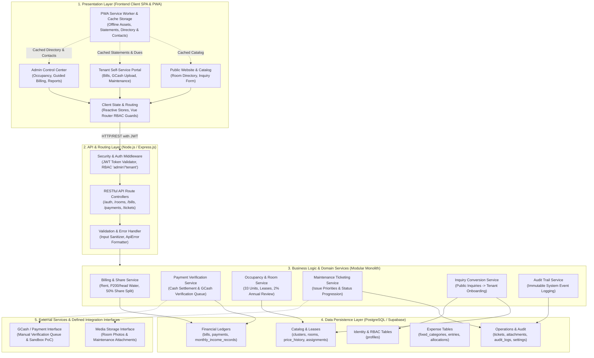

# BUCS IT DEPARTMENT | IT 124: CAPSTONE PROJECT 2
## MODULE 01: SYSTEM ARCHITECTURE SPECIFICATION
### Finalized Architecture, Pattern Justification, and Component Responsibilities

**Project Title:** Hivelet: A Web-Based Boarding House Management and Financial Operations System  
**Target Property:** Fe Galang Da Silva Boarding House, Legazpi City  
**Group Number:** [Insert Your Group Number]  

---

## 1. Finalized Architectural Pattern

Hivelet utilizes a **Layered Client-Server Architecture Structured as a Modular Monolith**.

The system establishes horizontal separation across four logical tiers:
1. **Presentation Layer (Frontend Client SPA & PWA):** Built using Vue 3 (Composition API) and Tailwind CSS, executing within the user's web browser.
2. **API & Security Layer (Backend Server):** Implemented using Node.js and Express.js, providing RESTful JSON endpoints protected by JSON Web Token (JWT) authentication and Role-Based Access Control (RBAC) middleware.
3. **Business Logic & Service Layer (Modular Monolith):** Encapsulates core boarding house business rules into discrete domain services (`billingService`, `paymentService`, `occupancyService`, `ticketService`, `auditService`) executing within a single backend application runtime.
4. **Data Persistence Layer (Database):** Hosted on PostgreSQL 16 (via Supabase), enforcing relational constraints, foreign keys, and transaction atomicity.

---

## 2. Architectural Defense Against Alternatives

During our Capstone 1 defense, our panel emphasized choosing an architecture that is well-aligned with the operational scale of our target property. We evaluated three architectural paradigms:

### 2.1 Why Not Microservices?
Microservices decompose application functionality into independently deployed network services, each maintaining a separate database. For Fe Galang Da Silva Boarding House (a single property with 32 rentable units and ~20 to 50 active residents), microservices introduce severe architectural drawbacks:
* **Distributed Transaction Failures:** Operations such as payment verification require synchronizing changes across bills, payment records, monthly income ledgers, and audit logs. In microservices, this requires two-phase commits or saga patterns, which introduce high failure risks during network partitions.
* **Operational & Infrastructure Complexity:** Managing multiple containerized services, inter-service API gateways, and distributed logging is unwarranted for a localized team and would exceed the hosting resource limits of our university server.
* **Network Latency:** Internal network calls between microservices introduce latency that degrades user experience compared to direct in-memory service calls.

### 2.2 Why Not a Traditional Server-Rendered Monolith (e.g., Pure PHP/Blade/Django)?
A server-rendered template application tightly couples the user interface generation with backend server execution. While simple to deploy, it fails to meet the specific usability and environmental needs of our stakeholders:
* **Lack of Offline Resilience:** Server-rendered architectures require an active internet connection for every single page transition. In dormitory settings near Bicol University where internet connectivity fluctuates, this causes frequent page load crashes.
* **Mobile Experience:** Separating the frontend into a Vue 3 Single-Page Application (SPA) with Progressive Web Application (PWA) capabilities allows client-side caching of static assets and previously viewed room directories, enabling fluid mobile navigation and slide-over drawers for student boarders on mobile devices.

### 2.3 Why the Layered Modular Monolith is the Optimal Design
The Layered Modular Monolith combines the maintainability of domain-driven modularity with the simplicity of a single unified deployable codebase:
* **Separation of Concerns:** The presentation layer is completely decoupled from database access via secure REST APIs, ensuring the client cannot execute unauthorized database writes.
* **Domain Modularity:** Business rules governing billing, inquiries, and maintenance are organized into distinct modules that can be maintained or refactored independently without breaking unrelated modules.
* **Resource Efficiency:** The entire backend executes within a single lightweight Node.js process consuming under 256MB of RAM, ensuring maximum reliability and rapid response times on our university deployment server.

---

## 3. One-Sentence Responsibility Statements

Every component within the finalized architecture has a single, unambiguous responsibility:

1. **Public Catalog Component (`UI_PUBLIC`):** Presents public room directories, availability statuses, and collects prospective tenant inquiry submissions without exposing private system data.
2. **Tenant Portal Component (`UI_TENANT`):** Enables active residents to inspect itemized rental balances, upload GCash payment references, and submit maintenance tickets from mobile or desktop devices.
3. **Admin Control Center Component (`UI_ADMIN`):** Provides the landlady with centralized controls for guided monthly payment encoding, online payment verification, and real-time financial reporting.
4. **Client State & Navigation Guards (`STATE_STORE`):** Manages reactive client-side session tokens using Vue 3 Composition API stores and prevents unauthorized route transitions via Vue Router navigation guards.
5. **PWA Service Worker & Cache (`PWA_CACHE`):** Intercepts network requests to cache read-only data, enabling tenants to view statements and balances, the admin to view occupancy directories and emergency contacts, and visitors to browse room listings during dormitory internet disruptions.
6. **Authentication & RBAC Middleware (`AUTH_MW`):** Validates incoming JWT bearer tokens and restricts API endpoint execution based on the user's authenticated role (`'admin'` vs `'tenant'`).
7. **RESTful Route Controllers (`API_ROUTER`):** Maps incoming HTTP requests to specific backend service handlers and formats standardized JSON responses.
8. **Validation & Error Handler (`VAL_ERR`):** Sanitizes and validates request payloads against defined schemas before execution, converting runtime exceptions into structured `ApiError` responses.
9. **Billing & Revenue Share Service (`SRV_BILLING`):** Computes monthly rental dues, derives occupant-based water charges ($\text{occupants} \times ₱200$), and calculates the 50% co-ownership revenue share.
10. **Payment Verification Service (`SRV_PAYMENT`):** Processes on-site cash settlements and manages the asynchronous verification queue for digital GCash submissions.
11. **Occupancy & Room Service (`SRV_OCCUPANCY`):** Maintains the 33 canonical property units, tracks active tenant room leases, and recommends 2% annual price adjustments upon contract anniversaries.
12. **Maintenance Ticketing Service (`SRV_TICKET`):** Manages maintenance request lifecycles, enforces ticket priorities (Emergency to Low), and tracks repair technician assignments.
13. **Inquiry Conversion Service (`SRV_INQUIRY`):** Automates the transition of approved public inquiries into active tenant accounts without redundant data re-entry.
14. **Audit Trail Service (`SRV_AUDIT`):** Records an immutable, append-only log of all financial ledger adjustments, void actions, and administrative status modifications.
15. **PostgreSQL Relational Database (`DATA_TIER`):** Enforces ACID transactional integrity, foreign key constraints, 3NF normalization, and persistent storage of all operational records.
16. **Payment Integration Interface (`EXT_GCASH`):** Serves as a pluggable, decoupled adapter providing direct GCash reference verification today, while remaining architecturally ready to connect an automated payment gateway (e.g., Adyen) once stakeholder consultation concludes.
17. **Media Storage Interface (`EXT_STORAGE`):** Validates and stores multipart file uploads for public room imagery and maintenance photo attachments.

---

## 4. Technology Stack Table

| Layer / Role | Software / Tool | Version | Technical Justification |
| :--- | :--- | :---: | :--- |
| **Frontend Framework** | **Vue.js (Composition API)** | 3.5.x | High-performance reactive Single-Page Application (SPA) framework providing modular composables and fast virtual DOM re-renders. |
| **UI Styling System** | **Tailwind CSS** | 4.x / 3.4 | Utility-first styling engine enabling rapid implementation of the Jira-inspired corporate design system (`#f4f5f7`, `#172b4d`, `#0c66e4`). |
| **Client State Management**| **Vue 3 Reactive Composables** | Native | Lightweight, type-safe reactive state singletons (`reactive()` and `ref()`) managing user sessions without external boilerplate. |
| **Frontend Routing** | **Vue Router** | 4.5.x | Client-side routing providing asynchronous navigation guards that enforce role-based access control before view rendering. |
| **Offline Caching (PWA)** | **Vite PWA Plugin (Workbox)** | Latest | Service worker generating client-side runtime cache for application shells and room directories in low-connectivity settings. |
| **Build & Development Tool**| **Vite** | 5.4.x | Fast build tool offering native ES module imports, rapid Hot Module Replacement (HMR), and optimized production bundling. |
| **Backend Runtime** | **Node.js** | 20+ LTS | Event-driven, non-blocking asynchronous JavaScript runtime ensuring high I/O throughput with minimal memory footprint. |
| **Backend Web Framework** | **Express.js** | 4.x | Minimalist HTTP server framework providing robust routing pipelines, centralized error handling, and modular middleware support. |
| **Programming Language** | **TypeScript** | 5.7.x | Statically typed JavaScript superset enforcing strict interface contracts between frontend API calls and backend services. |
| **Database Engine** | **PostgreSQL (via Supabase)** | 16+ | Enterprise-grade relational database management system supporting ACID transactions, foreign key constraints, and JSONB audit storage. |
| **Cryptographic Hashing** | **Bcrypt.js** | Latest | Adaptive salted one-way key derivation function securing user passwords against rainbow-table and brute-force attacks. |
| **Token Security** | **JSON Web Tokens (JWT)** | Latest | Stateless, cryptographically signed authentication mechanism encoding user identity and permissions for secure API authorization. |
| **Iconography Engine** | **Lucide-Vue-Next** | Latest | Clean, standardized vector SVG icons adhering strictly to the capstone requirement of eliminating emojis from corporate interfaces. |

---

## 5. System Architecture Diagram

