# BUCS IT DEPARTMENT | IT 124: CAPSTONE PROJECT 2

> [!CAUTION]
> **SUPERSEDED IN PART — read `docs/claude_pipeline/outputs/PHASE1_MODULE01_ERRATA.md` first.**
>
> This document was submitted before the Phase 1 and Phase 2 audits. Twenty-one corrections
> (E-01 … E-21) apply to this submission set. The ones most likely to be read aloud by mistake:
>
> | Claim in this pack | Correction |
> | :--- | :--- |
> | "32 units" | **33 units** across 5 clusters, floors **11 / 11 / 10 / 1** |
> | "2% annual increase rule" | **No such rule exists.** The owner sets rates by hand; only the change history is kept |
> | "50/50 co-ownership revenue share" | **Banned wording.** `fifty_percent_share` is a system-computed figure equal to half the row's Rent Amount, retained for ledger parity with the historical spreadsheet — no party, recipient or purpose is modelled |
> | "Main Building / Annex A / Annex B" | **Not cluster names.** BH, Back Apartment, Front Apartment, Penthouse, Linda. "Annex" is the family's word for a *floor* |
> | "Pending Consultation" | **Withdrawn.** The Adyen evaluation is complete — a developer sandbox is configured and the GCash flow runs against it |
> | "one-week grace period" | **There is no grace period.** Late payment is not accepted (OD-16) |
> | "ON DELETE RESTRICT" as existing fact | It did **not** exist when this was written. Applied by migration `005` on 2026-09-13 |
> | "atomic database transaction" | No transaction existed in `backend/src` when this was written |
>
> **For the Capstone 2 defense, speak from `docs/claude_pipeline/outputs/PHASE3_DEFENSE_PACK.md`,
> not from this pack.** Only one panel recommendation was ever given — see
> `PHASE3_PANEL_RECOMMENDATION_REGISTER.md`.

---

## MODULE 01: DATABASE SCHEMA & DATA DICTIONARY
### 3NF Relational Model, Crow's Foot ERD, and Data Dictionary

**Project Title:** Hivelet: A Web-Based Boarding House Management and Financial Operations System  
**Target Property:** Fe Galang Da Silva Boarding House, Legazpi City  
**Group Number:** 4  

---

## 1. Executive Schema Audit (The 6 Schema-Refinement Checks)

To resolve the gaps identified during our Capstone 1 proposal defense, the Hivelet database schema was audited and refined against the six standard schema-refinement checks:

1. **Entity Completeness:**  
   Proposal gaps were closed by introducing dedicated tables for property clusters (`clusters`), historical rental pricing (`room_price_history`), multi-tenant lease assignments (`room_assignments`), property expense allocations (`expense_property_allocations`), and immutable ledger modification records (`audit_logs`).
2. **Attribute Definition & Cryptographic Standards:**  
   User passwords are never stored in plain text; they are documented and stored as salted hashes (`password_hash VARCHAR(255)`) generated via bcrypt. All monetary attributes strictly use high-precision decimals (`NUMERIC(10, 2)`) to eliminate floating-point roundoff errors during financial aggregations. Authoritative server timestamps (`TIMESTAMPTZ DEFAULT NOW()`) are attached to all transactional records.
3. **Primary and Foreign Key Integrity:**  
   Every table uses a Version 4 Universally Unique Identifier (`UUID DEFAULT gen_random_uuid()`) as its surrogate primary key, eliminating sequential record enumeration attacks. Foreign keys are explicitly established across all relational boundaries.
4. **Cardinality and Participation:**  
   Cardinality and participation rules are strictly modeled using **Crow's Foot notation** and validated through formal academic participation statements.
5. **Third Normal Form (3NF) Normalization:**  
   Repeating groups (photos, allocations) were extracted into discrete entities (1NF); single-column primary keys guarantee full functional dependency (2NF); transitive dependencies (tenant contact details, past price records, fixed expense categories) were completely decoupled (3NF).
6. **Referential Integrity and Cascading Strategies:**  
   Non-financial child records (`room_photos`, `ticket_attachments`) enforce `ON DELETE CASCADE` to prevent orphaned media files. Critical financial and audit entities (`bills`, `payments`, `monthly_income_records`) enforce `ON DELETE RESTRICT` or `SET NULL`, guaranteeing permanent historical auditability per Capstone Rule BR-003.

---

## 2. Crow's Foot Entity-Relationship Diagram (ERD)

```mermaid
erDiagram
    CLUSTERS ||--o{ ROOMS : "categorizes"
    PROFILES ||--o{ ROOM_ASSIGNMENTS : "leases"
    PROFILES ||--o{ BILLS : "billed_to"
    PROFILES ||--o{ PAYMENTS : "remitted_by"
    PROFILES ||--o{ MAINTENANCE_TICKETS : "submits"
    PROFILES ||--o{ NOTIFICATIONS : "receives"
    PROFILES ||--o{ AUDIT_LOGS : "performed_by"

    ROOMS ||--o{ ROOM_PHOTOS : "contains"
    ROOMS ||--o{ ROOM_PRICE_HISTORY : "tracks_rates"
    ROOMS ||--o{ ROOM_ASSIGNMENTS : "occupies"
    ROOMS ||--o{ INQUIRIES : "receives"
    ROOMS ||--o{ BILLS : "invoiced_for"
    ROOMS ||--o{ PAYMENTS : "credited_to"
    ROOMS ||--o{ MONTHLY_INCOME_RECORDS : "generates"
    ROOMS ||--o{ MAINTENANCE_TICKETS : "reported_for"

    INQUIRIES ||--o{ INQUIRY_MESSAGES : "threads"
    BILLS ||--o{ PAYMENTS : "settled_by"
    
    MAINTENANCE_TICKETS ||--o{ TICKET_ATTACHMENTS : "attaches"
    MAINTENANCE_TICKETS ||--o{ TICKET_MESSAGES : "contains"

    FIXED_EXPENSE_CATEGORIES ||--o{ FIXED_EXPENSE_CATEGORIES : "subdivides"
    FIXED_EXPENSE_CATEGORIES ||--o{ MONTHLY_EXPENSE_ENTRIES : "classifies"
    MONTHLY_EXPENSE_ENTRIES ||--o{ EXPENSE_PROPERTY_ALLOCATIONS : "splits_into"

    CLUSTERS {
        varchar code PK "Cluster Code: BH, Back, PH, Front, Linda"
        varchar name "Full Cluster Title"
        int display_order "Canonical ordering (1 to 5)"
    }

    PROFILES {
        uuid id PK "Surrogate identifier"
        varchar email UK "Unique lowercase login email"
        varchar password_hash "Bcrypt salted hash (never plain text)"
        varchar full_name "Legal name of tenant or admin"
        varchar phone_number "Contact mobile number"
        varchar emergency_contact_name "Emergency contact person"
        varchar emergency_contact_phone "Emergency contact number"
        varchar occupation "Student course or employer"
        varchar facebook_url "Social contact link"
        varchar role "Role: 'admin', 'tenant'"
        varchar account_status "Status: 'active', 'suspended', 'inactive'"
        timestamptz last_login_at "Last session timestamp"
        int failed_login_count "Security lockout counter"
        timestamptz created_at "Registration timestamp"
    }

    ROOMS {
        uuid id PK "Surrogate unit identifier"
        varchar cluster_code FK "References CLUSTERS(code)"
        varchar room_number UK "Unique Unit Code: 1a, 2b, B1F, PH"
        int floor "Floor level: 1, 2, or 3"
        varchar room_type "Type: Studio, 1-bed, 2-bed, 3-bed"
        int capacity "Maximum allowed occupants"
        numeric base_price "Historical base rental rate"
        numeric current_price "Current active rental rate"
        varchar operational_status "Status: Available, Occupied, Maintenance"
        varchar visibility_status "Visibility: Published, Hidden"
        boolean is_linda_unit "Linda special co-ownership flag"
        date available_from "Expected availability date"
    }

    ROOM_PHOTOS {
        uuid id PK "Photo record identifier"
        uuid room_id FK "References ROOMS(id) ON DELETE CASCADE"
        text file_url "Storage URI / path"
        varchar caption "Descriptive caption"
        int display_order "Carousel sort order"
        boolean is_primary "Thumbnail display flag"
    }

    ROOM_PRICE_HISTORY {
        uuid id PK "History record identifier"
        uuid room_id FK "References ROOMS(id) ON DELETE CASCADE"
        numeric previous_price "Pre-adjustment rent rate"
        numeric new_price "Adjusted rate (2% annual increase)"
        date effective_date "Legal escalation start date"
        text reason "Justification notes"
        uuid created_by FK "Admin who approved rate"
    }

    ROOM_ASSIGNMENTS {
        uuid id PK "Contract lease identifier"
        uuid room_id FK "References ROOMS(id) ON DELETE CASCADE"
        uuid tenant_profile_id FK "References PROFILES(id) ON DELETE CASCADE"
        date start_date "Move-in date (sets monthly due date)"
        date end_date "Move-out date (NULL if active)"
        date anniversary_date "1-year rent review milestone"
        numeric deposit_amount "Security deposit held"
        int occupant_count "Headcount for 200/head water fee"
        boolean is_primary_contact "Main accountable leaseholder"
        boolean is_active "Active occupancy flag"
    }

    INQUIRIES {
        uuid id PK "Inquiry identifier"
        uuid room_id FK "References ROOMS(id) ON DELETE CASCADE"
        varchar prospect_name "Prospective tenant full name"
        varchar prospect_email "Prospect contact email"
        varchar prospect_phone "Prospect contact phone"
        text message "Inquiry message content"
        varchar status "Status: Pending, Contacted, Converted"
        uuid converted_tenant_id FK "References PROFILES(id) on onboarding"
    }

    INQUIRY_MESSAGES {
        uuid id PK "Message identifier"
        uuid inquiry_id FK "References INQUIRIES(id) ON DELETE CASCADE"
        uuid sender_id FK "Nullable if external prospect"
        varchar sender_name "Sender display name"
        text message_body "Chat message body"
        timestamptz created_at "Message timestamp"
    }

    BILLS {
        uuid id PK "Invoice identifier"
        uuid room_id FK "References ROOMS(id) ON DELETE CASCADE"
        uuid tenant_profile_id FK "References PROFILES(id) ON DELETE CASCADE"
        varchar bill_type "Type: Rent, Utility, Deposit"
        date billing_period_start "30-day period start"
        date billing_period_end "30-day period end"
        numeric rent_amount "Monthly base rent portion"
        numeric water_amount "Water fee (occupant_count * 200)"
        numeric total_amount "Total due (Rent + Water)"
        date due_date "Payment due date"
        date grace_period_end_date "Due date + 7 days grace period"
        varchar status "Status: Due, Paid, Overdue, Cancelled"
    }

    PAYMENTS {
        uuid id PK "Payment transaction identifier"
        uuid bill_id FK "References BILLS(id) ON DELETE SET NULL"
        uuid room_id FK "References ROOMS(id) ON DELETE CASCADE"
        uuid tenant_profile_id FK "References PROFILES(id) ON DELETE CASCADE"
        numeric amount "Amount paid in PHP"
        varchar payment_method "Method: Cash, GCash, Bank Transfer"
        varchar payment_source "Source: On-Site Office, Direct GCash"
        varchar verification_status "Status: Pending Verification, Verified"
        varchar transaction_reference "GCash 13-digit reference / OR number"
        timestamptz paid_at "Remittance timestamp"
        timestamptz verified_at "Admin verification timestamp"
        uuid verified_by FK "Admin who verified funds"
    }

    MONTHLY_INCOME_RECORDS {
        uuid id PK "Ledger record identifier"
        uuid room_id FK "References ROOMS(id) ON DELETE CASCADE"
        uuid tenant_profile_id FK "References PROFILES(id) ON DELETE SET NULL"
        int year "Accounting year (e.g., 2026)"
        int month "Accounting month (1 to 12)"
        date date_paid "Receipt payment date"
        varchar contact_name "Name printed on receipt"
        varchar invoice_number "Official invoice number"
        numeric rent_amount "Gross rent collected"
        numeric fifty_percent_share "50% co-ownership revenue share"
        int occupants "Occupants during month"
        numeric water_payment "Water collected (occupants * 200)"
        numeric gbg_fee "Garbage collection fee"
        numeric remitted_amount "Net remitted amount to landlady"
        varchar verification_status "Status: Verified, Pending"
        timestamptz voided_at "Audit void timestamp (non-destructive)"
    }

    FIXED_EXPENSE_CATEGORIES {
        varchar code PK "Category Code: 1..10, 6a..6c"
        varchar name "Title: Supplies, Taxes, Salaries, etc."
        varchar parent_code FK "Self-referencing parent code"
        int display_order "Canonical accounting order"
    }

    MONTHLY_EXPENSE_ENTRIES {
        uuid id PK "Expense entry identifier"
        date expense_date "Official expense receipt date"
        varchar or_supplier "Official Receipt / Supplier name"
        varchar category_code FK "References FIXED_EXPENSE_CATEGORIES(code)"
        numeric total_expenses "Total monetary expense"
        timestamptz voided_at "Audit void timestamp"
        uuid created_by FK "Admin who encoded entry"
    }

    EXPENSE_PROPERTY_ALLOCATIONS {
        uuid id PK "Allocation record identifier"
        uuid expense_entry_id FK "References MONTHLY_EXPENSE_ENTRIES(id)"
        varchar property_area "Area: BH, Apartment, Main House"
        numeric amount "Subdivided expense amount"
    }

    MAINTENANCE_TICKETS {
        uuid id PK "Issue ticket identifier"
        uuid room_id FK "References ROOMS(id) ON DELETE CASCADE"
        uuid tenant_profile_id FK "References PROFILES(id) ON DELETE CASCADE"
        varchar title "Issue summary"
        text description "Detailed problem description"
        varchar category "Category: Plumbing, Electrical, Carpentry"
        varchar priority "Priority: Low, Medium, High, Emergency"
        varchar status "Status: Submitted, In Progress, Closed"
        varchar assigned_technician "Name of technician / repair person"
        timestamptz resolved_at "Work completion timestamp"
        timestamptz closed_at "Admin closure timestamp"
        uuid closed_by FK "Admin who verified repair"
    }

    TICKET_ATTACHMENTS {
        uuid id PK "Attachment identifier"
        uuid ticket_id FK "References MAINTENANCE_TICKETS(id) ON DELETE CASCADE"
        text file_url "Storage path of issue photo"
        varchar file_type "MIME format (JPEG, PNG)"
    }

    TICKET_MESSAGES {
        uuid id PK "Ticket message identifier"
        uuid ticket_id FK "References MAINTENANCE_TICKETS(id) ON DELETE CASCADE"
        uuid sender_id FK "References PROFILES(id)"
        text message_body "Communication content"
        timestamptz created_at "Message timestamp"
    }

    NOTIFICATIONS {
        uuid id PK "Notification identifier"
        uuid recipient_profile_id FK "References PROFILES(id) ON DELETE CASCADE"
        varchar title "Notification title"
        text message "Notification text"
        varchar type "Type: Payment, Ticket, System"
        varchar priority "Priority: Low, Medium, High"
        boolean is_read "Read state flag"
        timestamptz created_at "Dispatch timestamp"
    }

    AUDIT_LOGS {
        uuid id PK "Audit entry identifier"
        uuid actor_profile_id FK "References PROFILES(id) ON DELETE SET NULL"
        varchar action "Verb: PAYMENT_VERIFIED, RATE_ADJUSTED"
        varchar entity_type "Target table: PAYMENT, BILL, ROOM"
        varchar entity_id "UUID string of target record"
        jsonb previous_values "Pre-mutation JSON state"
        jsonb new_values "Post-mutation JSON state"
        varchar ip_address "Client IP address"
        timestamptz created_at "Immutable server clock timestamp"
    }

    SYSTEM_SETTINGS {
        varchar key PK "Setting Key: water_rate_per_occupant, etc."
        text value "Current parameter value"
        varchar value_type "Type: number, string, boolean"
        varchar label "Human-readable setting title"
        text description "Detailed description of parameter"
        varchar business_rule "Governing rule: BR-014, BR-035"
        timestamptz updated_at "Last adjustment timestamp"
    }
```

---

## 3. Cardinality and Participation Statements

1. **Profile to RoomAssignment:**  
   *"A **Profile** may hold **zero or many RoomAssignments**, and an active **RoomAssignment** must belong to **exactly one Profile**."*
2. **Room to RoomPriceHistory:**  
   *"A **Room** may have **zero or many RoomPriceHistories**, and a **RoomPriceHistory** must reference **exactly one Room**."*
3. **Room to RoomAssignment:**  
   *"A **Room** may have **zero or many historical RoomAssignments**, and an active **RoomAssignment** must reference **exactly one Room**."*
4. **Bill to Payment:**  
   *"A **Bill** may have **zero or many Payments**, and a **Payment** may belong to **zero or one Bill** (to accommodate unbilled advance payments)."*
5. **Room to MaintenanceTicket:**  
   *"A **Room** may have **zero or many MaintenanceTickets**, and a **MaintenanceTicket** must belong to **exactly one Room**."*
6. **MaintenanceTicket to TicketAttachment:**  
   *"A **MaintenanceTicket** may have **zero or many TicketAttachments**, and a **TicketAttachment** must belong to **exactly one MaintenanceTicket**."*
7. **ExpenseEntry to ExpensePropertyAllocation:**  
   *"A **MonthlyExpenseEntry** may have **one or many ExpensePropertyAllocations**, and an **ExpensePropertyAllocation** must belong to **exactly one MonthlyExpenseEntry**."*

---

## 4. Third Normal Form (3NF) Normalization Derivation

### 4.1 Unnormalized Form (UNF)
The original paper-based ledger combined tenant personal information, room rates, utility calculations, and maintenance issues in a single flat row:
`[ Date, RoomNumber, TenantName, TenantPhone, BaseRent, Occupants, WaterAmount, TotalPaid, GCashRef, 50%Share, MaintIssue, PhotoUrls ]`

### 4.2 First Normal Form (1NF)
*Rule:* Eliminate repeating groups and ensure atomic values.
* **Resolution:** Multiple room photos and maintenance attachments are extracted into child tables (`room_photos`, `ticket_attachments`). Multi-area expense splits are extracted into `expense_property_allocations`. Every column now holds a single scalar value.

### 4.3 Second Normal Form (2NF)
*Rule:* Meet 1NF criteria; ensure no partial dependencies on composite candidate keys.
* **Resolution:** Every table implements a single-column surrogate Primary Key (`id UUID DEFAULT gen_random_uuid()`). Because no composite primary keys exist, all non-key attributes are fully functionally dependent on the entire primary key.

### 4.4 Third Normal Form (3NF)
*Rule:* Meet 2NF criteria; eliminate transitive dependencies between non-key attributes.
* **Resolution 1 (Tenant Data):** In the unnormalized model, `tenant_phone` and `emergency_contact` depended transitively on `room_assignment_id`. These were decoupled into `profiles`, referenced via FK `tenant_profile_id`.
* **Resolution 2 (Rental Rates & 2% Escalation):** In a naive schema, overwriting `rooms.current_price` destroyed past ledger auditability. Price modifications are isolated into `room_price_history`, preserving historical room rent rates.
* **Resolution 3 (Utility Calculation):** Water amounts are not stored as arbitrary unlinked values. Instead, `bills.water_amount` is derived dynamically from `room_assignments.occupant_count` multiplied by the authoritative rate in `system_settings` (₱200/head).

---

## 5. Master Data Dictionary

### Table 1: `profiles` (User Identities & Access Control)
| Column Name | Data Type | Constraints | Description |
| :--- | :--- | :--- | :--- |
| `id` | `UUID` | PK, `gen_random_uuid()` | Primary unique surrogate identifier. |
| `email` | `VARCHAR(255)` | UK, NOT NULL | Account login email address (case-insensitive indexed). |
| `password_hash` | `VARCHAR(255)` | NULL | **Bcrypt cryptographically salted password hash**. |
| `full_name` | `VARCHAR(150)` | NOT NULL | Legal name of the tenant or administrator. |
| `phone_number` | `VARCHAR(50)` | NULL | Primary contact mobile number. |
| `emergency_contact_name` | `VARCHAR(150)` | NULL | Name of designated emergency contact person. |
| `emergency_contact_phone`| `VARCHAR(50)` | NULL | Phone number of emergency contact person. |
| `occupation` | `VARCHAR(100)` | NULL | University course, student designation, or employer. |
| `facebook_url` | `VARCHAR(255)` | NULL | Social media contact URL for secondary verification. |
| `role` | `VARCHAR(50)` | NOT NULL, DEFAULT `'tenant'` | Access control role (`'admin'`, `'tenant'`). |
| `account_status` | `VARCHAR(50)` | NOT NULL, DEFAULT `'active'` | Operational status (`'active'`, `'suspended'`, `'inactive'`). |
| `failed_login_count` | `INTEGER` | NOT NULL, DEFAULT `0` | Security counter tracking consecutive bad logins. |
| `created_at` | `TIMESTAMPTZ` | NOT NULL, DEFAULT `NOW()` | Server registration timestamp. |

### Table 2: `rooms` (Property Rental Units)
| Column Name | Data Type | Constraints | Description |
| :--- | :--- | :--- | :--- |
| `id` | `UUID` | PK, `gen_random_uuid()` | Unique unit surrogate identifier. |
| `cluster_code` | `VARCHAR(50)` | FK $\rightarrow$ `clusters(code)` | Canonical property cluster (`'BH'`, `'Back Apartment'`, `'Penthouse'`, `'Front Apartment'`, `'Linda'`). |
| `room_number` | `VARCHAR(20)` | UK, NOT NULL | Canonical unit number (e.g., `'1a'`, `'2b'`, `'B2F'`, `'PH'`). |
| `floor` | `INTEGER` | NOT NULL, DEFAULT `1` | Floor level location (1, 2, or 3). |
| `room_type` | `VARCHAR(50)` | NOT NULL, DEFAULT `'Studio'` | Architectural layout (`'Studio'`, `'One-bedroom'`, `'Two-bedroom'`, `'Three-bedroom'`). |
| `capacity` | `INTEGER` | NOT NULL, DEFAULT `1` | Maximum authorized resident capacity. |
| `base_price` | `NUMERIC(10, 2)` | NOT NULL, DEFAULT `0.00` | Historical baseline monthly rental rate in PHP. |
| `current_price` | `NUMERIC(10, 2)` | NOT NULL, DEFAULT `0.00` | Current active monthly rental rate in PHP. |
| `operational_status` | `VARCHAR(50)` | NOT NULL, DEFAULT `'Available'`| Unit state (`'Available'`, `'Occupied'`, `'Maintenance'`). |
| `visibility_status` | `VARCHAR(50)` | NOT NULL, DEFAULT `'Published'`| Public catalog flag (`'Published'`, `'Hidden'`). |
| `is_linda_unit` | `BOOLEAN` | NOT NULL, DEFAULT `FALSE` | Special co-ownership flag for Linda units (LF, LB). |
| `created_at` | `TIMESTAMPTZ` | NOT NULL, DEFAULT `NOW()` | Catalog creation timestamp. |

### Table 3: `room_price_history` (Temporal Rent History)
| Column Name | Data Type | Constraints | Description |
| :--- | :--- | :--- | :--- |
| `id` | `UUID` | PK, `gen_random_uuid()` | Unique historical adjustment record identifier. |
| `room_id` | `UUID` | FK $\rightarrow$ `rooms(id)` ON DELETE CASCADE | Associated property unit. |
| `previous_price` | `NUMERIC(10, 2)` | NOT NULL | Previous rent rate prior to adjustment in PHP. |
| `new_price` | `NUMERIC(10, 2)` | NOT NULL | Adjusted rental rate (e.g., after 2% annual escalation). |
| `effective_date` | `DATE` | NOT NULL, DEFAULT `CURRENT_DATE` | Date when the adjusted rate takes legal effect. |
| `reason` | `TEXT` | NULL | Administrative justification note. |
| `created_by` | `UUID` | FK $\rightarrow$ `profiles(id)` | Administrator profile who authorized rate change. |

### Table 4: `room_assignments` (Active Leases & Occupancy)
| Column Name | Data Type | Constraints | Description |
| :--- | :--- | :--- | :--- |
| `id` | `UUID` | PK, `gen_random_uuid()` | Unique lease contract record identifier. |
| `room_id` | `UUID` | FK $\rightarrow$ `rooms(id)` ON DELETE CASCADE | Leased property unit. |
| `tenant_profile_id` | `UUID` | FK $\rightarrow$ `profiles(id)` ON DELETE CASCADE | Primary responsible leaseholder. |
| `start_date` | `DATE` | NOT NULL | Official move-in date (establishes monthly due date). |
| `end_date` | `DATE` | NULL | Move-out date (NULL if contract is currently active). |
| `anniversary_date` | `DATE` | NOT NULL | Date marking 1-year continuous occupancy for 2% review. |
| `deposit_amount` | `NUMERIC(10, 2)` | NOT NULL, DEFAULT `0.00` | Security deposit held by landlady in PHP. |
| `occupant_count` | `INTEGER` | NOT NULL, DEFAULT `1` | **Active head count used to compute ₱200/head water fee**. |
| `is_active` | `BOOLEAN` | NOT NULL, DEFAULT `TRUE` | Active occupancy status indicator. |

### Table 5: `bills` (Tenant Invoices)
| Column Name | Data Type | Constraints | Description |
| :--- | :--- | :--- | :--- |
| `id` | `UUID` | PK, `gen_random_uuid()` | Unique billing invoice identifier. |
| `room_id` | `UUID` | FK $\rightarrow$ `rooms(id)` ON DELETE CASCADE | Invoiced unit. |
| `tenant_profile_id` | `UUID` | FK $\rightarrow$ `profiles(id)` ON DELETE CASCADE | Invoiced tenant leaseholder. |
| `bill_type` | `VARCHAR(50)` | NOT NULL, DEFAULT `'Rent'` | Invoice classification (`'Rent'`, `'Water'`, `'Deposit'`). |
| `billing_period_start`| `DATE` | NOT NULL | Start date of 30-day billing cycle. |
| `billing_period_end` | `DATE` | NOT NULL | End date of 30-day billing cycle. |
| `rent_amount` | `NUMERIC(10, 2)` | NOT NULL, DEFAULT `0.00` | Room rent component in PHP. |
| `water_amount` | `NUMERIC(10, 2)` | NOT NULL, DEFAULT `0.00` | **Water component ($\text{occupant\_count} \times ₱200.00$)**. |
| `total_amount` | `NUMERIC(10, 2)` | NOT NULL, DEFAULT `0.00` | Authoritative sum of Rent and Water in PHP. |
| `due_date` | `DATE` | NOT NULL | Monthly payment deadline based on move-in date. |
| `grace_period_end_date`| `DATE` | NULL | Due date plus 7 days grace period. |
| `status` | `VARCHAR(50)` | NOT NULL, DEFAULT `'Due'` | Status (`'Due'`, `'Paid'`, `'Overdue'`, `'Cancelled'`). |

### Table 6: `payments` (Payment Remittances & Verification)
| Column Name | Data Type | Constraints | Description |
| :--- | :--- | :--- | :--- |
| `id` | `UUID` | PK, `gen_random_uuid()` | Unique payment transaction identifier. |
| `bill_id` | `UUID` | FK $\rightarrow$ `bills(id)` ON DELETE SET NULL | Associated bill being settled (NULL if advance). |
| `room_id` | `UUID` | FK $\rightarrow$ `rooms(id)` ON DELETE CASCADE | Associated room unit. |
| `tenant_profile_id` | `UUID` | FK $\rightarrow$ `profiles(id)` ON DELETE CASCADE | Tenant who remitted payment. |
| `amount` | `NUMERIC(10, 2)` | NOT NULL, DEFAULT `0.00` | Monetary amount paid in PHP. |
| `payment_method` | `VARCHAR(50)` | NOT NULL, DEFAULT `'Cash'` | Method (`'Cash'`, `'GCash'`, `'Bank Transfer'`). |
| `payment_source` | `VARCHAR(100)` | NULL | Origin (`'On-Site Office'`, `'Direct GCash'`). |
| `verification_status`| `VARCHAR(50)` | NOT NULL, DEFAULT `'Verified'`| **Status (`'Pending Verification'`, `'Verified'`, `'Rejected'`)**. |
| `transaction_reference`| `VARCHAR(150)`| NULL | **13-digit GCash reference or manual OR number**. |
| `paid_at` | `TIMESTAMPTZ` | NOT NULL, DEFAULT `NOW()` | Timestamp when payment was remitted. |
| `verified_at` | `TIMESTAMPTZ` | NULL | Timestamp when administrator verified payment. |
| `verified_by` | `UUID` | FK $\rightarrow$ `profiles(id)` | Admin profile who verified receipt of funds. |

### Table 7: `monthly_income_records` (Landlady Financial Ledger)
| Column Name | Data Type | Constraints | Description |
| :--- | :--- | :--- | :--- |
| `id` | `UUID` | PK, `gen_random_uuid()` | Unique monthly income ledger entry identifier. |
| `room_id` | `UUID` | FK $\rightarrow$ `rooms(id)` ON DELETE CASCADE | Associated room unit. |
| `tenant_profile_id` | `UUID` | FK $\rightarrow$ `profiles(id)` ON DELETE SET NULL | Resident occupant profile. |
| `year` | `INTEGER` | NOT NULL | Calendar accounting year (e.g., 2026). |
| `month` | `INTEGER` | NOT NULL, CHECK (month BETWEEN 1 AND 12)| Calendar accounting month (1 to 12). |
| `date_paid` | `DATE` | NOT NULL | Official receipt date. |
| `contact_name` | `VARCHAR(150)` | NOT NULL | Payor name printed on receipt. |
| `invoice_number` | `VARCHAR(100)` | NULL | Official receipt or invoice number. |
| `rent_amount` | `NUMERIC(10, 2)` | NOT NULL, DEFAULT `0.00` | Gross rent collected in PHP. |
| `fifty_percent_share`| `NUMERIC(10, 2)` | NOT NULL, DEFAULT `0.00` | **Derived 50% co-ownership revenue share ($\text{rent} \times 0.50$)**. |
| `occupants` | `INTEGER` | NOT NULL, DEFAULT `1` | Number of occupants for billing period. |
| `water_payment` | `NUMERIC(10, 2)` | NOT NULL, DEFAULT `0.00` | Total water remittance collected ($\text{occupants} \times ₱200$). |
| `gbg_fee` | `NUMERIC(10, 2)` | NOT NULL, DEFAULT `0.00` | Garbage collection utility deduction in PHP. |
| `remitted_amount` | `NUMERIC(10, 2)` | NOT NULL, DEFAULT `0.00` | Net amount remitted to landlady ($\text{share} + \text{water} - \text{fees}$). |
| `verification_status`| `VARCHAR(50)` | NOT NULL, DEFAULT `'Verified'`| Audit status (`'Verified'`, `'Pending'`). |
| `voided_at` | `TIMESTAMPTZ` | NULL | Non-destructive audit void timestamp. |

### Table 8: `maintenance_tickets` (Tenant Issue Tickets)
| Column Name | Data Type | Constraints | Description |
| :--- | :--- | :--- | :--- |
| `id` | `UUID` | PK, `gen_random_uuid()` | Unique ticket issue identifier. |
| `room_id` | `UUID` | FK $\rightarrow$ `rooms(id)` ON DELETE CASCADE | Unit where maintenance issue occurred. |
| `tenant_profile_id` | `UUID` | FK $\rightarrow$ `profiles(id)` ON DELETE CASCADE | Tenant who logged the ticket. |
| `title` | `VARCHAR(200)` | NOT NULL | Brief summary of maintenance concern. |
| `description` | `TEXT` | NOT NULL | Detailed problem description. |
| `category` | `VARCHAR(100)` | NOT NULL | Issue classification (`'Plumbing'`, `'Electrical'`, `'Carpentry'`, `'General'`). |
| `priority` | `VARCHAR(50)` | NOT NULL, DEFAULT `'Medium'`| Urgency level (`'Low'`, `'Medium'`, `'High'`, `'Emergency'`). |
| `status` | `VARCHAR(50)` | NOT NULL, DEFAULT `'Submitted'`| Lifecycle state (`'Submitted'`, `'In Progress'`, `'Resolved'`, `'Closed'`). |
| `assigned_technician`| `VARCHAR(160)`| NULL | Assigned contractor or repair technician name. |
| `resolved_at` | `TIMESTAMPTZ` | NULL | Timestamp when repair was completed. |
| `closed_at` | `TIMESTAMPTZ` | NULL | Timestamp when administrator verified and closed ticket. |
| `closed_by` | `UUID` | FK $\rightarrow$ `profiles(id)` | Admin profile who authorized ticket closure. |

### Table 9: `audit_logs` (Immutable Activity Trail)
| Column Name | Data Type | Constraints | Description |
| :--- | :--- | :--- | :--- |
| `id` | `UUID` | PK, `gen_random_uuid()` | Unique audit event identifier. |
| `actor_profile_id` | `UUID` | FK $\rightarrow$ `profiles(id)` ON DELETE SET NULL | Profile ID of user who executed action. |
| `action` | `VARCHAR(100)` | NOT NULL | Action verb (`'PAYMENT_VERIFIED'`, `'RATE_ADJUSTED'`, `'BILL_VOIDED'`). |
| `entity_type` | `VARCHAR(100)` | NOT NULL | Affected database table (`'PAYMENT'`, `'BILL'`, `'ROOM'`). |
| `entity_id` | `VARCHAR(100)` | NOT NULL | UUID string of modified database record. |
| `previous_values` | `JSONB` | NULL | Snapshot of record state prior to modification. |
| `new_values` | `JSONB` | NULL | Snapshot of record state following modification. |
| `ip_address` | `VARCHAR(50)` | NULL | Client IP address of operator. |
| `created_at` | `TIMESTAMPTZ` | NOT NULL, DEFAULT `NOW()` | Immutable server timestamp of operation. |
