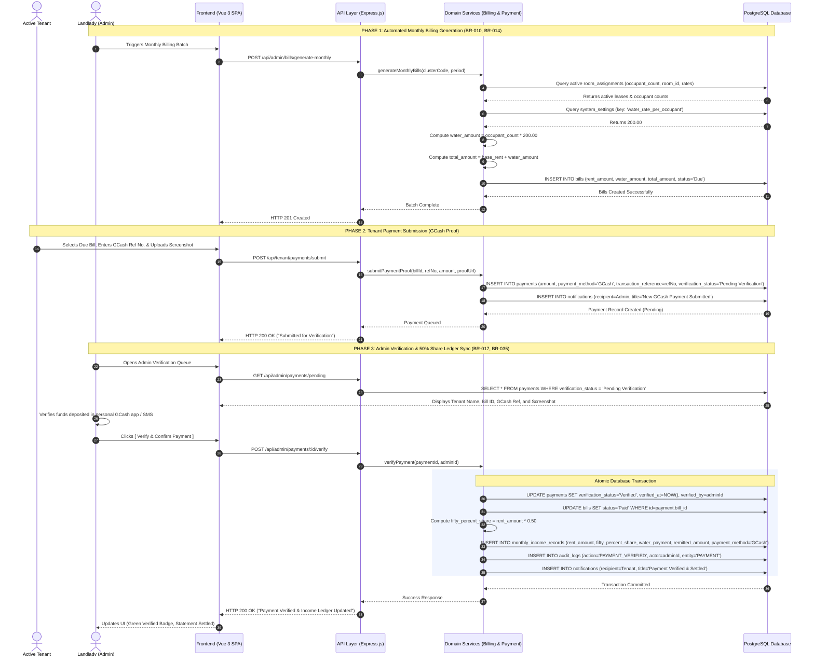

# BUCS IT DEPARTMENT | IT 124: CAPSTONE PROJECT 2
## MODULE 01: PROCESS & DATA FLOW DIAGRAMS
### Context Diagram (Level 0), Level 1 DFD, and UML Sequence Diagram

**Project Title:** Hivelet: A Web-Based Boarding House Management and Financial Operations System  
**Target Property:** Fe Galang Da Silva Boarding House, Legazpi City  
**Group Number:** [Insert Your Group Number]  

---

## 1. Design Review Checklist & Traceability Audit

Module 01 strictly requires that:
1. **Every data store in your DFD maps to a specific entity in your ERD.**
2. **Every process in your DFD maps to a specific component in your architecture diagram.**

### 1.1 DFD Data Store to ERD Entity Mapping
| DFD Data Store | Exact Mapped ERD Entity | Data Content & Purpose |
| :--- | :--- | :--- |
| **$D_1$ Room Catalog** | `rooms`, `clusters`, `room_photos`, `room_price_history` | 33 canonical units, clusters, rates, 2% price history. |
| **$D_2$ User Profiles** | `profiles` | Tenant & Admin user accounts, bcrypt hashes, RBAC. |
| **$D_3$ Room Assignments** | `room_assignments` | Active & past tenant leases, move-in dates, occupant count. |
| **$D_4$ Inquiries Store** | `inquiries`, `inquiry_messages` | Prospective tenant leads, room selections, message threads. |
| **$D_5$ Tenant Bills** | `bills` | Monthly rent invoices, ₱200/head water fee, due dates. |
| **$D_6$ Payment Records** | `payments` | Cash receipts, GCash 13-digit references, proof URLs. |
| **$D_7$ Monthly Income Ledger** | `monthly_income_records` | Official income report, 50% co-ownership revenue share. |
| **$D_8$ Expenses Ledger** | `fixed_expense_categories`, `monthly_expense_entries`, `expense_property_allocations` | Standardized 1..10 expense categories, official receipts. |
| **$D_9$ Maintenance Tickets** | `maintenance_tickets`, `ticket_attachments`, `ticket_messages` | Maintenance reports, photo uploads, repair status logs. |
| **$D_{10}$ Audit Logs** | `audit_logs` | Immutable system event log (actor, action, JSON diff, IP). |
| **$D_{11}$ System Parameters** | `system_settings` | Dynamic utility rates (₱200/head water), grace periods. |
| **$D_{12}$ Notifications** | `notifications` | In-app alerts for pending verifications and tickets. |

### 1.2 DFD Subprocess to Architecture Component Mapping
| DFD Process | Mapped Architecture Component | Functional Responsibility |
| :--- | :--- | :--- |
| **1.0 Manage Inquiries & Catalog** | `UI_PUBLIC` $\rightarrow$ `SRV_INQUIRY` | Filter rooms by status; accept prospective inquiries. |
| **2.0 Manage Tenancy & Occupancy** | `UI_ADMIN` $\rightarrow$ `SRV_OCCUPANCY` | Convert inquiries into tenant leases; track contract anniversaries. |
| **3.0 Process Billing & Payments**| `UI_TENANT` / `UI_ADMIN` $\rightarrow$ `SRV_BILLING` & `SRV_PAYMENT` | Compute ₱200/head water; process GCash verification queue. |
| **4.0 Manage Operational Expenses**| `UI_ADMIN` $\rightarrow$ `SRV_EXPENSE` | Record official receipts; allocate costs across property clusters. |
| **5.0 Process Maintenance Issues** | `UI_TENANT` / `UI_ADMIN` $\rightarrow$ `SRV_TICKET` | Intake issue photos; manage urgency triage; technician sign-off. |
| **6.0 Generate Financial Reports** | `UI_ADMIN` $\rightarrow$ `SRV_FIN_REPORT` & `SRV_AUDIT` | Aggregate Monthly Income & Expense Reports; audit trails. |

---

## 2. Context Diagram (Level 0 DFD)

The Context Diagram defines the system boundary of **Process 0.0 (Hivelet Central System)**, depicting all external actors and the primary information exchanged across the system boundary:

```mermaid
graph LR
    %% External Entities
    PROSPECT["Public Visitor / Prospect"]
    TENANT["Active Tenant"]
    ADMIN["Boarding House Administrator<br/>(Mrs. Fe Galang Da Silva)"]

    %% System Boundary (Process 0.0)
    SYSTEM(("0.0<br/><b>HIVELET</b><br/>Boarding House Management &<br/>Financial Operations System"))

    %% Prospect Flows
    PROSPECT -->|Room Availability Queries<br/>Inquiry Submission & Contact Info| SYSTEM
    SYSTEM -->|Catalog Room Details & Availability<br/>Inquiry Status & Response Messages| PROSPECT

    %% Tenant Flows
    TENANT -->|Authentication Credentials<br/>GCash Reference No. & Receipt Proof<br/>Maintenance Tickets & Photos| SYSTEM
    SYSTEM -->|Itemized Bills (Rent + P200 Water)<br/>Payment Verification Confirmation<br/>Ticket Status Updates & Notices| TENANT

    %% Admin Flows
    ADMIN -->|On-Site Cash Payment Entries<br/>GCash Verification Approvals / Rejections<br/>Room Rate & 2% Annual Adjustments<br/>Expense Receipts & Property Allocations<br/>Maintenance Technician Assignments| SYSTEM
    SYSTEM -->|Pending Payment Verification Queue<br/>New Inquiry Notifications<br/>Emergency / High Priority Maintenance Alerts<br/>Monthly Income & Expense Ledgers (50% Share)<br/>Immutable System Audit Logs| ADMIN
```

---

## 3. Level 1 Data Flow Diagram (DFD)

The Level 1 DFD decomposes Process 0.0 into six discrete operational subprocesses, explicitly connecting external entities, internal transformations, and database data stores:

```mermaid
graph TB
    %% External Entities
    PROSPECT["Public Visitor"]
    TENANT["Active Tenant"]
    ADMIN["Administrator (Landlady)"]

    %% Processes
    P1(("1.0<br/>Manage Public<br/>Inquiries & Catalog"))
    P2(("2.0<br/>Manage Tenancy<br/>& Occupancy"))
    P3(("3.0<br/>Process Billing<br/>& Payments"))
    P4(("4.0<br/>Manage Operational<br/>Expenses"))
    P5(("5.0<br/>Process Maintenance<br/>Tickets"))
    P6(("6.0<br/>Generate Financial<br/>Reports & Analytics"))

    %% Data Stores (Mapped 1:1 to ERD)
    D1[("D1: Room Catalog<br/>(rooms, clusters, photos, price_history)")]
    D2[("D2: User Profiles<br/>(profiles)")]
    D3[("D3: Room Assignments<br/>(room_assignments)")]
    D4[("D4: Inquiries Store<br/>(inquiries, messages)")]
    D5[("D5: Tenant Bills<br/>(bills)")]
    D6[("D6: Payment Records<br/>(payments)")]
    D7[("D7: Monthly Income Ledger<br/>(monthly_income_records)")]
    D8[("D8: Expenses Ledger<br/>(fixed_categories, entries, allocations)")]
    D9[("D9: Maintenance Tickets<br/>(tickets, attachments, messages)")]
    D10[("D10: Audit Logs<br/>(audit_logs)")]
    D11[("D11: System Parameters<br/>(system_settings)")]
    D12[("D12: Notifications<br/>(notifications)")]

    %% Process 1.0 Flows
    PROSPECT -->|Search / Submit Inquiry| P1
    D1 -->|Read Room Availability| P1
    P1 -->|Write Inquiry Details| D4
    P1 -->|Dispatch Alert| D12

    %% Process 2.0 Flows
    ADMIN -->|Approve Onboarding| P2
    D4 -->|Fetch Prospect Details| P2
    P2 -->|Create Tenant Profile| D2
    P2 -->|Assign Room & Headcount| D3
    P2 -->|Update Room Status to Occupied| D1
    P2 -->|Log Onboarding Action| D10

    %% Process 3.0 Flows
    D3 -->|Read Occupants Headcount| P3
    D1 -->|Read Base Rent| P3
    D11 -->|Read P200 Water Rate| P3
    P3 -->|Generate Bill (Rent + Water)| D5
    TENANT -->|Submit GCash Ref & Proof| P3
    ADMIN -->|Record Cash / Verify GCash| P3
    P3 -->|Write Payment (Pending / Verified)| D6
    P3 -->|Update Bill to Paid| D5
    P3 -->|Record 50% Share Income| D7
    P3 -->|Log Verification Event| D10
    P3 -->|Send Receipt Notice| D12

    %% Process 4.0 Flows
    ADMIN -->|Record Official Receipts & Cluster Splits| P4
    P4 -->|Write Categorized Expenses| D8
    P4 -->|Log Expense Action| D10

    %% Process 5.0 Flows
    TENANT -->|Submit Issue & Upload Photo| P5
    P5 -->|Write Ticket & Attachments| D9
    P5 -->|Dispatch Ticket Notice| D12
    ADMIN -->|Assign Tech & Close Ticket| P5
    P5 -->|Update Ticket Status| D9
    P5 -->|Log Closure Action| D10

    %% Process 6.0 Flows
    D7 -->|Read Income & 50% Shares| P6
    D8 -->|Read Categorized Expenses| P6
    P6 -->|Display Monthly Income & Expense Reports| ADMIN
```

---

## 4. UML Sequence Diagram: Monthly Billing & Payment Verification

This diagram details the transaction interaction between the Client, API Layer, Domain Services, and the Database for **Subprocess 3.0 (Monthly Billing & Asynchronous Payment Verification)**:


