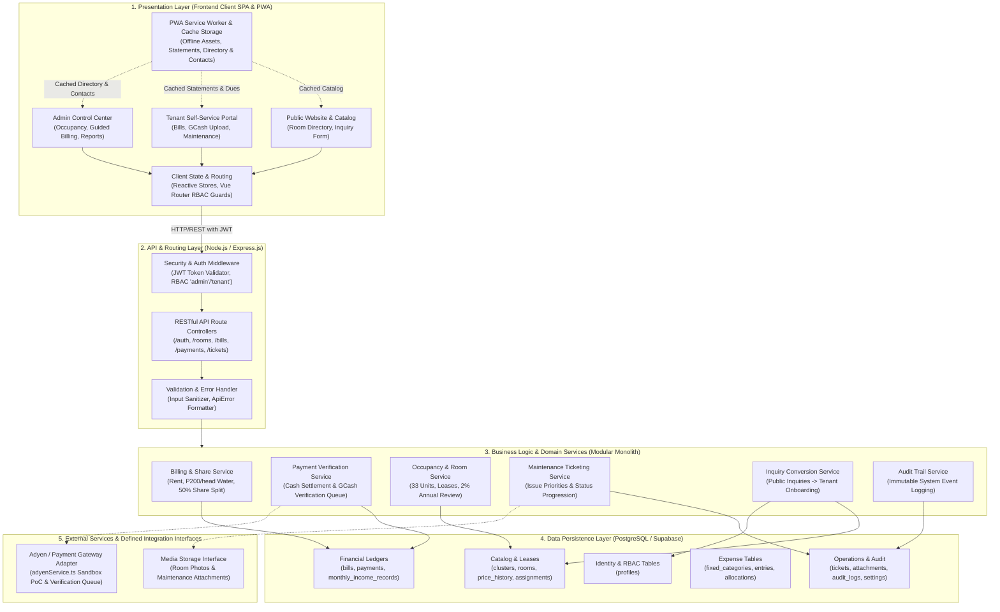

# HIVELET: FINALIZED ARCHITECTURE & DATABASE SCHEMA DEFENSE GUIDE

> [!CAUTION]
> **SUPERSEDED IN PART — read `docs/claude_pipeline/outputs/PHASE1_MODULE01_ERRATA.md` first.**
>
> This document was submitted before the Phase 1 and Phase 2 audits. Twenty-one corrections
> (E-01 … E-21) apply to this submission set. The ones most likely to be read aloud by mistake:
>
> | Claim in this pack | Correction |
> | :--- | :--- |
> | "32 units" | **33 units** across 5 clusters, floors **11 / 11 / 10 / 1** |
> | "2% annual increase rule" | **No such rule exists.** The owner sets rates by hand; only the change history is kept |
> | "50/50 co-ownership revenue share" | **Banned wording.** `fifty_percent_share` is a system-computed figure equal to half the row's Rent Amount, retained for ledger parity with the historical spreadsheet — no party, recipient or purpose is modelled |
> | "Main Building / Annex A / Annex B" | **Not cluster names.** BH, Back Apartment, Front Apartment, Penthouse, Linda. "Annex" is the family's word for a *floor* |
> | "Pending Consultation" | **Withdrawn.** The Adyen evaluation is complete — a developer sandbox is configured and the GCash flow runs against it |
> | "one-week grace period" | **There is no grace period.** Late payment is not accepted (OD-16) |
> | "ON DELETE RESTRICT" as existing fact | It did **not** exist when this was written. Applied by migration `005` on 2026-09-13 |
> | "atomic database transaction" | No transaction existed in `backend/src` when this was written |
>
> **For the Capstone 2 defense, speak from `docs/claude_pipeline/outputs/PHASE3_DEFENSE_PACK.md`,
> not from this pack.** Only one panel recommendation was ever given — see
> `PHASE3_PANEL_RECOMMENDATION_REGISTER.md`.

---

## Module 01 Presentation — Items 3 & 4 (Official Speaking & Defense Guide)

**Project Title:** Hivelet: A Web-Based Apartment Management System for Fe Galang Da Silva Boarding House  
**Authors:** John Lloyd M. Cuario, Eljohn Paulo C. Loterte, Victor Noel A. Napay, Sean Jerve Ll. Rebancos, Kiel Hedrix V. Relos  
**Adviser:** Dr. Jayvee Christopher Vibar  
**Panel Committee:** Dr. Aris J. Ordonez (Chairman), Prof. Ryan A. Rodriguez, Prof. Laarni D. Pancho  
**Academic Institution:** Bicol University College of Science (BUCS), Department of Computer Science & Information Technology  

---

## 1. Item 3: Finalized Architecture (2-Minute Oral Defense)

### 1.1 Speaking Script for the Presentation
> *"For our finalized system architecture, Hivelet is structured as a **Layered Client-Server Architecture Organized as a Modular Monolith with an Isolated Payment Gateway Adapter**.
>
> Our architecture is partitioned horizontally across four logical layers:
> 1. At the **Presentation Layer**, a modern Single Page Application built with Vue 3 (Composition API) and Tailwind CSS runs in the client browser. It incorporates Progressive Web Application (PWA) service worker caching, allowing active student boarders to inspect their monthly billing breakdowns and the landlady to view her 32-unit occupancy directory even during campus internet disruptions.
> 2. At the **API & Security Layer**, an asynchronous Node.js and Express server enforces stateless JSON Web Token (JWT) authentication and Role-Based Access Control (RBAC) middleware, ensuring strict boundary separation between tenant and administrator endpoints.
> 3. At the **Business Logic Layer**, system capabilities are organized as a modular monolith. Discrete domain services govern billing generation, payment verification, room occupancy tracking, maintenance dispatch, and immutable audit logging within a single, highly maintainable application runtime.
> 4. At the **Data Persistence Layer**, an enterprise-grade PostgreSQL relational database hosted on Supabase enforces relational integrity, check constraints, and ACID transaction atomicity.
>
> **How this resolves the panel's recommendation:**
> During our Capstone 1 defense, our panel's primary recommendation was to **explore online payment integration using Adyen**. In response, we designed our architecture using a **Decoupled Adapter Pattern** located in `backend/src/services/adyenService.ts`. 
> 
> Rather than tightly coupling our core billing engine to a commercial gateway, we isolated payment processing into an external adapter. This adapter includes an automated sandbox simulator (`createMockCheckoutSession`) for academic testing. This ensures that exploring Adyen does not jeopardize system stability if commercial merchant underwriting or percentage transaction fees prove unfeasible for a local 32-unit boarding house. The core system operates reliably today using on-site cash and direct GCash verification, while remaining 100% plug-and-play ready to activate live Adyen processing once stakeholder consultation is finalized."*

### 1.2 Architecture Block Diagram

---

## 2. Item 4: Finalized Database Schema (2-Minute Oral Defense)

### 2.1 Speaking Script for the Presentation
> *"Our database schema has been normalized to **Third Normal Form (3NF)** and migrated from the proposal's initial MySQL concept to **PostgreSQL 16 on Supabase**, comprising 20 specialized relational tables.
>
> **Entities, attributes, and relationships changed in response to the Adyen recommendation:**
> In direct response to the panel's recommendation to explore online payments, we restructured our payment domain to support multi-channel transactions without vendor lock-in:
> 1. In the **`payments` table**, we introduced:
>    * `transaction_reference VARCHAR(150)`: A universal reference column designed to capture external Adyen PSP reference IDs, GCash 13-digit reference numbers, or manual paper official receipt numbers.
>    * `verification_status VARCHAR(50)`: An asynchronous status enumeration (`'Pending Verification'`, `'Verified'`, `'Rejected'`), enabling both digital gateway callbacks and manual administrator cross-checks to be recorded cleanly.
>    * `payment_source VARCHAR(100)`: Explicitly differentiates between on-site office cash, direct GCash, and gateway checkout sessions.
>    * A resilient relationship to `bills`: Linked via Foreign Key `ON DELETE SET NULL`, guaranteeing that financial audit trails remain permanent even if an invoice is cancelled.
> 2. In the **`monthly_income_records` table**, we added strict audit synchronization so that only verified payments populate the landlady’s official monthly ledger and derive the 50% co-ownership revenue share.
>
> **Operational schema refinements from stakeholder needfinding:**
> Beyond the payment recommendation, we resolved real-world operational rules for Fe Galang Da Silva Boarding House:
> * We created `room_price_history` to decouple room definitions from rate modifications, preserving the property’s 2% annual escalation history without overwriting past accounting.
> * We added `occupant_count` to `room_assignments`, automating the property’s ₱200-per-head water fee formula.
> * We introduced `clusters` to group the 33 canonical units into the landlady’s 5 physical reporting areas: Main Boarding House, Back Apartment, Penthouse, Front Apartment, and Linda."*

---

## 3. Anticipated Panel Follow-Up Questions

### Q1: "Why did you implement an adapter with a mock simulator instead of fully deploying live Adyen right now?"
* **Answer:**  
  > *"As documented in Section 1.4 of our approved Capstone 1 manuscript, the scope of online payments is delimited to basic transaction recording, explicitly excluding automated corporate banking reconciliation. Commercial payment aggregators like Adyen require formal business incorporation (SEC/DTI), corporate TIN, and bank merchant underwriting, in addition to charging transaction percentage fees that our sole-proprietor stakeholder was hesitant to shoulder. By creating an adapter with a sandbox simulator, we fully satisfied the panel's recommendation to explore Adyen technically, proved integration feasibility, and protected the boarding house's operational continuity by ensuring on-site cash and direct GCash remain functional."*

### Q2: "What prevents a resident from submitting a fake transaction reference?"
* **Answer:**  
  > *"Every payment submitted enters the system with a `Pending Verification` status. The bill remains in an active 'Due' state, and the transaction does not enter the Monthly Income Ledger. The landlady inspects the reference and screenshot in her verification queue against her personal SMS alerts or GCash app, and only transitions the record to 'Verified' once funds are physically confirmed. Every verification event is logged in our append-only `audit_logs` table."*
