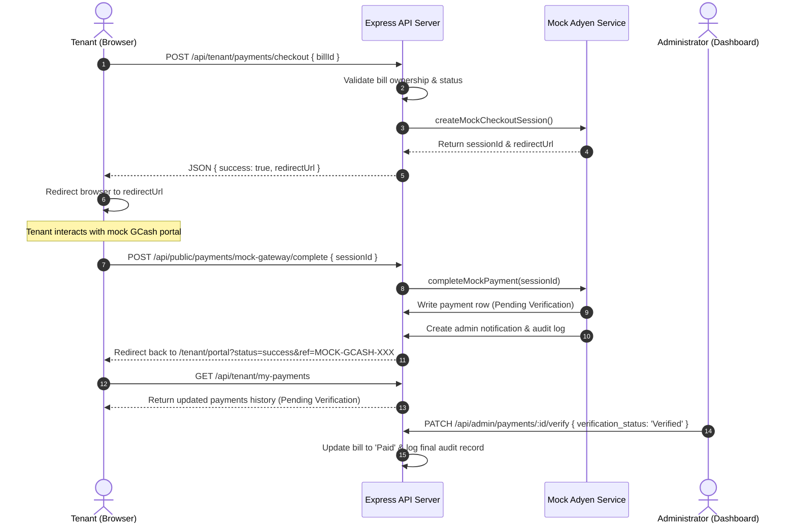

# Design Specification: Optional Adyen GCash Mock Payment Integration

**Date:** 2026-08-10  
**Status:** Approved (Brainstormed with User)  
**System Bible Reference:** Section 12 (Payment Types)  
**Business Rules Reference:** BR-016 (Online Payment), BR-017 (Payment Verification)  
**Requirements Reference:** FR-015 (Online Payments), FR-016 (Payment Verification)

---

## 1. Context & Purpose
Hivelet manages the Fe Galang Da Silva Boarding House. Per the Capstone objectives, while the owner prefers On-Site In-Person Cash Payment, tenants must have the optional ability to submit payments online using GCash via an Adyen integration.

To facilitate testing and verification without requiring external sandbox accounts or incurring live fees during academic evaluation, this specification defines a **mock payment gateway system** on the server. The mock behaves exactly like a real Adyen integration, routing transactions through checkout sessions, providing simulated redirects, and submitting verification-pending payments into the administrative audit pipeline.

---

## 2. Key Academic & System Constraints
1. **Administrative Control (BR-017)**: Payment gateway authorization must *not* automatically mark a bill as paid. The transaction enters `Pending Verification` status. The administrator retains final verification authority.
2. **Server-Only Secrets (04_ARCHITECTURE.md)**: All simulated gateway keys and processing logic remain isolated on the backend API. The browser only processes safe token/session identifiers.
3. **Auditability (BR-018)**: Completing checkout and verifying payments must log appropriate immutable events in the audit trail.

---

## 3. Data Flow & System Sequence

---

## 4. Proposed Changes

### 4.1 Backend Components

#### 1. [New Service] `backend/src/services/adyenService.ts`
* Holds an in-memory map of active sessions: `checkoutSessions = new Map<string, SessionDetails>()`.
* **Functions**:
  * `createMockCheckoutSession(billId: string, tenantProfileId: string, amount: number)`:
    * Generates a unique `sessionId` (e.g. `mock_sess_10293`).
    * Stores metadata `{ billId, tenantProfileId, amount }` in the session map.
    * Returns the session ID and a redirect URL: `/api/public/payments/mock-gateway?sessionId=mock_sess_10293`.
  * `completeMockPayment(sessionId: string)`:
    * Retrieves session details from map. Throws `ApiError.notFound` if missing.
    * Fetches the room assignment to resolve the `room_id`.
    * Creates a database entry in the `payments` table:
      * `bill_id`: `billId`
      * `tenant_profile_id`: `tenantProfileId`
      * `room_id`: `roomId`
      * `amount`: `amount`
      * `payment_method`: `'Adyen Online'`
      * `payment_source`: `'GCash Sandbox'`
      * `verification_status`: `'Pending Verification'` (BR-017)
      * `transaction_reference`: `'MOCK-GCASH-' + randomNumbers`
      * `paid_at`: `NOW()`
    * Deletes the session from the map.
    * Dispatches an in-system notification to the admin and writes a `PAYMENT_INITIATE` log into the `audit_logs` table.

#### 2. [Modified Routes] `backend/src/routes/tenant.ts`
* Mounts a new route `POST /api/tenant/payments/checkout`:
  * Validates the request body contains a valid UUID `billId`.
  * Queries `bills` table to assert the bill belongs to the logged-in tenant and is currently unpaid (`Pending` or `Due`).
  * Resolves `amount` from the bill.
  * Calls `adyenService.createMockCheckoutSession()` and returns the response.

#### 3. [New Routes] `backend/src/routes/public.ts` (or payment-specific router)
* Mounts `GET /api/public/payments/mock-gateway`:
  * Serves a static HTML page containing a clean, mock GCash payment screen (styled to look like a simple digital portal).
  * Shows the merchant name ("Fe Galang Da Silva Boarding House") and amount.
  * Form action sends to `POST /api/public/payments/mock-gateway/complete`.
* Mounts `POST /api/public/payments/mock-gateway/complete`:
  * Validates the `sessionId` from the body.
  * Calls `adyenService.completeMockPayment(sessionId)`.
  * Redirects the browser back to `http://localhost:5174/tenant/portal?status=success&ref=MOCK-GCASH-XXXXX`.

---

### 4.2 Frontend Components (website/ package)

#### 1. [Modified View] `website/src/views/TenantPortalView.vue`
* Fetches the resident's unpaid bills from the backend `GET /api/tenant/my-bills`.
* Renders a clean payment list section in the "Payments & Billing" tab:
  * For unpaid bills, displays a button: `💳 Pay Online (GCash)`.
  * Clicking the button makes a POST request to `/api/tenant/payments/checkout`, extracts the `redirectUrl`, and redirects the page.
* Resolves `status=success` in the route query parameters upon redirection back:
  * Displays a professional Atlassian/Jira style banner alert confirming the submission.
  * Triggers a refresh of the local payment list.

---

## 5. Verification Plan

### 5.1 Automated and Core Route Tests
1. **Security boundary test**: Assert that calling `/api/tenant/payments/checkout` anonymously or with a guest token returns `HTTP 401/403`.
2. **Ownership verification test**: Assert that a tenant attempting to check out a bill belonging to a different tenant receives an access error.
3. **Double checkout prevention**: Assert that attempting to check out an already paid bill returns `HTTP 400/409`.

### 5.2 Manual Verification Steps
1. Log into the Tenant Portal as `mark.cruz@gmail.com`.
2. Go to **Payments & Billing** and select an unpaid bill.
3. Click **Pay Online (GCash)** and confirm you are redirected to the mock GCash payment gateway screen.
4. Click **Confirm Payment** on the gateway screen.
5. Verify you are redirected back to the Tenant Portal showing the success notification, and the transaction appears in the payment list with a `Pending Verification` badge.
6. Log in as `admin@hivelet.ph`, go to the **Payment & Income Ledger**, and confirm the transaction reference appears.
7. Click **Verify** as admin and verify the bill status changes to `Paid` and updates the Monthly Income Ledger correctly.
