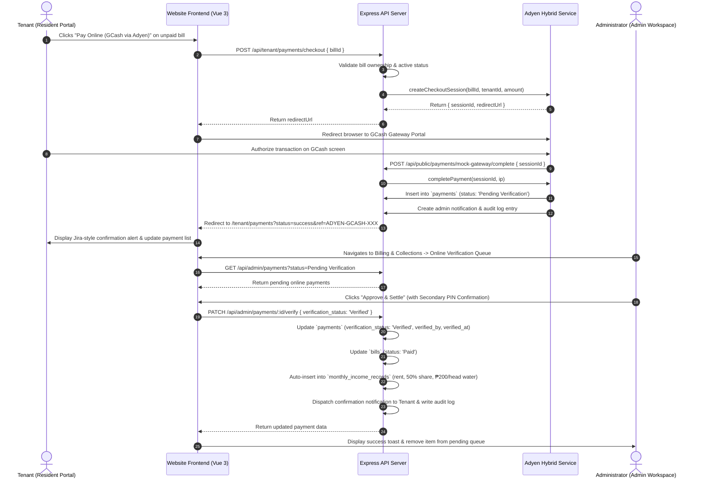

# Design Specification: Adyen GCash Payment Integration for Website (Tenant & Admin)

**Date:** 2026-08-21  
**Status:** Approved  
**System Bible References:** Section 4 (Roles), Section 12 (Payment Types), Section 14 (Auditability), Section 22 (System Interactions & Financial Sync)  
**Business Rules:** BR-014 (Water Fee ₱200/head), BR-016 (Online GCash via Adyen), BR-017 (Payment Verification), BR-018 (Audit Logging), BR-048 (Ledger Integrity)  
**Requirements:** FR-011 (Bill Management), FR-015 (Online Payment Initiation), FR-016 (Admin Verification), FR-043 (Income Ledger)  

---

## 1. Executive Summary & Capstone Alignment

Per the Fe Galang Da Silva Boarding House operational requirements:
- The owner/administrator prefers On-Site Cash Remittance, but tenants have the optional capability to remit monthly dues online using GCash through an Adyen integration (BR-016).
- Online payments are **not** immediately finalized upon checkout; they enter `Pending Verification` status (BR-017) to allow the administrator to confirm the bank/e-wallet transaction.
- When an administrator approves an online payment, the system must automatically mark the bill as `Paid`, synchronize the entry into the Monthly Income Collection Ledger (`monthly_income_records`) with the 50% revenue share and ₱200/head water deduction calculated, and log an immutable audit event (System Bible Section 22).
- The gateway architecture operates in **Hybrid Mode**: if live Adyen test credentials are provided in `.env`, the system integrates with the Adyen API; otherwise, it seamlessly provides a local academic sandbox gateway so evaluations and demonstrations can run offline without external dependencies.

---

## 2. System Architecture & Data Flow

---

## 3. Detailed Component Specifications

### 3.1 Backend Services & API Routes

#### 1. `backend/src/services/adyenService.ts`
- **Hybrid Configuration**: Detects whether `ADYEN_API_KEY`, `ADYEN_CLIENT_KEY`, and `ADYEN_MERCHANT_ACCOUNT` are configured with production/sandbox credentials or mock strings.
- **Session Management**: Maintains active sessions mapping `billId`, `tenantProfileId`, `roomId`, and `amount`.
- **Completion Workflow**:
  - Validates session.
  - Inserts payment row into `payments` table with:
    - `bill_id`: `session.billId`
    - `tenant_profile_id`: `session.tenantProfileId`
    - `room_id`: `bill.room_id`
    - `amount`: `session.amount`
    - `payment_method`: `'Adyen Online'`
    - `payment_source`: `'GCash Sandbox'` (or Adyen payment method)
    - `verification_status`: `'Pending Verification'` (BR-017)
    - `transaction_reference`: `'ADYEN-GCASH-' + randomNumbers`
    - `paid_at`: `NOW()`
  - Records an immutable audit log (`PAYMENT_RECORD`).
  - Dispatches an in-system notification to administrator profiles.

#### 2. `backend/src/routes/admin.ts`
- **Enhance `PATCH /api/admin/payments/:paymentId/verify`**:
  - When `verification_status` is updated to `'Verified'`:
    - Updates `payments` table (`verification_status = 'Verified'`, `verified_at = NOW()`, `verified_by = admin_id`).
    - Updates associated `bills` table (`status = 'Paid'`).
    - Queries bill, room assignment, and occupant count to calculate:
      - `rent_amount` = `bill.rent_amount`
      - `fifty_percent_share` = `bill.rent_amount / 2`
      - `water_payment` = `bill.water_amount` (based on BR-014 occupant calculation)
      - `remitted_amount` = `bill.total_amount`
    - Inserts a new synchronized record into `monthly_income_records` table if one does not already exist for this transaction reference.
    - Sends an in-system notification to the tenant: *"Your online payment of ₱X (Ref: ...) has been verified by the administrator."*
  - When `verification_status` is updated to `'Rejected'`:
    - Updates `payments` table (`verification_status = 'Rejected'`).
    - Keeps associated bill in `Due` status.
    - Sends rejection notice to tenant.
  - Logs `PAYMENT_VERIFY` or `PAYMENT_REJECT` in `audit_logs`.

#### 3. `backend/src/routes/public.ts`
- Fixes the return redirection URL in `POST /api/public/payments/mock-gateway/complete` to dynamic client URL: `${CLIENT_URL}/tenant/payments?status=success&ref=${result.paymentReference}` (or fallback to `http://localhost:5174/tenant/payments`).
- Updates `cancel` link to point to `${CLIENT_URL}/tenant/payments?status=cancelled`.

---

### 3.2 Website Frontend Integration (`website/`)

#### 1. `website/src/views/TenantPaymentsView.vue`
- **Query Parameter Handling**: On mount, checks URL for `?status=success&ref=...` or `?status=cancelled`.
  - Displays a crisp Jira-style alert banner:
    - **Success Banner**: *"Online GCash payment (Ref: ADYEN-GCASH-XXXX) submitted successfully! It is currently pending verification by Landlady Fe Galang Da Silva."*
    - **Cancelled Banner**: *"Online payment was cancelled. Your outstanding bill remains active."*
  - Clears query parameters using `window.history.replaceState`.
- **Checkout Action**: Adds spinner/loading state to the `Pay Online (GCash via Adyen)` button to prevent double clicks.
- **Payment History Ledger**:
  - Refreshes both outstanding bills and payment history automatically after payment submission.
  - Renders proper badges (`PENDING VERIFICATION` with clock icon, `VERIFIED & SETTLED` with shield icon).

#### 2. `website/src/views/BillingPaymentsView.vue`
- **3-Tab Navigation Architecture**:
  1. `Record Payment`: Manual on-site cash & online payment entry form.
  2. `Online Verification (Adyen)`: Dedicated verification queue tab with pending count badge (e.g. `Online Verification (1)`).
  3. `Collection History`: Historical monthly income collection ledger with date filter and Excel export.
- **Verification Queue View**:
  - Lists all payments with `verification_status === 'Pending Verification'`.
  - Displays columns: Date Paid, Tenant Name, Unit/Room, Amount, Payment Method (`Adyen Online`), Transaction Reference, and Actions.
  - **Approve Action**: Opens `SecondaryConfirmModal` (requiring PIN `1234`), sends `PATCH /api/admin/payments/:id/verify { verification_status: 'Verified' }`, shows success toast, and refreshes the queue and history ledger.
  - **Reject Action**: Opens confirmation modal, sends rejection status, and displays warning toast.

#### 3. `website/src/views/AdminOverviewView.vue`
- Adds a pending verification banner/counter when there are pending Adyen online payments, linking directly to `/admin/billing?tab=verify`.

---

## 4. Verification & Testing Strategy

1. **Automated Validation**:
   - Verify TypeScript compilation across `backend/` and `website/` (`npm run build`).
   - Run RBAC and route verification checks.
2. **End-to-End Workflow Verification**:
   - **Tenant Flow**:
     - Log in as tenant (`mark.cruz@gmail.com`).
     - Go to `/tenant/payments`.
     - Click **Pay Online (GCash via Adyen)** on an unpaid bill.
     - Authorize payment on the GCash sandbox gateway.
     - Verify return to `/tenant/payments` with success banner and `Pending Verification` status in the payment history table.
   - **Admin Flow**:
     - Log in as admin (`admin@hivelet.ph`).
     - Open `/admin/billing` and navigate to the **Online Verification** tab.
     - Verify the pending payment appears with correct unit, amount, and reference ID.
     - Click **Approve & Settle**, input PIN `1234`, and confirm.
     - Verify:
       - Payment status transitions to `Verified`.
       - The bill status changes to `Paid`.
       - A synchronized entry appears in the **Collection History** ledger with 50% revenue share and water fee calculations.
       - Audit log records the verification action.
